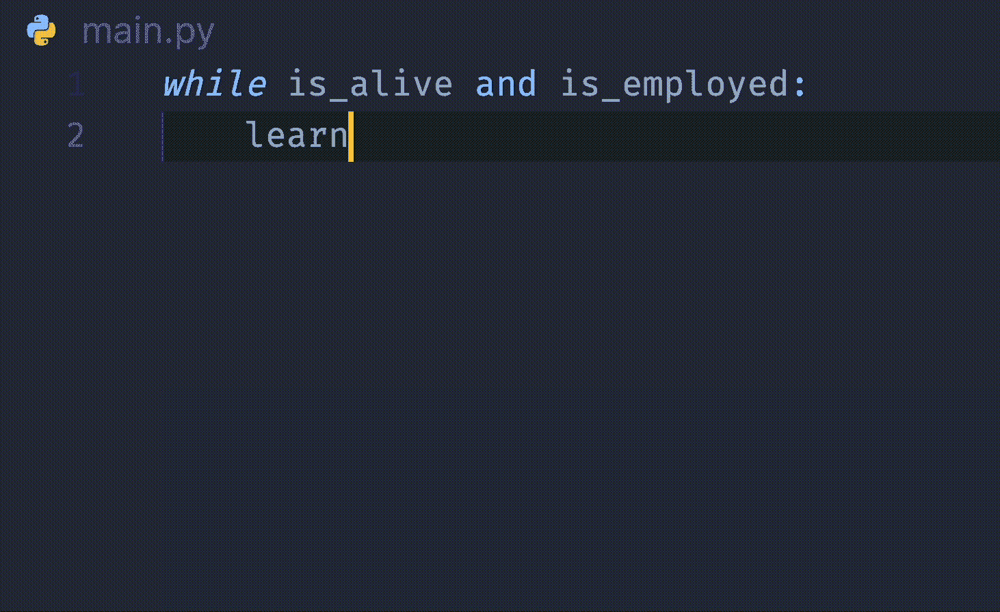

# 为什么所有的软件工程师都需要第二个大脑

> 原文：<https://levelup.gitconnected.com/why-all-software-engineers-need-a-second-brain-67d1423214f9>

## 或者像 idea 或 Obsidian 这样的笔记应用程序

我们不是天才。

除非你有过目不忘的记忆力，能记住你输入过的所有语言语法和命令，包括那些疯狂的正则表达式，否则你需要第二个(隐喻的)大脑，比如[概念](https://www.notion.so/desktop)或[黑曜石](https://obsidian.md/)。

不，但说真的，作为工程师，我们每天都在吸收新知识。我们学习新技术，继续前进，学习更多的新技术——循环往复。

不要相信我——以下是 [GitHub CoPilot](https://github.com/features/copilot) 提出的工程师的生命周期:

GitHub CoPilot 投入使用

不过不要误解我的意思——这个想法**并不是**为你所学的一切创建一个数据库(此外，这也是互联网的用途)。

这个想法很简单，就是有一个集中的地方来聚集你所有的想法，做笔记，记下会议纪要，确定想法，最重要的是，存储常用的代码片段。

这就是为什么它很重要。

## 1.刺激大脑的检索系统

你自己创建的笔记和互联网上的笔记有一个关键的区别——个性化。它们包含了你的元素——你思考的方式、组织要点和消化信息。

作为工程师，每当我们需要重新使用一项我们已经很久没有接触的技术时，我们通常只需要一条特定的信息，激活一种特定类型的记忆回忆，称为**暗示回忆**。

暗示回忆是指利用线索和引导回忆事物[1]。通过记下笔记或写下某个历史时间点的代码片段，将来对它的引用有助于立即触发与该信息相关的信息片段。

通俗地说，我们的笔记作为参考的起点，帮助我们回忆特定的信息，如 API 用法或语言语法，帮助记忆检索。

## 2.记忆巩固

我们的大脑擅长存储信息，但不擅长索引它们——至少从长期来看不是。

作为工程师，我们有自己的主要语言、框架和云提供商，我们每天都与之合作。我们也有我们不经常使用的辅助语言、框架和云提供商。

由于首因效应(你更自然地使用的东西会导致记忆巩固)和近因效应(你最后使用的东西往往会更强烈地保留在记忆中)，我们对主要技术的自由回忆要比次要技术容易得多。

这就是记笔记派上用场的地方。随着我们越来越多地查阅笔记，我们会不经意地将这些短期记忆转化为长期记忆——这一过程被称为记忆巩固。每次我们熟悉自己的笔记时，重新学习是一种将笔记植入大脑的方式。

## 3.想法转瞬即逝

这可能是无论你去哪里都要有一个虚拟的第二大脑的唯一最有说服力的理由。

当我们解决问题或想出新的方法来改进我们后端基础设施的设计时，我们工程师倾向于在任何地方解决问题——甚至在浴室里。巧合的是，当我们淋浴时，想法在浴室里变得活跃起来，因为它提供了一种多巴胺高的放松状态和分心的思维，这对创造力来说是完美的。

拥有第二个大脑有助于让那些在飞行中产生的想法和主意永垂不朽，因为它们往往转瞬即逝。

## 4.代码片段比你想象的更强大

使用 GitHub CoPilot 和代码片段也有一些类似的好处。

当使用 CoPilot 时，它会通过语法匹配自动检测您正在使用的语言，并获取您当前正在*编程的上下文，以建议接下来应该键入什么。本质上，它创建了接下来应该编写的代码片段。*

这是非常强大的，因为就像代码片段一样，您会立即对语言语法以及特定函数应该需要的参数有更多的了解和信心。这也节省了大量时间，因为你不必在*堆栈溢出*中寻找类似的代码。

## 5.【奖金！]把你的笔记变成(中等)文章

如果你在 Medium 或任何其他平台上写文章，你基本上有一个想法/代码的仓库，你可以把它从简短的笔记转换成较长的文章。

# 最后的话

你认为拥有第二个大脑是一种高杠杆活动吗？请在评论中告诉我:)

***支持我！*** —如果你喜欢我的内容并且*没有*订阅 Medium，请考虑支持我并通过我的推荐链接[订阅这里](https://davidcjw.medium.com/membership) ( *注意:你的一部分会员费将作为推荐费*分摊给我)。否则，留下一个👏🏻鼓掌或💬注释也有助于算法！

# 参考

[1] [记忆回忆和检索系统](https://human-memory.net/memory-recall-retrieval/)
【2】[为什么你最好的想法在淋浴时出现很重要](https://www.thindifference.com/2018/01/best-ideas-come-shower/#:~:text=Showers%20are%20a%20safe%20place,and%20yes%2C%20taking%20a%20shower.)
【3】[人类记忆:我们如何制造、记住和忘记记忆](https://www.nationalgeographic.com/science/article/human-memory)

# 分级编码

感谢您成为我们社区的一员！在你离开之前:

*   👏为故事鼓掌，跟着作者走👉
*   📰查看[升级编码出版物](https://levelup.gitconnected.com/?utm_source=pub&utm_medium=post)中的更多内容
*   🔔关注我们:[Twitter](https://twitter.com/gitconnected)|[LinkedIn](https://www.linkedin.com/company/gitconnected)|[时事通讯](https://newsletter.levelup.dev)

🚀👉 [**加入升级人才集体，找到一份神奇的工作**](https://jobs.levelup.dev/talent/welcome?referral=true)