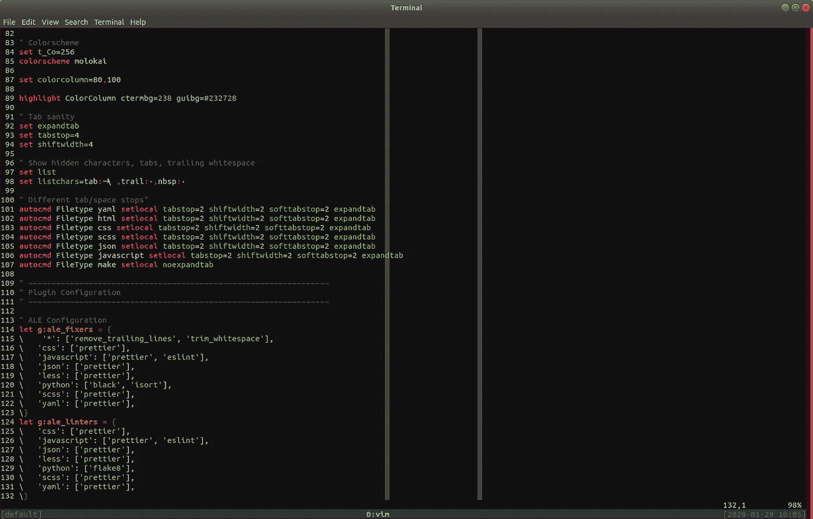

# 我为什么(以及如何)使用 Vim

> 原文：<https://levelup.gitconnected.com/why-and-how-i-use-vim-da322260aa6c>



我漂亮的 vim 配置

当我开始编程时，我从未想象过自己使用 vim。作为一名本科生，我的导师在命令行上做所有事情，看着他工作令人着迷。光标移动了，事情发生了，我一点也不明白它是如何工作的，但它有一种优雅。我认为他用的是 emacs 而不是 vim，但这无关紧要。他的肌肉记忆为他的按键提供动力，以轻松完成任务。

在大学和我工作的最初几年，我使用 Eclipse(甚至是 Python)。Eclipse 感觉像是程序员应该使用的东西。这个庞大的 IDE 有一百万个特性和插件。菜单和选项，我不知道它们是什么意思。也许我从来没有花时间去真正学习它，但老实说，我只是觉得它不适合我。

意识到我没有使用很多 Eclipse 应该提供的东西，我转向了 gedit，后来又转向了 Sublime Text。他们都是 Python 的优秀编辑器，多年来他们为我提供了很好的服务。我加了几个插件和一个我喜欢的配色方案，就到家了。没有太多改变的理由。

但是我记得那天我决定给 vim 一个尝试。我和一位使用 vim 的同事搭档，看着他工作让我想起了那些记忆。这让我想试一试。我的手指也能学会跳舞吗？我向他要了他的 vim 配置，他帮我开始了。当我浏览配置时，我试图删除我不理解或不觉得我需要的东西。在第一周左右，我的工作效率不是很高，但慢慢地，我建立了肌肉记忆，并确定了一个适合我的配置。我的手指开始在键盘上跳舞，因为我倒出新功能和修复错误。这对我来说就像是一个工具。

从那时起，我的配置发生了一些变化。我喜欢保持低定制，因为当我有更多的定制时，我发现当我 ssh 到服务器上时，我的键绑定不在那里，这让我很沮丧(尽管谢天谢地，我发现自己现在不必这么做了)。vim 的通用性是我喜欢它的原因之一，过多的配置让我觉得我正在远离它。

我也喜欢打开单个文件的焦点(我很少分割窗格)和有目的的选择从一个切换到下一个。在我以前的编辑器中，我经常打开几十个文件，疯狂地点击标签来找到我需要的。有了 vim，我会把手指放在键盘上，放慢速度，专注于手头的任务。我认为这让我成为一个更细心的程序员。当我创建一个新文件时，背景的巨大黑暗凝视着我，没有被菜单或边栏打断。看不到其他文件的引用或痕迹。只是敞开的黑暗呼唤被光明的代码填满。这不是我想象中喜欢或使用的东西，但我职业生涯的大部分时间都充满了同样的惊喜。

如果我的故事激励您尝试 vim，那么它将带您了解我的配置，重点是 Python 编程和 web 开发。如果你想就此打住，那么我仍然建议你花一点时间来思考你使用什么工具，为什么使用它们，以及你可以做出什么小的改变来改进它们。作为开发人员，我们在这些类型的工具上花费了太多的时间，拥有适合你的思维模式和个人风格的东西会有很大的不同。对我来说，这种风格已经随着时间的推移而演变，我希望它会继续演变。花时间重新评估或确认我们的选择可以让我们成为更好的程序员。

# 更改默认值

首先，对编辑器显示的内容(当前模式、行号)以及它接受新行字符的方式有一些小的改变。这使得 vim 在 Mac 和 Linux 上的行为是相同的。比起保存大量的临时文件，我更喜欢有一个长的撤销历史，所以那些备份文件被禁用，我把这个提升到 1000 个撤销级别。vim-sensible 插件包含了一些我喜欢的 vim 默认更改，它让我的配置更小。

```
set ttyfast
set showmode
set showcmd
set title
set number
set hidden" This is what files look like
set ffs=unix,dos,mac" Update find path to search subdirectories
set path=$PWD/**" No backups
set nobackup
set nowritebackup
set nowb
set noswapfile" Keep lots of history/undo
set undolevels=1000" Files to ignore
" Python
set wildignore+=*.pyc,*.pyo,*/__pycache__/*
" Erlang
set wildignore+=*.beam
" Temp files
set wildignore+=*.swp,~*
" Archives
set wildignore+=*.zip,*.tar
```

在这一部分的底部，你会看到一些额外的文件类型，我已经告诉 vim 忽略它们。我还是无视。我在玩 Erlang 的几个月里的 beam 文件。我可能不需要它，但我不能让自己删除它。这是一个梦想，也许有一天我会有时间重新投入学习更多的 Erlang *叹息*。

# 颜色；色彩；色调

我是 TextMate 的 [monokai](https://monokai.pro/) 配色方案的超级粉丝，后来 Sublime Text 采用了这种配色方案。当我做出改变时，这是我想保留的一件事。vim 端口稍微重命名了一下，但感觉是一样的。

```
set t_Co=256
colorscheme molokaiset colorcolumn=80,100highlight ColorColumn ctermbg=238 guigb=#23272
```

除了配色方案之外，我还在 80 和 100 个字符处配置了一个列突出显示。现在我已经自动格式化了我的大部分文件，这已经不太相关了，但是对于不能自动格式化的文件来说，这仍然是一个很好的行长度指南。我一直觉得 80 个字符太短了，而 100 个可能太长了，将这两个字符作为指导方针有助于我在开始输入“危险条纹”时做出关于何时换行的良好选择。

# 制表符和空白

因为 Python 是我选择的编程语言，并且它有有意义的空白，所以在我的编辑器中有好的空白设置是非常重要的。我喜欢显示与空格明显不同的制表符，我也喜欢突出尾部的空白字符，这些字符通常会被自动格式化程序清除。对于 Python，我总是使用 4 个空格作为制表符，遵循 PEP 8 的建议，在很长一段时间里，这是我对所有文件类型使用的(除了需要制表符的 Makefiles)。现在，我的 tabstop/shiftwidth 设置变得更加微妙了。我的团队更喜欢 JS、CSS、HTML 和 JSON 各占两个空间，我也学会了喜欢它。

```
" Tab sanity
set expandtab
set tabstop=4
set shiftwidth=4" Show hidden characters, tabs, trailing whitespace
set list
set listchars=tab:→\ ,trail:·,nbsp:·" Different tab/space stops"
autocmd Filetype yaml setlocal tabstop=2 shiftwidth=2 softtabstop=2 expandtab
autocmd Filetype html setlocal tabstop=2 shiftwidth=2 softtabstop=2 expandtab
autocmd Filetype css setlocal tabstop=2 shiftwidth=2 softtabstop=2 expandtab
autocmd Filetype scss setlocal tabstop=2 shiftwidth=2 softtabstop=2 expandtab
autocmd Filetype json setlocal tabstop=2 shiftwidth=2 softtabstop=2 expandtab
autocmd Filetype javascript setlocal tabstop=2 shiftwidth=2 softtabstop=2 expandtab
autocmd FileType make setlocal noexpandtab
```

我慢慢地收集了越来越多的使用两个空格而不是四个空格的类型，但是我怀疑我是否会为 Python 做出这样的改变。然而，随着 2 对我来说越来越常见，我可能会将它作为默认设置，并将 Python 显式设置为 4 个空格，而不是相反。这是我配置中的一个区域，我正在观察它的发展，看它是否有意义。

# 新快捷方式

快捷方式是我没有花太多时间定制 vim 的一个领域。也许我应该做得更多，但我觉得没有必要。然而，有一条捷径我不能没有:

```
" Remap escape
inoremap jk <Esc>
```

当处于插入模式时，这将把 *jk* 组合键映射到退出键，退出插入模式。这是一个非常流行的重新映射，我喜欢它。它让你的手指在家里，让你继续工作。它在 Macbook Pro 上特别好，因为它在任务栏上有假的 escape 键。如果您只添加了一个快捷方式/重映射到 vim，这应该是它。

# 启用插件

安装 vim 插件的方法有很多:Vundle，Pathogen，vim-plug，现在还有 vim 8 中的原生包。我的配置使用 Vundle，因为我的同事也是这么用的，而且对我很有效。有一点脚本可以让这个插件自动安装:

```
set exrc
set secure
" Set up Vundle on first install - Vundle, in turn, installs all other plugins
let iCanHazVundle=1
let vundle_readme=expand('~/.vim/bundle/vundle/README.md')
if !filereadable(vundle_readme)
    echo "Installing Vundle.."
    echo ""
    silent !mkdir -p ~/.vim/bundle
    silent !git clone [https://github.com/gmarik/vundle](https://github.com/gmarik/vundle) ~/.vim/bundle/vundle
    let iCanHazVundle=0
endif
set rtp+=~/.vim/bundle/vundle/
call vundle#rc()Plugin 'gmarik/vundle'
Plugin 'tpope/vim-fugitive'
Plugin 'tpope/vim-commentary'
Plugin 'tpope/vim-sensible'
" Python + Theme (molokai)
Plugin 'sentientmachine/Pretty-Vim-Python'
" JavaScript
Plugin 'jelera/vim-javascript-syntax'
" CSS and SCSS
Plugin 'cakebaker/scss-syntax.vim'
" Asynchronous Lint Engine
Plugin 'dense-analysis/ale'if iCanHazVundle == 0
    echo "Installing Bundles, please ignore key map error messages"
    echo ""
    :BundleInstall
endif 
```

[vim-逃犯](https://github.com/tpope/vim-fugitive)允许你在 vim 内部使用 git。在大多数情况下，我仍然在另一个终端中使用 git，但是在 vim 中检查一些附加上下文的状态、差异或错误也很好。

如前所述，vim-sensible 更新了一些常见的缺省值，对大多数 vim 用户来说感觉像是一个简单的包含。

[vim-commentation](https://github.com/tpope/vim-commentary)帮助注释掉代码块，顾名思义。我用它来注释/取消注释大块代码的次数比我愿意承认的要多。

[vim-sensible](https://github.com/tpope/vim-sensible) 包含了更多的 vim 默认更改，因此如果您希望在前面的部分中设置一些，这里是设置它们的地方。

[Pretty-Vim-Python](https://github.com/sentientmachine/Pretty-Vim-Python) 、 [vim-javascript-syntax](https://github.com/jelera/vim-javascript-syntax) 和 [scss-syntax](https://github.com/cakebaker/scss-syntax.vim) 分别是 Python、JS 和 SCSS/CSS 的语法绑定。这些并不特别华丽，但是如果您想要适当的语言语法突出显示，它们是必要的。你不需要完全使用这些版本，而是使用它们的某种形式。我用的莫洛凯岛配色也来自 Pretty-Vim-Python。

ALE 是我使用的林挺发动机。最近，当我开始将自动格式化整合到我的工作流程中时，我从[语法](https://github.com/vim-syntastic/syntastic)转换过来。将自动格式化整合到我的工作流程中后，我想我将很难再回头了。我记得当我打开一个旧文件或遗留项目的东西时，我的编辑器会覆盖红色警告，这让我很害怕。在花时间清理还是把它弄得一团糟之间做出选择的压力从来都不好玩。现在，通过让 ALE 自动修复 80%的问题，这种压力已经基本消失了。

你会注意到这并不包括一些流行/常见的插件，如 [ctrlp](https://github.com/kien/ctrlp.vim) 和 [nerdtree](https://github.com/preservim/nerdtree) 。我尝试过这两种方法，但最终都不适合我。我很想重新使用 ctrlp，因为我认为这是我的文件导航风格的两者中比较接近的一个。

# 插件配置

ALE 是上面唯一需要配置的插件。要么他们没有任何配置选项，要么我对默认设置很满意。如上所述，ALE 是一个自动格式化和林挺工具。为了有效地完成它的工作，需要为您希望它评估的语言进行配置。我对所有的文件类型都做了两个全局修正，那就是删除文件底部的任何尾随的新行，并修剪每一行中的任何尾随的空白。以前，我会将这些错误突出显示，而不会自动清除它们，但现在对我来说，删除它们更容易了。

```
" ~~~~~~~~~~~~~~~~~~~~~~~~~~~~~~~~~~~~~~~~~~~~~~~~~~~~~~~~~~~~~~~~~
" Plugin Configuration
" ~~~~~~~~~~~~~~~~~~~~~~~~~~~~~~~~~~~~~~~~~~~~~~~~~~~~~~~~~~~~~~~~~" ALE Configuration
let g:ale_fixers = {
\    '*': ['remove_trailing_lines', 'trim_whitespace'],
\   'css': ['prettier'],
\   'javascript': ['prettier', 'eslint'],
\   'json': ['prettier'],
\   'less': ['prettier'],
\   'python': ['black', 'isort'],
\   'scss': ['prettier'],
\   'yaml': ['prettier'],
\}
let g:ale_linters = {
\   'css': ['prettier'],
\   'javascript': ['prettier', 'eslint'],
\   'json': ['prettier'],
\   'less': ['prettier'],
\   'python': ['flake8'],
\   'scss': ['prettier'],
\   'yaml': ['prettier'],
\}
let g:ale_fix_on_save = 1
```

这些配置确实需要安装一些外部工具。对于 Python，我使用[黑色](https://black.readthedocs.io/en/stable/)、 [isort](https://isort.readthedocs.io/en/stable/) 和 [flake8](https://flake8.readthedocs.io/en/stable/) 。它们通过 pip 全局安装在 shell 中。对于 JS，我用的是[更漂亮的](https://prettier.io/)和 [eslint](https://eslint.org/) 。同样，npm 会在全球范围内安装这些产品。漂亮还支持一些相关的网络语言/文件格式，如 CSS，JSON 和 YAML。在这两者之间，它们涵盖了我每天接触的几乎所有文件类型。

# 我不能问你

写出所有这些内容的过程给了我更多的时间来思考我对我的配置所做的选择，并给了我一个很好的机会来将它重新组织成更多的逻辑块。我一直在寻找可以改进我的流程和流程的小变化。尽管开始很艰难，但转向 vim 让我受益匪浅。你可以在我的 Github 账户中找到我的完整的 vimrc 文件:[https://github.com/mlavin/dotfiles/blob/master/vimrc](https://github.com/mlavin/dotfiles/blob/master/vimrc)。我希望读完这篇文章后，你会尝试一下，并把它变成你自己的。