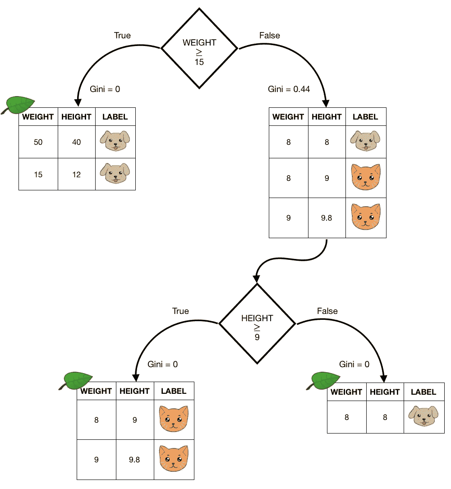

# 为什么以及如何向“局外人”解释机器学习模型

> 原文：<https://levelup.gitconnected.com/why-and-how-to-explain-machine-learning-models-to-outsiders-11411767f802>

## 利益相关者需要了解机器学习吗？

如果你从事机器学习，在某些时候你可能需要向没有这方面专业知识的商业人士解释这些模型。商业人士确实了解商业，如果他们能够**真正**理解一些机器学习模型是如何工作的，他们将能够做出很大贡献。这也适用于机器学习领域之外的任何其他人，如产品经理、软件工程师和任何其他利益相关者。基于此，我们来谈谈为什么以及如何解释模型。

约翰·施诺布里奇在 [Unsplash](https://unsplash.com/photos/FlPc9_VocJ4) 上的照片

# 为什么我要解释模型是如何工作的？

让我们用一个例子来说明，你正在建立一个模型来预测一家快餐店在未来几个月里每天能赚多少钱。在用您从数据库中提取的特征拟合模型后，您得到了大多数日子的极好预测，但是模型在一些随机的日子里表现不佳，预测远低于实际收入。

如果业务人员将模型视为古老的魔法生物，他们就无法帮助您理解这种行为。然而，从他们确实知道一些基本概念的前提出发，比如特征如何指导模型学习，几乎可以肯定他们可以帮助解决问题，或者至少阐述一些关于它的想法。

这是一个非常简单的例子，但是我想你已经明白了。**上面描述的情况真的发生了**，在那些随机的日子里的糟糕预测受到了美国[“社会保障福利金”](https://www.ssa.gov/)的影响，这是一个商业人士给出的一个相当有语境的信息。在模型中使用了[社保日历](https://www.ssa.gov/pubs/calendar.htm)后，预测结果有了很大的提高。

解释模型如何工作的另一个原因是为了避免冲突。如果作为机器学习项目的利益相关者，人们不能理解机器学习的基本知识，他们就不可能评估你或你的团队正在做出的决定。这可能会导致在您看来毫无意义的冲突，但在利益相关者看来却并非如此。我不知道你们中有多少人以前遇到过这种情况，但这看起来很常见。

# 我应该如何解释模型的工作原理？

既然我们已经有了为什么向“局外人”解释机器学习模型很重要的线索，那么让我们专注于如何正确地做到这一点。

首先，你不希望给出一个极其浅薄的解释，会让这个人感到困惑，甚至毫无用处，但同时你也不希望解释梯度下降是如何利用导数来优化一个函数的，所以我们需要在那两个极端之间找到一个平衡点。以下是一些要点:

## 知识和谦逊

首先，永远记住，这个人很可能和你没有相同的背景，所以不要说得好像他们很明显。在你生命中的某个时刻，事情对你来说也不明显。对你来说，深入理解你正在解释的模型或主题也是有好处的，因为这将更容易简化事情，并且不太可能犯错误。

## 尝试使用类比/隐喻

但是仔细一想，一个误解比什么都不懂更糟糕。围绕机器学习的背景总是过于具体，所以你可以尝试将解释带到最熟悉的背景中。让我们以监督学习为例，基于 Mello 和 Ponti [1]对学习的定义:

> 假设一个孩子正在学习一些物体的名称。孩子指着一张桌子说“椅子”。监督学习的父母纠正孩子说，那不是椅子，而是桌子。孩子不断地在物体上犯一些错误，父母不断地纠正他/她，但只是告诉他/她是对还是错，而没有解释为什么。随着时间的推移，孩子会自己开始联想到一些使那个物体成为椅子的特征:四条腿，木制的，有人坐在上面等等。监督学习的行为方式非常相似，将特征/特性映射到类。

这不是监督学习的最准确定义，但它可以帮助局外人理解算法背后的机制，并避免一些误解，如标签(或目标)如何使用。

## 使用图像和插图

对于每一种解释/演示来说，这是一个非常常见的技巧，也非常适合机器学习主题。没有任何视觉上的东西，很难理解复杂的主题。顺便说一下，基于树的模型很容易理解。下图显示了根据体重和身高这两个特征对猫和狗进行分类的树。

来自[艾玛·马尔迪](https://medium.com/u/44deedb40f94?source=post_page-----11411767f802--------------------------------)决策树[解说](https://towardsdatascience.com/decision-tree-an-algorithm-that-works-like-the-human-brain-8bc0652f1fc6)

## 熟能生巧

你越是试图向人们解释事情，你就越能理解在解释一件复杂的事情时，哪条路更容易走。一个很好的练习是和你亲近的人一起做这件事，比如你的父母、堂兄弟姐妹甚至你的祖父母，这样你就可以问他们有哪些困惑的地方。我听说过一次，当你奶奶明白时，你的解释很好，但请不要试图解释 xgboost 是如何工作的。

## 结论

我已经在非常接近外人的地方工作了将近四年，这些只是我对向他们解释机器学习的想法。你可以也必须有自己的方式来解释事情。从我的经验来看，我可以保证让产品和业务人员远离模型会让你的工作变得更加容易和令人满意，当你教他们时，你会成为一个参考，此外还有学到更多东西的副作用！

就是这样！感谢阅读。我希望你学到了一些东西。如有任何问题或建议，请随时通过此处或我的 [LinkedIn 个人资料](https://www.linkedin.com/in/caiocarneloz/)联系我。再见！

## 参考

[1]费尔南德斯·德梅洛、罗德里戈和莫阿西尔·安东内里·庞蒂。[《机器学习:统计学习理论的实用方法》](https://www.amazon.com.br/Machine-Learning-Practical-Approach-Statistical/dp/3319949888) *湛:施普林格国际出版* (2018)。

# 分级编码

感谢您成为我们社区的一员！在你离开之前:

*   👏为故事鼓掌，跟着作者走👉
*   📰查看[升级编码出版物](https://levelup.gitconnected.com/?utm_source=pub&utm_medium=post)中的更多内容
*   🔔关注我们:[Twitter](https://twitter.com/gitconnected)|[LinkedIn](https://www.linkedin.com/company/gitconnected)|[时事通讯](https://newsletter.levelup.dev)

🚀👉 [**加入升级人才集体，找到一份神奇的工作**](https://jobs.levelup.dev/talent/welcome?referral=true)