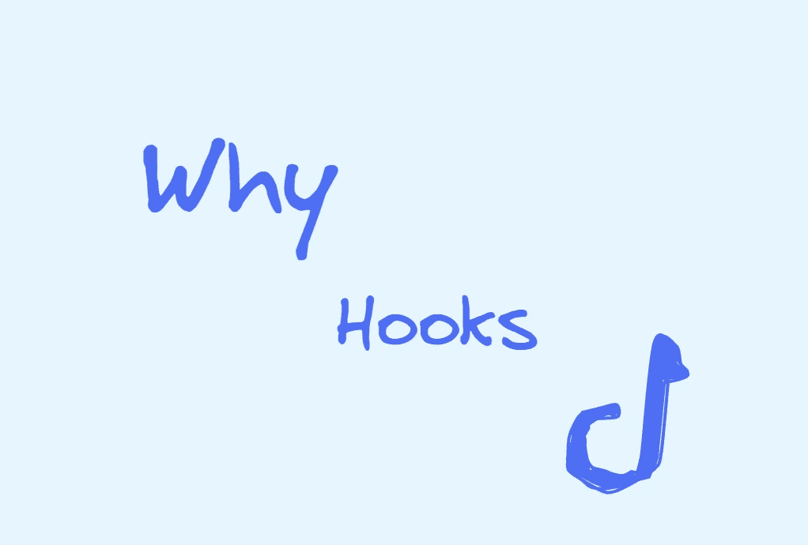

# 为什么挂钩这么受欢迎？

> 原文：<https://levelup.gitconnected.com/why-are-hooks-so-popular-77e032b34129>

## React 和 Vue 中的钩子有什么异同？

React 从 16.8.x 版本开始支持 Hooks 特性，后来的 Vue3、SolidJS、Preact 等框架也相继宣布支持 Hooks 特性。甚至像 Midway 这样的后端框架也实现了类似钩子的 API。

那么它为什么如此受欢迎呢？它有什么魔力？

# 什么是钩子？

您可能已经熟悉 React 挂钩，但挂钩实际上是软件工程术语，通常指:

> 当系统运行到一定周期时，会调用注册到定时的回调函数。

浏览器里有很多“钩子”。如`onload`事件、`addEventListener`等。并且在 Windows 等操作系统中也有类似的 API。

# 为什么是钩子？

## 1.状态逻辑重用

在 Hooks 之前，如果您想在 React 中实现状态逻辑重用，您可能会选择诸如高阶组件之类的解决方案。在 Vue2.x 中，需要使用 mixins。但是 mixins 有几个缺点:

**隐式依赖，难以追踪的属性:**由于 mixins 运行在同一个名称空间，很难追踪根本原因。您也不能随意修改其中的一个，因为它可能会在许多地方被引用。这些依赖关系对开发人员是隐藏的。您甚至需要知道所有的引用关系才能修改它。

**命名冲突:**不能保证两个特定的 mixins 能一起工作。您必须检查两者中是否有相同的命名变量。

**随着时间的推移复杂性增加:**每次添加新功能时，之前的 mixin 可能不适用，所以我们需要添加额外的逻辑。这在早期开发中可能很简单，但是随着项目的不断迭代，所有的 mixins 都变得越来越抽象。这使得代码越来越难以维护。

那么 Hooks 是怎么解决的呢？

钩子允许从组件中提取状态逻辑，这允许单独测试和重用这些状态逻辑。而且每个变量的来源都是清晰可追溯的，这无疑会让我们的开发变得更加容易。

## 2.代码组织

想象一个场景，我们可能在组件初始化时开始订阅消息，然后在组件卸载时取消订阅。在传统的类组件中，需要生命周期来帮助我们。使用钩子，我们可以将这些相关的部分组合成独立的钩子，这些钩子可以在多个组件之间共享。而不是被迫按照生命周期来划分。

这其实就是高内聚低耦合的体现。聚合相关代码使我们更容易调试和修改。它还极大地提高了代码的可维护性和可读性。

## 3.比上课容易

类需要理解`this`在 JavaScript 中是如何工作的，在 Vue 中也是如此。

在函数组件中使用钩子只是单个函数重用状态逻辑而不用担心`this`绑定。

## 4.友好渐进测验

不仅是 React，还有 Vue3 中的新钩子，可以渐进式选择钩子。它可以和前面的代码共存，你可以慢慢体会钩子带来的好处。

# React 和 Vue 中的挂钩

## 1.使用限制

React 只能在函数组件中使用钩子，钩子只能在顶层使用，不能在循环、条件或嵌套函数中使用。

Vue3 只能在`setup`周期内使用挂钩。这是一个比`created`更早的生命周期，每次组件渲染更新只调用一次。

那么，为什么会出现这种情况呢？

这是因为 React 将在 JSX 编写的代码转换成纤程节点。对应于这些钩子的状态将以链表的形式存储在相应的纤程节点上。当取出相应的挂钩时，需要使用`.next`依次访问。这意味着一旦顺序不同，对应的值就会出错，从而导致 bug。

在 Vue3 中，使用代理监控机制。它可以轻松准确地知道数据发生了变化，还可以知道它影响了哪些组件。然后可以直接更新该组件。

## 2.优点和缺点

React 作为一个整体是关于不变性的，React 钩子也是如此。这样做的好处是，你可以清楚地了解程序的来龙去脉，知道它从何而来。而这也给开发者带来了精神负担。没有优化，钩子将在每次渲染更新时被调用。为了避免这种情况，需要使用 useMemo 或 useCallback 进行优化。

而且有一些开发人员会偷懒，不会在任何地方主动优化自己的应用，所以这会做很多不必要的 CPU 工作。

Vue 的总体方向是可变性。它在编译时花费了大量的精力，分析模板并应用了大量的 AOT 优化。React 在编译时能做的事情相对较少，优化也很少。

Vue 的响应式追踪技术可以让更新更加细致入微。它呈现尽可能小的范围，而不提供任何优化。不会给开发者带来很大的精神负担。

但是 Vue 需要你非常了解它的特性。如果应用程序很大，可变性会导致它查询更多的路径，以了解为什么这次会发生更新。通往不变性的道路非常清晰。

今天就到这里。我是 Zachary，我将继续输出与 web 开发相关的故事。如果你喜欢这样的故事，想支持我，请考虑成为 [*中等会员*](https://medium.com/@islizeqiang/membership) *。每月 5 美元，你可以无限制地访问媒体内容。如果你通过* [*我的链接*](https://medium.com/@islizeqiang/membership) *报名，我会得到一点佣金。*

你的支持对我来说非常重要——谢谢。