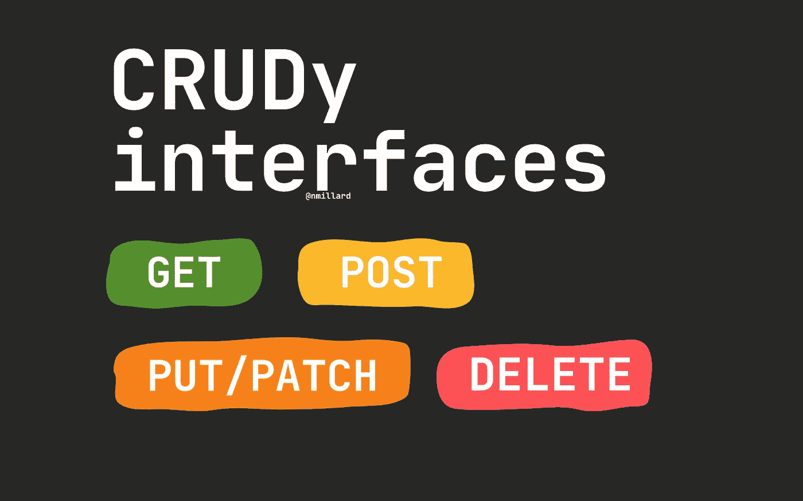
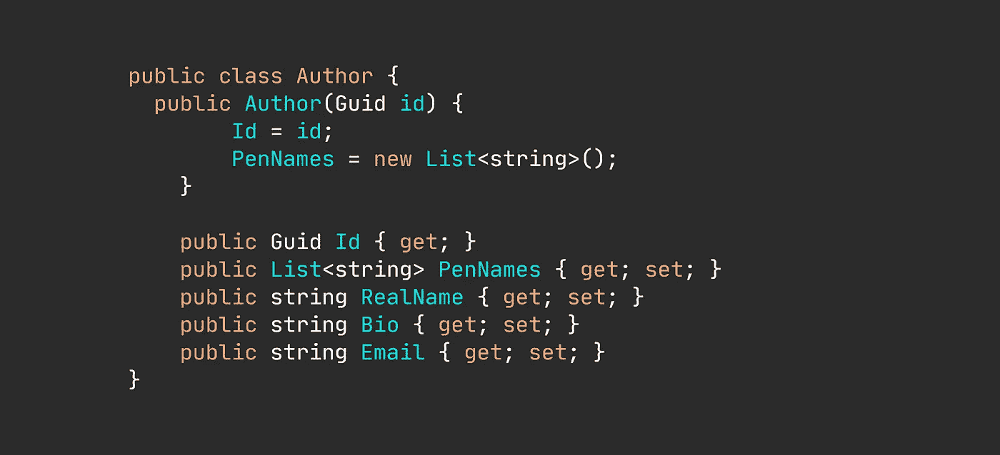
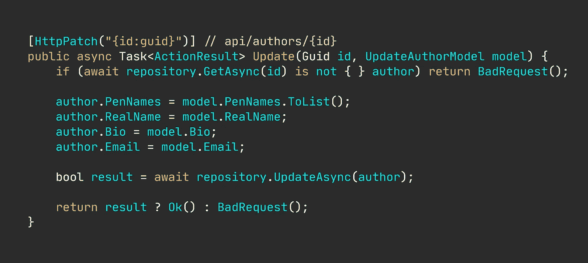
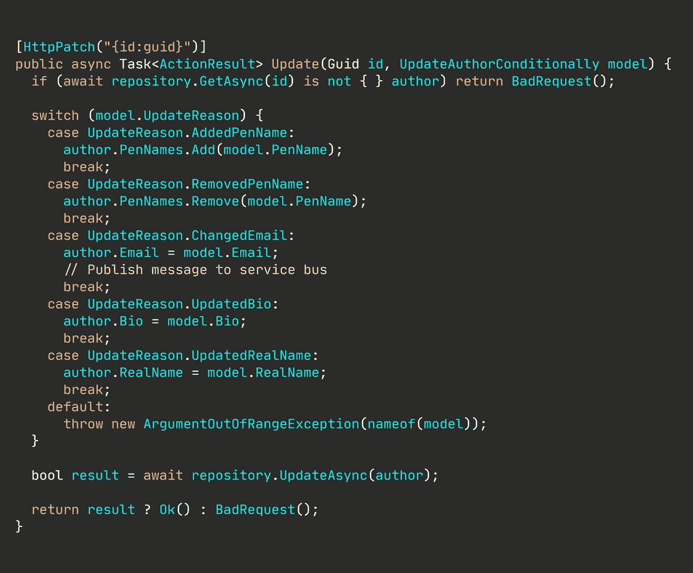
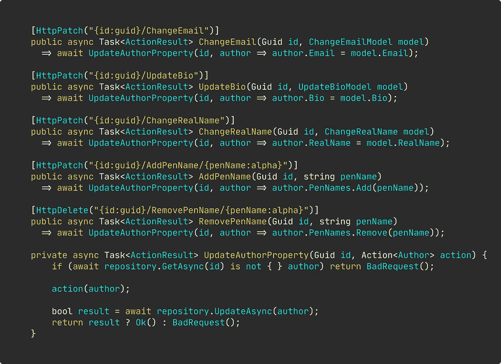

# 为什么还在创建 CRUD APIs？

> 原文：<https://levelup.gitconnected.com/why-are-you-still-creating-crud-apis-8790ca261bfb>

## 固执己见的观点

## 这是一个古老的模式，最好留下来。

图片由[尼可拉斯·米勒德](https://medium.com/u/7c7a43b3d9de?source=post_page-----8790ca261bfb--------------------------------)

当我开始学习编程和 web 开发时，我就听说过 CRUD。这很像是使用的*和*方法。我会花时间思考作为“资源”的实体，以及如何编写令人惊叹的基于 CRUD 的应用程序，其中每个资源都被创建、读取、更新或删除，仅此而已。本质上，最好的描述是“原始思维”

创建、读取、更新、删除。很简单——这正是问题所在。

> 您上次仅从存储管理的角度考虑您的领域是什么时候？

但是我明白为什么初学者喜欢这种方法。CRUD 思想可以很好地转化为现有的编程概念，如 SQL 的`INSERT, SELECT, UPDATE, DELETE`或 HTTP 的`GET, POST, PUT/PATCH, DELETE`。

# 基于 CRUD 的应用有什么问题？

在我看来，主要的问题是你在创建基于 CRUD 的界面时完全忽略了用户的意图。意图是一个重要的方面，作为开发人员，我们不能掩盖它。

一旦开始以类似 CRUD 的方式设计应用程序的接口(例如 HTTP 端点),问题就出现了。

> 顺便说一下，[这里有一篇关于 CRUD over REST 问题的更深入的文章](/whats-wrong-with-your-crudy-interfaces-besides-everything-bde4f4c8cb8a)。

例如，假设您有一个“作者”模型——尽管是人为的——定义如下，并且您正在开发一个 web API，它对作者执行一些操作并将其存储在数据库中。

人为的作者模型。

还有一个作者希望有一个额外的笔名——顺便说一下，笔名就像作者的“伪”名——但是应用程序只支持将完整的作者模型作为输入的`PATCH api/authors/{id}`。

起初，你可能认为这没什么大不了的。

但是，这对应用程序开发人员来说是一个巨大的烦恼。没有机会猜测需要更新什么，所以实现可能会变得过于冗长，更新每个属性，如下所示。

这非常混乱，记住我们只是想再添加一个笔名——现在想象一下如果我们添加了错误处理和条件分支。这很快就变成了一场维护噩梦。

当我是一名软件顾问时，我注意到一些开发人员试图避免更新每个属性。他们的解决方案是在相同的方法中增加一个额外的层:他们会收到一个属性，告诉他们用户的意图。

那我们就会有像这样的东西。

这个想法很好。但是我认为这个问题没有得到正确的解决，因为[圈和认知复杂性](/why-cognitive-and-cyclomatic-complexity-matters-in-software-development-5fce1efb56ab)都开始不受控制地螺旋式上升。[可读性也在窗外](/writing-readable-code-exemplified-bd387cd93b6b)。

显然，尽管保留了粗糙的 API，基于任务的方法正在悄然出现。这种方法出现了一个明显的陷阱:模型混乱。

作为 API 的客户，我仍然被允许完全合并`UpdateAuthorConditionally`模型，即，用数据填充所有属性，但是，`UpdateReason`属性是决定哪些作者属性被实际更新的属性。

所以，令人困惑的部分是:如果我只想添加一个新的笔名，为什么允许我填充`Email`？

🔔想要更多这样的文章吗？在这里签名。

# 有一个简单愚蠢的解决方案。

停止“设计”基于 CRUD 的界面。相反，基于任务的界面是一个很好的选择，你的客户和开发人员会非常喜欢。

以上面类似 CRUD 的接口为例，我们可以提取以下端点:

基于任务的端点。

更多的方法、类和更多的代码行。那么，这怎么更好呢？

就[干净多了](/writing-cleaner-code-with-examples-69be2160b4c1)。传统的条件分支语句已经一去不复返了。

每种方法都有明显的责任。每种方法只做一件事，而且每种方法都可以独立于其他方法而发展。

一旦你开始应用这种方法，圈复杂度和认知复杂度就会降到最低点。

代码更容易阅读和维护。不再需要猜测—您和您的客户确切知道什么时候更新了什么。

# "你只是在做地产级别的垃圾！"

当然，这可能看起来像是因为我直接将基于 CRUD 的接口转换为基于任务的接口。但是，希望这将有助于许多人的理解，因为除了 CRUDy API 中已经确定的任务之外，没有“新的”任务。

此外，我相信大多数人可以从实现中抽象出这个概念:在使用您的应用程序时，无论客户有什么样的意图，都可以使用更专门化的端点。

然而，让我清楚地说明这一点:我并不是说每个对象属性都应该有一个端点。我的意思是，您应该拥有与客户意图和他们想要执行的操作相匹配的端点。

# “但是现在你需要调用 5 个端点而不是一个！”

对，现在你确切地知道每个端点将做什么。

当我为丹麦教育部创建应用程序时，我们不得不与第三方服务提供商合作，他们拥有学校、教师、班级和学生的所有数据。

项目开始几周后，我们需要给一所学校增加学生。因此，我简单地调用了他们的端点，并为一名学生提供了 XML 数据。这该死的东西擦干净了整个学校，又增加了这个*一个*的新生。所以，结果基本上是 1 个学生的小学(而且不，他们的端点根本没有提到这个行为)。

如果他们有一个像`POST/PATCH api/schools/{id}/AddStudent`这样的终点，我们就可以避免这种头痛。

有趣的补充说明:由于第三方 API 很难使用，大多数学校会将 excel 表发送给第三方，他们会手动处理这些 excel 表。

# “粗糙的应用程序有时肯定没问题吧？”

当然可以。基于 CRUD 的应用程序可能有它们的位置，尽管我主张让它们消失。主要的优势是开发速度，这是肯定的。

It *也许*可以抛弃一个短命的概念验证(PoC)应用程序。然而，众所周知，没有什么东西是短暂的或可以丢弃的。

如果证明是可行的、可行的和令人满意的，POC 通常会升级到生产状态。

# 所以，总的来说…

初学者经常学习如何创建基于 CRUD 的应用程序接口，尤其是在学习如何创建 web APIs 时，但是他们很少花时间去思考这种看似简单的方法可能存在的一些困难。

应用基于任务的方法是粗糙界面的一个很好的替代方法。基于任务的接口传达意图和目的，允许每个端点单独发展，比 CRUD 更容易维护。

# 让我们保持联系！

[点击这里](https://nmillard.medium.com/subscribe)订阅时事通讯，获取类似文章的通知，并查看新的 YouTube 频道[*(@ Nicklas Millard)*](https://www.youtube.com/channel/UCaUy83EAkVdXsZjF3xGSvMw)

*连接上*[*LinkedIn*](https://www.linkedin.com/in/nicklasmillard/)

# 我想你会喜欢类似的材料。

*   [干净代码示例(YouTube)](https://youtu.be/goVjlWLY9NQ)
*   [移除 If-Else 和开关盒](/remove-your-if-else-and-switch-cases-1ed2b625b4cf)
*   [为什么认知和圈复杂度在软件开发中很重要](/why-cognitive-and-cyclomatic-complexity-matters-in-software-development-5fce1efb56ab)
*   [编写更干净的代码(附例子)](/writing-cleaner-code-with-examples-69be2160b4c1)

# 好奇者的资源

*   📚[源代码【GitHub】作者](https://github.com/NMillard/SimpleWebApps/tree/master/src/GeneralPractices/CrudOrTaskBased/CrudApp)[尼可拉斯·米勒德](https://medium.com/u/7c7a43b3d9de?source=post_page-----8790ca261bfb--------------------------------)作者
*   [CRUD 不利于休息吗？鲍里斯·卢布林斯基](https://www.infoq.com/news/2009/07/CRUDREST/)
*   [将 CQRS 用于事件采购或 CRUD 有什么问题？](https://blog.softmemes.com/2016/11/12/using-cqrs-with-event-sourcing/)克里斯蒂安·弗瑞德
*   [code academy 上的 CRUD](https://www.codecademy.com/articles/what-is-crud) 是什么
*   [为什么 CRUD 可能是他们想要的，但可能不是他们需要的](http://codebetter.com/iancooper/2011/07/15/why-crud-might-be-what-they-want-but-may-not-be-what-they-need/)Ian Cooper
*   [cqrs.wordpress.com 上基于任务的用户界面](https://cqrs.wordpress.com/documents/task-based-ui/)
*   Mathias Verraes 提出的 CRUD 是一个反模式