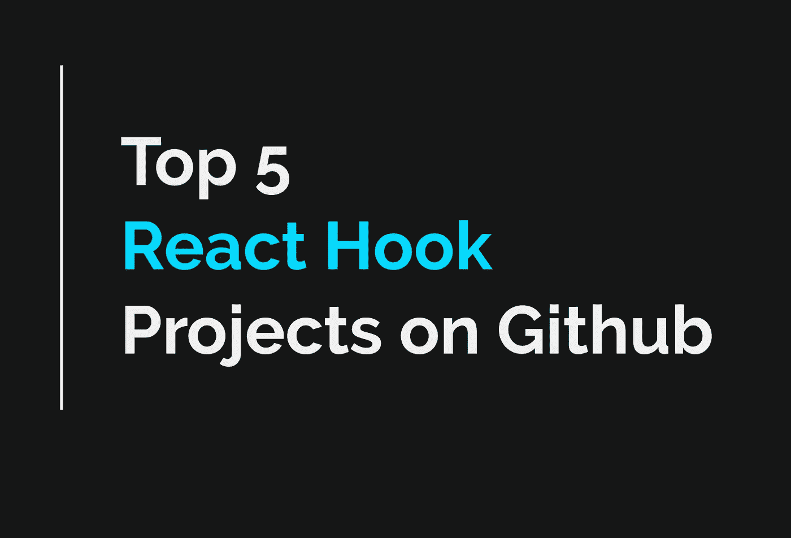
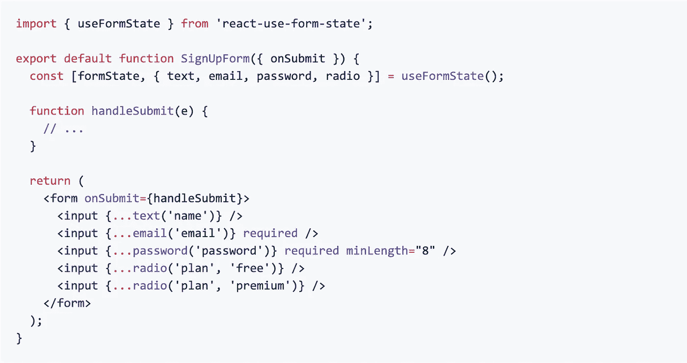
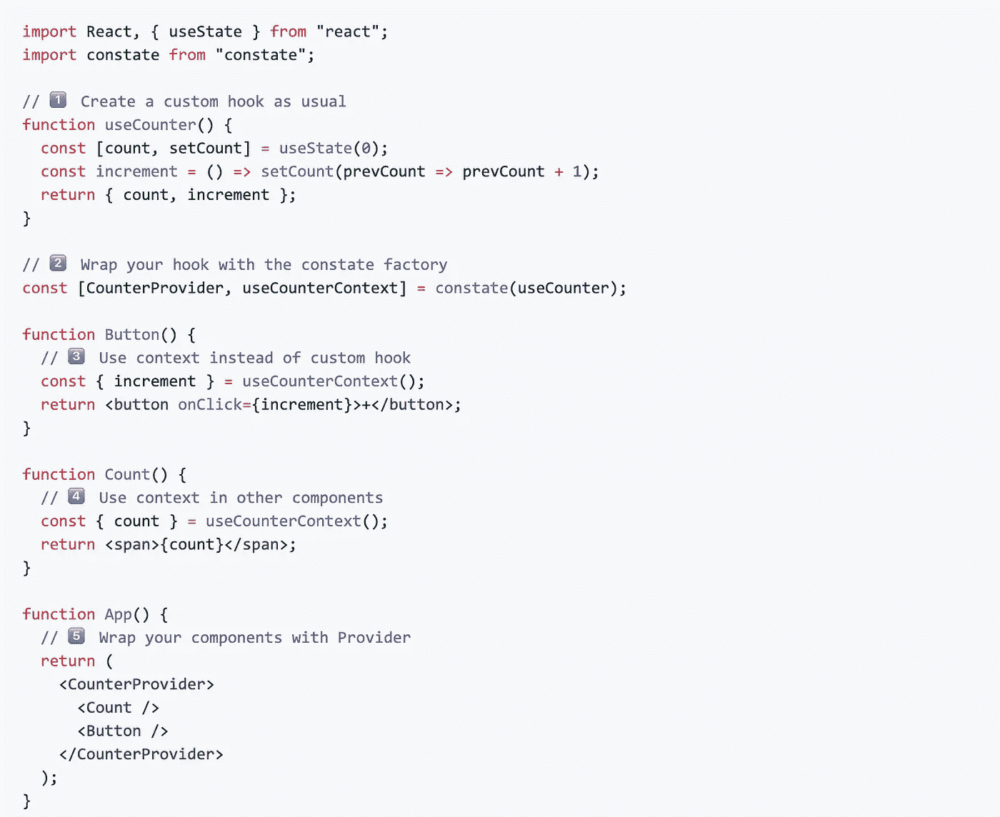
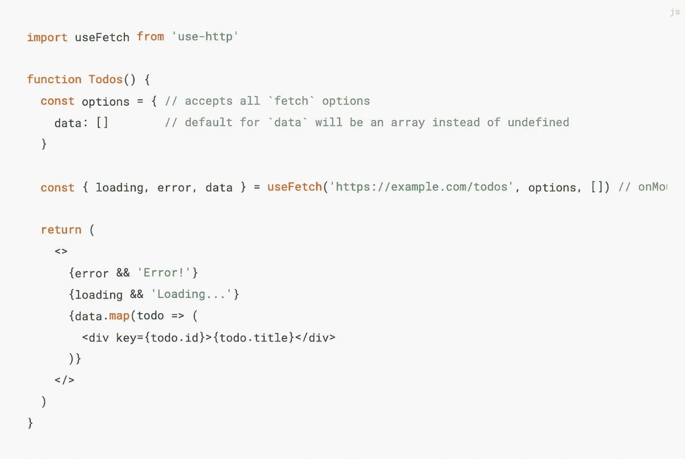
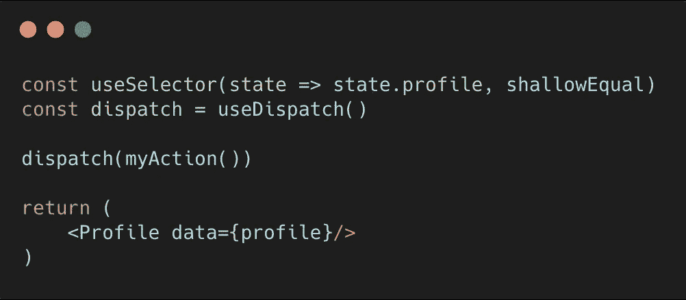
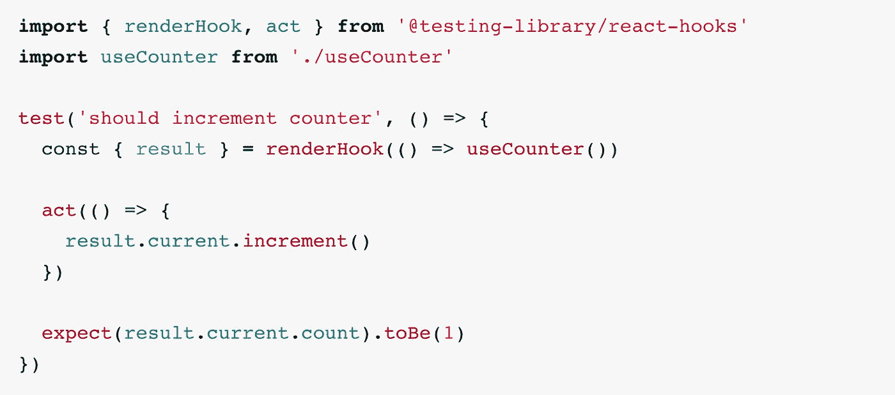

# Github 上排名前五的 React 挂钩

> 原文：<https://levelup.gitconnected.com/why-arent-you-using-these-custom-react-hooks-bf1e63589615>

你一定会找到你喜欢的东西

有了像`useState`、`useEffect`、`useCallback`和`useContext`这样的钩子，我们现在可以构建一个仅由功能组件组成的 React 应用程序。

但是有达芬奇和毕加索在为你我这样的人构建漂亮的 React hook 库。我们如果不利用它们就太傻了！

但是时间是宝贵的，所以我缩小了你今天可以在你的项目中开始使用的前 5 个 react hooks 库。

# 使用表单状态反应

您可以轻松地添加验证器、检查原始性、自定义值等等。

wsmd 的 react-use-form-state 是一个帮助你管理表单状态的奇妙的库。复杂的状态和形式往往总是在同一个三明治里(我说得对吗..？).以下是一些好处:

*   **一个简单但有效的 API。**您可以在 5-10 分钟内启动并运行。说真的。
*   **支持打字稿。**您可以获得现成的 Typescript 支持。太棒了。
*   **灵活。**您可以自由地使用自定义输入值、自定义变更处理程序、字段验证器以及表单可能需要的任何东西。
*   **轻量级。**API 很小。它不会像其他解决方案一样让你的应用程序膨胀。

# 康斯泰特

Constate 是 diegohaz 的一个包，它允许你将你的定制钩子中使用的状态“提升”到上下文中。

您是否曾经在一个组件中使用了`useState`,但希望多个组件也能访问该状态？上下文是解决方案，但是保持上下文和状态同步可能会很麻烦。

Constate 让您轻松做到这一点。它为您提供了一个上下文提供者，以及一个钩子的增强版本，它将与上下文提供者中的每个组件共享它返回的状态。

自述文件中的示例

那么有什么好处呢？

*   **同步状态。**很多时候你希望你的应用程序的几个部分能够访问相同的状态。这就是语境产生的原因。Constate 只是让使用你最喜欢的 React 钩子(useState、useEffect、useCallback 等)的上下文 API 变得超级简单。
*   **只使用你需要的状态。如果你的上下文状态中有 20 个变量会怎样？每次其中一个改变，你的整个树都会重新渲染。Constate 通过拆分值来避免不必要的重新渲染，如本例中的[所示。](https://github.com/diegohaz/constate#advanced-example)**
*   **样板文件少。Constate 只用一行代码就给出了一个上下文提供者和你的上下文连接钩子。**

# 使用 HTTP

[use-http](https://use-http.com/#/) 是一个为获取数据提供钩子的包。与使用`await fetch()`并自己处理加载、错误和成功状态不同，`useFetch()`允许您在一行代码中访问这些状态。

文档中的基本示例

这确实是一个基本的例子。`useFetch`有很多更牛逼的功能。你可以在他们的网站上找到它们，但我要重申几个突出的例子:

*   **SSR &反应原生支持。**如果服务器端渲染对你很重要，或者你正在使用 React Native 开发一个应用程序，这个包可以满足你。
*   **GraphQL 挂钩。**它有`useQuery`和`useMutation`挂钩，提供与`useFetch`相同的好处
*   **获取+提供者。**通过使用上下文提供者，你可以指定你的 API 根(例如`[https://api.mywebsite.com](https://api.mywebsite.com),)` [)、](https://api.mywebsite.com),)，然后提供者内的每个`useFetch`都将使用那个作为根。你只需要指定一个路径，比如`/posts`或者`/auth`。
*   您可以中止请求。您遇到的一个副作用是使用了一个在完成(或出错)时更新状态的钩子。如果您的组件数量增加，请求仍然会被处理，React 会警告您不能在一个卸载的组件上更新状态。这个图书馆会帮你处理的。

# Redux

没错。多亏了 Redux Hooks，甚至 Redux 也榜上有名。使用`mapStateToProps`和`mapDispatchToProps`的日子已经一去不复返了。

Redux 传统上有大量的样板文件，但是 redux 钩子有助于减轻一些样板文件。

shallowEqual 是 redux 为浅值比较提供的等式函数

*   **不再连接 hoc。**我们不再需要将组件包装在一个 connect HOC 中。
*   **不再有** `**mapStateToProps**` **和** `**mapDispatchToProps**` **。**这总是导致大量代码膨胀。
*   **可重复使用的选择器。**我们通过选择器函数获取状态，如果需要，可以很容易地在许多组件之间重用。

# @测试库/反应钩

在测试你的定制 react 钩子时有困难吗？也许您遇到了臭名昭著的错误消息，“*不变违例:钩子只能在函数组件的主体内部调用。*

[@ testing-library/react-hooks](https://www.npmjs.com/package/@testing-library/react-hooks)来救援了！

[文档中的基本示例](https://react-hooks-testing-library.com/usage/basic-hooks)

这个库减轻了测试挂钩的麻烦:

*   **无需制作“测试组件”容器。**钩子通常必须在一个组件内测试，因为那是它们唯一可以生存的地方。本库会为您处理这些。
*   **访问钩子的返回值。使用`result.current`，你可以访问从钩子返回的任何值。这些可能是更新状态的函数，也可能是其他函数。**
*   **非常简单的 API。没什么大不了的，这是好事。它专注于测试钩子的痛点，仅此而已。**

# 结论

好吧，就是这样！为您的项目提供 5 个很棒的库。我希望你至少能找到其中一个与你相关的。如果你知道其他很棒的(当然还有其他的)，请在评论中分享吧！

感谢支持！

# 想要 30 秒提示吗？在 Instagram 上关注我

