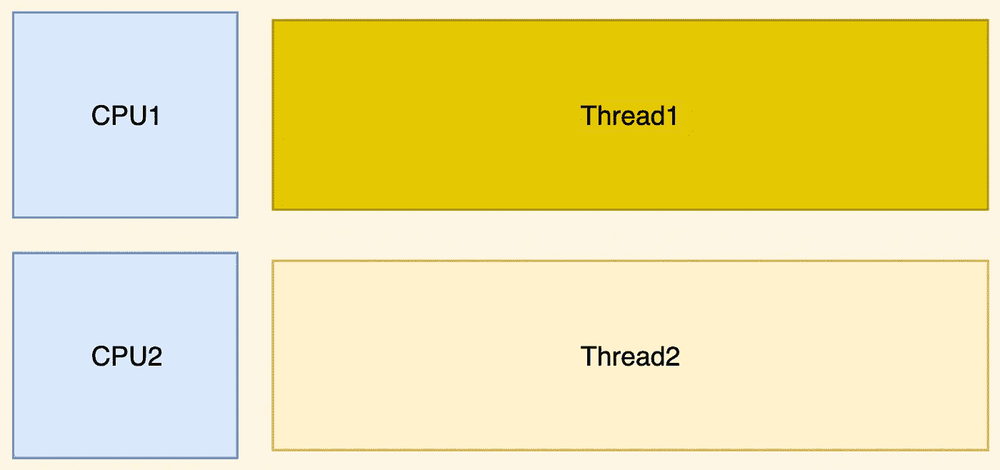

# 为什么异步是一种趋势？

> 原文：<https://levelup.gitconnected.com/why-asynchronous-is-a-trend-c9892667e245>

在过去的十年中，异步代码成为了一种非常流行的方法，但是您是否想过为什么我们要从同步代码转向异步代码呢？让我们更深入地探讨这个主题，并找出我们为什么进行这种转变，以及异步代码的利弊。

## 服务器如何在同步模式下工作

为了理解为什么异步代码变得如此流行，我们需要理解同步服务器是如何工作的。让我们从基础开始，我们有一个客户端(PC)和一个服务器，客户端通过互联网与服务器通信。

每次服务器收到一个请求，它都会创建一个新的[线程](https://en.wikipedia.org/wiki/Thread_(computing))。然后，所有与请求相关的操作都在这个线程中执行，这非常有用，因为您有用户上下文，并且一切都是独立的。

## 为什么同步服务器难以扩展

现在，当我们知道通常为每个请求创建一个线程时，是时候讨论多任务和并发性了。每台计算机都有一个 CPU(中央处理器), CPU 负责计算和执行我们用代码编写的操作。CPU 有一定数量的核心，每个核心一次可以执行一个线程。

通常，我们要执行的线程比内核多得多，所以我们的 OS(操作系统)管理硬件的方式是以[最有效的方式](https://www.guru99.com/cpu-scheduling-algorithms.html)将处理器时间分配给所有线程。我不会太深入这个话题，所以让我们假设它只是给每个线程等量的处理器时间。而这叫做伪并行，我们的 OS 切换每个 CPU 执行的线程，所以看起来像是每个线程的并行执行。

问题来了，为 CPU 切换线程并不是一个廉价的操作，而且****线程越多，CPU 花在线程间切换而不是执行实际代码**的时间就越多，这将导致由于进程时间不足而导致的滞后响应。**

## **异步服务器如何利用资源**

**最后，是时候讨论异步代码了，异步代码的思想是让主线程(执行业务逻辑的线程)响应客户端，同时将大多数操作，如 I/O(输入/输出，例如读取文件)和 CPU 密集型操作卸载到[线程池](https://en.wikipedia.org/wiki/Thread_pool)(也称为工作线程池)。该池的线程数不应超过服务器上的 CPU 核心数。**

****

**每次你需要在主线程之外做一些事情的时候，你都是在“调度”一个任务，通过把它放到一个队列中，然后当你从一个池中有一个空闲线程的时候，它将在你的任务上工作。通过这种方式，我们在一定程度上解决了扩展服务器的问题，因为现在您的 CPU 将更多时间用于处理请求，这显著增加了您的单个服务器可以处理的并发请求数量。**

## **异步服务器的缺点**

**异步代码的主要缺点是，您只有一个“主”线程，其中大部分时间执行所有业务逻辑，其余的通常由您的异步引擎处理。**

**由于您的业务逻辑是在单线程中执行的**如果您有一段运行时间过长的代码**(通常我们称之为阻塞器)**您的服务器将变得缓慢**并且几乎不会响应其他客户端，因为它将忙于处理多个请求中的一个。**

## **摘要**

**异步代码是一种工具，像任何其他工具一样，你需要知道何时使用它，它不是能解决你所有问题的银弹，而是一把双刃剑，如果使用不当，也会伤害你。**

**在[的下一篇文章](/how-to-handle-blockers-in-node-js-1966d0399703)中，我们将以 [Node.js](https://nodejs.org/en/) 为例，讨论如何克服异步服务器的缺点。**