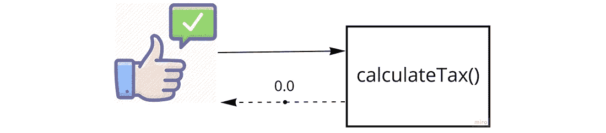
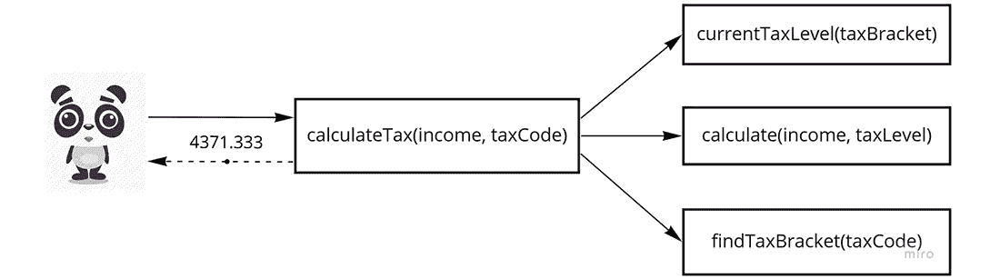
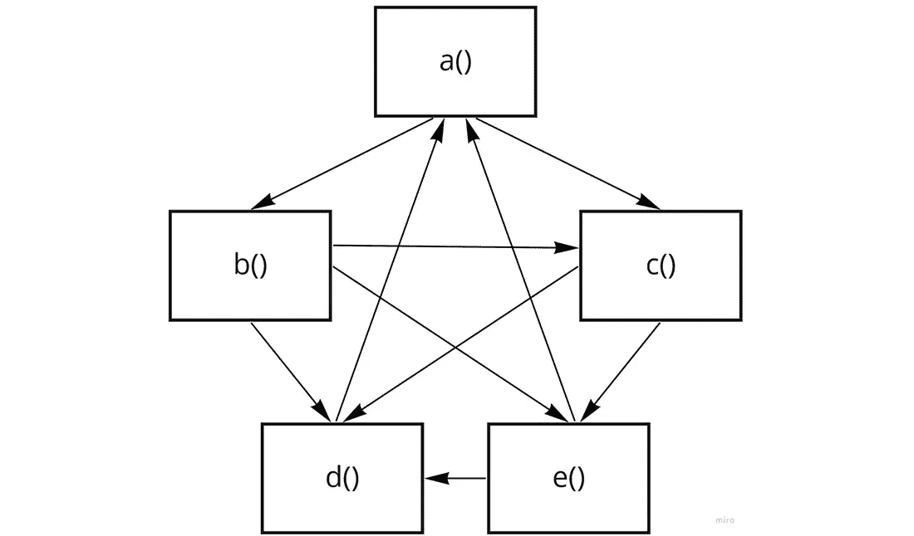

# 为什么“无 bug”是一个相当荒谬的断言，我们的目标是什么

> 原文：<https://levelup.gitconnected.com/why-bug-free-is-a-fairly-ridiculous-assertion-and-what-to-aim-for-instead-5af830eee839>

克雷格·卡梅隆在 [Unsplash](https://unsplash.com?utm_source=medium&utm_medium=referral) 上拍摄的照片

为什么要写单元测试？我问过很多人，一个常见的回答是:“所以我知道我的代码没有 bug。”

当然，这听起来很合理，除了一件事…

说一段代码 100%没有错误就像说一艘大帆船上没有老鼠一样…你永远无法确定。

为了说明原因，让我们从最简单的情况开始，然后加入一些次要的复杂性。

代码单元越小或越不复杂，就越有理由将其标记为 100%无错误:

这段代码只有一个没有参数的函数`calculateTax`。假设结果是不变量，只有一种可能的结果。在这一级别的测试中，只需验证一个预期的结果，您就可以安全地验证该功能是否有效。

当然，功能不会独立运行，它们是一个更大系统的一部分:

我们现在有四个功能，而不是只有一个，所以事情变得有点复杂。

这个函数调用链仍然只有一个入口点；然而，即使这个简单的代码也有潜在的错误，因为:

*   `currentTaxLevel`依赖于`findTaxBracket`的输出
*   `calculate`依赖于`currentTaxLevel`的输出
*   `calculateTax`(最外层功能)依赖于`calculate`的输出

但是大多数代码甚至没有那么简单。

如果你熟悉[梅特卡夫定律](https://medium.com/@john_ryu/metcalfes-law-101-69733d33b167)，仅仅 5 个相互关联的函数的最坏情况的复杂程度可能是这样的:

晚餐吃意大利面？

…不过，公平地说，这肯定是一个设计得非常糟糕的程序。

如果你为`a()`编写一个单元测试，为`b()`编写一个单元测试，等等，这将变得非常昂贵，但是不能证明`a`、`b`、`c`等等一起正确地工作。正确性与验证功能本身一样，也与功能之间的交互有关。

然而在如此多的项目中，[代码覆盖率](https://en.wikipedia.org/wiki/Code_coverage)——测试运行的代码库的百分比——在衡量项目的整体适用性时被给予了不成比例的高度重视。您可以为上述 5 个函数中的每一个编写一个独立的测试，并在每种情况下模仿或存根其他 4 个函数，并且——即使项目仍然可能充满 bug——代码覆盖率将达到令人兴奋的 100%。啊哦…

照片由[艾尔·琼·布斯塔曼特](https://unsplash.com/@eyrejune123?utm_source=medium&utm_medium=referral)在 [Unsplash](https://unsplash.com?utm_source=medium&utm_medium=referral) 上拍摄

一旦您从单个函数中缩小哪怕一点点，您就会面临复杂性——函数在不同的时间以不同的顺序从不同的端点调用其他函数。排列的数量很快变得惊人的巨大，以至于说“是的，绝对没有错误”是荒谬的。我们可以尽最大努力，通过手工测试、自动化测试、基于属性的测试等来捕捉尽可能多的 bug，但仅此而已。

# "哦，他现在正试着看花"

情况变得更糟……取决于输入参数——也就是说，一旦你开始考虑*数据*——代码覆盖率的概念变得毫无意义。可能的结果的数量，以及潜在的未被发现的错误的数量，实际上是无限的。

我想，到目前为止，我已经描绘了一幅相当暗淡的单元测试图，但是…暗示乌云正在散去，太阳正在升起…有一种更好的测试方法，也将使你的编程生活变得更容易。

# 所以，如果我们不能证明我们的代码没有错误，我们能做什么呢？

罗伯特·卢克曼在 [Unsplash](https://unsplash.com?utm_source=medium&utm_medium=referral) 上拍摄的照片

由于“无 bug”是一个相当荒谬的断言，你的软件可以被打上“适合用途”的标签。

“目的”是由需求定义的，您可以使用用户故事和场景来指定。让我们停下来快速定义一下:

用户故事是从最终用户的角度对软件特性的描述。场景是用户故事的一个具体例子。

这里有一个例子:

> 作为一名银行客户，我想从自动取款机上取钱，这样我的钱包里就有现金了。

场景分解故事，探索细节。您应该会发现，您至少有一个“快乐之路”场景(一切顺利)，以及您的团队能想到的尽可能多的“不快乐之路”场景(哪里出错了，系统如何响应)。场景通常以用例形式编写(“用户输入他们的 PIN 系统检查 PIN 和…)，或者作为测试场景，例如使用[小黄瓜](https://medium.com/@mvwi/story-writing-with-gherkin-and-cucumber-1878124c284c)格式(“给定/何时/然后”)。

# 所以，现在我们都赶上了…

如果测试全面地覆盖了需求，那么您可以自信地说:

> 我的代码符合目的，因为它满足需求(用户故事和场景),包括我可能遇到的所有错误场景(不愉快的路径)。

这和“这段代码没有 bug”是完全不同的，因为“这段代码没有 bug”是完全没有把握的。但是前者比后者更有用，这也是我们的目标。这也是一个更现实的目标。

**换句话说，瞄准*需求覆盖*而不是代码覆盖。**

在测试中达到 100%的需求覆盖率实际上是非常简单的——事实上，这是您的项目非常希望达到的状态😍。您只需执行以下操作即可实现这一目标:

1.  将用户故事分解成不同的场景——开心的和不开心的
2.  在编写代码时，为每个场景编写测试

最重要的是:

仅编写满足场景的代码，其中场景满足故事的一部分。

从需求覆盖而不是代码覆盖的角度来思考是思维方式的真正改变，因为团队会突然关注所有的需求，质疑边缘案例，并从涉众那里寻求澄清。这经常导致需求本身被修改，在任何一个需求被写在代码中之前。

实际上，你的团队将[将测试导向业务领域](https://www.domainorientedtesting.com/)而不是被测代码。

但是最重要的是，基于需求场景的测试意味着您将确切地知道您什么时候完成了测试——既知道您什么时候编写了使测试通过的所有代码，也知道您什么时候编写了足够多的测试。

并且您将能够自信地说您的代码是适合目的的。