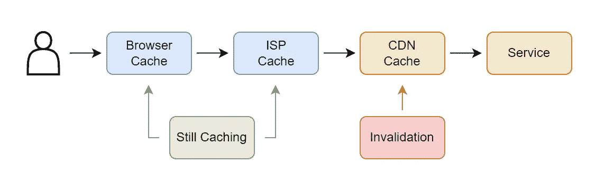
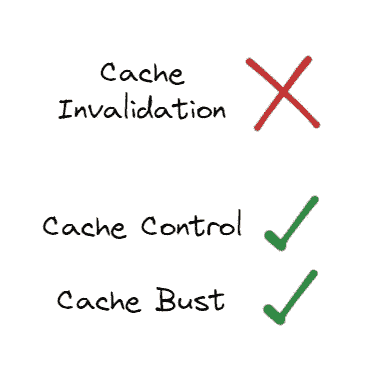

# 为什么缓存失效不起作用

> 原文：<https://levelup.gitconnected.com/why-cache-invalidation-doesnt-work-c258269466e4>

使用缓存失效来发布网站的新版本是行不通的。

当开发一个小网站时，很容易跳过管理缓存的过程，直接为所有东西服务。然而，一旦网站扩大规模并开始利用内容分发网络(CDN ),实施适当的缓存策略就变得非常重要。当开发人员跳过这一步时，可能会导致客户收到过期的内容，甚至是损坏的网站。


缓存失效不起作用

# cdn 为什么使用缓存

内容分发网络(CDN)通常用于缓存对 web 性能请求的响应。当一个 CDN 缓存一个网站时，它将提供内容而不返回到原点。这可以节省时间并提供更好的客户体验。然而，如果 CDN 有缓存内容，它可以提供过时的信息。开发人员推出新内容的方法之一是使用 CDN 提供的工具使缓存失效。


常见的 CDN 提供商

# 为什么缓存失效不起作用

使 CDN 级别的缓存失效不会对用户浏览器或互联网服务提供商(ISP)缓存产生任何影响。这意味着，即使您使缓存无效，也没有办法从客户的角度了解发生了什么。



缓存示例

浏览器使用与 CDN 相同的指令缓存标题。这意味着，如果用户访问您的站点，您随后会使缓存无效，当用户再次访问您的站点时，他们仍然可以收到旧版本。

> 失效是为了在特殊情况下使用，而不是作为正常工作流程的一部分。无效不会影响网页浏览器缓存或第三方互联网服务提供商运营的缓存中的缓存副本。— [谷歌](https://cloud.google.com/cdn/docs/cache-invalidation-overview)

ISP 也经常缓存常用网站的数据，以节省他们的网络成本并减少他们所拥有的服务器的负载。

一旦用户的浏览器或 ISP 缓存了您的内容，您就无法将其从缓存中删除。这就是缓存失效不起作用的原因，应该使用替代解决方案。

# 有哪些替代方案？

在对网站进行更改时，我们应该使用适当的缓存头或缓存破坏，而不是使缓存无效。网站默认设置缓存头是很常见的，但是正确使用它们以避免缓存失效是很重要的。

## 期满

我们可以使用 expires 头来设置从缓存中清除特定对象的时间。然而，管理这种报头可能很困难，并且它有一些技术问题:

> 时间格式很难解析，发现了许多实现错误，并且有可能通过故意改变系统时钟来引发问题— [Mozilla](https://developer.mozilla.org/en-US/docs/Web/HTTP/Caching)

```
Expires: Tue, 28 Feb 2022 22:22:22 GMT
```

## 缓存控制:最大年龄

通常我们应该使用 max-age 头来提供一个对象应该被缓存的持续时间。一个很好的起点是将其设置为 86400，这等于一天，因为标题是以秒为单位设置的。这意味着，如果你推出了一个网站的新版本，它将保证在 24 小时后向所有用户展示。

```
Cache-Control: max-age=86400
```

## 缓存破坏

如果我们既想使用缓存，又想向客户推出即时更新，我们可以使用一个更复杂的解决方案，称为缓存破坏。通过为我们的请求设置唯一的 URL 或查询字符串值，缓存会将每个版本视为一个新对象。这意味着，如果我们在每次更改时都部署新的链接，并且从不缓存初始 index.html，我们就可以加载新文件，而不必等待缓存清除旧文件。

```
# Initial link
/css/main.css?1653714985# New link
/css/main.css?1653715024
```

# 摘要

下次您需要使缓存无效来部署网站更改时，请尝试使用 max-age 或缓存破坏。这将为您的每次部署节省时间和精力，同时让您确信为客户提供的是正确的文件。



缓存控制&破坏而不是无效

如需了解更多内容，请点击此处或通过以下方式联系我:

*   **推特:** [@BenTorvo](https://twitter.com/BenTorvo)
*   **邮箱:**[ben@torvo.com.au](http://torvo.com.au/)
*   **网址:**[torvo.com.au](http://torvo.com.au/)

# 更多信息

[](https://developer.mozilla.org/en-US/docs/Web/HTTP/Caching) [## HTTP 缓存- HTTP | MDN

### HTTP 缓存存储与请求相关联的响应，并为后续请求重用存储的响应…

developer.mozilla.org](https://developer.mozilla.org/en-US/docs/Web/HTTP/Caching) [](https://developer.mozilla.org/en-US/docs/Web/HTTP/Headers/Cache-Control) [## Cache-Control - HTTP | MDN

### max-age=N response 指令表示响应保持新鲜，直到响应被…

developer.mozilla.org](https://developer.mozilla.org/en-US/docs/Web/HTTP/Headers/Cache-Control)