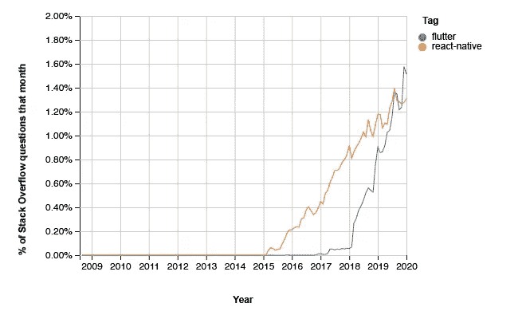

# 2020 年为什么选择 Flutter？

> 原文：<https://levelup.gitconnected.com/why-choose-flutter-in-2020-22d87e60200a>

## 和大家说的一样好，但是更好

[https://flutter.dev](https://flutter.dev)

## 什么是颤振？

F lutter 是来自 Google 的一个很棒的跨平台框架，可用于构建移动、桌面和 web 平台的应用程序。2018 年 12 月正式发布，仅用了一年时间就在 GitHub 和 Stack Overflow 上获得了超过 React Native 的人气。所有的炒作都有一个很好的理由，我将在本文中尝试解释。

## 为什么是另一个框架？

当我告诉软件行业的人关于 Flutter 的时候，他们通常会问我的第一个问题是“为什么有人会使用它而不是 React Native 或其他 SDK？”答案很简单——它在各方面都优于其他任何可用的产品。一般来说，人们想要更多的解释，这是可以理解的。

我们经常看不到我们自己的工具和资源的局限性，直到其他人提供了更好的东西，即使这样，我们自己的偏见和先入为主的观念也很难放弃“旧方式”并接受更强大和更灵活的东西。软件也不例外。例如，只有 PHP 经验的人会争论为什么 PHP 是如此伟大的语言，而不理解除了简单的 web 服务器之外的设备和系统的巨大生态系统。并不是所有的东西都是网站，这也是为什么我如此强烈地支持使用一套专门构建的工具来进行应用程序开发，而不是使用那些从前端 web 生态系统移植过来的工具。

## 颤振的优点

颤振有一些明显的优势。这些优势被设计到底层语言和 SDK 中，以解决其他技术的常见问题和缺点。这里有几个简单的理由，说明为什么你应该为你的下一个项目选择 Flutter，或者如果你处于任何领导位置，你应该允许你的开发人员使用它:

## **1。飞镖语言**

与那些努力实现标准化并经常有许多不同语言特性的不同版本的语言不同(许多开发人员不知道这些差异是什么)，Dart 语言从一开始就被设计成一个用于构建客户端应用程序的优秀工具，并针对开发 UI 进行了调整和优化。没有相互竞争的标准，没有移植应该是标准的特性，也没有奇怪的语言。

Dart 有一个清晰且非常强大的语法，它不仅促进而且鼓励强大的应用程序架构和设计，更不用说团队统一、标准化、长寿、易于维护，以及其他通常与许多现有的跨平台开发工具不相关的事情。它类似于其他流行的语言，如 C#、Java 和 TypeScript，这意味着对于那些有一些经验的人来说，它很容易采用并立即开始使用。

## **2。开发人员广泛采用**

在短短的一年时间里，Flutter 在 GitHub 和 Stack Overflow 上都比 React Native(当时最流行的框架)更受欢迎。这对您的应用程序来说意味着有更多的资源可供学习，有更多熟练的开发人员来开发您的应用程序，技术本身的迭代速度更快(这意味着它将更快地成长和成熟，并保持更长的相关性)。

[堆栈溢出趋势](https://insights.stackoverflow.com/trends?tags=flutter%2Creact-native) —颤振与反应原生的比较

在上面堆栈溢出趋势的图表中，我们可以看到 Flutter 是如何突然出现并取得领先地位的。这种情况可能会继续，这意味着迟早会很难找到愿意并且能够使用其他技术支持跨平台应用程序的开发人员。这通常需要很长时间(几年),但是在软件开发社区中已经一次又一次地发生了。

## **3。速度极快**

Flutter 应用程序编译成依赖于 C/C++内置的图形和渲染引擎的本地二进制文件，从而产生一个非常快速和高性能的应用程序。Flutter 应用程序能够在大多数设备上实现稳定的 60fps，在支持它的设备上达到令人难以置信的 120fps。许多开发人员已经注意到与其他跨平台框架相比，Flutter 的性能有了巨大的提高，这是它被移动应用程序开发人员迅速广泛采用的一个驱动因素。虽然在性能和流畅渲染方面，构建真正的原生应用程序是难以超越的，但在跨平台框架方面，Flutter 比竞争对手有明显的优势。

## 4.(相对)很好学

虽然有人可能会说没有真正的生产语言或工具包是真正*容易*学习的，但是在那些拥有清晰的文档和标准设计模式的人和那些拥有参差不齐的文档和高度不同的方法来完成应该非常简单和直接的任务的人之间有很大的区别。

除了性能之外，Flutter 获得如此大规模广泛采用的另一个原因是因为有优秀的文档和大量高质量的示例可供参考。对于有兴趣学习新的框架、工具包或语言的开发人员来说，这是非常重要的，对于更有可能发现语言或工具包本身设计问题的有经验的程序员来说尤其如此。当学习某项技术时，一个已经编程几十年的人会很快变得沮丧，因为该技术没有很好的文档或者关于如何完成基本任务的相互矛盾的例子。Flutter 因其清晰的文档和支持性的专家和新手社区而受到重视，这些专家和新手经常渴望分享他们的经验，并为他人提供优秀设计和开发模式的可靠工作示例。对于那些旨在易于使用并被广泛受众采用的技术，精英主义的色彩通常会有所减少。

## 5.它设计得很好

Flutter 是在一个优秀的语言( [Dart](https://dart.dev) )和一个快速高性能渲染引擎( [Skia](https://skia.org/) )的基础上从头开始设计的。由于这些设计选择，避免了以他人为代价的多年试验，并且从一开始就做出了关于其设计的重大决策。

这产生了一个优秀的框架，它鼓励所有技能水平的开发人员以一种促进使用良好设计模式和最佳实践的方式来构建应用程序，而不是倾向于标准冲突或由糟糕的语言实践(如糟糕的 JavaScript，大多数开发人员都认为这充其量是一场噩梦)导致的内置技术债务。熟悉在各种设备上构建应用程序多年的人可能会在使用 Flutter 的几分钟内看到它所提供的明显优势，并且新来者不太可能感到沮丧，因为互联网上有很多可以学习最佳实践的例子。

## 结论

Flutter 从头开始构建，使开发人员能够在创纪录的时间内创建高性能的应用程序，避免了许多甚至难以用语言表达的问题，并提供了一个优秀的开发平台，真正需要看到才能完全理解。很难将经验用语言表达出来，但是我希望这篇文章能够提供一些关于为什么有经验的开发人员会选择 Flutter 作为未来项目的见解。

请跟随我，了解演示如何构建动画、部署到桌面或 web 目标，以及实现其他可以很好地转化为现实世界应用程序开发场景的有用内容的 Flutter 示例。

感谢您的阅读，祝您的下一个项目好运！

> 肯尼斯·雷利( [8_bit_hacker](https://twitter.com/8_bit_hacker) )是 [LevelUP](https://lvl-up.tech) 的 CTO