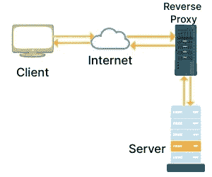

# 为什么 Cloudflare 放弃 NGINX 而选择 Pingora

> 原文：<https://levelup.gitconnected.com/why-cloudflare-abandoned-nginx-for-pingora-b5c4e5256a4a>

## 网络应用和对速度的需求

照片由 [imgix](https://unsplash.com/@imgix?utm_source=unsplash&utm_medium=referral&utm_content=creditCopyText) 在 [Unsplash](https://unsplash.com/s/photos/cloud-server?utm_source=unsplash&utm_medium=referral&utm_content=creditCopyText) 上拍摄

在我们进入代理和反向代理的技术细节之前，让我们了解一下 Cloudflare 是做什么的，以及它们服务的客户类型。

## 什么是 Cloudflare？

Cloudflare 是一种服务器网络，可提高互联网连接应用程序的安全性和性能。

可以将 Cloudflare 看作是一个充当客户端和服务器之间中介的系统。该系统充当反向代理。

Cloudflare 还充当 CDN(内容交付网络),这意味着缓存 web 资源(静态内容)以增强 web 应用程序的性能和速度。

## 什么是反向代理？

我们知道，客户端与服务器通信的方式之一是通过 URL，类似于 www.myserver.com。但是，实际的服务器位置是通过一个类似 127.0.0.1 的 IP 地址来访问的。

将 URL 转换成适当的 IP 地址的过程称为 DNS 查找。

如果没有像 Cloudflare 或 Nginx 这样的系统，当客户端试图联系 www.myserver.com 时，相应的服务器的 IP 地址将被返回。

通过使用像 Cloudflare 或 Nginx 这样的系统作为客户端和服务器之间的中间人，DNS 查找将返回中间人的 IP 地址，而不是实际服务器的 IP。

**为什么这很重要？**

1.  服务器的 IP 不需要暴露给公众，增加了服务器的安全性。
2.  安全威胁由 Cloudflare 系统识别和处理。
3.  由于 Cloudflare 还充当 CDN 系统，它有助于提升 web 应用程序的性能。

因此，反向代理是位于应用服务器前面的代理服务器。

作者图片:反向代理

## NGINX 是什么？

NGINX 于 2004 年 10 月发布，是一个开放源代码的 web 服务器，充当反向代理。

NGINX 遵循事件驱动的架构。

NGINX 没有使用单线程处理每个 web 请求，而是遵循一个工作进程。每个工作进程使用称为工作连接的更小的工作单元来处理类似的线程。这些工作单元处理并发请求。

这个架构帮助 NGINX 快速处理数千个请求。

## 什么是 Pingora？

Cloudflare 长期以来一直在其代理堆栈中使用 NGINX，但最近他们转向了内部解决方案 Pingora。

NGINX 是用 C 编写的，而 Pingora 是用内存安全的现代 Rust 语言编写的。

Pingora 采用多线程方法，而不是 NGINX 遵循的多进程方法。

## 为什么 Cloudflare 会迁移到 Pingora？

Cloudflare 发现了 NGINX 工作进程架构的局限性。

Cloudflare 加速代理服务器与源服务器之间的连接的方法之一是尽可能多地重用已建立的 TCP 连接。

使用 NGINX，单个 web 请求由单个工作器处理，这意味着到达特定工作器的请求只能重用该工作器可用的连接。这会影响代理服务器的性能，并且需要 Cloudflare 维护更多的连接和资源，这也会增加费用。

这也是 Pingora 从多进程模型转向多线程模型的原因之一，这样他们就可以共享资源，比如连接池。

Cloudflare 声称 Pingora 比 NGINX 更快更高效，只使用了三分之一的内存和 CPU 资源。

## 你的项目中需要抛弃 NGINX 吗？

Cloudflare 现在已经使用 NGINX 很长时间了。

考虑到 Cloudflare 每天服务超过 1 万亿个请求，这是他们决定解决 NGINX 带来的性能挑战的原因。

您可能需要自己检查一下，您的应用程序是否已经超出了 NGINX 提供的服务；如果没有，你现在可能没有理由担心。