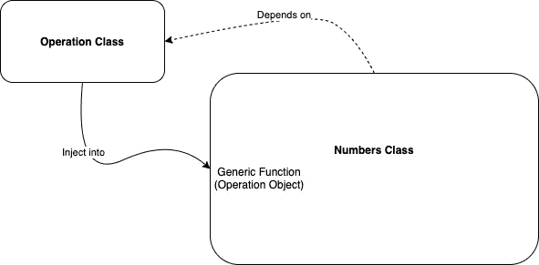
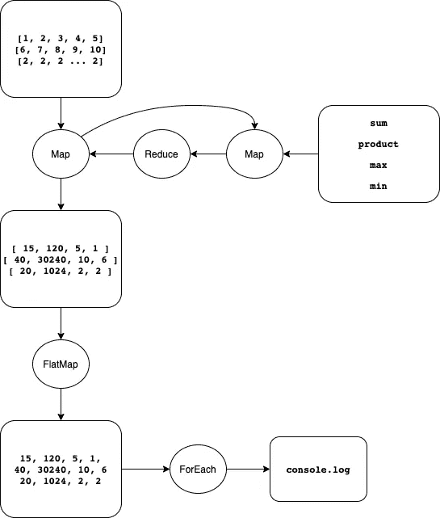

# 为什么代码从过程化到面向对象再到函数式编程

> 原文：<https://levelup.gitconnected.com/why-code-evolve-from-procedural-to-object-oriented-to-functional-programming-13a88292307e>

## 探索编程世界

## 通过实际的代码示例学习不同风格的编程范式


由[马库斯·斯皮斯克](https://unsplash.com/@markusspiske?utm_source=medium&utm_medium=referral)在 [Unsplash](https://unsplash.com?utm_source=medium&utm_medium=referral) 上拍摄的照片

函数式编程是当今的趋势！但是等等，为什么它会成为潮流？我们是怎么来到这里的？它不容易理解，不知道与以前的范例相比它有什么好处。

从一开始就知道编程范式是如何转变的，将有助于我们更好地欣赏它，并能够在前进的道路上把握变化的美妙和需要。

当我第一次学习编程时，C 语言知识被认为是所有喜欢学习编程的人的标准语言。这就是所谓的程序设计时代。

然而，那时候 C++是最先进的。类、继承、封装、多态……我的脑袋在困惑为什么需要它们。我就不能用函数做所有的事情吗！

我花了一段时间才完全理解面向对象编程(也称为 OOP)，认为我已经掌握了编程的技巧。我以为我现在可以统治世界，学习任何编程语言。

直到最近(最近几年)，每个人都在谈论函数式编程(又名 FP)。这是什么？功能？那不就是程序化编程吗？

曾经感到困惑的我，现在试图分享我在这个过程中学到的东西，用实际的代码例子(用 JavaScript)来演示代码是如何进化的，如下所示。

加入我的编码之旅，并希望它能更清晰地展示它们的差异和范式转换的需要。

# [结构化编程](https://en.wikipedia.org/wiki/Structured_programming)


图片由作者提供

在程序化编程出现之前，有一种东西叫做结构化编程。它大量使用控制流，如 if-else 和 for-loop。

下面让我们开始我们的编码之旅。

假设我有一个数字数组`[1, 2, 3, 4, 5]`，我喜欢把它们相加。

```
const *numbers1* = [1, 2, 3, 4, 5]
**let *sumOfNumbers1* = 0
for (let index = 0;index < *numbers1*.length; index++) {
    *sumOfNumbers1* += *numbers1*[index]
}**
*console*.log(*sumOfNumbers1*)
```

[ [完整代码在此处](https://github.com/elye/demo_javascript_language_evolution/blob/master/structural1.js)

简单，如上所示的 for 循环，累加所有的数得到总和。

## 需要对不同的数据再次做同样的事情

后来我又有了一组数字`[6, 7, 8, 9, 10]`。我也想总结一下。我需要再次做同样的事情。

```
const *numbers1* = [1, 2, 3, 4, 5]
**let *sumOfNumbers1* = 0
for (let index = 0;index < *numbers1*.length; index++) {
    *sumOfNumbers1* += *numbers1*[index]
}**
*console*.log(*sumOfNumbers1*)const *numbers2* = [6, 7, 8, 9, 10]
**let *sumOfNumbers2* = 0
for (let index = 0;index < *numbers2*.length; index++) {
    *sumOfNumbers2* += *numbers2*[index]
}**
*console*.log(*sumOfNumbers2*)
```

[ [完整代码在此处](https://github.com/elye/demo_javascript_language_evolution/blob/master/structural2.js)

我们可以看到一个共同的模式如下

```
let ***sumOfNumbers*** = 0
for (let index = 0;index < ***numbers***.length; index++) {
    ***sumOfNumbers*** += ***numbers***[index]
}
```

吃两次也没那么糟。然而，想象一下，如果我们必须对 100 组数字进行这样的操作，那么这将是非常重复的。因此，我们需要一种新的编程方法。

# [程序化编程](https://en.wikipedia.org/wiki/Procedural_programming)


图片由作者提供

如上面结构化编程中的例子所示，我们有一些重复的代码。

为了解决这个问题，我们可以将公共代码分离出来，放在一个不同的地方，我们称之为函数(或方法，或例程，或过程)。然后让主逻辑流程调用这个函数。

通过这种方法，我们可以**一次又一次地重用**代码(函数),而不用在多个地方重复使用它。这种方法后来被称为过程化编程。

```
**function sumOfNumbers(numbers) {
    let sumOfNumbers = 0
    for (let index = 0;index < numbers.length; index++) {
        sumOfNumbers += numbers[index]
    }
    return sumOfNumbers
}**const *numbers1* = [1, 2, 3, 4, 5]
*console*.log(sumOfNumbers(*numbers1*))
const *numbers2* = [6, 7, 8, 9, 10]
*console*.log(sumOfNumbers(*numbers2*))
```

[ [完整代码在此处](https://github.com/elye/demo_javascript_language_evolution/blob/master/procedural1.js)

除了避免重复之外，这种做法还降低了出现 bug 的可能性。如果函数中有 bug，更容易被发现和修复。修复将适用于所有人。太好了！

## 需要对相同的数据再次做不同的事情

有一天，我们决定除了对数字求和之外，还要计算数字的乘积(所有数字的乘积)。

为此，我们现在可以轻松地编写另一个函数来编译。

```
function sumOfNumbers(numbers) {
    let sumOfNumbers = 0
    for (let index = 0;index < numbers.length; index++) {
        sumOfNumbers += numbers[index]
    }
    return sumOfNumbers
}**function productOfNumbers(numbers) {
    let productOfNumbers = 1
    for (let index = 0;index < numbers.length; index++) {
        productOfNumbers *= numbers[index]
    }
    return productOfNumbers
}**const *numbers1* = [1, 2, 3, 4, 5]
*console*.log(sumOfNumbers(*numbers1*))
*console*.log(productOfNumbers(*numbers1*))
const *numbers2* = [6, 7, 8, 9, 10]
*console*.log(sumOfNumbers(*numbers2*))
*console*.log(productOfNumbers(*numbers2*))
```

[ [完整代码在此处](https://github.com/elye/demo_javascript_language_evolution/blob/master/procedural2.js) ]

很好，只需一个函数，我们就能轻松做到。在帕斯卡的时代，生活是美好的。

但是程序员就是程序员，他们很懒。他们开始思考，为什么我们要一次又一次地为如下所示的每个函数提供数字呢？

```
const *numbers1* = [1, 2, 3, 4, 5]
*console*.log(sumOfNumbers(***numbers1***))
*console*.log(productOfNumbers(***numbers1***))
const *numbers2* = [6, 7, 8, 9, 10]
*console*.log(sumOfNumbers(***numbers2***))
*console*.log(productOfNumbers(***numbers2***))
```

一个简单的解决方案是将这两个函数合并成一个大函数

```
const *numbers1* = [1, 2, 3, 4, 5]
*console*.log(**sumOfNumbersAndProductOfNumbers**(*numbers1*))
const *numbers2* = [6, 7, 8, 9, 10]
*console*.log(**sumOfNumbersAndProductOfNumbers**(*numbers2*))
```

但是结合功能的想法不好。它消除了让它们(和与积)在不同时间或顺序独立计算的灵活性。例如，组合功能将无法灵活满足以下需求。

```
const *numbers1* = [1, 2, 3, 4, 5]
*console*.log(**sumOfNumbers**(*numbers1*))
*console*.log(**sumOfNumbers**(*numbers2*))
const *numbers2* = [6, 7, 8, 9, 10]
*console*.log(**productOfNumbers**(*numbers1*))
*console*.log(**productOfNumbers**(*numbers2*))
```

# [面向对象编程](https://en.wikipedia.org/wiki/Object-oriented_programming)


图片由作者提供

随着这个问题在过程编程中的共享，面向对象编程的诞生来拯救。

整个想法是，对象(或数字)能够做自己的操作，而不需要调用者担心它是如何做的。这叫做…

## 包装

在面向对象编程中，对象将包含它自己的数据，以及它可以对数据进行操作的一组函数。物体通常被定义为`class`

```
class **Numbers** {
    constructor(numbers) {
        this.numbers = numbers
    } **sumOf**() {
        let sumOfNumbers = 0
        for (let index = 0;index < this.numbers.length; index++) {
            sumOfNumbers += this.numbers[index]
        }
        return sumOfNumbers
    } **productOf**() {
        let productOfNumbers = 1
        for (let index = 0;index < this.numbers.length; index++) {
            productOfNumbers *= this.numbers[index]
        }
        return productOfNumbers
    }
}
```

这里我们的对象将拥有`numbers`以及函数`sumOf`和`productOf`。

这些数据和函数对使用该对象的代码是隐藏的。这也被称为 ***封装*** 。

有了这个类对象，我们可以使用`new`命令创建它们，并向它提供编号。

```
const *numbers1* = **new Numbers([1, 2, 3, 4, 5])**
*console*.log(*numbers1*.sumOf())
*console*.log(*numbers1*.productOf())
const *numbers2* = **new Numbers([6, 7, 8, 9, 10])**
*console*.log(*numbers2*.sumOf())
*console*.log(*numbers2*.productOf())
```

[ [完整代码在此处](https://github.com/elye/demo_javascript_language_evolution/blob/master/oop1.js)

有了它，我们可以随时调用`sumOf`或`productOf`，而不需要再次向它提供号码。懒惰的程序员现在很开心，因为他不需要一次又一次地提供数字…直到…

## 遗产

我们决定再次添加另一组数字进行计算。这一次，我们希望有`[2, 2, 2, 2, 2, 2, 2, 2, 2, 2]`，或者换句话说，10 个 2。

简单的方法是我们可以做如下

```
const *numbers1* = **new Numbers([1, 2, 3, 4, 5])**
*console*.log(*numbers1*.sumOf())
*console*.log(*numbers1*.productOf())
const *numbers2* = **new Numbers([6, 7, 8, 9, 10])**
*console*.log(*numbers2*.sumOf())
*console*.log(*numbers2*.productOf())
const *numbers3* = **new Numbers([****2, 2, 2, 2, 2, 2, 2, 2, 2, 2****])** *console*.log(*numbers3*.sumOf())
*console*.log(*numbers3*.productOf())
```

虽然这是可行的，但它让程序员看起来很愚蠢。原因是

> 为什么我们要打这么多 2？在 JavaScript 中，我们可以使用`*Array(times).fill(value)*`来实现，其中 value 是 2，times 是 10。

我们可以做如下

```
const *numbers3* = **new Numbers(*Array*(10).fill(2))** *console*.log(*numbers3*.sumOf())
*console*.log(*numbers3*.productOf())
```

但是也许我们可以隐藏`*Array*(times).fill(value)`在类构造函数中完成。

那么我们是否应该编写一个新的类对象来实现这一点呢？它不是一个真正的新类对象，因为它应该有相同的`sumOf`和`productOf`值，同时它也有`numbers`。

在面向对象编程中，我们可以使用 ***继承*** 的概念来解决这个问题。

虽然`[2, 2, 2, 2, 2, 2, 2, 2, 2, 2]`可以是一个`Numbers`对象，但它有一些并非所有`Numbers`都有的特殊属性。它是`Numbers`的子集。

我称之为`SameNumbers`。它是`Numbers`的一部分，将继承`Number`所拥有的一切，同时拥有自己构造对象的方式。

在 JavaScript 中，我们可以使用如下所示的`extends`进行继承。

```
class **SameNumbers** extends **Numbers** {
    constructor(value, times) {
        super(*Array*(times).fill(value)); // Note: we also store `value` and `times` now
        // To explain our next bit of idea: Polymorphism
        this.value = value
        this.times = times
    }
}
```

使用它，现在我们可以编码如下

```
const *numbers3* = **new SameNumbers(2, 10)**
*console*.log(*numbers3*.sumOf())
*console*.log(*numbers3*.productOf())
```

[ [完整代码在此处](https://github.com/elye/demo_javascript_language_evolution/blob/master/oop2.js)

这里我们可以继续使用`sumOf`和`productOf`，因为`SameNumbers`从`Numbers`继承了它们。

## 多态性

一位数学家来检查我们的工作。代码看起来是正确的，因为`sumOf`和`productOf`计算正确。但是数学家不喜欢我们为`SameNumbers`计算`sumOf`和`productOf`的方式

以下是评论

> 为了计算`*SameNumbers*`的和与积，我们不需要遍历这些数字。我们可以通过`*sum = value * times*`和`*product = value ^ times*`更快地完成

哦天哪！但都是`Numbers`。我们如何解决这个问题，让他们与众不同？

也许我们把`Numbers`的`sumOf`和`productOf`中的`if-else`放在下面？

```
class Numbers {
    constructor(numbers) {
        this.numbers = numbers
    } sumOf() {
 **if (this instanceof SameNumbers) {
            return this.numbers[0] * this.numbers.length  
        }** 
        let sumOfNumbers = 0
        for (let index = 0;index < this.numbers.length; index++) {
            sumOfNumbers += this.numbers[index]
        }
        return sumOfNumbers
    } productOf() {
 **if (this instanceof SameNumbers)  {
            return *Math*.pow(this.numbers[0], this.numbers.length)
        }**
        let productOfNumbers = 1
        for (let index = 0;index < this.numbers.length; index++) {
            productOfNumbers *= this.numbers[index]
        }
        return productOfNumbers
    }
}
```

虽然这是正确的，但它看起来很粗糙！！废弃它！

好消息是由于`SameNumbers`是`Numbers`类的子类，它可以 ***覆盖*** 它的父类函数来执行它独特的行为。这使用了 ***多态*** 的概念，其中子对象可以将其功能变形为不同于父对象的另一种形式。

为此，我们只需要在我们的`SameNumbers`类中重新定义`sumOf`和`productOf`函数，如下所示。

```
class SameNumbers extends Numbers {
    constructor(value, times) {
        super(*Array*(times).fill(value));
        this.value = value
        this.times = times
    } sumOf() {
 **return this.value * this.times**
    } productOf() {
 **return *Math*.pow(this.value, this.times)**
    }
}
```

我们现在可以回去告诉数学家，当它是`SameNumbers`时，我们的程序将优化它的`sumOf`和`productOf`计算。加油

## 将所有数字视为对象数组。

为了完成前面所有的计算，我们可以写下面。

```
const *numbers1* = new Numbers([1, 2, 3, 4, 5])
*console*.log(*numbers1*.sumOf())
*console*.log(*numbers1*.productOf())
const *numbers2* = new Numbers([6, 7, 8, 9, 10])
*console*.log(*numbers2*.sumOf())
*console*.log(*numbers2*.productOf())
**const *numbers3* = new SameNumbers(2, 10)
*console*.log(*numbers3*.sumOf())
*console*.log(*numbers3*.productOf())**
```

为了更简洁，我们将使用结构化编程的概念，将它们组合成一个数组，并遍历它们。

```
const *arrayOfNumbers* = [
 **new Numbers([1, 2, 3, 4, 5]),
    new Numbers([6, 7, 8, 9, 10]),
    new SameNumbers(2, 10),**
]for (let index = 0;index < *arrayOfNumbers*.length; index++) {
 ***console*.log(*arrayOfNumbers*[index].sumOf())
    *console*.log(*arrayOfNumbers*[index].productOf())**
}
```

[ [完整代码在此处](https://github.com/elye/demo_javascript_language_evolution/blob/master/oop3.js)

注意，上面的`SameNumbers`和`Numbers`可以被视为同一个`Numbers`对象，它有`sumOf`和`productOf`。因此，将它们组合在一起并很好地循环是可能的。万岁！

快乐的生活了很多年…直到一个年轻的、精力充沛的、进步的 CEO 接管了我们的项目。他的口号是“改变或被改变”…

# [功能编程](https://en.wikipedia.org/wiki/Functional_programming)


图片由作者提供

面向对象编程很好。它允许某种程度的重用。我们可以在这里和这里进行一些小的改动，或者应用于整个`Numbers`类，或者使用*继承*和*多态*的概念进行一些小的功能转移。

我们尽量保持`Numbers`尽可能稳定，变化最小。`Numbers`类的用户必须让我们知道他们是否需要新功能，所以我们为他们添加了新功能。但这需要时间。

然而，新的首席执行官对我们的进展感到沮丧。外部世界变化如此之快，敏捷开发是一个新概念。变化必须迅速发生。

首席执行官建议我们进行以下改进。

*   `Numbers`类应该有一个通用函数来适应任何操作，而不是让我们在`Numbers`类中显式编码它们。
*   具体的操作将由`Numbers`类的用户来定义，并通过上面提到的通用操作来发送。

在面向对象的世界中，我们将不得不创建另一个类，也许叫做`Operation`类，并发送。

哦，又一个要维护的类！？而且我们的`Numbers`类还会有另一个依赖！？



由于注入，数字类依赖于操作类。

## 高阶函数

不过，还好，我确实是跟着编程的潮流走的。JavaScript 现在能够将函数作为参数。我们可以避免为此创建新的类。因此，`Numbers`类将不再依赖新的依赖项。

这样，我创建了一个函数`operation`，它接受一个`operator`函数。而`operation`函数将遍历所有元素并执行`operator`函数提供的必要工作。

```
class Numbers {
    constructor(numbers) {
        this.numbers = numbers
    }

    sumOf() { /* Previous code */ }
    productOf() { /* Previous code */ }

 **operation(operator) {
        let result = null
        for (let index = 0;index < this.numbers.length; index++) {
            result = operator(result, this.numbers[index])
        }
        return result
    }**
}
```

算子函数是什么样子的？让我们试着创建一个返回最大值的操作函数。

```
function max(result, current) {
    if (result === null) result = *Number*.MIN_SAFE_INTEGER
 **if (result > current) return result
    else return current**
}
```

因为操作符值是在单个项目级别处理的，所以它只需要关心单个项目的处理，在我们的例子中，将较高的数作为最大数。

同样，让我们试着创建另一个函数，它返回最小值。

```
function min(result, current) {
    if (result === null) result = *Number*.MAX_SAFE_INTEGER
 **if (result < current) return result
    else return current**
}
```

因为操作符值是在单个项目级别处理的，所以它只需要关心单个项目的处理，在我们的例子中，将较小的数作为最大数。

酷毙了。现在我们有了通用的`operation`函数，还有上面显示的`max`和`min`函数。让我们在我们的`Numbers`对象的接口上把它们粘在一起。

我们只是重用了我们在*面向对象编程*部分的代码，并通过为`operation`函数提供`max`和`min`函数来添加两个额外的调用。

```
const *arrayOfNumbers* = [
    new Numbers([1, 2, 3, 4, 5]),
    new Numbers([6, 7, 8, 9, 10]),
    new SameNumbers(2, 10),
]

for (let index = 0;index < *arrayOfNumbers*.length; index++) {
    *console*.log(*arrayOfNumbers*[index].sumOf())
    *console*.log(*arrayOfNumbers*[index].productOf())
 ***console*.log(*arrayOfNumbers*[index].operation(max))
    *console*.log(*arrayOfNumbers*[index].operation(min))**
}
```

[ [完整代码在此处](https://github.com/elye/demo_javascript_language_evolution/blob/master/functional1.js)

瞧啊。！这是可行的，因为它正确地返回了数字数组中的`max`和`min`。

真正好的一点是，`Numbers`类不再需要担心详细的操作，因为它只需要执行一般的操作。`Numbers`对象的用户将定义细节。

这真的很好，就像现在一样

*   `Numbers`不再是瓶颈，因为新功能是在`Numbers`之外定义的。
*   我们现在变得更加敏捷，因为我们现在可以动态地改变操作，而不需要为它修改`Numbers`。

首席执行官现在很高兴，因为我们可以更快地做出改变。我们已经改变，我们将不会改变:)

## 删除`sumOf`和`productOf`

鉴于我要添加的新函数`Numbers`较少，我不会什么都不做，而是查看我们现有的`sumOf`和`productOf`函数。

哇，我发现这两个函数都符合通用`operation`函数的行为。我只需要定义类似于`min`和`max`函数的东西，它在单位项目级别处理如下。

```
function sum(result, current) {
    if (result === null) result = 0
    return result + current
}

function product(result, current) {
    if (result === null) result = 1
    return result * current
}
```

找到了。！！

我现在也可以删除`Number`中的`sumOf`和`productOf`功能。相反，我用通用的`operation`函数替换它们，参数为上面定义的`sum`和`product`函数。

```
const *arrayOfNumbers* = [
    new Numbers([1, 2, 3, 4, 5]),
    new Numbers([6, 7, 8, 9, 10]),
    new SameNumbers(2, 10),
]for (let index = 0;index < *arrayOfNumbers*.length; index++) {
 ***console*.log(*arrayOfNumbers*[index].operation(sum))
    *console*.log(*arrayOfNumbers*[index].operation(product))**
    *console*.log(*arrayOfNumbers*[index].operation(max))
    *console*.log(*arrayOfNumbers*[index].operation(min))
}
```

[ [完整代码在此处](https://github.com/elye/demo_javascript_language_evolution/blob/master/functional2.js)

庆祝！！！我们缩小`Numbers`类的规模！

## 具有 ForEach 操作函数的声明式编程

因为我现在有更多的空闲时间，所以我读更多的书。我发现有一个函数会用这个函数性的`forEach`语句来代替正常的结构`for-loop`。

我现在可以改变下面的

```
**for (let index = 0; index < *arrayOfNumbers*.length; index++)** {
    *console*.log(*arrayOfNumbers*[index].operation(sum))
    *console*.log(*arrayOfNumbers*[index].operation(product))
    *console*.log(*arrayOfNumbers*[index].operation(max))
    *console*.log(*arrayOfNumbers*[index].operation(min))
}
```

到下面，在这里我们不需要显示如何通过每个项目循环。

```
*arrayOfNumbers*.**forEach**(runAllOperations)

function runAllOperations(item) {
    *console*.log(item.operation(sum))
    *console*.log(item.operation(product))
    *console*.log(item.operation(max))
    *console*.log(item.operation(min))
}
```

[ [完整代码在此处](https://github.com/elye/demo_javascript_language_evolution/blob/master/functional3.js)

这叫做 [*声明式编程*](https://en.wikipedia.org/wiki/Declarative_programming) ，因为我们只是声明我们做什么，而不是隐式编码我们如何做`for-loop`(也称为 [*命令式编程*](https://en.wikipedia.org/wiki/Imperative_programming) )。

> 注意:有一些状态表明 Loop 的性能较慢。我在这里只是举例说明功能方法，而不是关注性能。

## 函数数组

如果我们现在更仔细地观察，下面的内容似乎非常重复。

```
*console*.log(item.operation(**sum**))
*console*.log(item.operation(**product**))
*console*.log(item.operation(**max**))
*console*.log(item.operation(**min**))
```

唯一的区别是函数名。你知道吗，我们现在也可以将函数存储为数组了！

```
const ***mapOfFunctions*** = [
    **sum, product, max, min,**
]
```

这样，现在不用显式地执行每个操作，我们可以将它们放入一个循环中(再次使用`forLoop`),如下所示。

```
const *arrayOfNumbers* = [
    new Numbers([1, 2, 3, 4, 5]),
    new Numbers([6, 7, 8, 9, 10]),
    new SameNumbers(2, 10),
]

**const *mapOfFunctions* = [
    sum, product, max, min,
]**

*arrayOfNumbers*.forEach(runAllOperations)

function runAllOperations(item) {
 ***mapOfFunctions*.forEach(functionItem =>
        *console*.log(item.operation(functionItem))
    )**
}
```

[ [完整代码在此处](https://github.com/elye/demo_javascript_language_evolution/blob/master/functional4.js)

哈利路亚。！这么好看又整洁！

## 消除整个“数字”类！

与我发现 JavaScript 提供的`forLoop`函数类似，还有另一个函数`reduce`，它的主要功能是遍历所有元素，并根据提供的函数执行操作。哦，听起来是不是很熟悉？

显然，这正是我的`Numbers`操作函数所做的事情！

现在我不再需要`Numbers`类，因为所有的功能都被删除了(即`sumOf`、`productOf`和`operation`)。此外，要使用`reduce`，它必须应用于数组对象(而不是`Numbers`对象)。

拜拜`Numbers`。我们将回到最初的数字数组，如下所示。

```
**const *arrayOfNumbers* = [
    [1, 2, 3, 4, 5],
    [6, 7, 8, 9, 10],
    *Array*(10).fill(2)
]**

const *mapOfFunctions* = [
    sum, product, max, min,
]
*arrayOfNumbers*.forEach(runAllOperations)

function runAllOperations(item) {
    *mapOfFunctions*.forEach(functionItem =>
        *console*.log(**item.reduce(functionItem)**)
    )
}
```

[ [完整代码在此处](https://github.com/elye/demo_javascript_language_evolution/blob/master/functional5.js)

雅虎！！又短又甜。

## 链接功能

函数式编程的另一个好处是，我们可以让函数返回一个对象，该对象包含要调用的后续函数。

为了实现连续操作，我们可以将我们的操作从

```
*arrayOfNumbers*.**forEach**(runAllOperations)

function runAllOperations(item) {
    *mapOfFunctions*.**forEach**(functionItem =>
        *console*.log(item.reduce(functionItem))
    )
}
```

到

```
*arrayOfNumbers*.**map**(it => *mapOfFunctions*.**map**(functionItem =>
            it.reduce(functionItem)))
    .**flatMap**(it => it)
    .forEach(it => *console*.log(it))
```

[ [完整代码在此处](https://github.com/elye/demo_javascript_language_evolution/blob/master/functional6.js)

使用`forEach`通常是终端函数，因为它不返回任何东西。为了帮助链接，我们将使用`map`来代替，因为它将返回另一个数组。

结果的`reduce`是一个数组的数组。然后我们使用`flatMap`将它们放入一个数组中，然后`console.log`取出数组中的每个元素(以产生与链接前相同的结果)



函数链的图示

又短又甜！！

# 直到现在…

我希望您从不同时代的编程范例中获得了愉快的经历。他们都在定义我们今天所拥有的东西中扮演了重要的角色，尽管他们中的大多数并不完美，却为今天编程的形成留下了巨大的足迹。