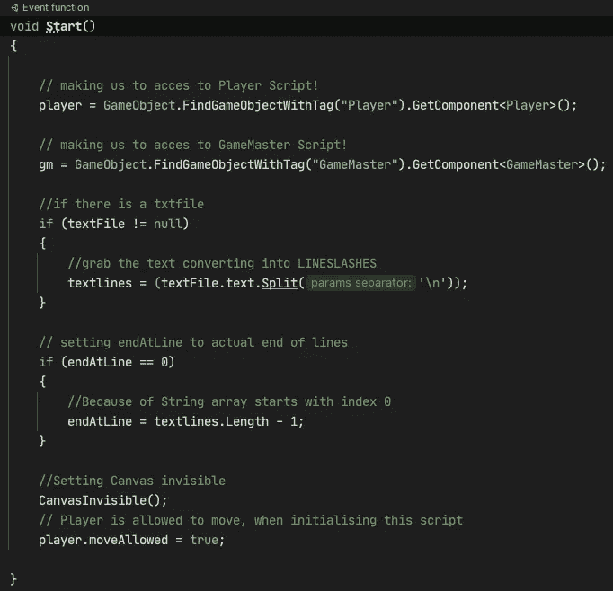

# 为什么评论能让你对你的编码技巧有深刻的了解

> 原文：<https://levelup.gitconnected.com/why-comments-give-a-tremendous-insight-about-your-coding-skill-452245b57721>

## 以及为什么有时允许你变通这条规则

作者: [kornwaikas](https://gfycat.com/@kornwaikas) 来自 [Gfycat](https://gfycat.com/assuredamusedgroundhog-monkey-island-scumm-bar)

当我一头扎进软件开发的世界时，我几乎对任何事情都发表了评论。

我在学习语言和概念，我没有认知资源来解决现实世界的问题，并在记住代码做什么的同时将它转换成代码。

在我学习期间，有一位教授认为对代码进行评论是强制性的。否则，没有人会理解你的代码！

*如今评论有多不可或缺？*

以我的经验以及专业员工的身份？

*有必要保证代码的高质量吗？*

*注释是否会妨碍代码的可理解性和可读性？*

我在后面的章节里回答了这些问题。 ***走吧！***

# 评论驱动的开发

注释驱动的开发示例

在我的研究中，我不得不使用一种叫做*注释驱动开发*的技术。

这种技术基于预先编写代码应该做什么的行为。所有写的注释都解释了不存在的代码。下一步是用完全按照注释解释的代码来填补空白。

*应该很简单吧？我们可以假设这是一种很好的编码方式。*

不要！这很费时间，而且如果没有事先评论过的指导方针，你将缺乏编写代码的能力。如果你所做的只是应用这种技术，你将无法编写代码。

当编码是新东西时，尤其是对于小项目来说，开始学习这种思维方式可能是个好主意。

这里的重点是了解你的语言。它就像一门外语，你可以流利地读和说。例如，作为一个以英语为母语又懂德语的人。

他应该能读和说。

这同样适用于编程语言。阅读源代码可能不是问题。你至少应该匀速阅读。

# 注释代码的问题

2015 年，我想建立一个对话系统，就像猴岛一样

你进入一个对话，然后 NPC 说了些什么，你可以用几个可能的答案来回应。

作者:[dutchmeisterwanna](https://imgur.com/user/Dutchmeisterwannabe)来自 [Imgur](https://imgur.com/gallery/eBNX9GV)

请看一下我的第一个问题……嗯程序(2015)，先生。

[作者的](https://www.udemy.com/user/arnold-abraham-3/)自己 2015 年的蹩脚代码

这是初始化程序，看看这部分有多饱和。

我甚至解释了最简单的 If 语句。那时的评论帮助我学习，记忆学到的东西，也让我自己了解我的代码是如何工作的。

今天，我不仅会完全省略掉这些评论，而且我还会把它重构到月球上，然后再回来！

这段代码的真正问题是，使用注释会暴露出之前隐藏的问题。

***源代码应该是自明的。***

此外，绿色文本比普通代码多，这使得整个部分非常模糊，难以理解。

*语句、方法、类和其他程序部分可以非常有表现力地命名。*

因此，注释应该更好地用于提示代码的一部分，这部分代码编程不干净，有设计缺陷，或者有架构问题。

源代码应该总是立即显示它是关于什么的。

# 评论:什么与为什么

注意不要将它们混为一谈。

有例外条款时，评论是完全可以的。例如，当您想指出代码中可能存在的问题时。

一般来说，把评论分成两个阵营:例如
`//Load datasets from database`解释正在发生的事情，而
`//Double call of this method because the library has a bug`解释为什么事情必须如此。

第二个是很好的评论。这是有意义的，否则会导致不希望的代码更改。

解释“什么”的注释应该被丢弃，相关的代码应该通过暴露自身来重写。

请允许我引用我自己的代码，先生。我很乐意介绍下面的评论:`//grab the text converting into LINESLASHES`是一个糟糕的例子，但如果我能解释我为什么这样做，它会是一个更好的例子。

[作者的](https://www.udemy.com/user/arnold-abraham-3/)自己 2015 年的蹩脚代码

阅读这篇文章意味着思考几分钟，并找出我为什么这样做。幸运的是，我已经写了这个代码，记住我自己的代码和 2015 年的意图比弄清楚另一个人的意思要容易得多。

*你能弄清楚，* ***为什么*** *我到底在做什么？*

每当出现由`\n`转义的换行符时，我就将对话的原始文本分割成一个数组。

此外的问题是:*为什么在这里？*一个评论将*的*完全适合解释。

# 被遗忘已久的评论关怀

但也为了解释评论，必须有人关心它们。当你改变代码时，你会改变注释吗？

在日常的编码业务中，我不记得自己是一名护工来检查每一条评论是否都在说真话。

*理解已经有错误注释的代码是一种不愉快的经历。*

> 评论更容易阅读，因此你更快地相信它们，因为它们欺骗你更容易获得信息，更快地达到你的目标。

在这种情况下，注释表会发生变化，使代码更容易理解。

# 表达性代码的示例

约书亚·科尔曼在 [Unsplash](https://unsplash.com?utm_source=medium&utm_medium=referral) 上拍摄的照片

我想给你看一个很好的例子，我的 Web 闲置游戏 [***醉叔殖民者***](https://www.ducidle.com/) ***(公测)*** 的代码库，它在没有评论的情况下存活下来。

这个例子不是关于高编码能力(它将是我的 Udemy 课程的一部分:面向初学者的 JavaScript)，它是关于阅读那部分代码后的清晰性。

说到高编码能力，这是我正在进行的 C# Pro 课程的一个片段，在那里我教如何制作一个基于回合的战斗游戏。你可以收集你回合的所有步骤，然后点击动作，让角色执行你排队的所有动作。

在这个例子中，一切都是可表达和可理解的。

# 如何注释掉不需要的源代码？

注释对于注释掉不需要的源代码非常有用。

我也时不时这样做，但是这样可以吗？好吃吗？

> 是的，不，也许，我不知道...你能重复一下问题吗？—他们也许是伟人

如今，我们有了版本控制系统(Git 或 SVN)。删除不再需要的代码，因为未调用或注释的代码会分散注意力。

除此之外，每当你看到这一部分，你的思维就会受到束缚，就像记得你必须打扫厨房，但却拖延了。

被删除的代码并没有消失。如果在您删除它之后我们仍然需要它，请查看您的历史记录并恢复它。

> ***一个异常注释掉代码:***
> 
> 对于问题的简短评估和行为观察，这是找到 bug 隐藏点的好方法。

但是一旦你让它被注释掉，很有可能会拖着它穿过整个版本历史，一旦有人发现它，没人记得为什么它被注释掉了，它会永远留在那里。

# 我个人的结论

[Gfycat](https://gfycat.com/fluffytenderfowl)

我的意思是，如果你仍然用汇编指令写代码，那就带上它！

今天，当我们有了像 IntelliJ 和 auto-completion 这样的工具时，名称甚至可以更长，因此也更明确。

*还有，当你不得不评论你的代码做了什么时，还有什么要说的吗？*

我编写代码时不加注释，并且总是尽可能地让代码清晰明了。许多 IDE 都有舒适的功能，重命名可以在几秒钟内完成，包括所有的引用。

每当我能为一个已经命名的类、方法、变量找到一个更好的名字时，我会立即给它重新命名，使它更加明确。

**评论对任何程序员来说都是一个沉重的负担，除了那些解释*为什么*的评论。**

我希望你喜欢这本书。省略注释意味着更好地命名变量和类。所以下一篇文章是这一篇的甜点。

你不会错过甜点吧？

 [## 命名是如何毁掉你的代码的！

### 伟大的代码始于你，终于有更多的时间为你的爱人编码！

medium.com](https://medium.com/front-end-weekly/how-naming-ruins-your-code-6f3a53a380b9) 

[***节省自己大量的时间，专注于重要的主题。***](https://arnoldcodeacademy.ck.page/26-web-dev-cheat-sheets)

阿诺德代码学院 26 网页开发人员备忘单