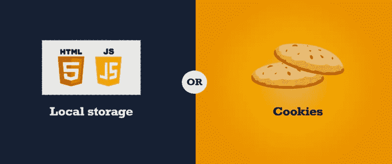

# 就身份验证而言，为什么 Cookie 优于 localStorage

> 原文：<https://levelup.gitconnected.com/why-cookie-is-preferable-compared-to-localstorage-when-it-comes-to-authentication-b43ac5610be6>



# 介绍

我们知道 JWT(JSON Web Token)是一种行业标准 [**RFC 7519**](https://tools.ietf.org/html/rfc7519) 方法，用于安全地表示双方之间的声明。JWT 现在很常见。但是我们应该把它们存储在前端的什么地方呢？

在本文中，我将分解两个存储令牌的常见位置。**cookie**和**本地存储**

# 比较

## 局部存储器

要使用`localStorage`，只需调用使用`localStorage`对象

```
localStorage.setItem("yourTokenName", yourToken)
localStorage.getItem("yourTokenName", yourToken)
```

优点:

*   非常方便，不需要任何后端，纯 JavaScript 即可。
*   大数据大小，5mb 左右。

缺点:

*   易受 XSS 攻击。当攻击者可以获取您存储在`localStorage`中的访问令牌时，就会发生 XSS 攻击，因为他们可以在您的网站上运行 JavaScript。

## 饼干

要设置`cookie`，我们可以这样做:

```
document.cookie = "cookieName=value"
```

或者使用 http 请求:

```
Set-Cookie: <cookie-name>=<cookie-value>
```

优点:

*   如果你使用的是`httpOnly`和`secure`cookie，这意味着你的 cookie 不能用 JavaScript 访问，所以即使攻击者可以在你的网站上运行 JS，他们也不能从 cookie 中读取你的访问令牌。
*   可以设置到期日期

缺点:

*   只有 4kb 的存储空间

# 安全问题

## XSS 袭击

就像我上面说的，本地存储很容易受到攻击，因为使用 JavaScript 很容易访问它，攻击者可以检索您的访问令牌。然而，虽然使用 JavaScript 无法访问`httpOnly` cookies，但这并不意味着使用 cookies 就可以避免涉及访问令牌的 XSS 攻击。

如果一个攻击者可以在你的应用程序中运行 JavaScript，他们可以发送一个 HTTP 请求到你的服务器，这个请求会自动包含你的 cookies 这对攻击者来说不太方便，因为他们无法读取令牌的内容，尽管他们可能不需要这样做。

## CSRF 袭击

跨站点请求伪造(也称为 CSRF)是一个 web 安全漏洞，使得攻击者能够诱导用户执行他们不打算执行的操作。

然而，这可以通过在您的 cookie 中使用`sameSite`标志，包括一个[反 CSRF 令牌](https://owasp.org/www-community/Anti_CRSF_Tokens_ASP-NET)来轻松缓解。

# 结论

Cookies 仍然有一些漏洞，但只要有可能，它比`localStorage`更可取。因为:

*   `localStorage`和 cookies 都容易受到 XSS 攻击，但是当你使用`httpOnly` cookies 时，攻击者更难进行攻击。
*   Cookies 很容易受到 CSRF 攻击，但是可以使用`sameSite`旗帜和[反 CSRF 令牌](https://owasp.org/www-community/Anti_CRSF_Tokens_ASP-NET)来缓解。
*   你仍然可以让它工作，即使你需要使用`Authorization: Bearer`头或你的 JWT 大于 4KB。