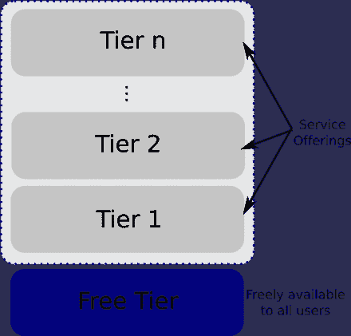

# 开发者为什么要免费做事情？

> 原文：<https://levelup.gitconnected.com/why-developers-do-things-for-free-e3b8068dc332>

## 我们被自由软件宠坏了吗

斯蒂芬·莱昂纳迪在 [Unsplash](https://unsplash.com?utm_source=medium&utm_medium=referral) 上拍摄的照片

我用来处理书签的 chrome 扩展一夜之间消失了。我慌了，上了扩展的官方网站联系客户支持。

我的书签去哪了？我输入了实时聊天。令人惊讶的是，我立即得到了回应。他向我保证他们正在努力，并告诉我一个找到书签的方法。

问题在同一天得到解决。

然后我想，“哇，我甚至没有为他们的服务付费，他们为什么要这样做？”

作为一名软件开发人员，我只能通过问自己“为什么我会免费写代码”来猜测他们为什么这么做

# 回馈社区

> 自治..精通..目的-
> 这些是新的做事方式的基石。
> 
> —丹尼尔·平克

互联网上充满了关于如何编码的免费资源。我有很多从未谋面的老师。我使用由聪明人构建的库和工具。

作为开发人员，我们从前辈那里受益匪浅。仿佛他们已经擦亮并准备好了接力棒，他们对你说:

> “我们已经竭尽所能，现在轮到你带领我们走向更光明的未来了。”

当我们意识到我们的数字形式的思想可能比我们的有生之年还要长时，我们可以将未来的方向转向更积极的方向。

照片由 [Massimo Sartirana](https://unsplash.com/@sarti46?utm_source=medium&utm_medium=referral) 在 [Unsplash](https://unsplash.com?utm_source=medium&utm_medium=referral) 上拍摄

# 获得经验

> 如果你要去地球，你可能需要一个向导。我在这方面确实有点经验。
> 
> 灭霸:如果你考虑失败的经历…
> 
> 洛基:我考虑经验，经验。

喜欢与否。我们做的任何事情都成为我们在地球上经历的一部分。

有时我们高薪的工作并不能提供我们想要的经验。幸运的是，对于开发者来说，我们拥有将想法转化为现实的超能力。

我们每天至少有 [5 万个想法](https://www.successconsciousness.com/blog/inner-peace/how-many-thoughts-does-your-mind-think-in-one-hour/)。挑一个就走。如果你开始一个兼职项目有困难，这篇文章可能会有所帮助。

# 个人品牌

[Linus Torvalds 于 1991 年创建了第一个 Linux 内核原型](https://en.wikipedia.org/wiki/Linux)，它被用于全球无数的个人电脑和服务器。

由[阿里安·达尔维什](https://unsplash.com/@arianismmm?utm_source=medium&utm_medium=referral)在 [Unsplash](https://unsplash.com?utm_source=medium&utm_medium=referral) 上拍摄的照片

当我们创建软件时，如果至少有一个人从中受益，他或她会记住这一点。

# 免费增值

[https://en.wikipedia.org/wiki/Freemium](https://en.wikipedia.org/wiki/Freemium)

在商业方面，软件公司经常试图实现免费增值模式。但残酷的事实是，使用免费产品的客户与愿意付费的客户本质上是不同的。

# 结论

软件开发人员是有需求的人。了解他们的需求可以在各个层面创造双赢的局面。

对于软件开发人员来说，你应该有一个严格的指导方针来决定你接什么样的无报酬项目。