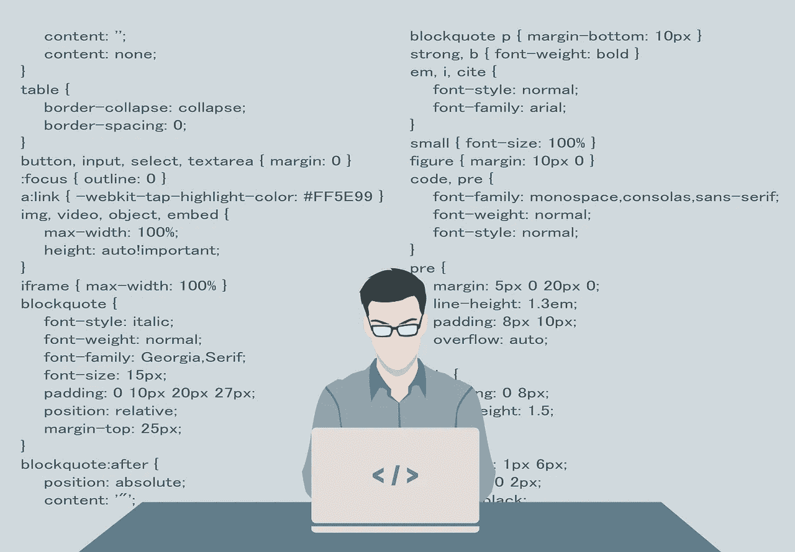

# 为什么开发商也要学营销

> 原文：<https://levelup.gitconnected.com/why-developers-should-also-be-marketers-e1bc501d22ca>

增加你的价值和成功的潜力。

图片由 [200 度](https://pixabay.com/users/200degrees-2051452/?utm_source=link-attribution&amp;utm_medium=referral&amp;utm_campaign=image&amp;utm_content=1653351)来自 [Pixabay](https://pixabay.com/?utm_source=link-attribution&amp;utm_medium=referral&amp;utm_campaign=image&amp;utm_content=1653351)

乍一看，程序员和营销人员似乎是本质上不同的人。程序员生活在布尔逻辑的世界里，真假总是可以被检查和量化的。营销人员生活在人类行为的灰色地带，梳理出消费者无形动机的复杂性，并找出如何最好地利用它们。尽管看起来不相容，但事实是每个程序员都应该在他们的技能中加入大量的营销知识。

从开发 SaaS 平台的最小的一个人的商店，一直到从事企业软件工作的大型编码部门的成员，这在开发者角色的各种变体中都是真实的。让我们来看看为什么。

## 营销和用户界面/UX 齐头并进。

作为一名开发人员，你的产品的可用性应该永远在你的脑海中。在不使界面过于复杂的情况下，找到功能、易用性和美学优势之间的平衡是一项棘手的任务。如果做得正确，没有什么比用户对你设计和编程的 UI 感到舒服和有力量更能推销你的产品了。

当你设计你的项目时，理解营销人员的思维方式将有助于你在配色方案、按钮位置和用户流量方面做出明智的选择，从而吸引最终用户。再多的搜索引擎优化、华而不实的广告或巧妙的文案都无法让一个设计糟糕的产品获得成功，所以在你开发的时候了解一些营销基础知识可以让你避免无意中破坏你的努力。

## 这会让你成为团队中更好的一员。

在我做开发人员的这些年里，我见过很多开发人员和营销人员之间的争斗和怨恨。有一种明显的敌意，似乎是我们工作看似不同性质的副产品。事实是，每个从事产品工作的人都希望看到它成功，而且大多数时候每个人都真诚地尽自己最大的努力通过他们的专业知识为成功做出贡献。通常，这种专长没有得到应有的重视，我坚信这是因为没有真正理解不同角色的本质。

众所周知，开发商将营销人员简化为“二手车推销员”的刻板印象，以此来证明他们的论点无效。类似地，我当然也见过营销部门把他们的开发人员视为需要圈养的机器人，对人性一无所知。这两件事都不是真的，简单地学习和理解是什么让营销部门运转起来，会对找到一些中间立场大有帮助。能够做到这一点的开发人员为他们工作的团队和公司提供了更多的价值，并且会走得更远。

## 软件即服务

可以肯定地说，软件即服务(SaaS)的时代不再是“即将到来的事情”，而是“现在的现实”。像苹果这样的大公司转向“服务”作为他们未来的主要收入模式并不是偶然的。销售一个软件或一个应用程序固然不错，但销售一项服务可以创造一个持续的收入流，而且潜力无限。

这种范式的变化意味着开发人员必须学会比以前戴更多的帽子。我们不能再坐在黑暗的房间里，看着发光的屏幕，活在我们的矩阵幻想中。越来越多的人期望开发人员不仅能够理解，而且能够在营销、客户服务、入职以及产品的常规技术支持等方面提供帮助。

这意味着灵活性和团队合作现在不再是我们不可或缺的。实现这种灵活性和团队友爱的最佳方式是理解你的同事正在做的工作和他们想要达到的目标。由于许多成功的 SaaS 商店都是小团队甚至单个开发商的商店，理解营销的能力变得更加重要。如果没有适当的营销和曝光，你的“杀手级应用”不会走得很远。

我并不是建议每个开发人员都成为营销神童。作为开发人员，你最好的角色是编码和创建产品本身，但是拥有一些核心原则和理解，最重要的是，尊重营销人员的手艺是每个严肃的开发人员都不应该再认为是可有可无的。

我们开发人员经常对我们花费无数时间编码和构建的项目有一种强烈的主人翁感。这种主人翁意识应该激励我们尽一切努力确保它取得成功。此外，用一些市场营销知识和对其功能的总体评价来扩展我们的技能组合，将会使我们在我们工作的公司中更加成功。如果你获得了与市场部合作良好的开发人员的声誉，你对公司整体的价值将会大大提升。

大多数开发人员花大量时间自学，努力跟上不断变化的最新技术；花一点时间阅读和学习一些推动你的营销部门的原则。和他们团队的一个成员一起吃午饭，问他们做什么，最重要的是为什么。你会惊奇地发现，它可以多么迅速地帮助你简化键盘背后的工作，并最终构建出更好、更强、更有市场的产品。