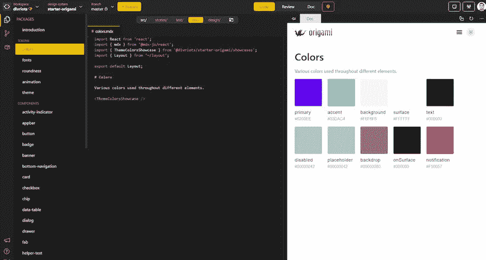
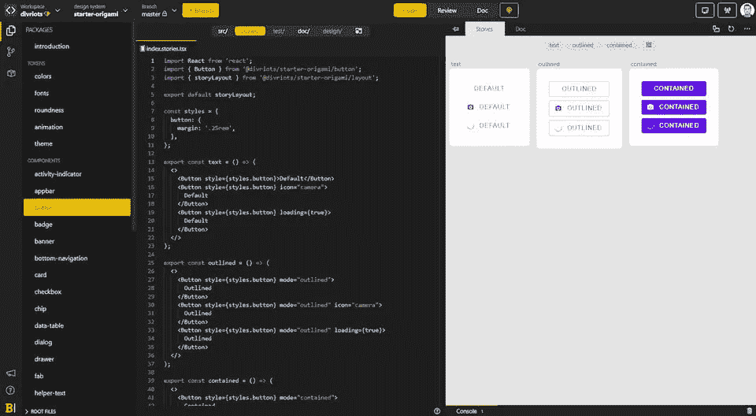
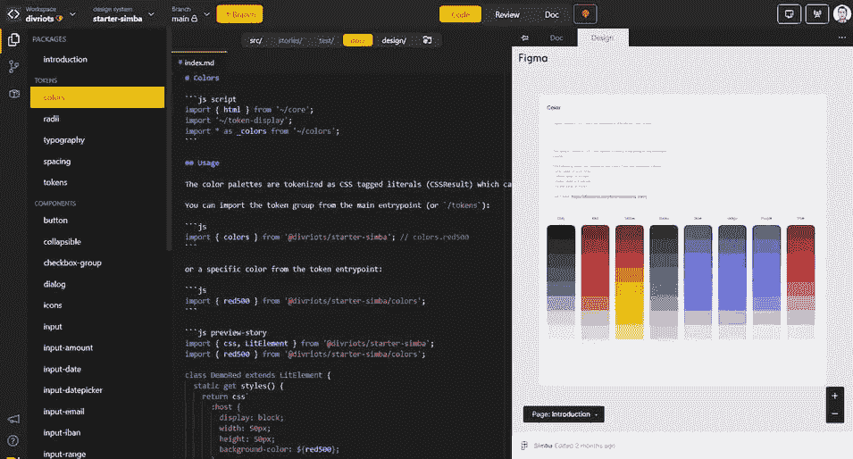
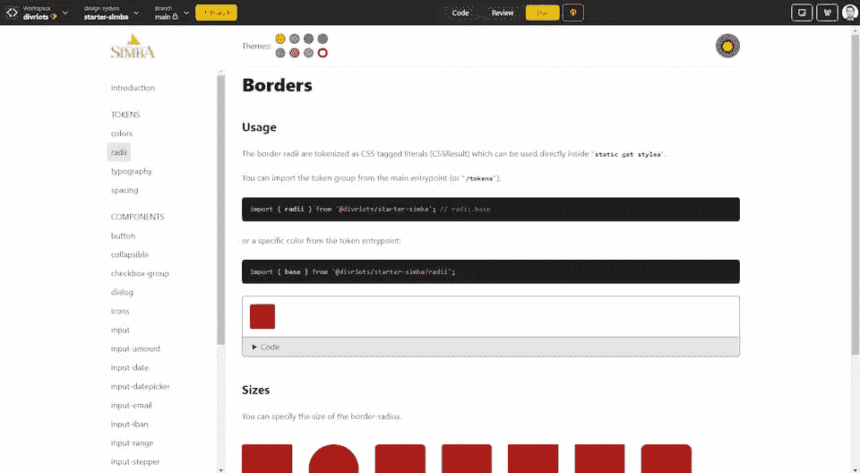

# 为什么开发人员应该用设计系统来构建？

> 原文：<https://levelup.gitconnected.com/why-developers-should-build-with-design-systems-52716c393c40>

作为前端开发人员使用设计系统的 9 个好处

为什么开发人员应该用设计系统来构建？

设计系统现在是前端团队的热门话题。设计系统已经从大型企业的最佳解决方案转变为任何前端团队的必备解决方案。

最初，设计系统已经被设计人员推广(使用 Figma/Sketch 之类的工具)，帮助他们构建可重用的组件，以提高他们的工作效率和一致性。

从开发人员的角度来看，设计系统可以比作组件库，因为它们被广泛用作构建 web 产品的可重用组件源。那么，开发人员为什么要考虑在代码端构建设计系统呢？

> 设计系统不仅仅是组件库。它们还包括设计令牌、文档和设计工具包。如果你想了解更多，查看这篇文章 [*什么是设计系统？*](https://backlight.dev/mastery/what-is-a-design-system)

让我们来发现为开发人员构建设计系统的一些关键好处。

# 🤝协作工作空间

使用设计系统的最重要的好处之一是建立一个独立的协作环境，以确保团队构建和使用的所有资产(令牌、组件、文档、设计等)的质量和采用。

因此，一个好的设计系统平台应该提供核心功能，以促进和简化开发团队内部的协作，以及与整个前端团队的协作。

# 🧩从设计符号中获益

设计标记是设计语言的核心元素，设计人员和开发人员都使用它来构建设计系统中的组件。

> *我们可以将令牌称为设计系统代码库中托管公共值的“常量”。关于它的一个有趣的帖子* [*这里*](https://twitter.com/equinusocio/status/1481283030903836678) *。*

> *例如，这里有一些常见的标记:颜色、字体、间距、边框、半径、不透明度、阴影、z 索引等等*

设计系统是令牌的真实来源，与设计者和开发者内置协作。当令牌被修改时，基于令牌构建的所有设计系统组件都受益于更新。

因此，拥有一个设计系统，而不是一个独立的组件库，可以更容易、更有效地构建一致且可维护的组件。

# 📦设计系统中的组件库

组件库(如 [Material UI](https://mui.com/) )在开发人员中变得非常流行，因为它们有助于加速开发并带来更多的可重用性/一致性。使用组件库构建的挑战在于它需要定制以适应特定的设计准则。

无论是从零开始还是在流行的组件库之上，在设计系统中构建自定义组件库都有很大的好处。

设计系统本身就是为了提供一个嵌套的环境来将组件工作和产品工作分开。使用设计系统有助于防止开发人员直接在产品代码中定制组件，从长远来看，这会导致一致性和维护问题。开发人员只在设计系统中处理组件，而在生产代码中使用组件。它使组件的定制更容易管理，并确保随着时间的推移质量更好。

在生产代码中交付之前，在设计系统中构建和更新组件库也将受益于协作审查和测试工作流。它提高了新版本的可靠性，并自动化了生产中的组件维护。当在跨产品或多品牌环境中工作时，设计系统甚至更加强大。

设计系统内部构建的组件库示例

将组件库放在设计系统中还可以提供增强文档的可能性，包括直接与来自组件库的代码片段集成的活动组件和运动场。这使得文档更容易维护。

# 🎨设计套件的优势

设计系统还提供设计工具包资产(品牌指南、品牌资产、组件设计等)。在开发者侧的设计系统中，设计工具包可以是与设计侧的设计系统的映射，或者通过到相关设计资产(例如 Figma/Sketch 文件)的链接，或者通过某种同步(由设计到代码/代码到设计特征提供)。

开发团队可以从具有这种设计套件的设计系统中受益，因为它将有助于解决与设计人员的交接问题。由于设计系统为每个组件提供了设计，这使得开发人员可以轻松地随时获得最新的相关设计版本。

用设计系统内的令牌和组件映射的设计链接示例

# 📒开发人员从文档中获益

文档是设计系统的核心元素。这是一个协作工作区，整个前端团队在这里分享设计和代码的基础知识、指南和操作方法。

它有助于促进整个团队的协作和信息共享。对于开发人员来说，文档是一个强大的工具，可以帮助他们找到如何使用设计令牌和组件库的信息。这在新开发人员入职时尤其有用。

从设计系统构建的文档示例

# ⚡️提高开发者效率

对于设计师来说，当用设计系统构建产品时，开发人员受益于生产力的极大提高。每次开发人员需要使用组件时，来自设计系统的可重用组件有助于节省他们的宝贵时间(而不是重新发明轮子，或者浪费时间寻找正确的组件)。

> [*这项研究*](https://sparkbox.com/foundry/design_system_roi_impact_of_design_systems_business_value_carbon_design_system) *表明，使用设计系统比从头开始构建要快 47%，最终一致性也更好。*

# 🚧低级代码维护

在开发人员方面使用设计系统也意味着节省大量时间来确保产品的一致性和维护。

当设计团队提出新的要求时(如改变原色或组件设计/行为……)，在不使用设计系统的情况下，升级生产中的所有资产可能会非常繁琐和耗时。

另一方面，设计系统提供了安全开发组件的协作环境，能够在多种环境/条件下独立地构建、升级和测试组件，从而减轻了后期产品开发和维护的负担。

# 🎯更好的一致性

使用来自设计系统的组件将确保生产组件的一致性，因为组件应该直接从设计系统加载和更新。所有类似的组件都是严格相同的，并且所有基本令牌都与设计系统绑定在一起。

# ⭐️更好的质量和可及性

质量和可访问性是关键方面，还有技术挑战需要解决。在嵌套环境中构建组件，比如在设计系统中，是一种很好的方法，可以确保组件在安全地交付到生产环境之前，经过精心制作和协作测试。

# 😀结论

使用设计系统进行构建可以为开发人员带来多种好处。最终，设计系统将成为真理的来源，是整个团队信任的来源。设计系统最终赋予开发者协作、速度、质量和一致性。

资源:

[*什么是设计系统？*](https://backlight.dev/mastery/what-is-a-design-system)

[令牌上的 Twitter 线程](https://twitter.com/equinusocio/status/1481283030903836678)

[研究开发者对设计系统的效率](https://sparkbox.com/foundry/design_system_roi_impact_of_design_systems_business_value_carbon_design_system)

[背光开发工具截图](https://backlight.dev/)

*最初发布于 2022 年 1 月 26 日*[*https://back light . dev*](https://backlight.dev/blog/why-should-developers-build-with-design-systems)*。*