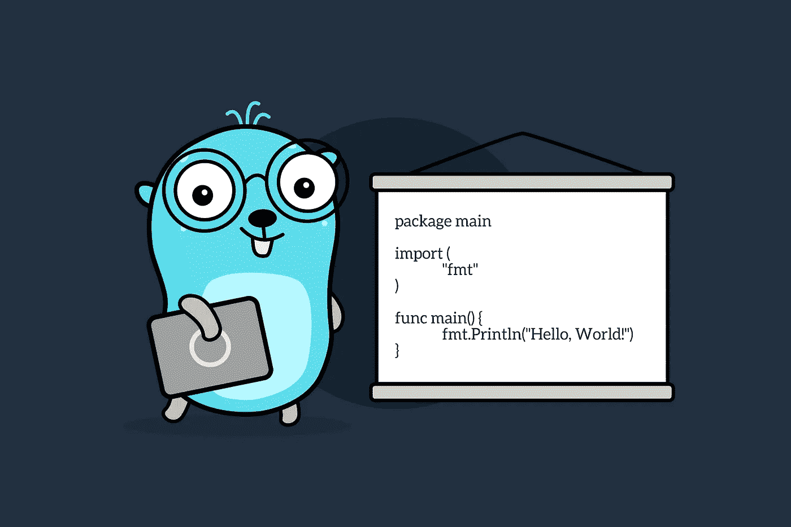

# 为什么我从打字稿转向 Go

> 原文：<https://levelup.gitconnected.com/why-did-i-move-from-typescript-to-go-1d9f92ef882a>

## 以及为什么我不会放弃使用 TypeScript

几乎没有任何开发人员会一直使用同一种编程语言工作数十年。随着时间的推移，开发人员切换到不同的编程语言有各种各样的原因，有时，这只是外部因素，或者你自己已经成长了。

在大多数情况下，**学习一门新的编程语言**也会开阔你的视野，让你跳出框框思考。

作为**网站开发**的一名软件开发人员，我开始用 **PHP** 进行专业编码，这在当时或多或少是一种规范。2018 年，我处理了 NodeJS 和 Java，我决定 **NodeJS** 值得我永远离开 PHP。同年，我开始使用 TypeScript，从去年开始，我越来越多地使用 Go，无论是私人还是专业。

# 围棋是什么？

Go 是谷歌开发的一种编程语言，它从 2009 年就已经存在，2012 年正式发布。从语法上来说，Go 乍一看让人想起 C，但是它在许多方面看起来更现代、更整洁。

**围棋的结构非常简单。**在许多情况下，只有一种语言结构。其他编程语言，如 TypeScript 或 C，提供了几种表达方式。

比如围棋只有一个循环的概念。但这里也不得不说，Go 的 for-loop 比其他编程语言的 for-loop 强大得多，也灵活得多。您可以使用它来映射任何已知类型的循环(do、while、for each 等。)，但它简化了只有一个选项的过程。

在直接比较中，JavaScript 中有六种不同类型的循环，这还不包括数组的“forEach”函数。用多种方式表达某件事是 JavaScript 的一个普遍行为，这促进了灵活性，但经常导致不同开发者和项目之间的不一致。

Go 非常重视简单性。从理论上讲，这可能不总是导致最优雅的代码，但它确实导致非常可读和实用的代码。

但这不是我研究 Go 的主要原因，因为这只是从语法的角度来描述 Go。我现在喜欢和围棋打交道有一些很好的理由。今天我想谈谈这些原因。

# 跨平台编译器

与 JavaScript 不同，Go 有一个**真正的编译器**，可以生成机器代码，甚至可以用于不同的 CPU 架构，如 x86 或 ARM 以及不同的操作系统。

在这一点上，论点通常主要基于真实编译器比 JIT 编译器更好的性能，但对我来说，这个论点并不那么相关。我认为更令人兴奋的是生成的二进制文件是静态链接的单文件二进制文件。这意味着编译后的二进制文件无需事先安装运行时环境或类似的东西就可以执行。

当然，与 NodeJS 应用程序相比，这简化了部署，因为您只需处理单个文件。这也有一个好处，那就是你不必交付或公开你的源代码，这可以根据上下文来提高对你的知识产权的保护。

# 强标准库

第二点是，Go 有一个庞大的标准库，其中包含许多您首先必须用 NodeJS 安装外部 NPM 模块的特性。

一方面，您不必搜索和选择太多，因为您不必在来自各种第三方提供商的不同模块之间进行选择。另一方面，这些开箱即用的特性保证了**的高可靠性**。外部封装无法达到这种可靠性水平。

在过去的几个月里，这个问题在 NPM 出现过几次。请记住 Color.js 和 Faker.js。尽管这个 NPM 生态系统可能很美，**但它也非常脆弱**。

# 并发

Go 从一开始就被设计成高度关注并发性。NodeJS 也提供并发性，但不是在这个级别，而且，最重要的是，JavaScript 在这方面已经被证明不是非常可伸缩的。

在 JavaScript 中实现并发性之前，差不多过了四分之一个世纪，实现这一目标的道路相当坎坷。

> **你不明白我的意思？**阅读我关于[为什么 JavaScript 如此怪异的文章](https://javascript.plainenglish.io/why-javascript-is-weird-eff1b4953579)，在那里我解释了更多关于 JavaScript 的悠久历史。

从第一个版本开始，Go 在这个问题上提供了令人惊讶的东西。此外，在 Go 中，在不同的 **goroutines** (轻量级线程)之间进行通信并同步它们是很简单的。

Go 在并发性方面非常依赖于简单性，尽管在许多编程语言中并发性是非常复杂的。此外，异步编程只有一种语言结构，而 JavaScript 中有许多不同的方式。Go 在这里得到了很多东西，这就是为什么 Go 在可伸缩性方面非常受欢迎。

# 工具和 CLI

这种方法可以在《一遍又一遍》中找到。Go 在单个 CLI 中捆绑了一系列必需的工具。

除了编译器，它还包括一个**代码格式化器**，linter，test runner，一个运行性能测试的工具，一个创建文档的工具，等等。

原则上，这可能有点让人想起 Deno，NodeJS 也在进步，但那里的雄心仍然很低。有时，当我准备建立一个新的 TypeScript 或 NodeJS 项目时，我会头晕目眩。使用样板代码很容易避免这种努力，但这种努力在 Go 中甚至不存在。

你所要做的就是安装 Go，然后你就可以开始了。这也促进了围棋界的团结。虽然在 NodeJS、TypeScript 和 JavaScript 中几乎没有任何真正的和严格的标准化，但是这些项目的方法是非常不同的，并且经常非常非常混乱。围棋通常只知道一种严格的方法。

# 流行

是啊！Go 当然不是最广泛的编程语言，但 Go 享有**的高接受度和受欢迎程度**，尤其是在 web 和云领域，这是至关重要的，因为那是我花费大部分职业时间的地方。

在这个领域已经有一系列用 Go 编写的流行工具。只要想到 **Kubernetes** ，Docker，Terraform，领事，金库等。

但这也意味着有许多有经验的开发人员。这当然不能与 TypeScript 相比。

# 铁锈呢？

如果你已经阅读了这篇文章，有理由问**为什么我选择了检查铁锈**。Rust 是一种很有前途的编程语言。它有一个优秀的类型系统和一个快速的编译器，越来越多的**关键软件用 Rust** 编写也不是巧合。然而，有三个原因让我现在不选择 Rust。

像 C 和 C++一样，Rust 更多的是面向系统而不是面向应用。当然可以用 Rust 开发应用，但是 Rust 比 Go 更深入一层。当谈到编程**驱动或内核模块**时，Rust 可能是一个极好的选择，但对于云和 web 原生应用程序，我认为 Go 更有优势。web 应用程序的 Rust 库仍在开发中，并且**不够稳定**。

第二点是，Rust 不一定是一种简单的编程语言。与围棋相比，T21 的学习进度更快。当然，这不是一个可靠的论点，因为从长远来看，你只需要学习一次，但似乎有经验的 Rust 开发人员更少。随之而来的是锈菌传播的减少。这可能是时间问题，但我对此表示怀疑。你要知道 Rust 背后是 Mozilla。

尽管 Mozilla 已经启动了许多项目，但很少成功。此外，已经有一个关于生锈的大失望。两年前， [Mozilla 终止了许多 Rust 开发者](https://www.zdnet.com/article/programming-language-rust-mozilla-job-cuts-have-hit-us-badly-but-heres-how-well-survive/)作为重组措施。与此同时，Rust 的进一步开发已经外包，这是正确的一步。但是，我不得不承认**我对 rust 的信任已经被挠**。

# 结论

可能我在这里只是比较了两种你一看就不一定要比较的编程语言。然而，这些编程语言的应用领域有很多重叠，所以你可以问问自己想要选择哪种编程语言，例如，对于可伸缩的微服务。

在我看来，比较不同的编程语言对于**做出一个优秀且经过深思熟虑的决定**是有意义的，无论是客观上还是主观上。

将来，我会问自己是用 TypeScript 还是 Go 来编写应用程序。这可能主要归结于这样一个事实:对于更复杂的应用程序，我更喜欢使用 TypeScript。这因应用而异，必须单独评估**。**

感谢您阅读我关于为什么从 TypeScript 转向 Go 的文章。我希望我能坦率地表达我的观点。请让我知道你的想法。

干杯！

# 相关文章

 [## Go 中的简单 API 与光纤和 Docker (2022)

### 用 Fiber、GORM、Postgres 和 Docker 在 Go 中构建一个简单的 API

levelup.gitconnected.com](/api-in-go-with-fiber-and-docker-5de04651463a)  [## 深入探究 Go 的并发性

### 在并发性方面最健壮的编程语言

better 编程. pub](https://betterprogramming.pub/deep-dive-into-concurrency-of-go-93002344d37b)  [## 为什么 JavaScript 很奇怪

### JavaScript 的历史

javascript.plainenglish.io](https://javascript.plainenglish.io/why-javascript-is-weird-eff1b4953579) 

# 分级编码

感谢您成为我们社区的一员！升级正在改变技术招聘。 [**在最好的公司找到你的完美工作**](https://jobs.levelup.dev/talent)**。**

** [## 提升——改变招聘流程

### 🔥让软件工程师找到他们热爱的完美角色🧠寻找人才是最痛苦的部分…

作业. levelup.dev](https://jobs.levelup.dev/talent)**