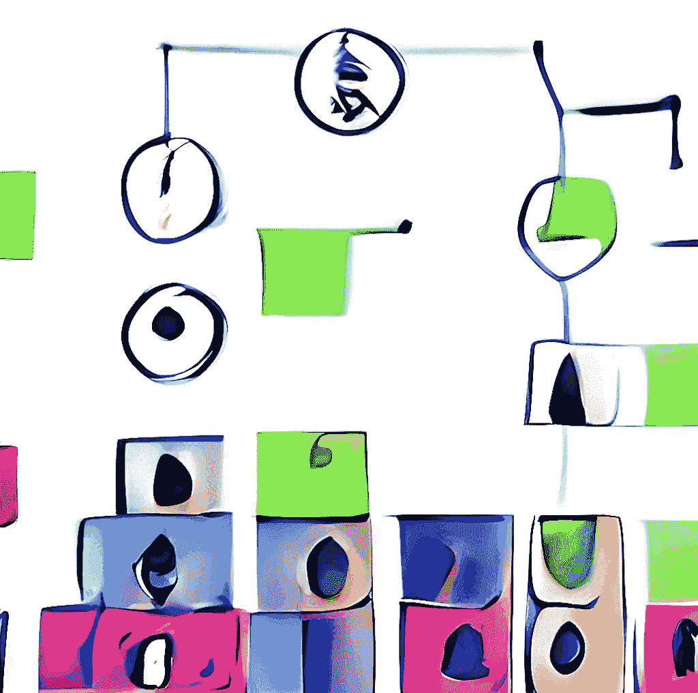
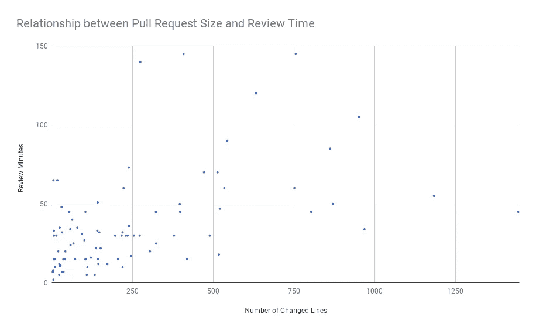
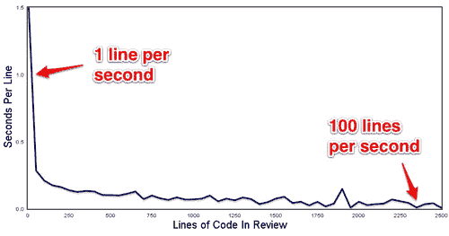

# 为什么不信任拉取请求

> 原文：<https://levelup.gitconnected.com/why-do-not-trust-pull-requests-f6e1fa82ee1>

## 拉请求有问题，你能感觉到，但你不知道它是否真实。

DALL E-mini 重新构想了马斯洛的需求层次。

有一些想法，你看到的时候很优秀，但是经过一番评估后发现，其实并没有看起来那么好。

我不清楚拉取请求的来源，但我第一次看到它们是在 GitHub 上。他们说得很有道理。想象一下，在您正在使用的工具的公共存储库中，您看到了一个 bug。您可能想修复它，但您无法修复，因为您没有权限。所以，因为代码是公开的，所以你可以创建你自己的分支(副本)，修复它，然后请求官方库的维护者来拉你的修改。然后，他们可以观察您的更改，看它将如何被合并，然后决定他们是否需要您的更改。

GitHub 自动化了这个过程。维护人员不是去您的存储库，而是发送大量邮件，然后手动合并更改，在他们自己的存储库中收到通知。有了这种自动化，他们可以查看应用它的结果，如果有疑问或需要任何更改，他们可以在同一页面上直接询问。这是一种与组织外的人合作的非常有效的方式。

但是它有一个主要的问题。它仍然很慢。

当然，它比邮件和手工处理要快，但是比允许直接在存储库上进行更改要慢得多。但是在公共存储库中，我们不信任任何人，然而我们希望任何人都有贡献的可能性。因此，如果备选方案是要么给任何人完全访问权，要么不允许其他人贡献，这似乎是一个很好的妥协。

为什么拉取请求很慢？这是因为它们处理人与人之间的异步协作。这就像发电子邮件。首先，参与者完成并向存储库审阅者发送通知。然后，审查者，当他们可以的时候，他们审查代码。如果他们需要额外的信息或更改，他们会添加评论并等待回复。当贡献者注意到请求时，停止他当前的任务，恢复上下文，进行必要的更新，并作出响应。并且这一直持续到拉请求被接受。在最好的情况下，它会被立即接受。在任何其他情况下，我们面临连续的中断、上下文变化，并等待即将到来的响应。这种流动是缓慢的。

这个想法在开源软件中非常有效。在不损害代码质量的情况下，允许任何人做出贡献的想法是令人信服的。但这是建立在不信任的基础上的。然而，当我们把这个概念应用到私营公司时，会发生什么呢？

## 评论者是更快的读者

事实证明，公司内部的过程比任何人想要面对或支付的都要慢，即使是编码员。例如，在下图中，我绘制了一张花费在拉取请求审查上的时间图，并与它的复杂性(行数)进行了比较:

超过一定的复杂性，评审过程就停止了。图表由[small businessprogramming](https://smallbusinessprogramming.com/optimal-pull-request-size/#fn-352-3)绘制。

您可以看到，没有人可以超越时间限制，即使拉取请求变得复杂。您可以看到最后一点比大多数拉取请求复杂十倍，因为它在不到 50 分钟内就被接受了。

还有另一个观点，由 Atlassian 提供，他们测量多少秒(秒！！)审稿人按行花费:

有拉取请求的行越多，每行花在审阅者身上的时间就越少。图表由[大西洋](https://www.atlassian.com/blog/2011/07/creating_optimal_reviews)

你可以看到他们变得越大，复习得越快。你还可以看到，在最大的屏幕上，他们每秒钟可以浏览 100 行。连谢尔顿都没办法这么快复习。

## 我认识一个人

如果开发商想要加快审批，会发生什么？

一种典型的方式是去找别人，直接要求审核。但这通常很突兀。当有人要求一个程序员同事进行评审时，评审者必须停下来，失去他的注意力，并改变上下文。尽管他们做了这些工作，但这并不能保证他们会立即批准拉取请求，因此很可能会得到回应。

虽然，有时候程序员会应用社会工程。每个人都是不同的，每个人都有不同的优先事项。如果你是一个开发者，你知道你可能的评审者，以及他们的偏好。他们也知道，有些目光短浅的审查者可能仅仅因为截止日期看起来很近就批准任何东西。因此，最有可能的是，他们知道谁会批准他们的拉取请求，甚至不需要审查。

一个关于拉请求的小笑话，可悲的是有时是真的。

这个案子有一个看点，叫做:“*你在挡我*”。当一个评审者发现一些可能被改正的东西，但是作者不想改正，或者不知道如何改正，那么这个过程就停止了。在某些情况下，作者衡量问题，指责审查者的不公平审查，并强迫其批准。虽然在某些情况下，每个人都同意审查者的观点，但由于议程的原因，他们会强制批准。

不同的评审者，不同的标准。因为现在交付很重要，所以你跳过了这个过程。

## 好心情，坏心情

复习是一个非常微妙的过程。当有人提交工作进行审核时，会感到暴露。这很容易理解，他的工作代表了几天的努力、汗水和大量的内部思考。对他们工作的任何批评都会被认为是对他们自己工作能力的怀疑或不信任。事实证明，审查的结果往往是针对个人的。

通常，评审人员了解编码人员，并且知道他们将如何对一些评论做出反应。有时他们不在乎别人的看法，或者他们只是不知道如何以更礼貌的方式写评论，所以他们制造了不好的氛围。但是也有其他评论者不想制造那些不好的氛围，但是也不知道如何以更礼貌的方式评论，所以他们避免某些评论。

根据谁是被评估者、谁是另一个人以及他们将如何对待它来改变评估标准，这有多种形式。有这样一种情况，我们不想强迫新人，觉得他们不受欢迎，所以为了避免他们离开公司，我们会让他们通过不可接受的事情。我是一个低年级学生，正在复习高年级学生，他们知道得更多，我不能和他们争论我认为是错误的事情。

评审是程序员之间苛刻的社交，他们经常会更改评审内容以避免不安定。

> **提示**:如果你是一名评审员，并且你想不受本节所述的限制而自由地进行评审，试试下面的技巧:不要假设你知道正确的答案，相反，看看代码，试着理解作者为什么这样做，并带着真正的好奇心问他们为什么要这样写。

## 马斯洛的需求层次理论

没有什么是完美的，我们可以在各个层面发现问题。我们总是可以期待对方提供更多、更好的服务。无限的完美需要无限的努力。问题是，当一个评论者开始建议修改时，会有近乎无限的建议。

如果我们看一下建议的类型，我们会发现它们在严重性上有所变化。最简单的是关于命名简单变量的建议:评审者很好地理解了代码，但是认为另一个名字可能会有帮助。其他的变化有助于更好地理解代码，比如“重命名那个变量，这样我就能更好地理解它”或者“封装它，这样它的目的就更明显了”。但建议可能是因为更关键的事情，例如，评审者可以检测到可能影响未来开发的代码复制，并要求应用一个模式。或者更糟的是，评审者可以发现某个 API 被错误地使用，并建议修改以避免将来的问题。或者更糟的是，它可能包含 bug 并建议修复它们。

原来我们有一个建议变更的层级。我们可以从顶部开始，不太关键，一些变化只是美学，像命名，我们可以在底部结束，要求修复 bug。

但是事实证明，没有一个评审员要求立刻改变他们发现的所有东西。第一，在一次审查中增加所有可能的变化会花费很多。第二，评审者对总体评审有一种正确的感觉，他们根据贡献的质量来调整他们的迫切程度。我们可以看到，当代码好的时候，评审者只要求很少的美学上的改变，当代码质量差的时候，他们只要求关键的改变。即使是更苛刻的评审者，在代码令人沮丧的时候也只要求一些美学上的改变。

评审人员遵循马斯洛需求层次理论，每个评审都有不同的尺度。

拉请求在自由软件领域是一个伟大的想法。它们有效地允许不受信任的人对代码做出贡献。因为不急于交付，贡献通常不是计划的特性，所以不存在延迟的问题。甚至在某些情况下，一些拉式请求需要数年才能被接受。

但是拉动式需求并没有很好地转化为私有企业的需求。它们创造了一种不信任的氛围，减缓了开发，并且考虑到它们的成本和质量，提供了很少的价值。我们应该寻找替代方案。

那么，如何在一家私人公司处理拉式请求呢？他们必须消失吗？嗯，不。拉请求是好的，问题是评论。

*   如果拉请求是由经常对存储库做出贡献的团队成员创建的，他们应该能够自己批准它们。这是日常工作的情况。这个结果以后会被同一个团队面对，所以他们会有机会修复它。并且因为我们保持拉取请求，所有 CI 继续工作，我们可以请求审查它们自己，这是令人惊讶的有效。
*   如果拉动请求是由团队之外的成员创建的，则需要进行审查。这种情况应该是例外的，只适用于团队关键路径之外的事情，这样他们就可以花大量的时间来验证它。这也很重要，因为我们正在跨越认知障碍:团队之外的一些人可能无法理解代码的一些细微差别，并造成未来的问题。

那么，如果我们不要求团队内部的评审员，我们如何保证它的质量呢？

*   自我评价。作者应该回顾他们自己的贡献，永远。这是惊人的有效。一旦作者因为自己的审查者，看到不同的代码，阅读它，并开始寻找改进点。这将提高其自身的技能，并在未来做出更好的贡献。
*   征求反馈。如果你不确定自己的贡献，请向其他团队成员寻求反馈。您可以传递拉动式请求，并亲自与他们讨论您的顾虑。最好的时刻是在休息之后，或者在会议之后，这样你就不会打扰他们的创作过程。
*   结对编程。或者暴民编程。这可能是最好的策略。当同一个任务中有多个程序员时，他们会在不中断创建过程的情况下不断地互相评审。结果不需要审查过程，因为它已经被审查和改进。
*   稍后修复。如果你发现一个拉取请求刚刚被批准，但你发现了一个问题。如果不需要评审，没有人会阻止你，所以你可以用 fix it 快速创建一个 pull 请求。这比一开始就要求改变要快得多。但是如果你担心对方可能没有吸取教训，你总是可以向他发送你的请求。
*   周五复习。你可以每周安排几个小时来回顾和讨论所有的拉式请求。您也可以在最后一次会议后直接进入最后一次提交，并查看自那以后的所有更改。因为所有的团队都在一起，所有的团队都看到相同的东西，理解相同的东西，并学会像一个团队一样行动。
*   更多。

所有这些建议都将拉请求审查的异步通信的本质改变为同步的。我们的想法是在评审过程中让双方都关注，这样我们就不会强行改变上下文，也不会在各个步骤之间浪费时间。我们还希望加快贡献的速度，[，这样我们就可以实现连续交付](https://www.youtube.com/watch?v=ASOSEiJCyEM)。

公关没用吗？不要！但是我们应该开始思考如何应用它们。问题是，我们是否可以遵循使用开放软件的相同方法，或者我们是否可以调整它们以实现更好的理解和提高生产力？

*感谢阅读。我通常喜欢写故事来思考我们如何理解和应用软件工程，并让我们思考我们可以改进什么。如果你喜欢这篇文章，* [*查看我在媒体上最成功的故事*](https://drpicox.medium.com/my-most-viewed-stories-95b5d96ade0e) *阅读更多。您也可以通过访问此推荐链接* *成为* [*中等会员。*](https://drpicox.medium.com/membership)