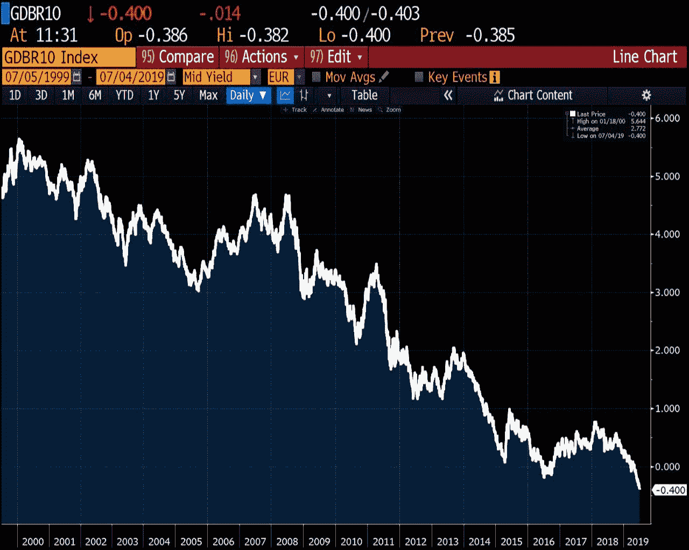
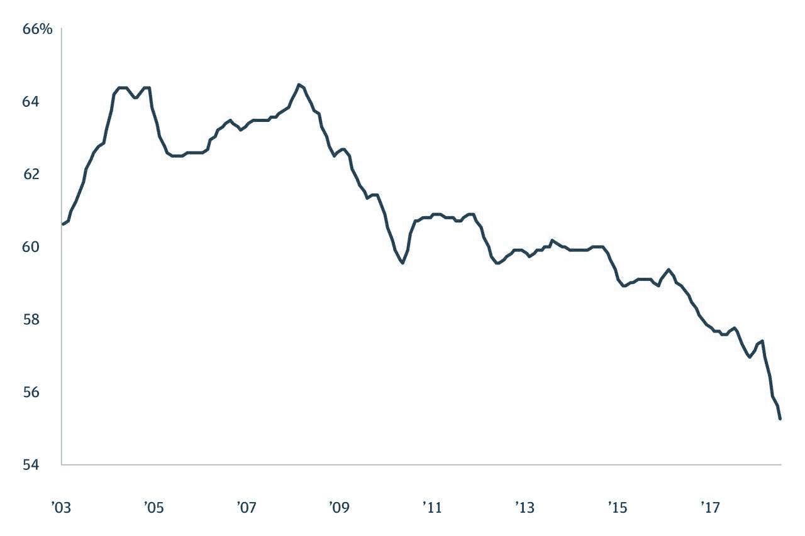
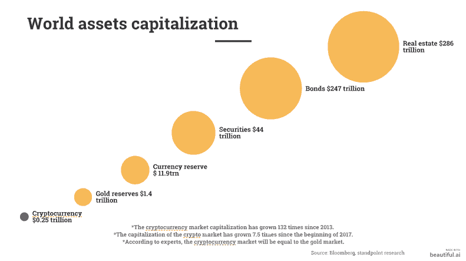
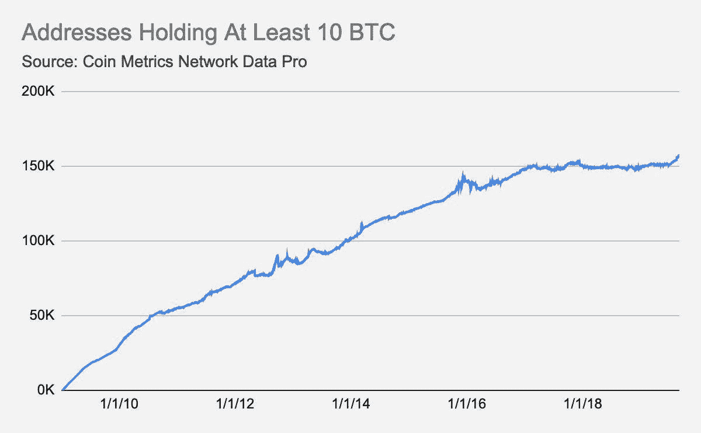
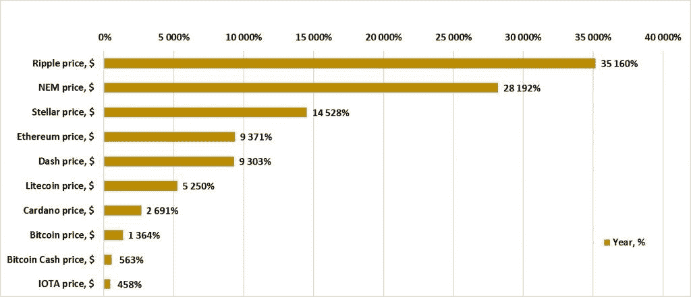

# 为什么人们从银行转向加密货币

> 原文：<https://levelup.gitconnected.com/why-do-people-switch-banks-to-cryptocurrency-64d7647cd0b7>

随着加密货币的出现，银行开始失去在金融市场的垄断地位。资金的增加，尤其是在 ICO 运动的高峰期，迫使许多大型玩家关注这个年轻的市场。

几个世纪以来，人们一直试图挣脱银行的枷锁，现在看来，这可能最终会成功。

# 生长催化剂

为了让社区完全接受加密货币，需要一个全面的推动来加速整个过程。就像纸牌搭的房子一样——呸，完成了！

例如，博客在 1994 年首次出现，直到 2004 年才进入大众。这花了大约 10 年时间，这是采用任何大规模技术所必需的时间。

在这个阶段，我想立刻指出几个有助于加密货币增长和传播的催化剂:

# 1.过热的市场

*图表上，德国政府 10 年期债券收益率跌至-0.40%。*

也许这是现在观察到的最重要的[因素之一](https://upfina.com/how-overheated-is-the-stock-market/)。通常过热的市场表明，危机已经在背后喘息。

许多工具的收益率仅为百分之几，而比特币表现良好。

# 2.中美之间的贸易战。

摩根大通:美国央行储备中的美元份额正在稳步下降。

当选美国总统后，唐纳德·川普立即开始向[迈出几步，批评与先天中国的贸易关系](https://www.bbc.com/news/election-us-2016-36185012)，并与台湾建立积极的关系。市场对他关于对来自中国的商品征收关税和人民币贬值的声明做出了反应。

在中美关系紧张的背景下，许多国家开始增加黄金数量，相反，减少股票中的美元数量。

# 3.数字资产的低估。

图表比较了加密货币和其他有价值资产的资本化。加密货币目前的低估至少等于黄金的体积，这是目前 4 倍以上的金额。也就是比特币的真实价格会是~$5 万。

# 4.多样化

*拥有至少 10 个未使用比特币的地址继续增长。*

多样化是成功的投资组合管理的主要关键之一，有经验的投资者也坚持多样化。最好的工具是:

*   交易所交易基金
*   金色的
*   对冲基金
*   财产
*   证券
*   指数([Cryptoindex.com—cix 100](/cryptoindex.com)、 [Crypto20](https://crypto20.com) 、 [Huobi10](https://www.hbg.com/de-de/markets/hb_index/) 等多个)。

在危机时期，许多资产价格下跌，聪明的投资者迅速“捡起”它们。

沃伦·巴菲特建议投资者购买指数基金，因为这是新人和新手投资者的最佳策略。

# 5.新的投资机会

[许多加密初创公司有巨大的潜力](https://www.crunchbase.com/hub/cryptocurrency-startups#section-leaderboar)，主要参与者也看到了这一点。当然，这不是另一个仓促组装的 ICO——这些都是来自行业巨头的成熟产品，比如来自脸书的 [*克莱顿*](https://www.coindesk.com/kakao-teases-2019-launch-of-crypto-wallet-dapp-partners)отKakaoTalk[天秤座](https://en.wikipedia.org/wiki/Libra_(cryptocurrency))等等。

未来几年，加密货币的利润将与 IPO 兼容。

你怎么想？[和我分享你的想法吧！](https://twitter.com/rwiligut)