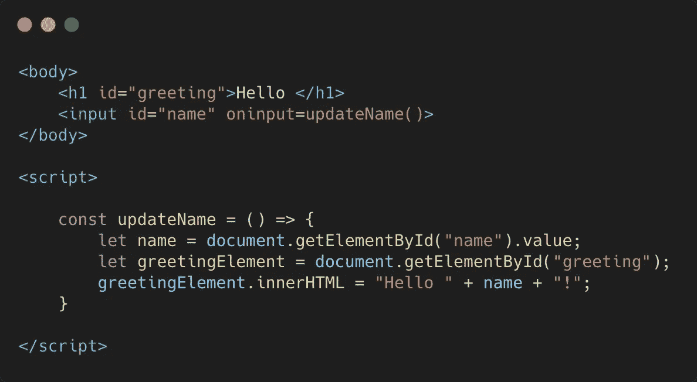
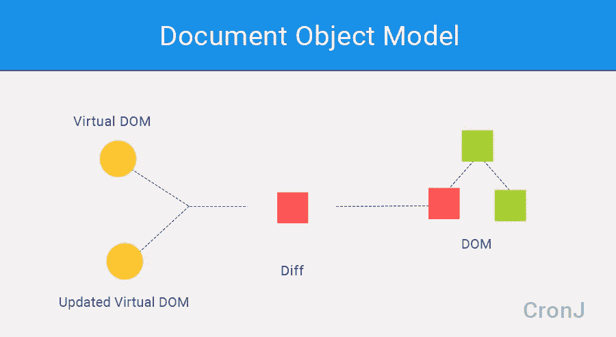

# 我们为什么要用 React？

> 原文：<https://levelup.gitconnected.com/why-do-we-even-use-react-fd38effa13ca>

## WEB 开发

## 检验成功的要素

冷静点。

我敢肯定，许多点击了这篇文章的 web 开发人员已经准备提交回复，谈论 React 为什么很棒以及使用它的好处。

但是不——我不是来这里做垃圾反应的。

我在这里提出一个问题:我们为什么要使用 React？

我不是指*“既然 React 很烂，而且还有更好的选择，我们为什么还要用它”*。

我是说，我们是怎么走到这一步的？React 为什么受欢迎？是什么让它流行起来的？我们需要它吗？**我们为什么要用它？**

我想探讨这个话题的原因是因为我认为这是一个经常被跳过的讨论，不应该被跳过。这些天，初学者只是想当然地认为他们的网站应该用 React 来构建。

但是人们了解为什么用 React 建立他们的网站吗？

这就是我想要阐明的。因此，我打算回答两个问题:

1.  **我们为什么要使用 web 框架/库？**
2.  **在框架和库之外，我们为什么要使用 React？**

现在，在我们深入研究之前，先声明几条免责声明:

*   我知道不是每个人都使用 React。然而，初学者正越来越多地被引向反应高于一切。我在和他们说话。你知道为什么人们推荐 React 给你吗？
*   在这个话题上，我远不是专家。我是说，**真的很远。**因此，这篇文章并不意味着是关于性能、设计决策或诸如此类的深入的技术讨论。我刚刚意识到我有点盲目地遵循 React 路径，并想停下来问一句:这有什么原因吗？
*   我知道 React 是一个库。然而，从现在开始，当以一种集体的方式谈论 Vue、Angular、React、Svelte 等时，为了简单起见，我将把它们称为“web 框架”。
*   ⚠️ **这篇文章是写给初学者的，或者是那些从来没有时间去理解他们为什么要使用 React** 的人。它将包含简化，其目标是提供对我们为什么做事情的洞察力，而不是仅仅因为其他人都这样做而这样做。

内务整理到此结束，我们开始吧。

# 1.我们为什么要使用 Web 框架？

看看上面的片段。

它所做的是更新文档(特别是`h1`标签)说“Hello < name >！”每次名称改变时，即当`input`标签的值改变时。

因此，文档*对数据的变化做出*反应，并相应地更新 UI。

这就是 JavaScript 的用途:**让网站具有交互性。**

一个按钮被点击，一个键被按下，一个元素被悬停，JavaScript 可以识别该事件，然后*相应地做出*反应，通常是通过更新用户看到的内容。

这就是 React 名字的由来:React 处理状态的变化，并相应地更新 UI。

但是我们实际上不需要**对此做出反应。事实上，我们不需要任何框架、库或任何东西来对状态变化做出反应并生成更新。上面的片段就是一个例子。**

然而，随着网站变得比难看的输入框和一些标题文本更复杂，问题就出现了。保持用户界面与状态同步变得非常困难。

我在这里基本上是在引用阿尔贝托·吉梅诺的话，因为他有一篇关于这个主题的优秀文章。他的主要观点是，我们没有 web 框架，因为组件很好，或者第三方库到处都有用。我们有 web 框架，因为没有它们很难构建复杂的交互式网站。

例如，考虑像 Express 或 Django 这样的服务器端 web 框架。你不需要它们，但是退一步说，每次你需要的时候，从零开始创建一个健壮高效的 web 服务器肯定是非常困难的。

所以重点是:我们可以用 React、Angular 或 Vue 做的任何事情也可以用 VanillaJS 做。我的意思是，*当然是*——毕竟 web 框架是建立在 JavaScript 之上的。

但是仅仅因为我们可以这样做，并不意味着我们应该这样做，因为在任何重要的项目中，仅仅通过`getElementById`、`addEventListener`和他们的团队来保持 UI 与状态同步是非常困难、混乱和适得其反的。

因此，我们使用框架给我们一个抽象层，并为我们处理同步，而我们专注于构建页面本身。

# 2.我们为什么使用 React？

已经建立了使用框架的相当明显但经常被忽视的原因，现在让我们进入第二个问题:在可用的框架之外，为什么要做出反应？

好吧，与其直接看我们为什么使用 React，不如让我们先缩小范围。

让我们考虑一下:为什么我们不使用 React？

与一些博客帖子可能告诉你的相反…

## ❌……我们不用 React，因为它很快

如果我们认为速度高于一切，那么我们就不会使用 React。

结果因实验而异，但是，一般来说，一些鲜为人知的框架在速度上胜过 React。

在[这个实验](https://medium.com/@ajmeyghani/javascript-frameworks-performance-comparison-c566d19ab65b)中，例如，RE:DOM、Inferno、Svelte 和 Vue beat 的反应速度。

## ❌:我们不用 React，因为它很小

再说一次，对于规模有不同的衡量标准。这也可能变得棘手，因为有些基准测试包括 Redux 和 React，而有些则没有。

由于 React 是(大部分)框架中的一个库，所以在某些情况下将两者加在一起，组成一个具有与其他框架相同功能的代表性“框架”是有意义的。

然而，React 也没有最小的包大小。其中(RE:DOM，Inferno)， [Preact](https://preactjs.com/) 在这方面表现突出。它的卖点本质上是更小的 React，所以如果你喜欢 React，但仍然优先考虑包的大小，你会选择 Preact。

## ❌:我们不用 React，因为它简单易学

这里我重点说一个具体的比较:Vue。

Vue 团队公开承认 React 和 Vue 非常相似。不过，虽然我自己没用过 Vue，但我看的文章里大部分人都说 Vue 绝对比 React 好学。另一个经常提到的问题是 Vue 的文档更好。

不管怎样，如果你想要一个易于学习的 React 风格的框架，你应该选择 Vue。如果你真的想在所有框架中挑选最简单的，有一些小的应该比 React 更简单。

## ❌:我们不用 React，因为它有组件

这里不多说了。如今大多数顶级的 web 框架都包含了组件的概念。我们不是在谈论可用组件的质量，只是说它们确实存在。没有理由选择 React，因为它是基于组件的。

## ❌:因为虚拟 DOM，我们不使用 React

[图片由 CronJ 拍摄](https://www.cronj.com/blog/virtual-dom-react-js/)

对于那些不熟悉虚拟 DOM 的人来说，虚拟 DOM 是 React 处理 UI 更新的方式。

实际的 DOM 是文档的一种表示，即 HTML，浏览器用它来决定应该向用户呈现和显示什么。

例如，当您在 VanillaJS 中使用`document`时，您正在使用 DOM API 与 DOM 接口进行通信，或者是拉或者是推数据。因此，当你做`document.someElement.innerHTML`时，你正在使用 API 来改变 DOM，这将导致网站的 UI 改变。

然而，从计算的角度来看，DOM 操作是“昂贵的”。因此，React 创建了一种新的方法来处理对 DOM 的更新，称为虚拟 DOM。

虚拟 DOM 实际上是内存中真实 DOM 的副本/表示。然后，当状态改变时，React 首先将必要的改变应用到虚拟 DOM，然后将其与真实 DOM 的状态进行比较，以确定需要更新什么，并以优化的方式进行更新。

通过这种方式，对 DOM 的昂贵操作被限制在绝对必要的情况下，并且以高效的方式完成。React 中的组件仅在必要时重新渲染，其他一切保持不变。

当 [React 推出这款](https://www.youtube.com/watch?v=x7cQ3mrcKaY&t=1155s)的时候，相当具有革命性。与以前的做法相比，这是一个重大的进步。因此，在 React 的早期，选择它作为首选框架是非常有意义的，因为它实现了虚拟 DOM，这是处理 DOM 更新的最佳方式。

然而，今天，这不是选择 React 的理由。Preact、Vue、Inferno 和许多其他软件也使用虚拟 DOM，正如我们所看到的，其中一些甚至比 react 还要快。

此外，一些框架开始质疑我们是否真的需要一个虚拟 DOM，比如 [RE:DOM](https://redom.js.org/) 和**特别是** [**Svelte**](https://svelte.dev/) **。**这里的想法是:虚拟 DOM 肯定是伟大的，是一个令人敬畏的突破，但是在 DOM 之上添加另一层永远不会比实际上**只是**修改 DOM 更快。但那是另一天的故事了(如果你想了解更多，你可以观看这个演讲)。

## ❌:我们不用 React，因为它是声明性的

简而言之，声明式编程就是用一种方式来表达你想做什么，而不是达到目的的具体步骤。

反应就是这样——这很好。您不需要关注状态应该如何处理以及如何与 UI 同步。您构建了 UI，React 将在发生变化时计算出如何更新 UI。

这经常被认为是 React 的优势之一，事实也的确如此。然而，当 React 开始与 jQuery 等使用命令式编程风格的库竞争时，这一点尤其重要。

声明式编程很棒，但是 Vue、Svelte、Ember、Preact 等等本质上也大多是声明式的。所以这也不是使用 React 的理由。

## ❌我们不使用 React，因为它有更多的 GitHub 明星

只是一个快速和轻松的点。虽然 React 对乔布斯来说更受欢迎，但在媒体上，似乎在任何地方，Vue 实际上有更多的 GitHub 明星(或至少在我写这篇文章时是这样)，168k 比 React 的 152k 多。

# 那么我们为什么要使用 React 呢？说出来！

我认为我们使用 React 有几个原因。我也觉得这个自然会因人而异。但本质上，我们使用 React 是因为它是以下的**组合**:

*   对于大多数用途来说，这已经够快的了
*   **对于大多数用途来说，它足够小了**
*   **对于大多数目的来说，这很简单**足够了****
*   **它由一家大型科技公司(脸书)推动和维护**
*   **它率先引入了虚拟 DOM(先动优势)**
*   **它允许创建跨平台的移动应用程序(使用 React Native)**
*   **它有一个强大的生态系统**
*   **这就是工作描述所要求的！**

**…还有很多其他原因。**

**这一切听起来非常明显！这篇文章是浪费时间！**

**“我们使用框架是因为没有它们很难，使用 React 是因为它有一个强大的生态系统。”咄，我们知道这么多。**

**但是我在这里想表达的观点实际上更深入一点。**

**如果你盲目地跟随行业或你的同事告诉你去做的事情，你最终会走上一条不一定是最适合你的道路。**

**因此，尽管这篇文章的标题是“我们为什么要使用 React？”真正有趣的是关于为什么**我们不用它**的部分。**

**原因是:尽管 React 很棒，但是如果你正在寻找简单易学的东西，你应该选择另一个框架。如果您寻求最佳性能，请选择另一个框架。如果你想建立一个简单的登陆页面，只需使用 VanillaJS！**

**因此，虽然选择 React for job opportunities 是一个非常有效的理由，但对于大多数其他事情来说，花一些时间来理解你为什么实际上在做某个决定是值得的。对于 web 框架以及您的堆栈中的其他任何东西来说都是如此！停下来，想想你需要什么，选择最适合你的。**

**上周我用客户端浏览器 Python 制作了一个游戏，因为我的目的是享受尝试新事物的乐趣。性能很差。没关系——反正这不是我的目标。**

**因此，总之，React 很棒，您应该使用它。但是你实际上并不**必须**。永远记住这一点。**

# **作者注✍️**

**感谢阅读！如果你认为这篇文章有用，请鼓掌支持我👏👏。**

**如果您对 Web 开发感兴趣，您可能还会喜欢:**

*   **[**厌倦了用 Javascript 做网页？用浏览器 Python 代替**](https://medium.com/swlh/sick-of-javascript-just-use-browser-python-4b9679efe08b?source=friends_link&sk=40e664d45bfea34d35189c32cd5d0a51)**
*   **[**通过黑一个网站了解 Git 的内部**](/learning-the-internals-of-git-by-hacking-websites-c70c59303b12)**
*   **[**【字面意思】在 10 分钟内构建自己的广告拦截器**](/building-your-own-adblocker-in-literally-10-minutes-1eec093b04cd)**