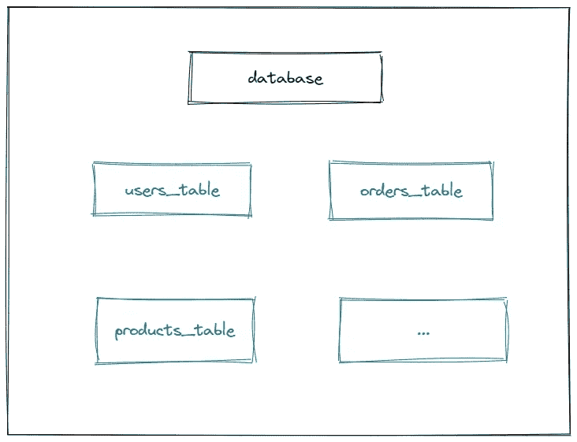
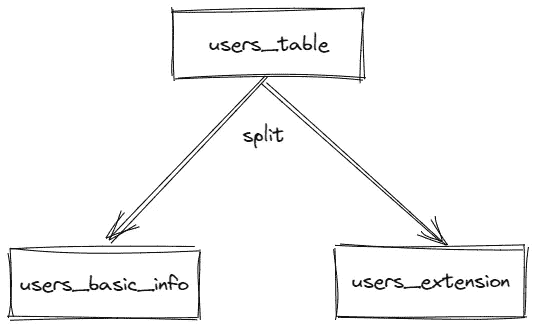
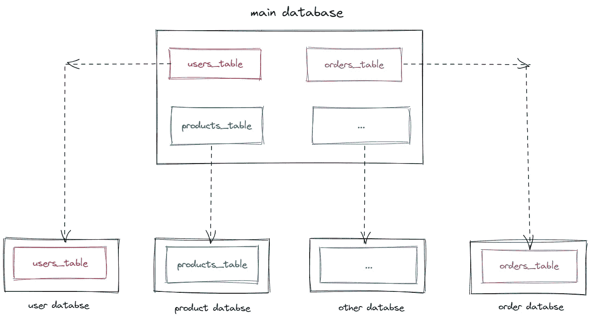
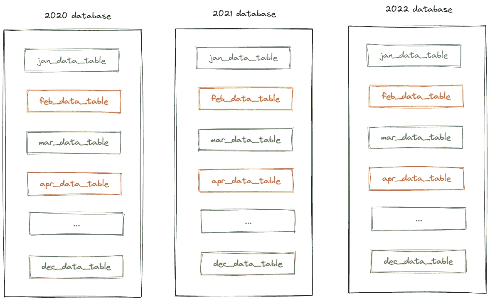
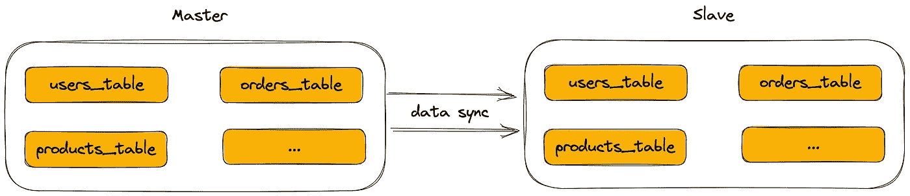
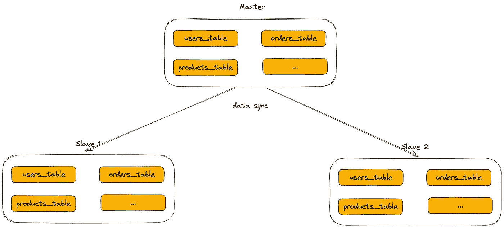
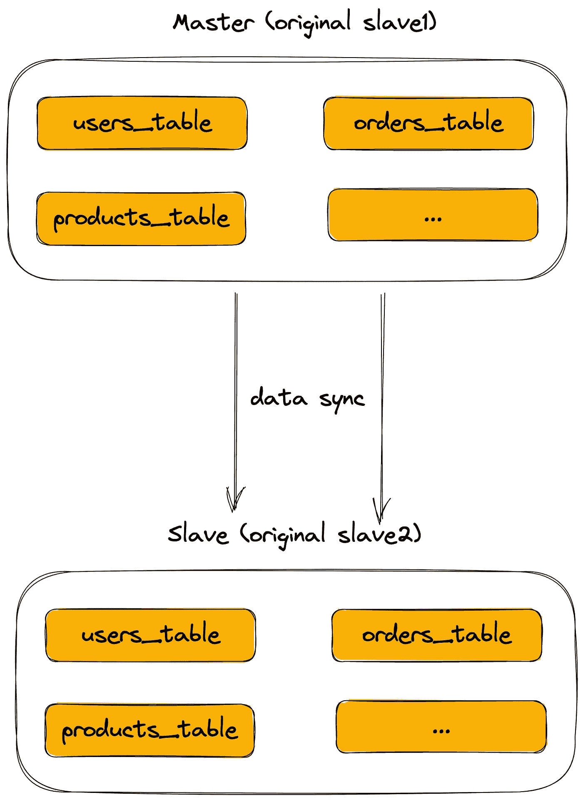
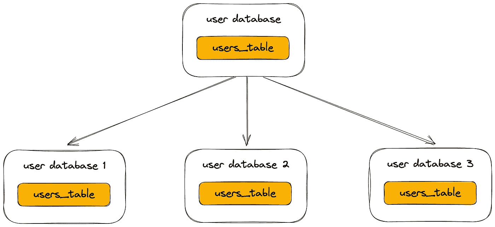
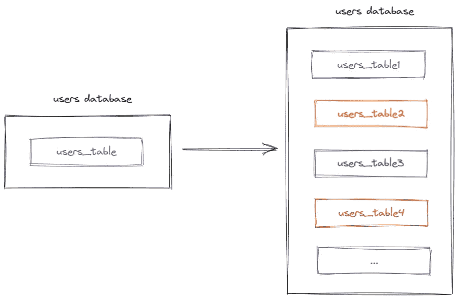
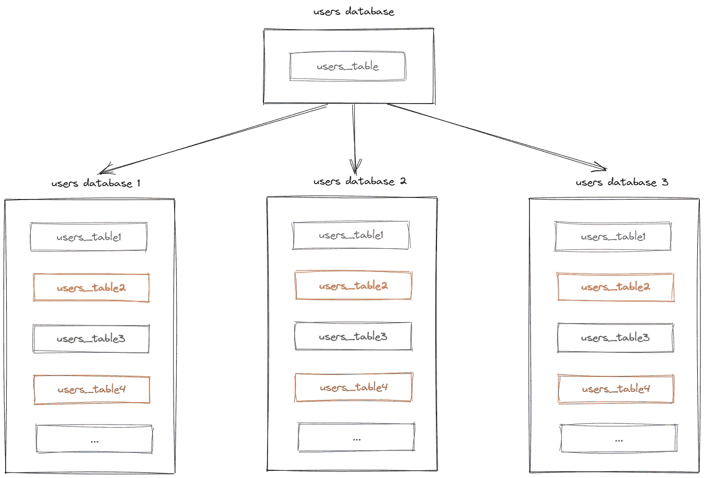

# 为什么我们需要分片？

> 原文：<https://levelup.gitconnected.com/why-do-we-need-to-sharding-e98d0e939d21>

Mysql 如何拆分数据库，拆分数据表？

照片由[卡拉·伊德斯](https://unsplash.com/es/@karaeads?utm_source=unsplash&utm_medium=referral&utm_content=creditCopyText)在 [Unsplash](https://unsplash.com/s/photos/house?utm_source=unsplash&utm_medium=referral&utm_content=creditCopyText) 拍摄

在高并发系统中，拆分数据库和拆分数据表是不可或缺的技术手段。

那么如何实现呢？

**扩大规模。**

# 1.单一数据库。

系统前期，业务功能比较单一，系统模块较少。

为了快速满足迭代需求，减少一些不必要的依赖。

更重要的是，为了降低系统的复杂度，保证开发速度，我们通常使用单一的数据库来保存数据。

系统的初始数据库结构如下。

作者图片

此时使用的数据库方案是:一个数据库包含多个业务表。用户读数据请求和写数据请求都在同一个数据库上操作。

# 2.拆分数据表。

系统上线后，随着业务的发展不断增加新的功能。结果，单个表中的字段越来越多，开始变得不太容易维护。

一个用户表包含几十个甚至上百个字段，管理起来有点混乱。

这时候我们该怎么办？

这时，我们可以选择拆分数据表。

例如，`users_table`可以拆分为:`users_basic_info`表和`users_extension`表。

作者图片

用户基本信息表存储了用户最重要的信息，如用户名、密码、昵称、手机号、邮箱、年龄、性别等核心数据。

这些信息与用户息息相关，查询频率很高。

用户扩展表存储用户的扩展信息，例如工作地点、城市等。、以及非核心数据。

这些信息只需要在特定的业务场景中查询，在大多数业务场景中是不需要的。

因此，核心数据和非核心数据由子表分隔，使表的结构更清晰，职责更单一，维护更容易。

除了按实际业务分表，我们还有一个常用的分表原则:把请求频率高的放在一个表，请求频率低的放在另一个表。

# 3.分割数据库。

经过 N 次需求开发迭代，功能已经非常完善。

系统功能的完善意味着系统的各种关系错综复杂。

在这一点上，如果你不赶快梳理好业务逻辑，那么后面会带来很多隐藏的问题，最终会给你造成很多遗留的麻烦。

这时候就需要根据业务功能划分不同的领域。将同一字段中的表放入同一个数据库，将不同字段中的表放入另一个数据库。

具体拆分过程如下:

作者图片

与用户、产品和订单相关的表从原始数据库拆分成单独的用户数据库、产品数据库和订单数据库，并且还准备了另一个数据库，共有四个数据库。

这样按字段拆分后，每个字段只需要专注于自己的相关表，职责更加单一，更好维护。

# 4.拆分数据表时拆分数据库。

有时候根据业务划分数据库或者只划分表是不够的。例如，一些财务系统需要按月和年汇总所有用户的资金。

这是需要做的:拆分数据库，同时拆分数据表。

每年有一个单独的数据库，在每个数据库中，有 12 个表，每个表存储一个月的用户资金数据。

作者图片

这样，数据库分表后，可以非常高效地查询到某个用户的月度或年度资金。

此外，还有一些特殊的要求，比如需要按照地区划分数据库，比如北美、南美等整体地区，每个地区都有单独的数据库。

甚至有一些游戏平台根据连接的游戏厂商做分库、分表。

**横向扩展。**

假设在系统前期，系统架构如下图所示。

作者图片

# 1.主从读写分离。

系统上线一段时间后，用户数量稳步增长。

此时你会发现，在用户的请求中，读取数据的请求占了大多数，实际写入数据的请求占了很小的比例。

众所周知，数据库连接是有限的，它是一种非常宝贵的资源。对数据库的每个读或写请求至少需要一个数据库连接。

如果写数据请求所需的数据库连接被读数据请求占用，则不能写入数据。

这使得问题变得严重。

要解决这个问题，我们需要把读库和写库分开。

于是，主从读写分离架构出现了:

作者图片

考虑到一开始用户数量没有那么大，所以选择了一主一从的架构，也就是常说的一主一从。

所有写入的数据请求都指向主库。一旦主库完成数据写入，它将立即与从库异步同步。这样所有的读数据请求都能及时从库中获取数据(除非有网络延迟)。

读写分离方案可以解决上面提到的单节点问题，与单数据库方案相比可以更好的保证系统的稳定性。

因为如果主库出现故障，从库可以升级为主库，所有读写请求都可以定向到新的主库，系统又可以正常运行了。

但这里有一个问题:如果用户数量确实有点多，如果主设备出现故障，将从设备升级为主设备，将所有读写请求都指向新的主设备。

但是这时候新的主完全不能处理所有的读写请求怎么办？

这需要一个主多从架构:

作者图片

在上图中，我画了一个主人和两个奴隶。如果主服务器出现故障，您可以选择从库 1 或从库 2 升级到新的主服务器。

如果我们在这里将从库 1 升级到新的主库，那么原来的从库 2 将成为新主库的从库。

作者图片

这样就解决了上面的问题。

此外，如果查询请求量增加，我们还可以将架构升级到一个主机和三个从机，一个主机和四个从机，最后升级到一个主机和 N 个从机。

# 2.分割数据库。

上述读写分离方案确实可以解决读请求大于写请求时主节点无法承受的问题。

如果注册用户的请求量很大，也就是写请求本身的请求量就很大，一个主库承受不了这么大的压力。

那我们该怎么办？

此时，可以创建多个用户库。

用户数据库的拆分过程如下。

作者图片

这里我把用户数据库拆分成三个库(真实场景不一定是这样的)，每个库的表结构完全一样，只有存储的数据不同。

# 3.拆分数据表。

用户请求数量的增加必然导致数据量成本的增加。即使做了子库，也有可能单个库比如用户库就有一亿个数据。

这种数量级的数据存储在单个表中，性能会变得很差。

如果数据量太大，需要建立的索引也会很大。从小到大检索数据会非常耗时，会消耗大量 CPU 资源。

我们能做些什么呢？

这时可以选择拆分数据表，这样可以控制每个表的数据量和索引的大小。

作者图片

这里我把用户数据库中的用户表拆分成四个表(真实场景不一定是这样的)。每个表的表结构完全一样，只是存储的数据不一样。

如果以后用户数据量越来越大，只需要再分几个用户表就可以了。

# 4.拆分数据表时拆分数据库。

作者图片

在图中，用户库分为三个库，每个库包含四个用户表。

如果有用户请求，首先根据用户 id 路由到一个用户库，然后定位一个表。

有许多路由算法:

*   模运算。比如:id=7，有 4 个表，那么 7%4=3，取模 3，路由到用户表 3。
*   区间范围。例如:如果 id 的值为 0–100，000，则数据存在于用户表 0 中，id 的值为 10–200，000，则数据存在于用户表 1 中。
*   一致的哈希算法。

**总结。**

*   拆分数据库:可以解决数据库连接资源不足和磁盘 IO 的性能瓶颈问题。
*   拆分数据表:可以解决单个表的数据量过大的问题，即使使用索引来查询 SQL 语句中的数据也非常耗时。此外，还可以解决消耗 cpu 资源的问题。
*   拆分数据库，同时拆分数据表:可以解决数据库连接资源不足、磁盘 IO 性能瓶颈、数据检索耗时、CPU 资源消耗等问题。

如果你喜欢这样的故事，想支持我，请给我鼓掌。

你的支持对我很重要，谢谢。

# 分级编码

感谢您成为我们社区的一员！在你离开之前:

*   👏为故事鼓掌，跟着作者走👉
*   📰更多内容请查看[升级编码刊物](https://levelup.gitconnected.com/?utm_source=pub&utm_medium=post)
*   🔔关注我们:[推特](https://twitter.com/gitconnected) | [LinkedIn](https://www.linkedin.com/company/gitconnected) | [时事通讯](https://newsletter.levelup.dev)

🚀👉 [**加入升级人才集体，找到一份神奇的工作**](https://jobs.levelup.dev/talent/welcome?referral=true)