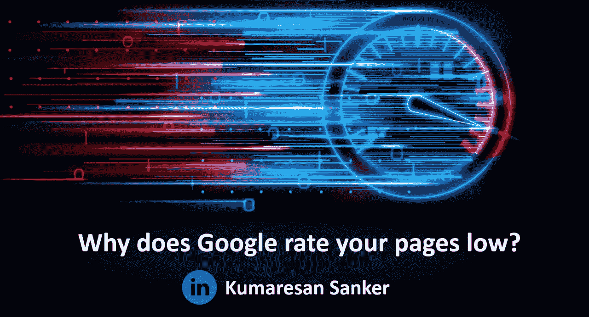
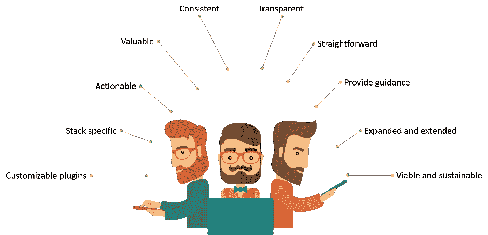
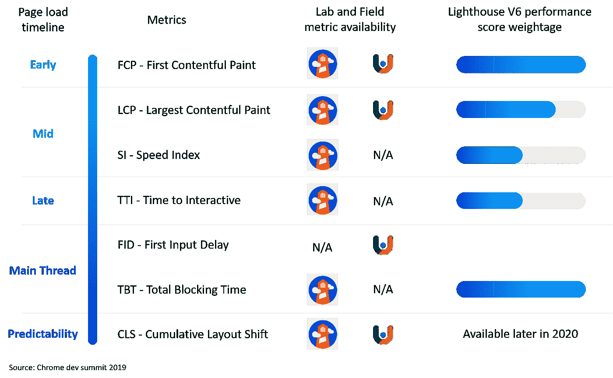

# 为什么谷歌对你的网页评价很低？

> 原文：<https://levelup.gitconnected.com/why-does-google-rate-your-pages-low-62f89edf92a2>

即使你已经优化并删除了没有附加价值的 CSS、JS、图片等，谷歌会给你的页面评分低吗？？

你是否厌倦了把时间和金钱花在提高成绩上，却得不到更好的结果？然后以正确的方式去做，通过理解谷歌是如何分析你页面的每一个元素来逐步提高你的分数！

谷歌最近宣布了他们的新灯塔 V6 和 PSI API。以下是一些亮点，

近年来，网站的发展有了突破。尽管如此，用户仍然面临着网站加载缓慢的问题。当时，Lighthouse 使用“负载”作为衡量性能得分的唯一标准。Lighthouse 已经发展了，现在他们把负载、交互性和可预测性作为衡量性能分数的高级标准。

Google 反对 FMI 和 FPI 在绩效得分中的作用，并引入了 LCP、TBT 和 CLS。最新的 lighthouse v6 对重量进行了调整，使负载的各个阶段更加平衡。

LCP(最大内容绘画)用于测量加载用户可用的主要最大内容所花费的时间，而 FCP 仅测量早期阶段的加载体验。LCP 测量用户登陆该网页的核心元素的持续时间值。

TBT(总阻塞时间)标识主线程负载完成的时间，并确保整个负载的平衡。TBT 量化了在主线程仍在加载时(输入延迟)可能对用户在主线程上的交互产生潜在影响的风险。谷歌表示，前 50 毫秒不是问题，超过 50 毫秒直到完成加载的时间是阻塞时间。换句话说，技术性贸易壁垒是 FCP 和 TTI 之间封锁时间的总和。

CLS(累积布局偏移)用于测量加载期间视窗内可用元素的交互时间。Ex —满载后，面板上的图像和 CTA 按钮可能会错位。CLS 有助于防止意外点击。

现在，Lighthouse v6 增加了更多的特性，其中一些突出的特性是:

*   使用页面速度洞察 API (PSI API)进行生产监控
*   搜索控制台上的新速度报告。
*   Lighthouse chrome 扩展将不再在我们的本地主机上测试。相反，单击 generate report 按钮将首先请求 PSI API 并在 Google 的基础设施上运行。
*   如果不能公开访问，您仍然可以使用本地主机加载，使用 dev tools 上的审计面板。
*   另一个很酷的特性是，我们现在可以在一个视图上看到两个 lighthouse 报告的比较，而不是两个报告，并在它们之间切换。

Lighthouse v6 具有定制和可操作的特性。栈包和插件可以更多地用于特定的用例，它们有自己独特的方式。

**堆栈包**为您的堆栈加载了特定的指导。它会自动检测所使用的 CMS 和框架，并根据 lighthouse 报告中的特定堆栈为我们提供特定的建议。谷歌将推出 CMS 和框架的堆栈包，如 Angular、WordPress、Magento、React 和 AMP。

**插件**——当我们点击生成报告按钮时，Google lighthouse 收集并分析一堆关于元素、网络记录等的数据。有了新的插件功能，我们现在可以根据自己的需要利用和定制所有这些数据。我们可以决定如何评分，也可以决定如何加权。因为这是我们自己的类别，我们可以对它有很大的控制权。这是一个可行的、简单的插件。

**灯塔 CI** 现已发售。我们既可以手动使用它，也可以使用 [GitHub Lighthouse CI action](http://bit.ly/34I5CFf) 。我们现在可以在投入生产之前，在每次提交时运行 lighthouse。每个拉取请求都是透明的，它会为我们插入的每个 URL 运行 lighthouse。

扑朔迷离的表演分数？

你有没有在不同的环境下体验过不同的性能分数，比如 Dev tools (audit)、Page speed insights、Lighthouse？不同的条件和硬件会导致不同的性能分数，这是合理的。

第二，在同一环境下分数的可变性问题。谷歌现在正在寻找缓解这个问题的方法。

不过，还有一些其他外部因素，如用户的设备性能、网络条件、缓存设置等。这影响评级绩效得分较低。

2020 年将是激动人心的一年，会有很多变化和新功能推出。希望看到更多加载速度更快的页面。

*来源— Chrome 开发峰会*