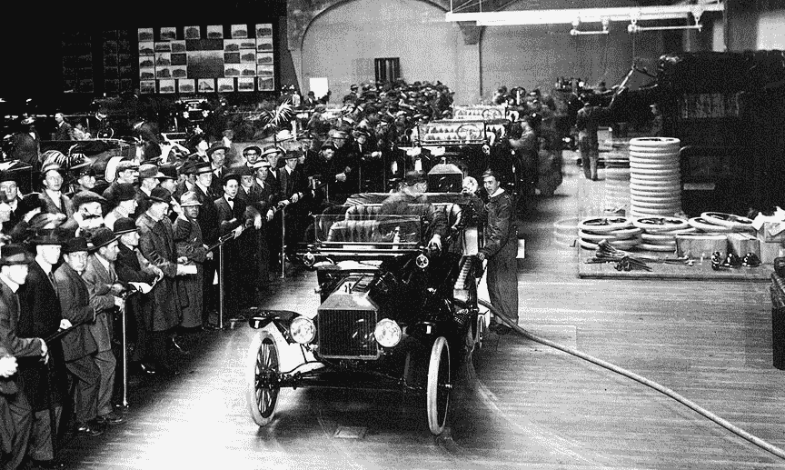

# 为什么他们不在冲刺阶段制造汽车？

> 原文：<https://levelup.gitconnected.com/why-dont-they-build-cars-in-sprints-40fff0b4a874>

## 如果连续流水装配是制造汽车的首选方式，那么为什么软件不是呢？

推出最新功能以供审查，利益相关方等待他们的第一印象| [来源](https://www.foundsf.org/index.php?title=File:Ford-assembly-line-in-Palace-of-Transportation---4400-cars-were-made-during-PPIE.jpg)

你见过一个汽车装配厂，它以开始和结束的离散冲刺生产汽车吗？比如，在两周的开始，团队开始制造一批新的汽车，并且在冲刺阶段结束时只完成那些汽车？没有新的汽车在冲刺阶段后期开始，因为所有的人员都完全专注于完成他们在冲刺阶段开始的汽车？当一批汽车在冲刺阶段结束时完成并交付时，所有用于组装早期阶段的设备都处于闲置状态。我也没有；这样工作毫无意义。而且，在每个冲刺阶段结束前清理所有汽车的装配线是没有意义的——这将大大降低工厂的生产能力。

取而代之的是，现代装配厂使用*管道*或*连续流*系统。工作连续地流过流程的所有阶段。工作开始或完成没有冲刺“开始”，也没有冲刺“结束”；这两种情况经常发生。如果你想分批交付工作，那很好——汽车以这种方式出口或发送给经销商。但是，将原材料转化为汽车的工作无时无刻不在进行，没有开始和结束的周期。

我对 Sprint 方法的看法是，它代表了一种幼稚的工作观。它把成品误认为生产它的过程。从表面上看，似乎合乎逻辑的是，在一个 Sprint 结束时，将一个功能包用蝴蝶结整齐地绑在一起，然后我们再次开始下一个 Sprint。但实际上，这个包装代表的是成品——它代表的是从装配线上下线的一辆汽车，而不是装配线本身。当每辆车从装配线上下线的时候，其他的车还在建造中。

但是在基于 Sprint 的软件开发中，我们混淆了成品和制造成品的过程。从头到尾产生一个新特性的过程(包括发现、设计、构建和部署)很可能比 Sprint 要长。那么在一个敏捷团队中，为什么设计师不能在工程师或测试人员完成旧功能的同时开始新功能的工作呢？通常他们会这样做，将发现和设计阶段分成一个单独的过程。稍后会详细介绍。

仅仅在构建阶段，创建一个特性可能需要比单个 Sprint 更长的时间。通常的方法是把它分成更小的部分，构建我们现在能做的，把剩下的留给以后。即使该功能在其余部分完成之前是无用或不可用的。即使缺少的部分在一段时间内还没有安排，因为所有随后的冲刺都已经完全投入到其他事情中了。这相当于将一辆少了两个轮子的汽车推出装配线，并通过说“抱歉，最后两个轮子在最后一次冲刺中不合适，但我们会将其放在待办事项中(所有其他缺少的部分都已提交)，并在未来的冲刺中处理它”来为其开脱

# 平稳生产与摇摆生产

精益生产的一个原则是它应该是平稳的。不应该有大的波动或紧急情况。这也是敏捷宣言的一个原则:

> 敏捷过程促进可持续发展。发起人、开发人员和用户应该能够无限期地保持恒定的步调。

但是考虑到在 Sprint 的开始，很可能没有几个任务准备好立即实现。许多任务需要某种类型的进一步澄清，通常是因为团队第一次看到它们是在 Sprint 规划期间，所以这造成了延迟。*跟踪丢失的信息浪费了时间。然而，在冲刺阶段结束时，所有损失的时间都会赶上团队。他们仍然必须在那些延迟发生之前，完成他们在 Sprint 开始时同意交付的所有任务。要在截止日期前完成每项任务，通常是一种疯狂的争夺。团队的压力水平遵循与活动相同的锯齿模式:冲刺开始时低，但结束时疯狂。然后我们一次又一次地重复这种不正常的模式。在我看来这太疯狂了！

*预先检查任务是可能的，称为细化。但是在实践中，我发现这很少发生，因为它与软件的交付争夺时间，而软件的交付已经很紧张了，并且团队是根据它来衡量的。也有可能不接受一个任务进入 Sprint，直到它首先被完全指定，这意味着当团队专注于当前 Sprint 的任务时，它变成了其他人的责任；工厂模式随之而来。这就导致了一个“准备好的定义”，被很多权威人士认为是反模式的。

此外，值得注意的是，在冲刺阶段，任务往往不会以平稳连续的方式完成。由于 Sprint 的开始和结束障碍，以及对任务的限制，大多数任务都会在最后几天完成。这就像一个汽车工厂在七天内没有生产出任何汽车，然后在接下来的三天内完成大量的生产，然后重复这个循环。这听起来不像是持续生产的好模式，因为它不是。

# 跨职能团队的流失

冲刺实际上减少了跨职能团队*出现的可能性。在 Sprint 结束时，我们会要求设计师切换工具来执行源代码审查，以帮助完成那些功能吗？在 Sprint 开始的时候，我们会让工程师们在等待完成选定的 Sprint 项目的下几个设计时闲晃吗？*

不，当然不是——那没有意义！就像汽车装配线上的早期设备闲置一样，让这些操作员开始下一批工作是最有意义的。产品经理开始下一轮的发现，设计师开始下一轮的设计。但是你如何在一个团队和一个 Sprint 中处理混合任务呢？你如何计划这样的冲刺？所有这些不同的任务打乱了 Sprint 计划。你如何估计发现任务、设计任务和编码任务的故事点数量？如何做到这一点的建议和指导在哪里？许多设计和发现任务还没有为利益相关者带来实现的价值。他们可能有一个不同于为工程师陈述的 Sprint 目标的目标。这看起来像是计划混乱。

因此，通常发生的情况是，我们将设计、产品发现以及任何不直接产生工作软件的东西转移到 Sprint 之外。产品经理和设计师以及其他角色在 Sprint 之外工作(或者可能在他们自己的 Sprint 安排中)，这反过来意味着 Sprint 仅限于由工程人员完成的工程任务。

因此，跨职能团队被分成不同的团队，或者更可能是不同的部门。产品经理在自己的团队里工作，设计师在自己的团队里工作，工程师在自己的团队里工作。每个团队都有单独的报告路线。为每个团队计算 Sprint 指标很容易，因为团队内部的工作类型是统一的:工程师只计算代码点，设计师只计算设计点。但它不再是跨职能的了；跨功能性本应提供的端到端可见性的优势已经丧失。

我想你可能会说，这种包括产品发现、设计和工程的不同团队的多团队情况代表了一种门控管道方法。每次冲刺都是团队之间的一扇大门。*冲刺门的意义是什么？它只是阻碍了作品从一个阶段到下一个阶段的自由流动。

*一个常见的例子是“双轨”敏捷。这种解读是错误的。[发现工作应该与开发工作同时持续进行](https://www.jpattonassociates.com/dual-track-development/)。

# 可变大小的任务

汽车装配厂与软件工厂的一个不同之处在于，在汽车工厂里，每周都会生产数千辆同样的汽车。当然，一条装配线可能被共享来制造多个模型，但是特定模型的每个实例在很大程度上与同一模型的其他实例相同(选项和颜色会有一些变化，但是这些也会不断重复)。制造特定模型所涉及的时间和工作是已知的；一个部件需要三个还是五个螺栓并不神秘，将这些螺栓插入每辆汽车需要多长时间也不神秘。

相比之下，在软件中，每个任务都是不同的。当然，可能有一些相似之处，但每个任务在某些方面都是独特的，可能只是一点点，也可能很多。所以我们不能绝对肯定地知道周期时间；总会有一些误差。大多数时候，[团队倾向于低估所需的时间](https://en.wikipedia.org/wiki/Planning_fallacy)。

因此，如果一个生产同一产品的多个副本的汽车工厂，其生产时间是众所周知的，不使用 Sprints，那么软件交付，这受到更多的可变性，会受益于这样一个规则的，有节奏的交付节奏吗？对我来说没什么意义。

冲刺本质上是一个固定容量的时间盒子；每次冲刺的规模都是一样的。但是我们插入的工作是*而不是*相同的——每个任务都是不同的。而且每个任务的大小并不是完全已知的:估计会有误差，最常见的是如上所述的低估。所以我们有这样一种情况，可变大小的任务，每个任务的实际大小很可能比它的估计值大，被打包成固定大小的交付节奏，称为 Sprints。然后团队被要求在 Sprint 结束时交付所有这些。这看起来更像是曼妥思汽水间歇泉的配方，而不是向我交付软件的可靠方式！

# 源源不断的救援

连续流是汽车装配厂使用的方法。总有一辆新车开始，总有一辆结束。没有冲刺。当汽车某一阶段的工作完成后，就可以顺利地移交给下一阶段。这条管道由实际上非常跨职能的团队组成:丰田称之为 [*单元*](https://web.mit.edu/2.810/www/files/lectures/lec14-intro-to-tps.pdf) 。

是的，以不连续的批量增量发布产品是可以的。不，以同样的方式运行你的创作过程是不好的。相反，你的团队应该在一个连续的流程中工作——这被证明是更平滑的，并且给团队带来更少的麻烦。连续流动意味着工作中没有人为的起止障碍。

"为什么他们不在冲刺阶段制造汽车？"似乎是一个荒谬的问题。几十年的制造经验表明，基于准时制原则的连续流水装配线是最佳安排。那么我们为什么不把同样的思维应用到软件上呢？软件是不是没那么复杂了？不。它需要更少的技能或专业化吗？不。优化的生产流程*不是*竞争优势的潜在来源吗？号码

你可能已经猜到了，我不是特别喜欢短跑。我觉得它们代表了一种天真的工作观，而且我发现让 Sprint 投入工作所需的额外措施只会增加我的问题。相反，我使用连续流看板系统。这并不意味着我没有计划会议、回顾等等。这只是意味着它们是由连贯的价值块(即每个特性)来调度的，而不是由滴答作响的时钟来调度的。

**编辑:**我有很多评论说构建软件不像制造汽车，但是没有进一步的证据表明 Sprints 比连续流有任何内在的优势。在我看来，每个软件任务都有点类似于构建另一个车身，因此可以从以同样的方式考虑工作管道中受益。

## 进一步阅读

 [## 快点，冲刺的最后期限快到了！

### 在之前的一篇文章中，我提到了对固定长度短跑的厌恶。我说过我会在另一篇文章中解释为什么…

medium.com](https://medium.com/catum/hurry-up-for-the-sprint-deadline-is-approaching-f17925e4752b)