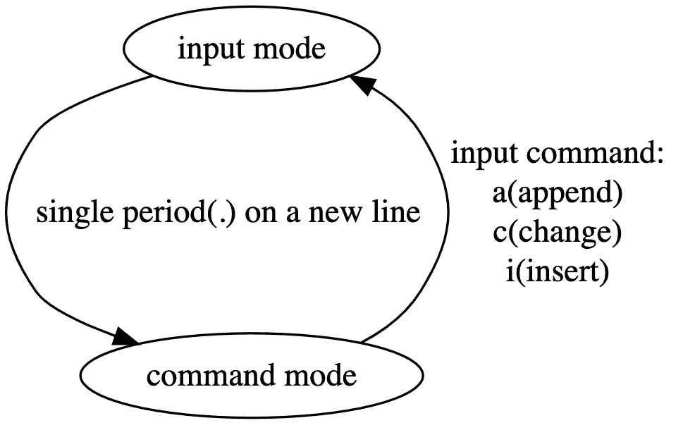

# 为什么 ed 是标准文本编辑器？

> 原文：<https://levelup.gitconnected.com/why-ed-is-the-standard-text-editor-bf45f8f21a3a>

如果你在 Twitter 上访问 [Rob Pike 的主页，你可能会注意到他的简历只包含一句话: **Ed 是标准文本编辑器。**](https://twitter.com/rob_pike)

作为一名文字编辑，艾德一定有什么特别之处。这篇文章将解释是什么使它如此特别。

# 什么是 Ed

`ed`是 Unix 系统上的一个行编辑器。说到编辑，很多人可能首先想到的是`vi`，但事实上，`ed`才是它的“爷爷”。

`ed`可以说是软件行业的活化石。它诞生于 1969 年，与 Unix 同龄，比 C 程序语言正式发布早了 9 年。它是由 Unix 的作者 Ken Thompson 开发的。

事实上，Ken Thompson 开发了三个关键工具来促进 Unix 操作系统的开发和测试:汇编程序、编辑器(ed)和 shell。换句话说，Unix 的早期版本就是在这个编辑器中诞生的。

几年后， [Dennis M. Ritchie](https://en.wikipedia.org/wiki/Dennis_Ritchie) (用 Brain W. Kernighan 开发 C 程序语言的家伙)开发了一个新版本的 ed，被道格·麦克洛伊描述为“权威的”ed。ed 的每一个方面都直接影响了它的后继者， [ex](https://en.wikipedia.org/wiki/Ex_(text_editor)) ，ex 影响甚至定义了 vi。

同时，ed 的概念并不是从零开始的，它的灵感来自于一个更早的文本编辑器，`[qed](https://en.wikipedia.org/wiki/QED_(text_editor))`。

# 教育署的核心特色

Ed 有 3 个核心特征。

## 简洁

ed 极其简单，几乎没有视觉反馈。我想这与 Ken Thompson 的设计哲学有关，因为整个 Unix 哲学都是基于简单性的。当然，还有另一个历史原因:在 20 世纪 70 年代，游戏机还是电传打字机，调制解调器很慢，内存很珍贵。为了节省资源，尽量减少视觉反馈是可以理解的。

如果出现错误(比如输入未知命令)，它会返回一个“？”并且没有给出任何其他信息。它也不报告文件名、行号等基本信息。最反常的是，在其早期版本中，如果用户试图在不保存内容的情况下退出，它甚至不会提示确认。所以它被(彼得·h·萨卢斯)称为“有史以来最讨厌用户的编辑器”。

## 占地面积小

上述简短是由于当时资源有限。因此，ed 使用起来非常节省资源。在内存和硬盘使用方面，它远远少于其他编辑器。例如，现代 ed 通常占用大约 50k 的硬盘空间，而它比 vi 的 2M 还多。

## 无安装

作为[单一 Unix 规范](https://en.wikipedia.org/wiki/Single_UNIX_Specification)的一部分，ed 命令内置于每个 Unix 或衍生系统中。这允许我们在其他系统功能不可用时使用它进行紧急文本编辑。这一点，加上它的小尺寸，使它可以在任何地方使用，从高端服务器到 Raspberry Pi 设备。甚至“闪烁 shell”，iPad 上的 ssh 客户端在其 shell 环境中提供 ed 命令。

# 快速启动

现在你已经了解了背景信息，让我们来看看它提供了哪些功能以及如何使用它。

## 两种操作模式

Ed 启动后在两种模式之间切换。一个是命令模式，一个是输入模式。

在命令模式下，它从标准输入读取命令，并相应地对缓冲器中的内容进行操作。一个典型的命令是，`s/old/new/g`，意思是用新的替换所有旧的**。如前所述，vi 源于 ed，所以当 vi 用户看到这个命令时，应该非常熟悉。注意搜索**支持正则表达式**。**

**在命令模式下，键入任何输入命令(如`i`表示插入)将导致 ed 切换到输入模式。然后，任何输入都被直接写入目标缓冲区。要退出输入模式，请另起一行并键入句点(".")，后面跟着一个“回车”笔画。**

**运行模式转换如下图所示。**

****

**波型转换**

## **经典例子**

**现在我们知道了 ed 的工作原理，让我们仔细看看下面一个流传很广的例子:启动 ed，然后一个接一个地输入命令，终端会显示以下消息。注意，下面的信息有些是手动输入的，有些是软件输出的。**

**ed 的一个基本例子**

**以上内容一部分由用户输入，一部分由软件输出。下面解释一下。**

*   **第 1 行，输入命令“`a`”，意思是追加，然后 ed 会从命令模式切换到输入模式。**
*   **第 2–3 行，输入两行文本。**
*   **第 4 行，退出输入模式，切换到命令模式**
*   **第 5 行，键入命令`2i`，意思是从缓冲区的第二个新行开始插入。**
*   **第 6 行，输入一个空行。**
*   **第 7 行，退出输入模式。**
*   **第 8 行，命令`,l`，打印出缓冲区中的所有内容。**
*   **第 9–11 行打印内容。请注意，每一行末尾的“$”表示该行的结尾，以便用户可以看到行尾任何可能的空格。**
*   **第 12 行，将缓冲区中第三行的“**两个“**替换为“**三个“**”。**
*   **第 13–16 行，再次打印缓冲区的内容以检查编辑的结果。**
*   **第 17 行，将缓冲区保存到一个文件名“text”中。**
*   **第 18 行，number **65** 表示写入文件的字节数。**
*   **第 19 行，退出。**

**正如你所看到的，在掌握了它的操作原理之后，你就可以使用 ed 相当高效地编辑文本了。**

## **命令格式**

**典型的 ed 命令格式如下。**

**`[address[,address]]command[parameters]`**

## **地址形式**

**命令前面的两个可选的`address`代表行地址。当省略该地址时，每个命令将动作应用于相应的“默认地址”。每个命令的默认地址可能会有很大变化。**

**由于本文无意取代官方手册，以下只是常用称呼的列表。**

*   **`.`当前行**
*   **`$`最后一行**
*   **`n`线 n**
*   **`-`上一行**
*   **`-n`前 n。**
*   **同样，`+`、`+n`分别代表下一行和下 n 行。**
*   **`,`所有行，相当于`1,$`**
*   **`/re/`匹配正则表达式的下一行 **re****

## **常见命令**

**ed 历史悠久，版本众多，这里只列出最早的和核心的命令。有关每个平台的详细信息，请参考该平台的命令手册。**

*   **`a`追加**
*   **`c`更改，即删除当前行，进入输入模式，用输入替换原来的行。**
*   **`d`删除。**
*   **`i`插入**
*   **`l`列出指定行地址的内容。**
*   **`q`退出。如果缓冲区中有未保存的内容，系统会提示您保存。**
*   **`r file`读取名为 **file** 的文件的内容，并将其从当前位置追加到缓冲区。**
*   **`s/re/replacement/`用 **re** 替换第一根火柴，用 **replacement** 替换**
*   **`s/re/replacement/g`同上，但更换所有线路**
*   **`s/re/replacement/n`同上，但只替换第 n 个匹配行。**

## **用法示例**

**以下是几个命令示例，可以帮助您更好地了解 ed 的工作原理。**

*   **`ed foo.txt`:打开 **foo.txt** ，将文件内容读入缓冲区。**
*   **`l` :列出当前行**
*   **`,l` :列出缓冲区中的所有内容**
*   **`8,$l`:列出从第 8 行到最后一行的所有内容**
*   **`8c`:更换第 8 行。**
*   **`s/foo/bar/g`搜索缓冲区中的所有行，将所有 **foo** 更改为 **bar****
*   **`2,4d`删除第 2 行到第 4 行。**

## **小把戏**

**因为 ed 太简单了，有时候很难知道我们处于什么模式。在这种情况下，命令模式中的`-p`参数或`P`命令会有所帮助。此参数允许用户指定命令提示符字符。出现提示时，表示我们处于命令模式。例如，我们可以用“:”作为`-p`参数**

# **总结**

**当比较 **ed** 和 **vi** 时，很容易看出，尽管在视觉反馈上有所不同， **vi** 在命令定义和操作模式上基本遵循 ed(那块“古老”的软件)。**

**正如你所看到的，虽然 **ed** 已经很老了，但是它所创造的交互模式直到 50 年后的今天仍然被广泛使用。也许这就是为什么经常提到“ **Ed 是标准文本编辑器**”的原因。**

**然而，虽然它的影响得到了继承，但 ed 本身在今天却很少被使用，这是事实。对于交互编辑，大多数人会选择 **vi** 、 **emacs** 等编辑器。对于在命令行中快速操作文本，流式版本的 ed、[、T32、、T34 是更好的选择。我们将在后面的文章中讨论这些继任者。](https://en.wikipedia.org/wiki/Sed)**

****参考****

*   **[编辑(文字编辑)](https://en.wikipedia.org/wiki/Ed_(text_editor))**