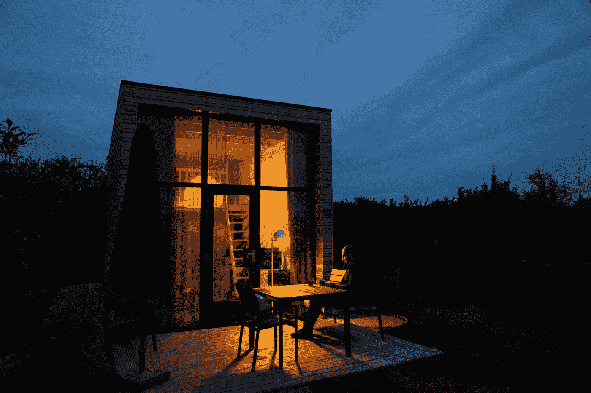
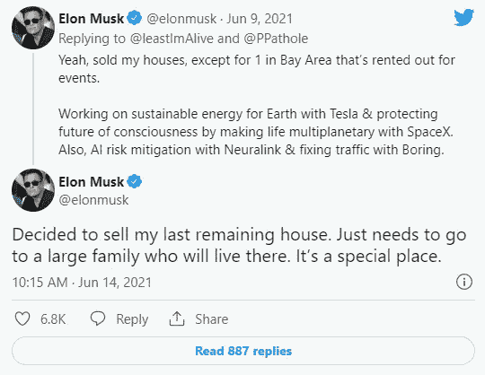

# 为什么亿万富翁埃隆·马斯克决定卖掉他所有的房子，搬进一个小小的预制屋

> 原文：<https://levelup.gitconnected.com/why-elon-musk-decided-to-sell-all-his-houses-in-the-us-and-moved-into-a-tiny-prefab-house-a5feb3728095>

## 这是一个精心策划的举动，下面是你可以从中学习到的东西

照片由 [Unsplash](https://unsplash.com/s/photos/tiny-house?utm_source=unsplash&utm_medium=referral&utm_content=creditCopyText) 上的 [Aysegul Yahsi](https://unsplash.com/@aysegulyahsi?utm_source=unsplash&utm_medium=referral&utm_content=creditCopyText) 拍摄

一个住在活动房屋里的技术巨头是不正常的。世界上最富有的人住在一栋价值 5 万美元的房子里，而这栋房子不到一天就建好了。

他做这样的决定是愚蠢的吗？众所周知，埃隆是世界上最聪明的人之一。那么，这里有什么问题呢？下面是一条表明出售他所有房子的推文。

图片来源:[推特](https://twitter.com/elonmusk/status/1404336639938154497)

湾区的房产出现在 Zillow 列表上。它的标价是 3750 万美元。事实上，他的意思是。他在 2017 年以大约 2300 万美元的价格买下了这处房产。

利润是他卖掉房子的原因之一吗？这是一个精心策划的举动，还是为了良好的公关和营销而夸大其词的想法？让我们找出答案。

埃隆·马斯克拥有的房子大多位于加州。当你想到加利福尼亚时，你会想到什么？

大多数情况下，如果你是一名居民，你首先想到的是与高税收捆绑在一起的高生活成本，更不用说不友好的法规了。

[富人不纳税](https://www.cnbc.com/2021/09/20/the-wealthy-may-avoid-163-billion-in-annual-taxes-how-they-do-it-.html)。我不是第一个这样说的人。他们找到合法逃税的聪明方法。例子包括:成立公司而不是有限责任公司，或者为自己设定最低工资以避免所得税。还有的根本不只是拿工资。

另一方面，中产阶级和穷人支付了大部分税收。甚至有一个专门的术语叫做穷人税。中产阶级和下层阶级在税收问题上做出最糟糕的决定。

> "今天，填写所得税表格比填写收入表格需要更多的脑力和精力。"阿尔弗雷德·纽曼

一位金融专家曾经说过，“知道如何合法避税比你赚了多少钱更重要。”本质上，追踪你的税收比你的收入更重要。

这些天几乎所有的东西都被征税。如果你没有纳税意识，你会发现你收入的 40%以上都要交税，这是不足为奇的。

在埃隆[的案例中，据商业内幕](https://www.businessinsider.com/elon-musk-paid-little-in-taxes-2014-2018-propublica-report-2021-6)。从 2014 年到 2018 年，他从 15.2 亿美元的应纳税收入中缴纳了 4.45 亿美元的税款。这是向国税局申报的数额。这使得他的税率为 3.27%。在同一时期，他的净资产增长了 145 亿美元。

大多数穷人和中产阶级个人最终要支付超过其总收入 10%的税率。

埃隆做的事情极其困难。他胜算不大。他反对他不完全理解的东西，太空。为他的课程节省每一美元是完全有意义的，即使这意味着合法地减少他的税收。

他支付的税款可以帮助他很大程度上推进他的课程。

出售他的财产会促使他合法减税。因此为他的新项目获得了更多的资金。

尽管是一种假设，处理掉他的财产的想法是终止他在加利福尼亚的居住。这将允许他成为德克萨斯州的居民，那里没有所得税。

埃隆目前居住的小预制屋位于德克萨斯州的 Starbase SpaceX 工厂。他声称自己是从 SpaceX 租赁的房产。

拆除他的房子将使得克萨斯州的小房子成为他的主要住所。因此，他将受益于得克萨斯州对各州友好的税收和法规。

仍然是一个假设，有一个传说，他即将收到数十亿美元的巨额奖金。无论是现金还是股票，如果他还是加州居民，他都将被征税。

住在德克萨斯州的好处是不用纳税。不管这些指控，他说即使搬到德克萨斯州，他也会继续在加州缴纳所得税。尽管这可能是短期的。

埃隆·马斯克是出了名的缺钱。当他决定卖掉他的房子时，疫情刚刚确定了价格。

合理的说法是，他想在房价暴跌之前卖掉他的房子。在一个仍然有人能设法买房子的时代。

他不想等到疫情结束，这样他就可以卖掉房子。

出售他的房子也将为他的个人运营注入流动资金，而不需要放弃他的投资。

这里的教训是聪明人缺乏现金。他们只带了很少的现金。他们大部分的钱都被投资了。当他们需要现金时，他们会找到聪明的方法来获得现金而不放弃他们的投资。

埃隆是一个喜欢爱护自己物品的人。

> “你做任何事情的方式就是你做所有事情的方式。”—玛莎·贝克

他的财产和宅邸令人分心。他想以自己喜欢的方式照顾他们。这意味着奉献他的时间和精神力量来照顾他的财产。

埃隆认为这是一个问题，他必须找到解决办法。对于一个有雄心壮志的人来说，没有什么比专注于工作更有意义了。占据头脑的其他一切都是噪音。

埃隆意识到了这一点，他愿意做出牺牲，即使这意味着卖掉他的豪宅。他只能走这么远。他的抱负和目标对他来说意味着一切。

现在过着简单的生活，他可以完全专注于他的抱负。这也适用于我们。我们应该消除生活中的干扰。我们生活的目标应该高于一切。

我们还应该愿意走多远就走多远。全力以赴，全力以赴。不牺牲，你要的就成了牺牲。

埃隆提到人们攻击他是因为他的财富。他的多栋昂贵的房子是攻击的媒介。他们没有必要。

没有他们他也可以。在接受乔·罗根的采访时，他表示出售自己房产的原因之一是向人们展示亿万富翁也可以过着简朴的生活。

他们不一定需要奢华的财产。没有它们，它们也能生存并茁壮成长。

如果这是一件麻烦的事情，而不是必须的，那就放弃它。要有逻辑，永远不要害怕脱离舒适。有逻辑可以让你避免做出错误的决定。

他的理由很多，不只是一个。一个住在小房子里过着简单生活的亿万富翁不会让很多人满意。

这个想法是非传统的。伊隆敢于追求它。这是他的专长。这使他有别于他的竞争对手。结果表明了这一点。

作为一个人，你不应该害怕走弯路。许多人遵循的宽阔道路不一定是正确的。