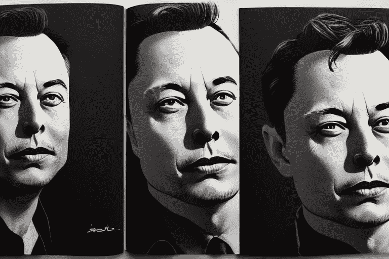

# 为什么埃隆·马斯克的双手测试非常有效

> 原文：<https://levelup.gitconnected.com/why-elon-musks-two-hand-test-for-hiring-is-very-effective-d4d366806319>

## 所有员工和受访者的学习机会

我们看到的大多是通过面试这种传统的用人方式。人们认为他们通过这种方式为公司获得了最好的人才。但是如果我告诉你常规的方法既费时又不确定呢？

你正在招聘的人可能非常适合这个职位，或者他们非常擅长面试。除了资格、教育和学位之外，一个人应该因为拥有该职位所需的知识和必要的能力而被录用。

雇用最好的候选人对公司的发展很重要。一次错误的聘用可能代价高昂，并给与招聘相关的员工带来额外的工作。

> 埃隆·马斯克发明了一种为公司挑选最佳人才的有效方法来解决这个问题。马斯克认为“技能比学位更重要”。

因此，很长一段时间以来，他一直在用这种方法从他的公司特斯拉和 SpaceX 招聘来自世界各地的最聪明的人才。

然而，他的招聘过程需要两只手:第一手经验和动手测试。

双手测试筛选申请人，不使用传统的途径，如学位。相反，它通过考察申请者的实践知识和实践经验来批准他们。任何组织都可以使用这种简单的程序来发现顶级人才，因为它是为了简单和有效而创建的，就像任何精心设计的流程或产品一样。

## 第一手经验

关于经验与教育有很多争议。尽管马斯克优先考虑体验，但他不想仅仅依赖体验。相反，马斯克认为体验是一种教育方法。换句话说，最好的教育。美国高校协会的一项研究无意中支持了马斯克的说法。

第一手经验是不言自明的——拥有与应聘职位相关的第一手专业知识的候选人通过了第一个挑战。

例如，在审查申请时，会考虑那些具有立即开始工作的相关经验或需要最低限度培训才能成功胜任该职位的人。

## 动手测试

第二个“手”测试是动手测试，这也是一个很好的方式来发现候选人的能力。虽然在这个过程中需要更多的准备和思考，但你肯定会对候选人在挑战性的情况下如何表现有更好的了解。

传统的招聘过程严重依赖于问答方式。与典型的招聘流程不同，动手测试包括实践测试。哈佛建议在面试开始前就提前测试候选人。

作为招聘人员，你可以在克服“双手测试”后，安排与候选人的传统面试。这个过程可能会节省你一些宝贵的时间。双手测试也将保证只有最优秀的申请人会被认真考虑一个职位。

# 如何实现双手技术

想在招聘中实施埃隆·马斯克的双手测试吗？

首先，你需要回顾一下你的招聘流程。招聘经理不应该过分关注大学学位和资历；相反，他们应该关注与该职位相关的技能和经验。

你的公司应该雇佣那些拥有必要技能和专业知识的人。别人应该会收到你公司的“感谢但不感谢”的信。

初试通过的考生，在面试前要联系实际考试细节。经过实践检验后，招聘经理很容易选出最佳候选人。

你必须记住，设置一个实际的测试是这项技术中最难的部分。为了确保你没有犯任何错误，你应该只考虑该职位所必需的关键技能。为实际测试创建一个真实的场景。它可以是创建一个商业战略，一个演示文稿，或一个小型项目。

# 双手技术如何更快地识别人才

传统的招聘过程有时会不公平。有些人在面试中表现得更好，而不是拥有所需的技能。此外，候选人可以谷歌一下面试的最佳答案，提前做好准备。

相反，双手技巧并不关心候选人回答所有问题的流利程度。测试只问，申请人是否有填补职位所需的深厚知识和经验？

有这么多有才华的人急切地等待着为领先的公司工作。如果你在招聘中运用这种双手技巧，你将拥有一些能够建立领先企业的优秀人才。

无论你在寻找什么样的职位，双手招聘程序都可以帮助你为你的公司找到并雇佣到合适的人。学位或资格并不总是决定谁有才华。你必须把他们放在一边，找到有信心、有必要技能适合你公司职位的人。

总而言之，我认为埃隆·马斯克关心的是为他的公司寻找和任命最佳人选。最合格的申请人有时是那些没有学位，但仍能在其专业领域表现出能力和经验的人。通过这样做，马斯克间接地向全世界数百万人传达了一个信息，即即使对于非毕业生来说，成功和有效也是可能的。

*别忘了在评论区分享你的观点。*

## 我的另一篇文章:[为什么 Github 把他们的公司卖给了微软，而不是亚马逊，谷歌，或者其他？](/why-did-github-sell-their-company-to-microsoft-instead-of-amazon-google-or-others-d217211dc7fd?source=your_stories_page-------------------------------------)