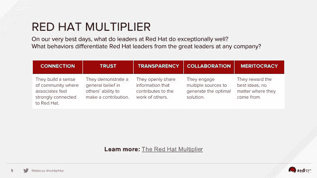

# 为什么工程文化是贵公司成功的首要因素

> 原文：<https://levelup.gitconnected.com/why-engineering-culture-is-the-number-one-factor-for-your-company-success-4c7a0d736a19>

当我开始面试初创行业的一个开发人员职位，后来成为团队领导时，我不明白为什么公司要谈论他们的工程文化。我心想，文化是如此模糊的东西。公司为什么需要价值观？我有自己的价值观。那么为什么我需要我的工作场所来和我谈论价值观呢？我应该如何评价未来工作场所的文化？

如果你曾经问过自己上述问题之一，这篇文章绝对适合你。如果你打算建立自己的公司或者在任何公司做人事经理，这篇文章是必读的。如果你正在寻找一份新工作，你可能会发现有见地的想法。

# 什么是文化？

在我开始解释为什么工程文化如此重要之前，了解一下社会中的文化是什么会有所帮助。

> **“文化**是一个总称，它包括在[人类](https://en.wikipedia.org/wiki/Human) [社会](https://en.wikipedia.org/wiki/Society)中发现的[社会行为](https://en.wikipedia.org/wiki/Social_behavior)[规范](https://en.wikipedia.org/wiki/Norm_(social))，以及这些群体中个体的[知识](https://en.wikipedia.org/wiki/Knowledge)[信仰](https://en.wikipedia.org/wiki/Belief)[艺术](https://en.wikipedia.org/wiki/Art)[法律](https://en.wikipedia.org/wiki/Law)[习俗](https://en.wikipedia.org/wiki/Social_norm)[习惯](https://en.wikipedia.org/wiki/Habit)(维基百科)

简而言之，文化是定义一个群体的一系列共同活动。因此，任何加入一个团体的人都会接受这种文化。

比如，每一项运动都有一种文化。足球迷有独特的文化。穿着燕尾服坐在巴塞罗那球迷的论坛上喝茶，同时期待人们窃窃私语，这将是很奇怪的。另一方面，穿着短裤、紧身 t 恤和鼓参加国际象棋比赛会很奇怪。不用说，你应该小声说话。

在这两种情况下，群体的文化是无可争议的，着装规范和参与者的行为是众所周知的。任何参加这些活动的人都知道对他们的期望。

> 文化源于组织的价值观，而价值观指导我们做出更好的决策，文化创造工作环境。

组织价值观和文化的重要性已经在许多书中有所涉及。个人推荐阅读[《经久不衰》](https://www.amazon.com/Built-Last-Successful-Visionary-Essentials/dp/0060516402)。

# 什么是工程文化？

从某种意义上来说，它与社会的文化没有太大的不同。工程文化是一套共同的信念和价值观，这些信念和价值观将会影响组织中的人们围绕软件开发做出决策或行动的方式**。**

以下是一些通常讨论的关于工程文化的话题:

*   你采用“无质量保证”政策吗
*   你的开发周期是怎样的
*   每个过程都应该首先自动化吗
*   你如何管理你的代码版本
*   你有多重视构建这种规模的系统
*   开发者是如何得到提升的
*   工程决策是如何做出的
*   什么是工程管理风格
*   是开放文化还是等级文化
*   你如何计划和优先处理你的任务
*   你使用敏捷、Scrum 还是看板。
*   围绕编码质量存在什么样的惯例
*   还有更多。

正如你从上面的例子中看到的，一个好的工程文化可以影响许多方面。但是上面例子的共同主题是做出正确决策的指导和清晰。

> 当一种文化被实施时，这个群体的 DNA 就建立了。这意味着组织已经就一系列共同的信念达成一致，这些信念将所有人结合在一起。任何加入组织的人都会接受这种文化，而不需要持续的自上而下的参与。**良好的文化能够在最底层做出好的决策**。即使不了解公司价值观。

重要的一点是，组织文化和工程文化是交织在一起的。我相信，如果工程组织拥有与所有其他组织完全不同的文化，那一定是出了问题。大多数文化价值观应该在组织的所有部门之间共享。

良好文化的好处是巨大的。我将用一个例子来说明其中的一些。

以客户为中心在很多公司都很重要，尤其是 B2C 公司。现在，想象一个只有两家公司的世界。这两家公司在工程组织方面都缺乏以客户为中心的理念。因此,“第一公司”的首席执行官发了一份备忘录，表示下一季度需要关注“以客户为中心”。此外，他还成立了一个由高层管理人员组成的小型工作组，以克服以客户为中心的问题。过了一会儿，工作组提出了一系列建议。主要的是应该获得更高优先级的重要客户请求列表。

在《公司二》中，这位首席执行官宣称，以客户为中心现在是公司的核心价值。他详细解释了为什么这个价值对公司的业务很重要。首席执行官要求公司的所有经理与团队讨论以客户为中心，并提出一个计划。工程组织分析了客户抱怨最多的领域，并决定关注质量和可靠性。工程师们开始寻找更好的监控和警报工具和方法。一位工程师决定推动更好、更有效的代码审查，并在一些松散的渠道和邮件列表上发布了他的建议。其他工程师喜欢这些建议，并开始采纳它们。另一位工程师建议采用“[零 bug 策略](https://sookocheff.com/post/process/zero-bug-policy/)”数据科学小组开发了一个模型，可以预测客户何时会对“公司二”的服务感到不满。公司的 QA 自动化工程师决定开始给予可用性问题更高的优先权。结果，任何可用性问题开始变得更加严重。人力资源和工程经理得出结论，在面试过程中加入反映面向服务或以客户为中心的候选人的问题会很好。

两家公司都决定应对以客户为中心的挑战。“第一公司”由一小群人提供了一个短期解决方案。不幸的是，从我的经验来看，很可能在两个季度后，该公司仍将遭受以客户为中心的问题。

“公司二”的首席执行官采取了不同的方法。他承认以客户为中心不是一次性的问题。他明白，没有以客户为中心，公司就不会成功。他还认识到“以客户为中心”是一个宽泛的术语，让工程师自由分析并提出解决方案是明智的。这是组织文化的另一个核心价值。结合这两个核心价值产生了各种非常有力的建议和行动，这创造了确保高质量软件的工程文化。

> *重要提示*工程文化不是从管理开始的，但是如果没有管理的意识和支持，工程文化很难茁壮成长

## 其他已知优势

工程文化浓厚的公司员工满意度高于平均水平。表现为相对较低的员工流失率和较高的员工保留率和敬业度。员工和经理很好地理解了对他们的期望以及他们所评估的能力。这些公司也报告了**更高的交货率。**员工觉得事情正在被做。除此之外，拥有强大工程技术的公司往往会产生更多的创新——最终，以上所有这些都归结为建立一个强大的公司品牌和满意的客户。

我希望现在我已经让你相信了文化的重要性。

# 工程文化反模式

*   **从其他公司复制工程文化**

一个公司可以从另一个公司获得灵感，但是从另一个公司复制文化很可能会失败，因为工程文化来自人、行业和当地传统。因此，B2B 公司的文化大多与 B2C 公司不同。我还有更多要说的，但这会让这篇文章太长。

*   **工程团队之间的多元文化**

如果你有太多的亚文化，那就是缺乏共同价值观的征兆

*   **工程文化不断变化**

在某个时间点，工程文化应该变得稳定。如果每次一个新的副总裁到来，文化都会改变，这可能表明所采纳的价值观是不真实的。

*   **价值观由管理层实施**

经理们肯定应该推动或参与工程文化价值观。但是，如果所有的价值观都是由管理层自上而下定义的，那么所有的要点都错过了。记住，价值应该被发现，而不是被强制。人们需要相信这些价值观。

# 良好工程文化的例子

许多公司因其强大的文化而闻名。所以我会试着看一下其中的一些。

# 网飞:

(Unsplash)

## 公司文化:

真正的价值——如果一家公司决定奖励或解雇谁，那么一组价值就是真实的。我就不细说这种文化了，因为网飞已经做得很好了。

> 我们的核心理念是以人为本。更具体地说，我们有优秀的员工作为梦之队一起工作。通过这种方式，我们成为了一个更加灵活、有趣、激励、创新、协作和成功的组织。

## 工程文化:

网飞工程文化聚焦于**自由和责任**。网飞雇佣资深和强大的开发人员，他们可以被信任并独立工作。[工程师被期望从编写代码到操作和文档端到端地管理微服务。](https://link.medium.com/t0XxyzDCLgb)团队是**完全自主的**，他们被期望做出自己的决定，并对他们自己的代码负责，从开始到部署到运营。像许多其他强大的文化公司一样，自主和信任是游戏的名字。没有对特定编程语言的要求。没有 SRE 或国家和地区奥委会团队监控服务。每个团队都对他们所拥有的服务的有效性和可靠性负责。

团队结构和方法也不一致。例如，每个团队决定是使用 Scrum 还是看板，并管理任务和需求。

为了实现上述目标，网飞“聪明地招聘、发展和裁员，让明星出现在每个位置”，这意味着网飞不会羞于解雇不适合的人。这也解释了为什么网飞倾向于不招聘毕业生或实习职位。他们不介意付出更多来拥有最好的团队，这样会产生更高的价值。

网飞不希望金钱成为你对公司不满的理由。这就是为什么网飞支付市场上最高的薪水，并鼓励工程师去其他公司面试，以确保他们获得高薪。

网飞是一家非常数据驱动的决策公司。从网飞的技术博客中可以清楚地看到，所有的工程师都对此非常介意。每一个特征，无论是内部的还是外部的，都是通过一套测量方法开发出来的。数据平台在整个组织中被民主化，开发人员被鼓励做出贡献。

黑客日在网飞是一件大事。这是一个纯粹的创新日。在这一天，所有的公司聚集在一起，任何人都可以创造他们想要的东西。生产和技术人员聚集在一起，提出各种各样的想法。我个人非常喜欢的一个想法是一个叫做[的新功能“我在哪里？!"](https://www.youtube.com/watch?v=6_GZMYl52K8)

来源:[1][https://www.slideshare.net/reed2001/culture-1798664](https://www.slideshare.net/reed2001/culture-1798664)【2】[https://jobs.netflix.com/culture](https://jobs.netflix.com/culture)

[https://www.quora.com/How-is-Netflixs-engineering-culture](https://www.quora.com/How-is-Netflixs-engineering-culture)

# ***红帽:**

每个员工都会得到一顶红色软呢帽(红帽的 LinkedIn)

**公司文化——“开源之道”**

红帽公司成立于九十年代。从一开始，该公司就受到 Linux 和 Unix 通过完全透明和社区共享的工作方式的启发。这是之前互联网时代之前，GitHub 和 Git。那时全球共享并不明显，也不容易。在这种氛围下，Red Hat 成立了，从一开始，对社区的贡献和合作对公司来说就很重要。

**Red Hat 是工程文化和原则影响公司文化的一个例子。**

公司价值观:自由、责任、勇气、承诺

> 没有任何一个价值观像所有价值观一样重要。没有责任的自由是混乱的。没有承诺的勇气是没有目标的。没有自由的承诺毫无意义。没有勇气的责任是没有灵感的。

红帽子是许多开源项目的重要贡献者。所有红帽产品都是在 GitHub 上发布的开源(“上游第一”)。公司的透明度如此之高，以至于连人员团队和开放文化都在一个[公共 GitHub repo](https://github.com/red-hat-people-team) 中管理。

**红帽乘数**

红帽价值观也转化为每个红帽人都应该具备的能力:联系、信任、透明、协作、包容性精英管理。这些能力，也称为红帽乘数，是红帽价值观的翻译。使用红帽乘数，每个红帽人都知道自己需要遵循或改进的行为是什么。

**备忘录列表**

备忘录列表是所有公司订阅的邮件分发，对每个人开放供张贴。肯定不是正规的分发名单。你会发现几乎每个话题都有活跃的讨论。可以是在管理层公告后开始的讨论，一些同事会表达他们的不同意见，首席执行官会做出答复。在某些情况下，公司决策是在备忘录列表中做出的。例如，正如 Red Hat 前首席执行官吉姆·怀特赫斯特所描述的，公司的使命宣言是在备忘录列表[中经过长时间讨论后选定的。](https://www.nytimes.com/2012/03/11/business/jim-whitehurst-of-red-hat-on-merits-of-an-open-culture.html)

**我们是红帽周**

整整一周，世界各地的红帽子网站都在庆祝

**上游第一**

红帽工程不拥有私人 GitHub 回购。所有代码都在 GitHub 上。事实上，红帽公司被鼓励首先将代码推送到上游，然后贡献给其他开源社区(T2)。

**精英管理**

红帽工程公司的精英制度非常强大。精英管理意味着最好的想法会胜出，倾听每个人的声音很重要。在一些罕见的情况下，决策仅由管理层做出，但它伴随着许多解释和讨论。一个很好的例子是决定[支持 centos stream 而不是 centos](https://www.zdnet.com/article/why-red-hat-dumped-centos-for-centos-stream/) ，这在备忘录列表中引起了非常热烈的讨论。

*完全披露:在写这篇文章的时候，我决定转移到 Red Hat。

来源:[1][https://www.redhat.com/en/about/brand/standards/culture](https://www.redhat.com/en/about/brand/standards/culture)

## 摘要

我试图分享我学到的关于工程文化重要性的大部分东西。如果你在一家拥有独特文化的公司工作，我会很高兴听到它。欢迎在评论中分享。