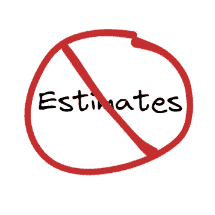
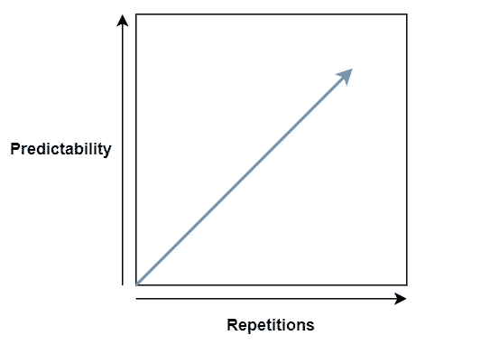
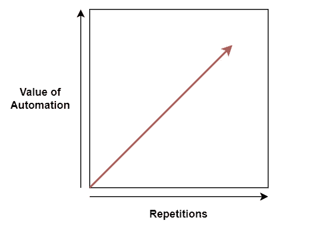
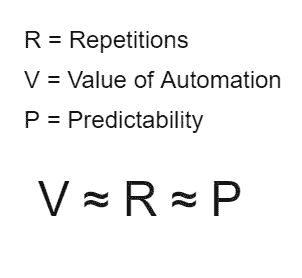

# 为什么评估是浪费

> 原文：<https://levelup.gitconnected.com/why-estimates-are-waste-742282550c77>

软件开发是不可预测的，但是人们每周都浪费数小时去猜测任务需要多长时间。

没有估计

评估可以为未来的变化提供信心，但是这不适用于软件开发，因为:

*   如果你能预测工作，那么你应该自动化它，而不是重复它。
*   如果你不能预测工作，那么尝试这样做是浪费时间。

# 自动化代替了精确的评估

重复增加了可预测性。如果你从未做过，就不可能准确估计一项任务需要多长时间。换句话说，你重复一项任务越多，它就变得越容易预测。

可预测性≈重复

**重复的工作应该自动化。**在软件开发中，重用库、框架和 API 的能力意味着可重复的工作可以自动化。你重复的次数越多，代码重用和自动化所节省的精力就越多。

自动化的价值≈重复

**准确的估计与徒劳的努力相关。随着重复次数的增加，自动化的价值和可预测性都会提高。因此…**

V ≈ R ≈ P

# 不准确的估计是有害的

如果评估的目的是计划未来，那么不准确的评估只会导致问题。估算工作的时间和精力成本使这一问题变得更加复杂。

我们应该找到替代方案，而不是花费时间和精力去评估无法预测或应该自动化的工作。最敏捷的方法之一是不做评估。

# 无评估工作

没有评估的工作对于好的软件开发是至关重要的，并且与持续交付密切相关。不需要估计的最简单的工作流程是:

1.  确定最有价值的任务。
2.  去完成那个任务。
3.  重复一遍。

考虑花费在评估工作上的时间及其提供的价值是很重要的。这个最小的过程对你来说可能太严格了，但是下次你评估你的工作时，考虑它提供的价值。

跟进文章:[没有估计的截止日期](https://medium.com/p/4292101c024f)

如果你想进一步讨论这个问题，请通过**Twitter**[@ BenTorvo](https://twitter.com/BenTorvo)或**电子邮件**[ben@torvo.com.au](http://torvo.com.au/)联系我