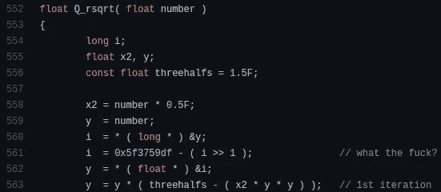

# 为什么每个开发人员都应该学习数据结构和算法

> 原文：<https://levelup.gitconnected.com/why-every-developer-should-learn-data-structures-and-algorithms-bf5cc7d9089f>

## 数据结构和算法不是程序员的必修课，而是更好的程序员的必修课。

由[奥拉夫·阿伦斯·罗特内](https://unsplash.com/@olav_ahrens?utm_source=unsplash&utm_medium=referral&utm_content=creditCopyText)在 [Unsplash](https://unsplash.com/s/photos/solving?utm_source=unsplash&utm_medium=referral&utm_content=creditCopyText) 上拍摄的照片

编程并不总是一项简单的任务；程序员经常会遇到他们需要解决的问题。事实上，在一个特定的软件系统中，可以有多种方法来实现一个给定的特性。一些实现可能会为硬件产生 CPU 密集型的长时间运行的进程。同时，一些实现具有高效和快速的过程。编程并不总是用库函数或框架 API 来实现给定的软件规范。如果你的下一个大项目是框架或软件库呢？毫无疑问，我们经常要用计算机科学基础来解决软件工程问题。

在计算机科学中，数据结构是虚拟排列的结构元素，可用于在计算机内存中存储或修改数据。众所周知的例子有数组、链表、栈、树和队列。另一方面，计算机算法指的是解决问题的一系列步骤。排序算法、图遍历算法和搜索算法是众所周知的算法类型。

当我从事软件项目时，我通常尝试使用高效的数据结构和算法(也称为 DSA)。我一直很欣赏我的大学教学大纲，因为我在开始企业级编码之前就学习了数据结构和算法。我发现，如果我们作为程序员掌握数据结构和算法知识，我们可以获得以下好处。

# DSA 帮助您找到高效的解决方案

解决软件工程问题确实有多种方法。但是我们总是需要选择最有效和最实用的解决方案来避免将来可能发生的不良性能问题。不幸的是，一个低效的解决方案可能在一开始看起来很友好。随后，由于低效解决方案的堆积，整个软件系统可能会运行缓慢。

有人可能会说，低效的解决方案仍然表现良好，因为我们现在拥有强大的硬件，所以高效的解决方案也是如此。但是，计算能力仍然有限。我们还没有无限内存和每秒无限时钟周期的处理器。此外，用户输入对性能也有很大的影响。例如，您的`O(1)`解决方案和`O(n)`解决方案对于您的测试用例可能表现相同，但是对于一些用户输入可能表现不佳。

DSA 概念总是激励我们选择正确的数据结构和有效的算法。这确实是一种减轻软件项目性能中未来风险的好方法。

# DSA 激励你写干净和优化的代码

优化代码指的是一组在时间和空间度量上表现良好的计算机指令。换句话说，优化的代码将有效地使用 CPU 和物理内存。优化的代码显然是硬件友好的。例如，在雷神之锤 III 竞技场的游戏引擎中检查以下显著的反平方根实现。

雷神之锤 III 竞技场中的快速反平方根函数，作者截图

上面的代码片段是一个被广泛接受的快速平方根倒数计算的有效解决方案。我们的实现应该是优化的，也是可读的。使用不正确数据结构的源代码变得复杂。例如，如果开发人员使用数组解决问题，即使堆栈是最合适的数据结构，解决方案也可能会重新发明轮子，因为不需要的数据处理逻辑会使重要的逻辑变得复杂。

同样，正确的数据结构用法会使你的代码更整洁。另一方面，优化的代码可以创建高效的解决方案。

# DSA 帮助你轻松通过顶级技术面试

数十亿用户使用大型科技公司的产品。此外，这些公司创新了供内部使用的框架和库。由于这两个关键原因，在这些公司工作的程序员必须协作编写高效(和可读性好)的代码。编写高效可靠的代码需要数据结构和算法知识。因此，大型科技公司通常会测试候选人的数据结构和算法技能，而不是要求他们实施软件规范。

有时候，数据结构和算法可能很难理解；不是每个开发人员都能熟练实现复杂的算法。所以大的科技公司很早就把这种情况作为优势来筛选优秀的候选人。他们总是要求候选人解决图论、递归、组合学、排序和动态规划问题。同样，学习数据结构和算法会迅速增加你通过下一次顶级技术面试的可能性。

# DSA 将引导你成为一名计算机科学家

开发人员选择软件工程职业有两个主要原因。一些开发人员选择编程是因为它打开了通往高薪工作的大门。同时，一些开发人员做编程是因为他们的爱好是编程。由于第二个原因，我选择了编程职业。构建软件是有趣的，当社区欣赏你所构建的东西时，言语无法解释那种快乐。创新新事物和基于实验构建软件需要计算机科学基础的流利知识。

计算机科学家是深入研究计算机科学理论并实施实际应用的人。计算机科学家通过使用计算机科学领域的核心概念，在现实世界中发明出令人印象深刻的东西。例如，作为一名计算机科学家，蒂姆·伯纳斯·李发明了万维网。毫无疑问，数据结构和算法主题确实是计算机科学最重要的基础。所以，如果有人的目标是将来成为计算机科学家，学习数据结构和算法是必修的。

# 结论

许多初学者和有经验的开发人员经常避免学习数据结构和算法。原因是他们可能认为那些概念在他们的职业生涯中没有用。他们可能将编程定义为为给定的业务规范编写代码。不，不是的。编程是指设计和开发计算机程序的过程。设计阶段包括为现有的工程问题选择最优和有效的解决方案。设计阶段和开发阶段一样重要，因为它是特定计算机程序的基础。

想象一下社交网络是如何存储朋友和共同朋友的详细信息的。您认为它们会在幕后生成大量耗时的 SQL 查询吗？或者他们使用图论相关的实现？用高效的解决方案解决现实世界的工程问题需要数据结构和算法知识。投入时间学习数据结构和算法。成为更好的程序员，做出更好的解决方案。

# 分级编码

感谢您成为我们社区的一员！[订阅我们的 YouTube 频道](https://www.youtube.com/channel/UC3v9kBR_ab4UHXXdknz8Fbg?sub_confirmation=1)或者加入 [**Skilled.dev 编码面试课程**](https://skilled.dev/) 。

 [## 编写面试问题+获得开发工作

### 掌握编码面试的过程

技术开发](https://skilled.dev)