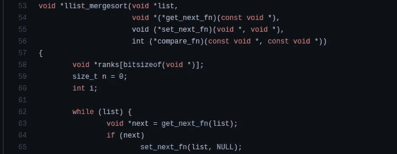
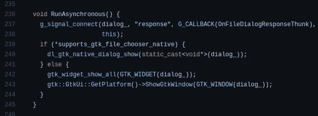

# 为什么每个程序员都应该在职业生涯中学习 C++

> 原文：<https://levelup.gitconnected.com/why-every-programmer-should-learn-c-during-their-careers-959e1bc2ea68>

## 掌握 C++不是一件容易的事情，但是一旦你做到了——你将会得到无价的好处

由[马克斯韦尔·尼尔森](https://unsplash.com/@maxcodes?utm_source=unsplash&utm_medium=referral&utm_content=creditCopyText)在 [Unsplash](https://unsplash.com/s/photos/c%2B%2B?utm_source=unsplash&utm_medium=referral&utm_content=creditCopyText) 上拍摄，由 Canva 编辑

程序员在其编程生涯中通常会使用多种编程语言。然而，我们看到一些程序员一直使用单一的编程语言。例如，我们经常会遇到有几十年经验的 Java 专家和 C#专家。但是，学习多种语言会让你在软件开发生涯中更加自信和熟练。例如，如果你掌握了 Go 语言，你就会理解几个令人印象深刻的语言设计概念，从而提高你的泛型编程技能。

学习 Python 也有好处，因为我们可以使用我们的 Python 知识高效地编写任何自动化脚本。学习一门新的编程语言无疑会给我们带来独特的体验和新的技术专长。与其他流行的编程语言相比，C++语言给我们带来了很多好处。学习 C++确实不容易——不像其他现代语言，它需要时间。所以，现在大部分程序员都跳过学习 C++而钟情于提供更抽象的开发者环境的现代语言。

我将解释为什么学习 C++是所有努力成为编程专家的程序员的必修课。

# C++激励你学习计算机科学基础

在每一个技术上合理的软件程序背后，我们可以找到几个核心的计算机科学理论。例如，Git 程序使用图论、散列和许多基本的计算机科学算法。例如，参见 [Git 代码库](https://github.com/git/git)中的以下合并排序实现:

[Git](https://github.com/git/git/blob/master/mergesort.c) 中的归并排序实现，作者截图

如今，每个商业实体通常都转向云计算生态系统，并努力实现业务流程的自动化。因此，现在大多数程序员通过解决业务问题来进行编程，而不是解决与计算机科学相关的问题。

但是，即使他们从事面向业务的软件开发项目，他们也经常不得不应用计算机科学理论来编写更好的代码并使他们的软件高效。因此，理论计算机科学技能对于每个程序员来说都是必不可少的。

毫无疑问，C++是一种高级语言，提供了比 C 更高的人性化抽象。但是，C++鼓励使用指针和手动内存管理——就像 C 一样，这是技术上合理的概念。此外，C++标准库的设计关注的是计算机科学概念、性能和灵活性，而不是仅仅关注开发的容易程度。所以你在学习 C++的时候，会无意中学习到计算机科学基础。

# 用 C++构建轻量级、高性能和简单的解决方案

大多数现代编程语言专注于用类似伪代码的语法隐藏底层技术细节，而没有仔细考虑性能、轻量级和灵活性。但是，C++仍然产生轻量级的二进制文件，并且是编写性能优先的软件系统的最佳选择。

Golang 等现代趋势编程语言通过提供类似 C 的最小语法和自动内存管理(通过垃圾收集)来与 C++竞争。但是，Go 产生了[大型二进制文件](https://github.com/golang/go/issues/6853)，所以它不适合我们需要轻量级的用例。这就是为什么大多数程序员使用 Go 来构建高性能的云工具，因为二进制文件的大小对于云环境来说不是问题。对于高性能和轻量级的软件开发，程序员仍然更喜欢 C++而不是 Go。

Go 通常静态链接标准库实现，并在我们导入`fmt`时将最小 1.2 兆字节的 Go 二进制文件增加到 1.8 兆字节。当我们包含`iostream`时，C++通常动态链接并增加 16.5 千字节大小的最小二进制到 17.3 千字节。在 GNU/Linux 平台上，Go 二进制大小增加了 50%，C++二进制大小增加了不到 5%。

以上简单的实验证明，C++更适合高性能、轻量级的软件开发。C++是一种复杂的全负载语言，但是您可以选择偏好的特性，并且仍然可以编写最少的代码。下面的故事将帮助你练习用任何编程语言编写最少的代码:

 [## 帮助你写出更好代码的 5 条编程原则

### 用这些编程原则编写更好的代码，给编译器和你的队友留下深刻印象

levelup.gitconnected.com](/5-programming-principles-that-help-you-to-write-better-code-5d96197725cc) 

# 利用 C++技能更快地学习其他编程语言

程序员根据自己的喜好学习各种编程语言。一些程序员在开始从事企业级软件开发项目时，会学习编程语言。同时，一些程序员倾向于将学习编程语言作为一种爱好。有些语言很容易掌握，有些需要不断的实验来获得进一步的经验。

由于复杂的语言语法(C++有 60 个关键字)、通用的标准库、面向硬件的开发环境以及鲜为人知的最佳实践，C++需要更多的时间来获得专业的工作经验。C++是一种多范例和多功能的编程语言。换句话说，你可以为用 C++写代码制定你自己的编程风格和最佳实践。

学习 C++标准库和开发模式需要扎实的计算机科学知识和技术技能。因此，当你擅长 C++的时候，学习一门新的语言是小菜一碟。

# 使用操作系统 API 的最佳语言

每个操作系统都为开发人员提供了一个可编程的接口，用于操作系统级的操作，如进程管理、文件处理、GUI 渲染和网络请求处理(通过套接字)。所有这些 API 都公开了基于 C/C++的接口，因为每个操作系统都是用 C/C++编写的。

GNU/Linux 系统提供了类似 Unix 的 API 和 GTK GUI 库作为 C 头文件。Windows 通过众所周知的 Win32 API 函数提供了 C 可编程接口。macOS 还提供了 Objective-C 接口，我们可以使用 Apple Clang LLVM 编译器。因此，我们可以用 C++直接访问任何操作系统级 API，因为 C++是 C 的超集，Apple 编译器允许开发人员混合 C++和 Objective-C。例如，参见 Electron 如何使用 C++源文件中的 GTK C 头文件:

文件选择器对话框源代码在[电子](https://github.com/electron/electron/blob/e28bde99476e640142396a36c1c562d377214509/shell/browser/ui/file_dialog_gtk.cc#L236)，截图由作者提供

另一方面，所有其他编程语言都需要特定于语言的绑定来访问操作系统 API。由于这个原因，几乎所有的操作系统级框架都是用 C++编写的。看看下面这些基于 C++的框架:

*   电子
*   反应自然
*   摆动
*   中立者

此外，像 Chromium、Firefox、Tensorflow、LLVM 和 V8 这样的大型软件项目使用 C++作为主要的开发语言。

# C++知识有助于您做出更好的技术决策

程序员不仅根据规范编写代码，他们还设计软件系统和组织项目结构。设计阶段在软件开发中非常重要，因为它是整个软件系统的基础。我们经常需要在设计阶段和开发阶段做出技术决策。

C++是一种复杂的语言——你有许多方法来解决同一个编程问题。此外，C++的设计速度很快，但它通过提供完全的自由来控制程序的执行，使程序员可以根据自己的意愿优化代码。因此，您需要谨慎地做出技术决策，根据您的偏好为您的需求选择最佳的 C++特性。

C++是一种多范例语言，尽管每个人都知道它是一种基于面向对象的语言。一些程序员在 C++中使用传统的 OOP 范例。同时，一些程序员在 C++中使用过程和函数编程范例。有时，我们经常不得不避免使用一些 C++特性，以使我们的源代码不那么复杂。例如，Google C++风格指南建议[不要使用](https://google.github.io/styleguide/cppguide.html#Exceptions) C++异常。所有这些场景都提高了我们的技术决策能力。

# 结论

我们已经通过这个故事讨论了在你的编程生涯中学习 C++的好处。有二十多种稳定的、功能齐全的、流行的编程语言。没有被称为“最佳编程语言”的编程语言——每种编程语言都在特定领域表现出色。因此，学习你喜欢的五种精心挑选的编程语言并把它们称为“我最好的编程语言”是一个明智的决定。

如果你仔细选择五种编程语言，考虑到每一个方面——毫无疑问，C/C++也会在你的清单上。我在下面的故事中解释了我最喜欢的编程语言列表:

 [## 每个开发人员都应该学习的 5 种编程语言

### 你可能只使用一种语言，但是学习所有这些语言会带来更多的好处

levelup.gitconnected.com](/5-programming-languages-that-every-developer-should-learn-dcdfaa986a7) 

学习 C++而不学习 C，就像学习 React.js 应用程序开发而不尝试普通的 JavaScript 和 DOM 一样——所以，先学习 C，然后更熟悉 C++以掌握你的编程生涯的所有上述额外好处。

感谢阅读。

# 分级编码

感谢您成为我们社区的一员！升级正在改变技术招聘。 [**在最好的公司**找到你最完美的工作](https://jobs.levelup.dev/talent/welcome?referral=true) **。**

 [## 升级—转变技术招聘

### 升级—转变技术招聘🔥使软件工程师能够找到完美的角色…

作业. levelup.dev](https://jobs.levelup.dev/talent/welcome?referral=true)