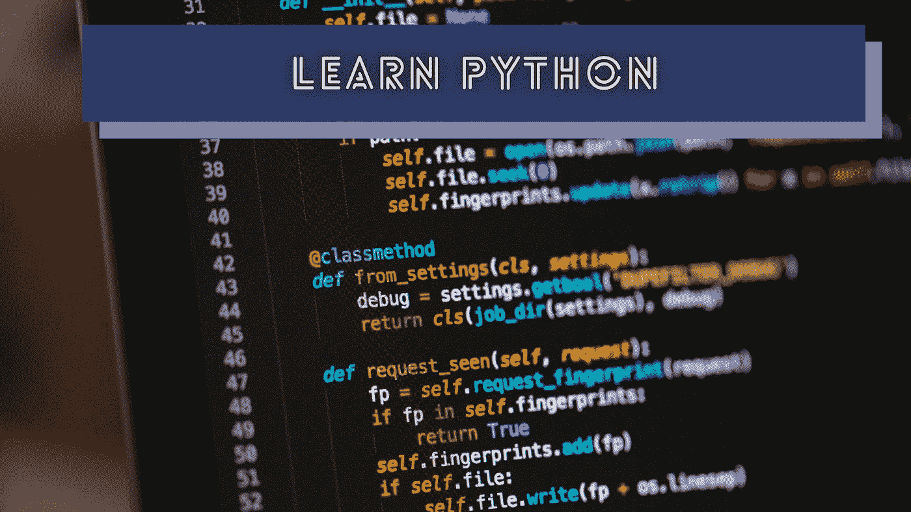
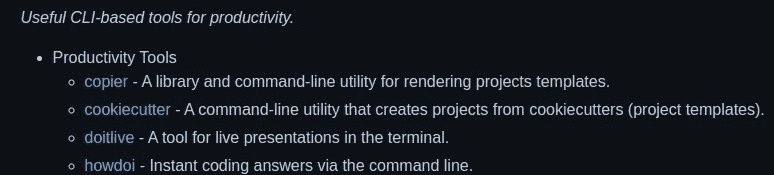

# 为什么每个程序员都应该在职业生涯中学习 Python

> 原文：<https://levelup.gitconnected.com/why-every-programmer-should-learn-python-in-their-careers-52d8d216c80>

## 在漫长的编程生涯中，学习 Python 会给你带来很多好处



克里斯里德在 [Unsplash](https://unsplash.com/collections/9285134/code-%2F-programming?utm_source=unsplash&utm_medium=referral&utm_content=creditCopyText) 上的照片，由 Canva 编辑

程序员从事各种使用不同编程语言的软件开发项目。使用大型企业系统的程序员通常使用 Java、C#和 JavaScript 等语言。如今，现代软件开发团队倾向于使用简单但高效的语言(如 Go)来开发企业级应用服务。

Python 最初是作为 ABC 编程语言的继承者而出现的。根据基于 LaTeX 的早期 Python [文档](https://github.com/python/cpython/blob/d9bf55d0d05fdadc96382c4e3c9c55630a2ef435/Doc/tut/tut.tex#L47) (1991)，Python 的目标是通过填补 C 和传统 Shell 脚本语言之间的空白，为脚本提供更好的编程语言。问题是您不能在 Bash 中本地访问基于 C 的操作系统 API。另一方面，用 C 写 Shell 脚本确实比 Bash 更费时。

Python 之所以成为最流行的语言之一，是因为它简单的语法、全功能的标准库、丰富的开源库生态系统和先进的框架。像类型提示和令人印象深刻的开源库/框架这样的新特性使 Python 适合企业应用。

学习 Python 会给你带来类似于 C/C++、JavaScript 和 [Go](/5-lessons-that-golang-teaches-to-all-programmers-71b332504cf2) 的显著收益。让我们来讨论一下为什么 Python 对每个人都如此重要。

# DevOps 的好选择，比如 Bash

在 GUI 操作系统时代之前，计算机用户必须通过 CLI 与操作系统交互。操作系统提供了几个预安装的 CLI 程序，用于管理文件、配置和各种操作系统级任务。自动化始于类似 Bash 的 shell 解释器，它提供了一种用基于文件的命令序列运行 CLI 程序的方法。

如今，DevOps moment 促使开发人员使用自动化脚本来自动化每个耗时的手动任务。Bash 对于 DevOps 来说很棒，但是在某些场景中它有几个缺点。例如，结构化数据(如 JSON、XML)处理需要 Bash 中的第三方工具。另外，用 Bash 调用操作系统级 API 是不可能的。

Python 提供了一个灵活的数据处理友好环境和最小的子进程 API，用于高效地编写任何 DevOps 脚本。Python 众所周知的缓慢不会影响自动化质量，因为性能不是 DevOps 工作流中的关键因素。看看在 Python 中获取当前 Git 提交有多容易:

```
import subprocessdef get_latest_commit():
    return subprocess.getoutput('git rev-parse HEAD').strip()
```

下面的故事通过将 Python 与 Bash 和 JavaScript 进行比较，解释了为什么 Python 更适合自动化:

[](https://betterprogramming.pub/bash-vs-python-vs-javascript-which-is-better-for-automation-92a277ef49e) [## Bash vs. Python vs. JavaScript:自动化哪个更好？

### 比较 Bash、Python 和基于 JavaScript 的 Shell 脚本的优缺点

better 编程. pub](https://betterprogramming.pub/bash-vs-python-vs-javascript-which-is-better-for-automation-92a277ef49e) 

# 面试中伪代码更实用的替代方法

现代科技公司会进行一系列面试来寻找顶尖的工程候选人。这些面试通常包括技术、人力资源和管理面试。在技术面试中，面试官经常会要求应聘者为各种算法挑战写伪代码。伪代码很好，但是有一个小问题。伪代码通常没有标准的语法，所以候选人往往倾向于从他们喜欢的语言中借用一些语法。

结果就是考生针对一个技术问题写出各种伪代码。如果我们有一个标准的伪代码语法呢？写 Python 代码无疑比写传统伪代码更有生产力。几乎所有的现场开发面试通常都是测试候选人的分析能力——而不是他们知道多少特定编程语言中的花哨语法，所以在技术面试中使用 Python 可以节省每个人的时间。

请看下面这个简单明了的代码片段，它从用户输入的完整人名中构造了短名:

```
def get_short_name(full_name):
    names = full_name.split(' ')
    short_name = ''
    for i in range(len(names)):
        if i < len(names) - 1:
            short_name += names[i][0] + '. '
        else:
            short_name += names[i]return short_name;print(get_short_name(input()))
```

在技术访谈中编写 Python 代码会产生一个语法正确、易于理解的伪代码替代方案。然而，在算法面试问题中使用更多的 python 短语法并不是一个好主意，因为 python 捷径会降低你的算法解决方案的价值(例如，使用列表理解而不是传统的循环语句)。

# 用 Python 编写实用程序和工具

铁杆程序员喜欢在空闲时间为社区和其他开发人员创建各种有用的工具。此外，一些软件开发团队编写实用程序脚本和工具作为子项目来支持他们的主项目。这些工具包括 CLI 程序、自动化脚本、小型 GUI 软件、后台服务和用于各种日常任务的基于 web 的应用程序。

Python 确实是一种很好的快速原型语言，这要归功于它的简单性。此外，您可以使用 Python 及其标准库更快地构建生产就绪的程序。除此之外，你还可以从 [Python 包索引](https://en.wikipedia.org/wiki/Python_Package_Index) (PyPI)中获得无数免费的开源库。大多数基于 GNU/Linux 和 Unix 的操作系统都预装了 Python 发行版，您不需要额外的设置。

因此，Python 是构建可移植实用程序和工具的好选择。大多数编程语言的标准库没有为每个操作系统级操作提供跨平台 API，我们经常不得不使用第三方库。但是，Python 通过其标准库提供了许多开发人员友好的跨平台 API，并支持实用程序开发。查看以下使用 Python 开发的有用的 CLI 生产力工具:



用 Python 开发的 CLI 程序(来自 [awesome-python](https://github.com/vinta/awesome-python#command-line-tools) )，作者截图

# Python 可以在计算机、服务器、手机、微控制器和浏览器上工作！

程序员最初在个人电脑上使用 Python 来满足各种通用脚本需求，比如自动化。后来程序员开始用 Python 写 GUI apps 和 web apps，多亏了 Tkinter，PyGTK，TurboGears，Flask 等。现在，Python 程序员可以使用 [Kivy](https://github.com/kivy/kivy) 框架，用一个 Python 代码库构建原生移动应用。Kivy 让你在 Android 和 iOS 平台上使用基于 Python 的特定于平台的 API 调用机制构建基于 T4 SDL T5 的图形用户界面。因此，您可以使用 Python 构建跨平台的移动应用程序 GUI，并动态调用特定于平台的 API。

新的 WebAssembly 概念提供了一种在浏览器上安全运行用其他编程语言编写的代码的方法。例如，多亏了 [Emscripten](https://github.com/emscripten-core/emscripten) 编译器，现在你可以在浏览器上运行 C 程序。如果我们用 Emscripten 编译 Python 实现源代码会怎么样？

[Pyodide](https://github.com/pyodide/pyodide) 项目是 [CPython](https://github.com/python/cpython) (官方 Python 源代码)到 Emscripten 的一个端口。它允许你通过 WebAssembly 在浏览器上运行 Python 代码和包。如你所见，Python 现在无处不在，就像 Java 和 JavaScript 一样。学习 Python 为新的学习机会和职业机会打开了大门。我在下面的故事中解释了 Python 的这些用例:

[](/5-python-use-cases-that-only-a-few-programmers-know-35e25ddf13d4) [## 只有少数程序员知道的 5 个 Python 用例

### Python 不仅仅用于数据科学和 web 后端——你可以做更多的事情。

levelup.gitconnected.com](/5-python-use-cases-that-only-a-few-programmers-know-35e25ddf13d4) 

# 一种简单、简洁但功能齐全的流行语言，你可以永远使用

Python 为数据处理提供了非常灵活的语法，因此有许多基于 Python 的科学计算和数据科学相关的库。Python 的列表处理、字符串操作和其他数据结构让每个人都很有效率。Python 总是试图通过简化复杂的事情，用标准库提供更高的抽象。例如，看看在 GNU/Linux 上调用共享库过程有多容易:

```
import ctypeslib = ctypes.cdll.LoadLibrary('libc.so.6')
print(lib.getpid()) # Shows the Python process's pid
```

Python 简单且易于入门，但它并不缺少构建任何现代应用程序的关键特性。Python 的简单性促使程序员编写清晰的自解释代码库，并为复杂的软件工程问题设计简单的解决方案。根据维基百科的说法，谷歌、Meta 和类似雅虎的科技巨头在他们的代码库中使用 Python。

Python 是一门三十年的稳定语言，你可以长期使用。还有，确实是一门你可以推荐别人学习和构建的好语言。

# 结论

总的来说，Python 是一种很好的编程语言，但是它有两个众所周知的问题:速度慢和高于平均水平的内存消耗。这些问题不是 Python 语言设计问题，而是 Python 参考实现中的问题，即 CPython。有人说 Python 慢，就是指 CPython 慢。然而，CPython 最初是作为通用脚本执行环境开发的，所以它不支持类似 JIT 的高级优化。

因此，如果我们需要一种更快的方式来执行 Python 代码，我们需要考虑一些 [JIT](https://en.wikipedia.org/wiki/Just-in-time_compilation) 驱动的替代 Python 实现，比如 [PyPy](https://github.com/mozillazg/pypy) 。但是，大多数 Python 程序员使用官方的 Python 解释器并优化他们的 Python 源代码，而不是使用第三方的 Python 代码运行器。

正如我们所讨论的，学习 Python 会给你带来很多好处。如果你适应了 Python 的编码风格，你也会一直努力用其他语言编写干净的源代码。让我们掌握 Python，让复杂的系统在创纪录的时间内变得简单！

感谢阅读。

# 分级编码

感谢您成为我们社区的一员！升级正在改变技术招聘。 [**在最好的公司**找到你的完美工作](https://jobs.levelup.dev/talent/welcome?referral=true) **。**

[](https://jobs.levelup.dev/talent/welcome?referral=true) [## 升级—转变技术招聘

### 升级—转变技术招聘🔥使软件工程师能够找到完美的角色…

作业. levelup.dev](https://jobs.levelup.dev/talent/welcome?referral=true)