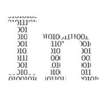

# 为什么每个软件工程师都需要考虑道德问题

> 原文：<https://levelup.gitconnected.com/why-every-software-engineer-needs-to-think-about-ethics-58d1fb5c2b01>

## 因为否则他们的软件可能会做坏事

不是所有的软件工程师都是天使。

 在  2018 年，[谷歌从其官方行为准则中移除了](https://gizmodo.com/google-removes-nearly-all-mentions-of-dont-be-evil-from-1826153393)标志性的口头禅“勿作恶”。它从 2000 年就在那里了。

公平地说，这句口头禅确实出现在文件的最底部，随后是呼吁如果有什么不对劲就说出来。然而，从《行为准则》原本的位置上删除这句咒语，表明了大型科技的整体趋势。

因此，毫不奇怪，谷歌在 2020 年因驱逐人工智能伦理学家蒂姆尼特·格布鲁而面临公众的蔑视和愤怒。大公司道德团队的问题在于，当道德学家看到事情朝着错误的方向发展时，他们总是有可能做好自己的工作并站出来说话。

然而，这并不是对大型科技及其偶尔(或持续——由你决定)对更大利益的损害的咆哮。

道德行为不应该由一些内部道德团队承担，也不应该依赖于那些往往不了解技术可行性细节的立法者。

从小型自由开发者到大型科技公司，道德应该也必须成为每家公司文化的一部分。从初级开发人员到首席执行官，每个工程师都应该把道德放在后面或前面。

这并不意味着道德是个人的责任。肯定是集体的。

但是，每个开发人员都会从不时反思自己的行为中受益。这对他们的职业、薪水或公司可能有帮助，也可能没有。但是当他们照镜子的时候会有帮助。

我不是牧师，但我知道大多数软件工程师都有某种规则手册——就像大多数牧师都有圣经、古兰经或其他参考书一样。在美国，最大的软件工程师协会,[国家专业工程师协会](https://www.nspe.org/resources/ethics/code-ethics) (NSPE)和[计算机械协会/电气和电子工程师协会计算协会](https://ethics.acm.org/code-of-ethics/software-engineering-code/) (ACM/IEEE-CS)都有职业道德准则。

这些并不意味着完整的规则手册或详尽的行为清单。就像在《圣经》或《古兰经》中一样，道德建议可以有无数种不同的解释。这取决于每个工程师的判断和诚信，以正确的方式行事。

伦理学，来自希腊语词根ἦθος(发音为 ethos)，是对如何最好地生活的研究。这并不意味着“试着每天早上 4 点起床，锻炼身体，喝点绿色果汁，努力工作直到你赚了几百万。”

与今天高度个人主义的指导方针相反，从古希腊到印度的学者们一直在寻找服务于更大利益的指导方针。因为当大多数人服务于更大的利益时，每个人总体上都有更好的生活。毕竟，我们生活在一个社会中。

矛盾的是，这种思路现在可能比以往任何时候都更重要。

直接或间接地，伦理与软件有着密切的关系。两者相互作用，都以人类为中心。

一些读者可能会说，桌子、椅子和室内植物也会与人类互动。的确如此——但是与椅子不同，软件非常容易扩展和重新发布。

首先需要生产一把椅子，这涉及到材料加工、组装和物流。如果市场需要更多的椅子，可能需要几个月的劳动力来满足需求。与软件相比，椅子的供应总是有限的。

从伦理上讲，这是好事。如果你买了一把有问题的椅子，当它摔成碎片时，你可能会生气，你会伤到你的屁股。然而，这种椅子不太可能对世界经济造成严重破坏，因为这种椅子可能只有几万或几十万把。如果你投诉，公司可能会给你退款。

把这个比作软件。一个完美的公司软件中最微小的错误都可能导致黑客的诱惑。

因此，你不会抱怨屁股疼。由于[大数据泄露](https://www.upguard.com/blog/biggest-data-breaches)，你的整个生活可能会天翻地覆。你的信用评分可能会暴跌。有人可能会盗用你的身份。

你不是唯一一个有危险的人。任何一个有电话和互联网连接的人都可以使用软件——在我写这篇文章的时候，T2 有 50 亿人。

当然，这并不意味着软件本身就是危险的。但是潜在损害的广度和规模应该唤醒每一个软件工程师。

创造软件的人有责任避免不好的结果，并鼓励好的结果。如果你在为极权国家研发无人驾驶飞机或监控软件，我不会对你评头论足。但是我鼓励你对自己诚实，问问自己这是不是你真正想要的职业。

如果你是一名系统管理员，并且你在存储敏感客户数据的数据库中拖延安装新的软件更新，我不会批评你。你可能在难以置信的压力下交付其他成果，或者你可能只是试图在有毒的工作环境中生存。

此外，工程师不应该只是试图避免伤害他们正在建造的产品。让抖音推荐算法[更加令人上瘾](https://www.psypost.org/2022/05/new-study-identifies-the-most-definitive-signs-of-tiktok-addiction-63071#:~:text=The%20social%20media%20platform%20TikTok,pathological%20dependence%20on%20the%20platform.)不会颠覆人们的生活。但这对用户和他们周围的人也没有好处，他们可能渴望与他们的同伴进行一些面对面的互动。

相反，工程师应该制造有益的产品。

自乌克兰战争开始以来，我一直在与志愿者一起工作，创造一个电报机器人，以帮助人们找到安全的空间并逃离这个国家。虽然它并不完美，也不以盈利为目的，但我认为这个产品对大众有益。

然而，让我陷入道德困境的是，我一直非常渴望为一场基本上发生在我家附近的战争建立解决方案(我住在法国)，但我却不太想为马里或阿富汗等其他冲突地区建立一些东西。部分原因是我不太了解这些国家，他们的文化，以及他们使用软件的习惯。

然而，这些并非不可克服的挑战。虽然我不认为自己的全职职业是为非营利组织工作，但能够兼职做这件事是一种很好的感觉，在道德上也是出于本能。

其他优秀软件的例子有医疗设备，如手术机器人或 X 射线图像处理，或帮助人们减少碳足迹或塑料垃圾产生量的应用程序。还有更多。

这不是成为某种救世主，只做好事。

如果部署正确，黑仔无人机可能会拯救生命。监控软件，正确使用，可能会防止恐怖袭击。

这完全取决于上下文。以及每个工程师的道德指南针。

有时候，我们会觉得自己生活在一个越来越不道德的时代，在这个时代，个人的成功比公共利益的行为更受重视。然而，事实上几乎每个公司——包括大型科技公司！—在其行为准则中包含一些鼓励去做正确的事情是一种希望。

快乐编码，相信你的直觉。

*成为* [*中等会员*](https://arijoury.medium.com/membership) *对我的内容进行完全访问。*