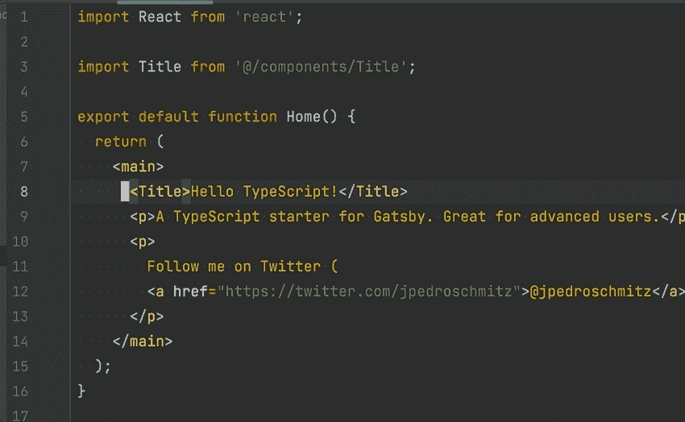
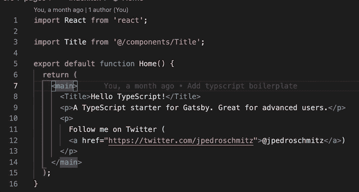
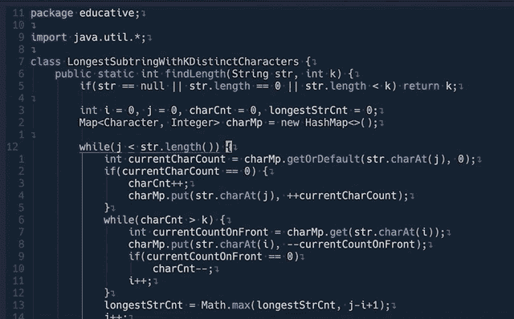
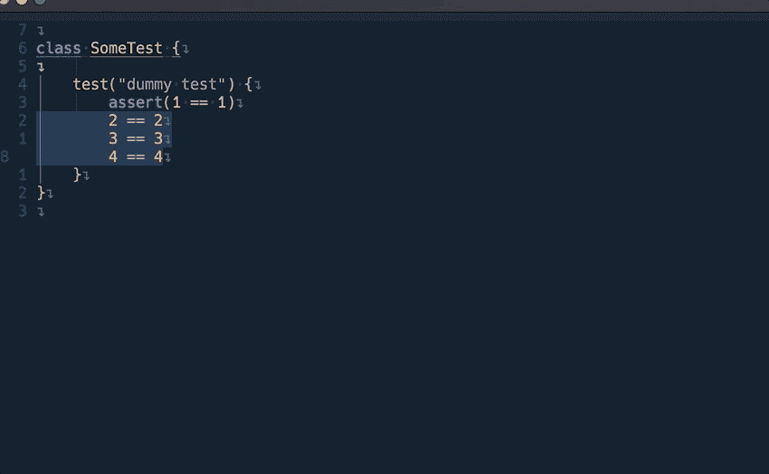

# 为什么每个软件工程师都应该使用 vim

> 原文：<https://levelup.gitconnected.com/why-every-software-engineer-should-use-vim-b9fb97e69d97>

## 克服“退出 vim”的恐惧，尝试一下

乍一看，这似乎有些言过其实，你可能会愤怒或大笑，这取决于你是哪种人，一个来自互联网的 vim 爱好者说每个软件工程师都应该使用 vim。但是我希望你能有五分钟的时间来听听我的理由，然后在此基础上做出你的决定。

我就不拐弯抹角了，直接切入正题:

1.  Vim 有自己的语言。如果你掌握了 vim，你可以在任何文本编辑器甚至浏览器中使用它(是的，你没听错！).
2.  你成长总是学习的心态。
3.  你真的会很快！
4.  很好玩。

T2:我有一种自己的语言。如果你掌握了 vim，你可以在任何文本编辑器中使用它
许多人有一种误解，如果你使用 vim，你必须在没有智能感知、调试器或任何 21 世纪功能的终端中使用 1980 年代的 UI/UX，你必须进行大量的定制。完全是神话。你可以在 [Intellij](https://plugins.jetbrains.com/plugin/164-ideavim) 、 [vscode](https://marketplace.visualstudio.com/items?itemName=vscodevim.vim) 、 [sublime](https://github.com/NeoVintageous/NeoVintageous) 以及几乎所有的 IDE 中使用 vim 作为插件，使用最新最棒的 IDE 特性，无需定制。

Intellij 和 vscode 中的 vim 演示

那么你从中获得了什么呢？现在您拥有了一套编辑技能，可以在任何编辑器中使用，甚至可以在远程 linux 服务器中使用(因为几乎所有的 linux 服务器都有 vim！).否则，您将不得不学习在每个编辑器中处理文件的提示和技巧，或者根据您的喜好配置所有内容。当你必须在服务器中编辑时，那里没有 intellij 或 vscode！

如果你真的对此感到兴奋(就像它已经变得！)您可以使用 vim 键绑定在[终端](https://github.com/christoomey/vim-tmux-navigator)和[浏览器](https://chrome.google.com/webstore/detail/vimium/dbepggeogbaibhgnhhndojpepiihcmeb?hl=en)中移动。所以对我个人来说，如果学习一件事在很多方面对我有帮助，那就是我的胜利。

YY**欧从小就有学习的心态**

学习 vim 是一个永无止境的过程。首先你学习基础知识，然后你突然发现有一种更快捷的方法。你会惊讶于有这么多令人敬畏的插件，以及你可以用 vim 做的有趣的事情。让我给你举几个例子来引起你的兴趣。

当您使用 vim 时，您遵循的是更好、更快地编辑代码、文本或降价的理念。你总是在学习新的技巧，总是在进化，最棒的是你几乎可以在任何地方使用这项技能。这是软件工程师持续发展的最重要的技能。这也适用于在任何领域做好事，对吗？

Y **欧会真的快！**

我想大多数人都听说过无鼠生活。我觉得有点偏激。在许多地方你仍然需要鼠标。但是在编辑文件的情况下，你会发现只使用键盘比键盘+鼠标组合要快得多。

> 键盘和鼠标之间的上下文切换会分散你对代码的注意力。

当您使用 vim 时，您不需要将手从键盘移到鼠标，反之亦然。它的方式更快，一旦你习惯了，你不会去想它。你只管去做。它带来了极大的满足感，你周围的人会看着你，就像你是某个编码布道者一样。

V **im 就是好玩！**

最后，如果您能够克服最初的恐惧，并对尝试持开放态度，那么使用 vim 进行编码和编辑绝对是一种享受。最后，人们说你使用 vim 比使用鼠标快，并不意味着你每天通过使用 vim 节省了 1 个小时。我认为没有人对此有一个基准。

> 如果你每天通过使用 vim 节省了五分钟，这值得吗？你浪费更多的时间只是坐在那里，什么都不想。但是我会告诉你为什么它值得一试，vim 帮助你建立总是学习的心态，你总是在寻找更好的做事方法，并且有一种巨大的满足感随之而来，你可以在几乎所有你能想象的编辑器中使用相同的技能和键绑定，在你的堂兄弟 mac 上，直接在服务器上快速测试开发环境中的问题，在任何终端上，如果你使用 tmux，甚至在该死的浏览器中导航！！！

在所有这些喋喋不休之后，我希望我已经说服你给 vim 一个尝试。如果没有，那也没关系。因为我相信每个人都应该做和尝试他们觉得有趣和有用的事情，而不是因为网上有人这么说。也请关注我，因为我计划写下一篇如何和 vim 一起摇滚！这是我下一篇[文章](https://medium.com/gitconnected/beginner-guide-to-started-with-vim-without-blowing-your-head-off-30313088a9f3)的[链接](https://medium.com/gitconnected/beginner-guide-to-started-with-vim-without-blowing-your-head-off-30313088a9f3)。