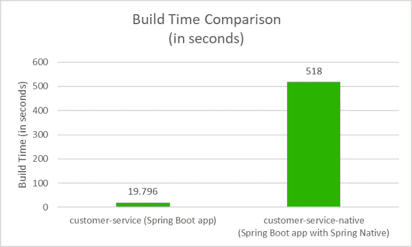

# 为什么有经验的开发人员仍然使用 JIT 和 JVM

> 原文：<https://levelup.gitconnected.com/why-experienced-developers-still-use-jit-and-jvm-706a2ba091bf>

## 为什么即使我们有 AOT，JIT 仍然是相关的，并且使你的构建更好的 3 个原因

照片由来自[佩克斯](https://www.pexels.com/photo/woman-in-orange-long-sleeve-shirt-standing-beside-woman-in-black-long-sleeve-shirt-5439487/?utm_content=attributionCopyText&utm_medium=referral&utm_source=pexels)的[马体·米罗什尼琴科](https://www.pexels.com/@tima-miroshnichenko?utm_content=attributionCopyText&utm_medium=referral&utm_source=pexels)拍摄

*JVM 能在云环境中生存吗？JIT 还有用吗？使用 AOT 时，我们可以改进哪些工具？如何降低 JIT 中的内存占用？*

一些开发人员发现 JVM 是一个额外的层。因为 JVM 是用来解释字节码的，而不是在容器中运行的。今天，我们有了其他编译成本地代码(Go)的选择。

让我们看看为什么 JIT 和 JVM 即使在今天的云环境中也会保持相关性。

# 为什么 JIT 编译的代码仍然有用？

大多数人会认为用 JVM 发布字节码和解释是一种浪费。

您将增加内存占用，因为您需要 JDK。此外，您在容器顶部添加了一个额外的层。如果部署本机代码，可以避免额外的一层。所有这些都让人们认为字节码没有用。

***原生编译器在内存占用上胜出。*** 但在此期间，他们缺乏吞吐量。

***尽管 AOT 编译的二进制代码在启动时速度更快，但在运行时它还是比不上 JITted 代码。***

为了解决这个问题，本机编译器增加了配置文件导向优化( [PGO](https://docs.oracle.com/en/graalvm/enterprise/20/docs/reference-manual/native-image/PGO/) )。即便如此，PGO 也适用于企业 GraalVM 用户。

***短命 app——AOT。长寿— JIT。***

对于短命的应用程序，启动是很重要的。如果你使用 AOT，编译将是唯一的瓶颈，但是启动会更快。对于其他人来说，最好依赖于只有 JIT 编译才有的运行时配置文件。

***长寿 app 崩溃怎么办？我们还能从 JIT 中得到优化吗？***

缓存 JIT 编译的代码是一个问题。JIT 编译的代码基于运行时变量进行优化/去优化。也就是说不可能缓存。

***相反，我们可以缓存概要分析数据。*** 那是来自 JIT 编译的分析。如果前提条件没有变化，这可以重复使用。一个选择是[jvamup](https://github.com/alibaba/dragonwell8/wiki/Alibaba-Dragonwell8-User-Guide?spm=a2c41.12911801.0.0.57544839B5EtTB#jwarmup)，这个解决方案将会包含在未来的 JDK 版本中。

***难道 AOT 不会在每个 CI 上要求大量的资源吗？***

*   *AOT——适用于小型应用程序，以及那些规模不会增长的应用程序*
*   *JIT——更适合发展解决方案*

随着 AOT 提前编译每条路径，这可能会耗尽资源。JIT 编译不会预先编译所有的路径。

我们来看一些现实生活中的例子。

*“比如我看到一个用 Go 做的开源项目。对于单一架构来说，构建时间很快。即便如此，他们还是为每个架构/平台组合构建了 30 次。因此，虽然 Go 编译速度很快，但一次潜在的代码更改就占用了大量 Azure/Github 资源。”* — [来源](https://www.reddit.com/r/java/comments/wbtz24/comment/iidiyau/?utm_source=share&utm_medium=web2x&context=3)

同样的事情也会发生在 NodeJS 身上。

*“Node 的 CI 非常愚蠢，因为它生成了大约 50 多个 docker 映像，每个微服务一个。换了一个 LoC 又推？每个构建都提供了一个 temp Ubuntu 实例来构建 Docker 映像。并且每个构建从头开始下载每个依赖项！”*——[来源](https://www.reddit.com/r/java/comments/wbtz24/comment/iigj9ny/?utm_source=share&utm_medium=web2x&context=3)

构建时间很重要，因为 CI 可以触发很多构建时间。

构建时间会阻塞 CI。用 AOT 编译一遍又一遍地做构建，最终会产生大笔的云提供商账单。

对于 Java 编译的工件，您可以在 env 变量中指向所需的工件。不需要全部重建(并重启 JVM ),只需更改 classpath env 变量。

# 我们今天能为 AOT 做些什么？

从 Java 9 开始，您可以使用 AOT 编译。更多关于提前编译的信息可以在 [JEP-295](https://openjdk.org/jeps/295) 中找到。

因此，随着 AOT 在 Java 中的出现，许多构建系统可以通过使用这个特性得到改进。

春天本地人就是一个例子。

GraalVM 编译器用于编译 Spring 原生项目。通过这种编译，您将获得更快启动的好处。

[来源](https://betterprogramming.pub/how-to-integrate-spring-native-into-spring-boot-microservices-add2ece541b8)

即便如此，使用 AOT 编译时，构建时间会更长。这是本机编译所需要的。

***但是春原生和倒影还是有问题。***Spring 团队为这些问题创造了一个术语:[原生提示](https://docs.spring.io/spring-native/docs/current/reference/htmlsingle/#native-hints)

对于反射需求，仍然需要配置。详细配置请访问[本机提示](https://docs.spring.io/spring-native/docs/current/reference/htmlsingle/#native-hints)。

所以如果 AOT 在这里，我们能让一切都本土化吗？ *原生编译会减少启动次数和内存占用。*

一种流行的构建系统是用 Java 编写的。它以 JIT 编译代码的形式发布。

*建造系统是* [*巴泽尔*](https://bazel.build/) *。*

一个人试图改变这一切。他试图 ***做出一个本土版的巴泽尔。***

旅程如下:
[GraalVM 原生映像问题# 7884 bazelbuild/bazel GitHub](https://github.com/bazelbuild/bazel/issues/7884)

我们可以用 Spring Native 构建本地可执行文件。 这里是[关于如何将可执行 JAR 转换成本机的文档](https://docs.spring.io/spring-native/docs/current/reference/htmlsingle/#executable-jar-to-native)。即便如此，这也不是这里的问题，因为我们正在尝试从*到* [*制作一个原生的 Bazel 版本*](https://github.com/bazelbuild/bazel/issues/7884#issuecomment-547687174) *。*

他遇到了反思的问题。因为一些类需要反射，所以需要配置[大部分](https://github.com/bazelbuild/bazel/issues/7884#issuecomment-478361453)。如果需要反射，一些类[会被自动解析](https://www.graalvm.org/22.1/reference-manual/native-image/Reflection/#automatic-detection)，但是仍然有一些不属于这个类别。

*   *JIT —反射是免费的*
*   *AOT——反思是有代价的*

所以问题出在这个原生二进制文件的原生类库的初始化上。初始化类需要手动初始化。这一切都发生在 AOT 编译期间的虚拟机中。

根据一个故事，Micronaut 有办法解决反射问题。对于 GraalVM 编译器，需要提前指定具有反射需求的类。

***今天我们能和巴泽尔做些什么？*** 我们可以把 JVM 二进制变成原生二进制: [Bazel 规则把 JVM 二进制变成原生二进制](https://github.com/andyscott/rules_graal)。它是[经常更新的](https://github.com/andyscott/rules_graal/commits/master)，所以如果你需要原生二进制，值得一试。尽管如此，还是有必要将反思包含在项目本身中。

*即使 Bazel Native 很远，我们也可以用 rules_graal 来编译原生二进制。*

# 当前的 Java 工具如何应对内存占用？

我们已经看到了本机编译如何提高吞吐量。所以即使这样也不再是问题了。这指的是 GraalVM 的概要引导优化。

也由于航运整体，JDK JIT 编译未能与 AOT 竞争。所以如果你真的需要压缩你当前的 JIT 代码，你会怎么做？

一种方法是使用 jdeps 和 jlink。

这里有一个真实的例子。Joe 使用这些工具创建了一个定制的 JRE。这样做，他削减了大量脂肪或 250 兆脂肪。

巴泽尔还对 Java 有依赖性。这意味着它与 JDK 一起发货。

作为一个 RFC，这里有[关于内存占用改进的文档](https://docs.google.com/document/d/1Igmv-2GfXkoVFWTXvBYPeniQom8nLAwzqzridDlBIS4/edit)。另外，你可以在 GitHub 上查看[实际里程碑。](https://github.com/bazelbuild/bazel/milestone/13?closed=1)

即便如此，这只使用了 Java 9 模块和其他专有特性(Proguard)来减少 Bazel 二进制文件的大小。做这些步骤削减了一个不坏的 56 兆字节的 JDK 大小。和大约 20 个额外的 MiB。

***因此，当启动 Bazel*** `***version***` ***时，我们获得的速度是之前“胖”Bazel 二进制的两倍。***

***当然，还是有一些内存占用，因为需要 JDK/JRE。***

[莱登项目](https://mail.openjdk.org/pipermail/leyden-dev/2022-June/thread.html#42)将尝试修复内存足迹。

结合 jdeps、jlink 和 AppCDS 应该会产生更好的内存占用。查看 [AppCDS 如何在 Spring Boot 应用上工作。](https://medium.com/@toparvion/appcds-for-spring-boot-applications-first-contact-6216db6a4194)

AppCDS 背后的主要思想是为类使用一个共享的归档。这个档案将存储“不可变的”类，并在必要时从档案中加载它们。这样，每次后续运行的内存消耗都会变小。当然，你的里程数可能会有所不同，但仍然，它看起来很有希望。

今天，由于莱登仍在发展中，我们只能遵循*“jdeps 和 jlink”*的方法。此外，我们可以检查 Bazel 团队用他们的 JDK 做了什么。这两种途径都应该导致更好的内存占用。

# 继续阅读相关文章:

认为 JVM 在当今时代没有必要的开发人员: [Java 和 C#在 Docker 时代已经过时|作者 Erik eng heim | Star Gazers | Medium](https://medium.com/star-gazers/java-and-c-is-obsolete-in-the-age-of-docker-39fb0d28f8b6)

 [## 面向云的 Java，以及面向 Java 的云

### 下载这篇文章的 PDF 文档。许多组织选择在云中运行现有的 Java 应用程序——并且…

blogs.oracle.com](https://blogs.oracle.com/javamagazine/post/java-cloud-services) 

# 分级编码

感谢您成为我们社区的一员！在你离开之前:

*   👏为故事鼓掌，跟着作者走👉
*   📰查看[升级编码出版物](https://levelup.gitconnected.com/?utm_source=pub&utm_medium=post)中的更多内容
*   🔔关注我们:[Twitter](https://twitter.com/gitconnected)|[LinkedIn](https://www.linkedin.com/company/gitconnected)|[时事通讯](https://newsletter.levelup.dev)

🚀👉 [**加入升级人才集体，找到一份惊艳的工作**](https://jobs.levelup.dev/talent/welcome?referral=true)