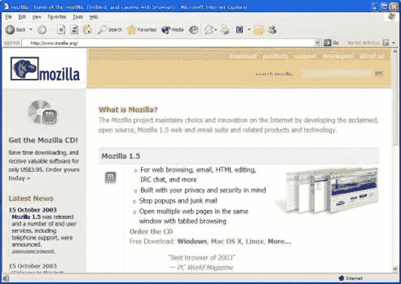
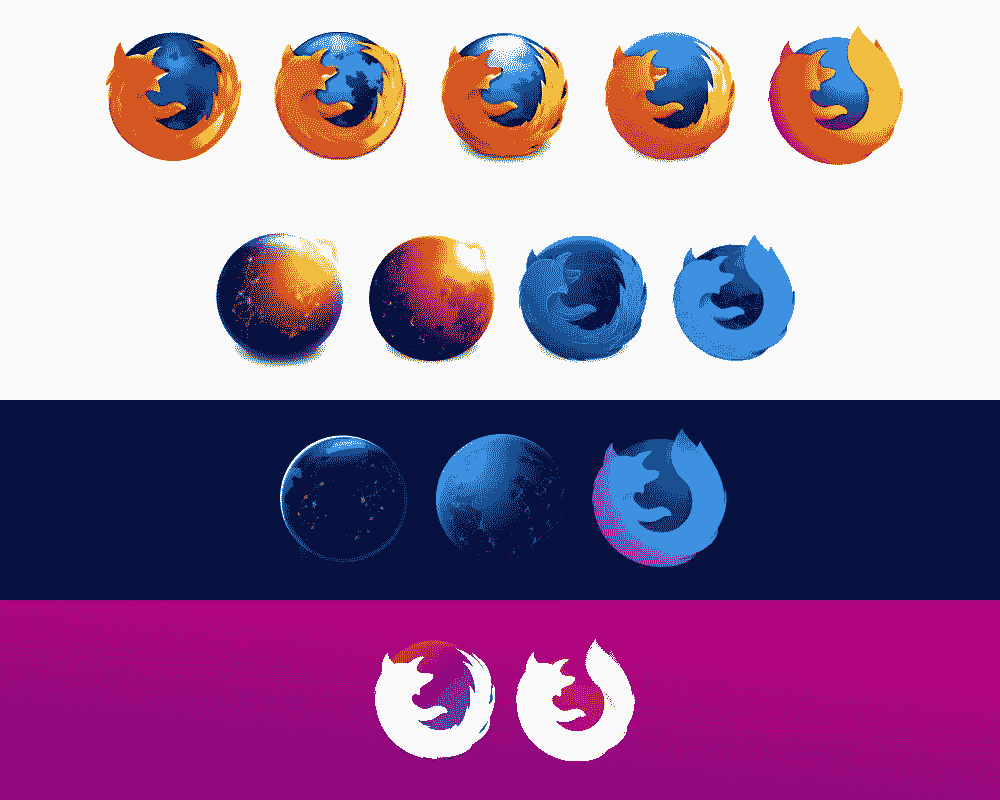
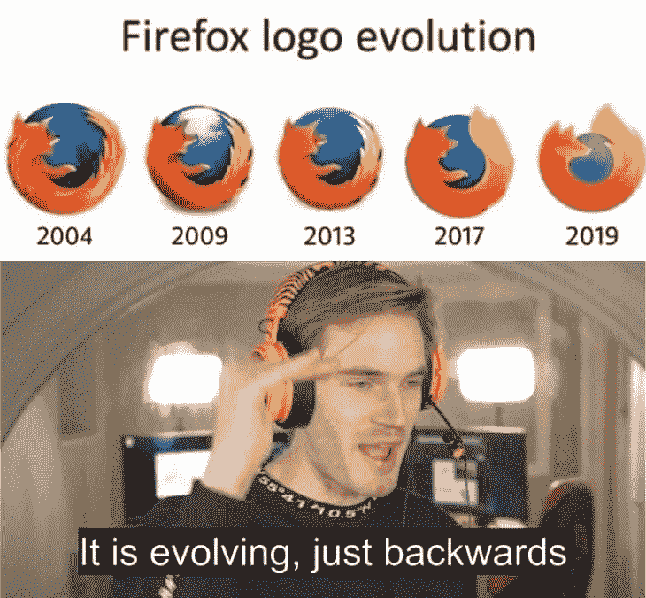
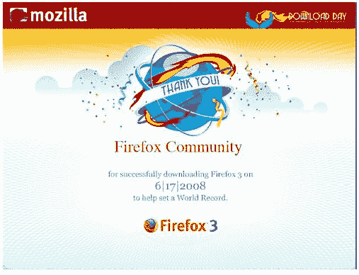
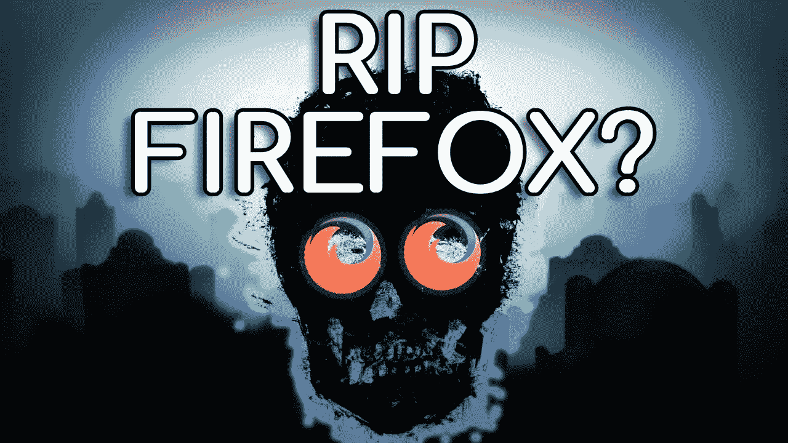
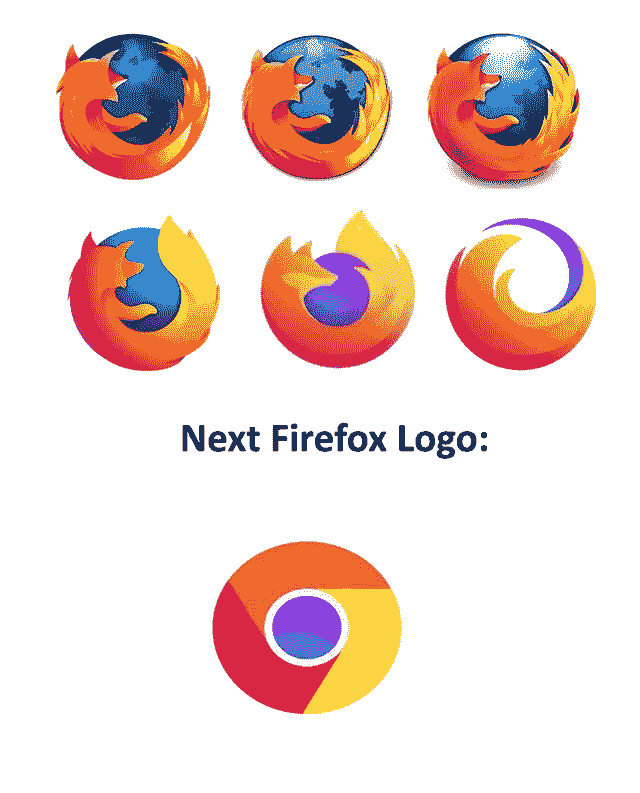
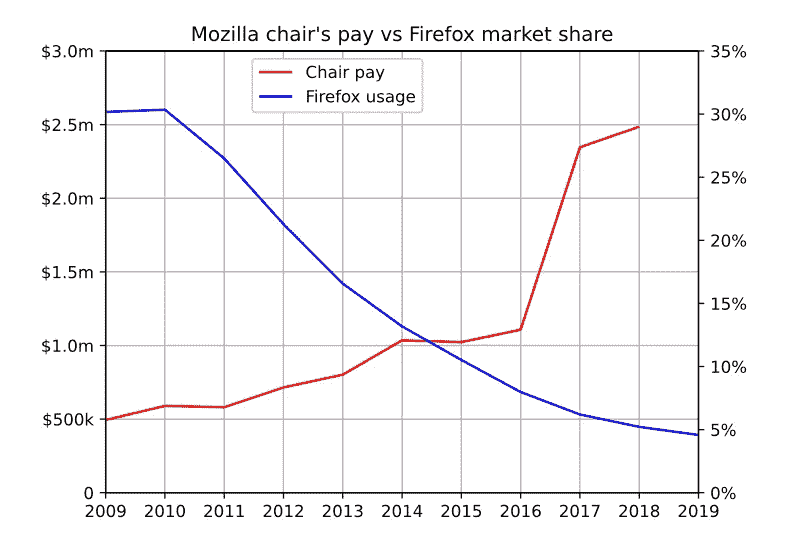

# 为什么火狐值得它可悲的衰落…

> 原文：<https://levelup.gitconnected.com/why-firefox-deserves-its-sad-decline-1c44d9ba59c9>

## 我们现在使用 Chrome 的大多数人要么以前用过 Firefox，要么太年轻了，不知道这个……至少根据统计。

火狐是一个传奇。当然，仍有数百万人在使用它，但已经不是以前的样子了。毫无疑问，它是以前最占优势的浏览器之一。但是，我个人认为，他们罪有应得。

# 第一部分:软件的兴起

## 所涉及的艰苦工作

这一切都始于一款名为 Netscape Navigator 的应用，该应用后来被 AOL 收购。这被认为是有史以来最早的网络浏览器之一，它的出现是因为之前没有人见过这样的应用程序。但是过了一段时间，在 ie 浏览器发布后，它就不再受欢迎了，因为与 ie 浏览器相比，它被视为“第三方应用”。因此，网景的市场份额从几乎 92%上升到大约 15%。

回到过去，Internet Explorer(…是的…这就是人们的生活方式)是最常用的网络浏览器。它是预装的，易于使用，工作起来没有任何麻烦。

这是网景公司决定做出其历史上最大胆的决定的时候。它开源了它的代码。

当然，这是一个迷因…

现在，如果他们现在做同样的事情，可能看起来不那么大胆，因为目前有许多开源应用程序。但是，以前的情况很不一样，而且很少。

同一天，身为网景开发者的杰米·扎温斯基(Jamie Zawinski)注册了 Mozilla，这原本是网景版本的代号。这个名字来自于 Mozake 和哥斯拉的组合。

Mozilla 最初的目标是成为一个应用套装。提供良好互联网导航和通信体验的应用程序集合。但是，考虑到他们把所有东西都开源了，这并不理想，也不有利可图。

1998 年 10 月，Mozilla 团队最终决定结束一切，从零开始，构建一个基于原生框架的跨平台浏览器。为此，他们已经在制造壁虎引擎。

1998 年，他们发布了预览版。虽然它简单而普通，但人们似乎很欣赏它，并期待它的主要版本。但遗憾的是，由于 Mozilla 计划在最后一刻增加一套额外的应用程序，这一计划被严重拖延了。

终于在 2002 年 6 月，凤凰浏览器第一版公布。它被称为凤凰城是因为它有着艰难的历史。

## 变化

但是当一切进展顺利时，AOL 决定停止对浏览器的支持。但是 Mozilla 在这一点上非常幸运，在戴夫·海厄特、乔·休伊特和布雷克·罗斯的领导下，成立了自己的基金会，名为 Mozilla 基金会，最终取代了 AOL 的工作。

所以凤凰继续从灰烬中升起。后来，它受到了另一家名为 Phoenix Bios 的公司的商标相似性的威胁，因此被重新命名为 Firebird(还不是 Firefox)。

随着时间的推移，浏览器也开始正式支持 macOS。由于社区讨厌这个浏览器的名字，这个名字最终被改成了 Firefox。

# 第二部分:剧变

Mozilla Firefox 是第一个推广“标签”概念的网络浏览器(不客气，Chrome)。它还开始实施其他想法，如弹出窗口拦截(现在的广告拦截)，广泛的安全性和隐私性，以在不需要时不跟踪系统，阻止潜在的有害跟踪器，等等，更不用说它还是第一个启动自己的下载管理器的浏览器，独立于操作系统使用的内容。

## 吉尼斯世界纪录

然后，软件团队在社区中大肆宣传下一个版本 Firefox-3.0。向社区公布了发布的确切日期。

2008 年 6 月 17 日，Firefox 发布了第三版，并创造了一天内拥有最多“独立下载”的世界纪录，24 小时内下载量达到 800 万次，创下了吉尼斯世界纪录，这在当时看起来几乎是不可战胜的。

## 创新ˌ革新

它只是在功能的基础上不断增加功能，这些功能是如此独特，与其他竞争对手不一样，几乎所有的现代功能都被创新成自己的旋转。

最终在 2010 年左右达到了 34%的用户使用火狐的峰值。这是一个巨大的成就，考虑到它在 2005 年的时候只有 5%,而它的主要竞争对手是……嗯，Internet Explorer。

# 第三部分:下山的开始

Mozilla 得到这个的主要原因是因为它不再被看作是 Internet Explorer 的“第三方应用程序”，而更像是 Internet Explorer 的一个更好的扩展版本，具有它需要的所有功能。

但是，当你有不止一个这样的软件，由一个更受欢迎的公司支持时，事情就真的变了。

当时，谷歌的首席执行官埃里克·施密特对网络市场不感兴趣。但是，像拉里·佩奇这样的人决定直接从 Mozilla 雇佣一些开发人员，开发一个更好的 Firefox 版本，迫使首席执行官改变主意。这就开始了当前主流浏览器谷歌 Chrome 的旅程。

## 从创新到努力尝试

这时，Firefox 明显改变了它的速度和添加的功能模式。似乎是这个软件试图跟上谷歌 Chrome 的步伐，而不是一个实际上有自己想法的软件。这导致火狐推出了其移动版的网络浏览器和类似的功能，几乎模仿了谷歌的确切功能。这导致 Chrome 有了更高的基础，因为 Chrome 增加的功能只对它自己有利。例如，移动版 Chrome 与 Android 集成良好，并且是 Android 中的默认浏览器，因为 Android 和 Chrome 都属于谷歌。

## 竞争

自从谷歌 Chrome 开始提供良好的竞争，并使自己成为 Android 的默认用户，Chrome 的营销和受欢迎程度就一飞冲天。而另一方面，Firefox 似乎模仿了 Chrome 的功能，而不是添加自己独特的功能和用例，并实施不同的营销策略。

## 障碍

Mozilla 的 Firefox 团队随后在 20 世纪 90 年代开发了自己的操作系统，该系统已经被它的老对手谷歌和微软接管。他们开始了一项繁重的 FirefoxOS 开发计划。

这完全失败的主要原因是，考虑到大多数手机都预装了 Android，没有人会疯狂地安装 FirefoxOS，而 Firefox OS 没有软件支持，也没有独特的卖点，人们根本没有理由使用它。这进一步减缓了像 Firefox 本身这样的实际项目的开发，更不用说社区中仇恨和批评的增加了。

> Mozilla 有一个巨大的…我的意思是巨大的优势，因为它有一个非常大的社区，有 34%的人使用和信任 Firefox。他们只是不够快从 Chrome 上抢回他们的观众。

我的意思是…上面的引用是我说的。但是，让我们听听火狐 CEO 自己想说什么。

> Firefox 没有跟上市场和人们真正想要的东西。很多火狐铁杆粉丝现在是快乐的 Chrome 用户。—克里斯·比尔德

# 第四部分:太晚了:(

当然，这是个玩笑…

2017 年，Mozilla 发布了新版本 57，几乎所有东西都翻倍了，有更现代的徽标，看起来非常现代的 UI，新的渲染引擎，更好的用户体验，更好的动画，等等。此次发布代号为“光子”。

它还发布了许多新产品，实际上更有用，也专注于其实际受众(不同于 Firefox OS)——如顺时针、容器、跟踪器阻止、高级 VPN 服务器、更好的外观和浏览器主题的主题商店。

但是，问题是为时已晚。当火狐刚开始的时候，它有一个优势，大多数使用电脑的人都是技术人员，知道他们在做什么，不像现在连婴儿都在做 Tik Toks…如果你知道我的意思。

这意味着人们更喜欢长期的、不那么臃肿的应用。如果 Chrome 已经默认安装并且运行良好，为什么还要在手机上再安装一个浏览器呢？既然 Chrome 在 Android 上使用，为什么不在 PC 上使用呢？当 Opera 和 Vivaldi 等其他浏览器开始加倍扩大受众范围，变得更加具体时，游戏会发生进一步的变化，比如 Opera GX 提供免费的迷你 VPN——这是 Firefox 在付费后提供的。

最后，当 Brave browser 出现时，我们看到使用 Firefox 的用户进一步减少，目标受众相似，但营销和功能实现更好。

# 为什么它罪有应得？

上图是 Firefox 主席要求的薪水，与它每年面临的用户数量损失相比，不…这张图没有夸大或近似。

虽然我不应该谈论这个人的薪水，但是“Mozilla 团队”现在是一个巨大的公司，尽管投入的工作和努力没有达到它需要的程度。他们没有继续通过实施新想法和创新来关注其受众，而是更愿意跟上谷歌的步伐，在 Android 和 Windows 上与其受众竞争。这导致了目前 Firefox 唯一占主导地位的地方是 Linux，似乎社区正在努力给他们另一个机会，但即使在那里，像 Brave 和 Vivaldi 这样的浏览器也在 FerenOS 这样的发行版中出现。

我不想撒谎，火狐在过去几年里已经开始努力了。再一次，它归结为一个事实，那就是太晚了。他们应该在占主导地位，而且实际上比 Chrome 更有优势的时候这么做。

# 结论

火狐继续三倍下降到虚无。它发布了版本 100，考虑到人们会因为它的版本号而尝试它，这可能是一个轰动，但他们没有做任何普通用户可以看到的事情。

就我个人而言，我希望 Firefox 能够成功。当像 Chrome 这样的公司实体拥有如此大的市场份额时，这真的很糟糕，更不用说它的开源版本 Chrome 也创造了许多像 Brave 这样的分支。

如果有一个不基于 Chromium 的开源浏览器，能够重新获得一些牵引力和统治地位，它必须是 Firefox。我希望…它明白自己的位置。

我肯定会在 YouTube 上制作一个完整的视频，介绍我的建议、意见和未来要采取的步骤。我还会在 Instagram 和 Twitter 上发布更多的推文和视频/故事/帖子。这篇文章就讲到这里，希望你喜欢，下一篇再见。

**你真棒:)**

> 法丁吉克