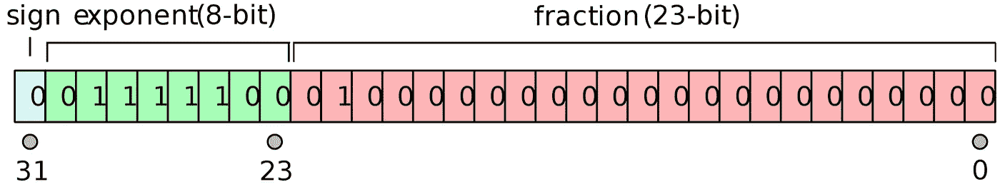
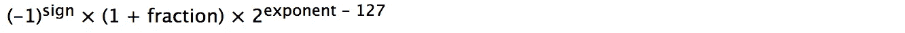

# 为什么浮点数并不总是准确的

> 原文：<https://levelup.gitconnected.com/why-floating-point-numbers-are-not-always-accurate-9a57e812ace1>

## 浮点数不准确或出错的原因。

如果您是一名程序员，并且处理带分数的数字(例如，表示从某个事件或交易金额[美元]开始经过的时间[秒])，您可能听说过不应该使用浮点类型，因为它们并不总是准确/精确的。

在这篇文章中，我将解释为什么浮点数并不总是精确的。

首先，让我快速提醒一下浮点表示的基础知识。

# **浮点表示法**

[IEEE 754](https://en.wikipedia.org/wiki/IEEE_754) 浮点标准规定浮点的二进制表示格式如下:

由 Codekaizen —自己的作品，CC BY 3.0，【https://commons.wikimedia.org/w/index.php?curid=3651274 

在这种情况下，浮点值表示具有 32 位大小(称为*单精度*，对于本文的其余部分，我将重点关注单精度浮点)。在 C 或 C++编程语言中，这对应于大多数平台上的 *float* 类型(C++标准没有规定大小)。

*   sign:浮点数的符号(1 位)。
*   指数:放在以 2 为基数的指数字段中的值(8 位)。
*   分数:通常介于 0 和 1 之间的值，位于分数字段(23 位)。

为了从编码值计算一个数，使用下面的形式。

IEEE 754 添加了一个值为 1 的不可见前导位(实际上并未编码),以在分数位中节省更多的位。

此外，为了优化对浮点值的操作，在将指数编码为二进制表示格式时，会将 127 作为偏差添加到指数中(即指数为-126 的值与指数+1 一起存储)，因此在从编码值计算数字时，我们需要从指数位中的值减去 127。

现在，我们刷新了关于浮点表示的记忆，让我们深入了解为什么浮点数并不总是精确的(精度有限)。

# **为什么浮点数的精度有限**

我们讨论了数字是如何编码成浮点格式的。我们还检查了它是如何计算到数字的。

为了更容易理解为什么浮点精度有限，这一次，我们从编码的浮点计算二进制数。

例如，1.0(十进制)编码为 0011111110000000000000000000，即 0(符号)011111111(指数)000000000000000(分数)。

如果我们用下面的形式计算二进制数，

1.0000000000000000000000(二进制)× 2⁰

可以加减的最小数字是 0.00000000000000000001(二进制)= 0.00000011920928955078(十进制)。

如果加上或减去一个小于 0.00000011920928955078 的数，结果不会改变。这是使用单精度浮点数时 1.0 的精度。

实际上，在这种情况下这不是一个大问题，因为 0.00000011920928955078 对于大多数应用程序来说已经足够小了(0.00000011920928955078 秒已经足够小了)。

接下来，我们来看看 1000000.0(十进制)。编码为 0100100101110100001001000000000，即 0(符号)10010010010(指数)111010000100000000(分数)。

二进制数是 1.111010000100100000000(二进制)× 2 ⁹，也就是 11110100001001000000.0000(二进制)。

可以加减的最小数字是 0.0001(二进制)= **0.0625** (十进制)。

在这种情况下，与数字为 1.0 时相比，精度要低得多。这可能会有问题。例如，如果使用单精度浮点来表示自应用程序启动以来的时间(秒)，并且应用程序每 0.05 秒计算一次时间。1000000.0(或更早)之后，时间停止前进！

# **总结**

在这篇文章中，我谈到了单精度浮点编码格式的基础，以及如何从编码值计算数字。然后我解释了为什么浮点数并不总是准确的。