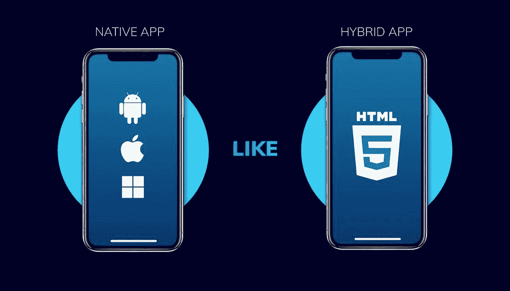

# 为什么颤振是 2021 年的发展趋势

> 原文：<https://levelup.gitconnected.com/why-flutter-is-a-development-trend-of-2020-d81ca0813a73>

作为跨平台开发世界的新手， [Flutter](https://flutter.dev/) 已经获得了软件的圣杯，被认为是发展最快的移动开发工具之一。在今天的文章中，我们将讨论颤振的好处，如果它是合理的，建议您从您当前的平台切换到这个。

# **颤振成为 2020 年发展趋势的 7 大理由:**

## **1。所有平台中相同的 UI 和业务逻辑**

我想到的 Flutter 技术的第一个优势是它的通用 UI 模式被提取到可重用的小部件中。跨平台 UI 框架消除了单独设置 UI 属性(如颜色、样式等)的需要。我们可以通过编辑 iOS 和 Android Flutter 应用程序的代码来全局调整 UI 和业务逻辑。

## **2。节省您的时间**

由于 Flutter 的热重新加载特性，不需要像常规编程那样在部署上花费时间。您可以立即应用所有更改，而不会丢失当前的应用程序状态。修复 bug，构建 UI，添加新特性，而不需要在速度和开发上妥协，这在很大程度上减少了质量评估工作，也是选择 Flutter 的另一个原因。

## **3。跨平台应用性能与原生应用相似**

Flutter 应用程序是用一种叫做 Dart 的语言编写的，这种语言消除了 JavaScript bridge，因此它被编译成本机代码。例如，Flutter framework 允许编译和发布应用程序的速度比使用 React Native 要快得多。此外，您还可以开发一个 Flutter 桌面应用程序。

## **4。任何复杂程度的定制动画用户界面**

结合各种小部件，您可以创建一个复杂的 UI，在不同版本的操作系统上看起来都一样。有了一个方便的大型动画库，可以很容易地实现 Flutter 的动画支持，您的应用程序将看起来抛光和流畅。你在屏幕上看到的一切都可以定制！

## **5。最适合 MVP**

一个最小可行的产品是验证一个商业想法的最有效的方法之一。它帮助你防止商业失败，因为你可以很容易地得到反馈和客户的需求。由于其高速度、易于集成和灵活的 UI， [Flutter app 开发](https://inveritasoft.com/technologies/flutter)已经成为创建移动 MVP 的完美选择。

## **6。便于设计者和开发者合作的热重装特性**

除了对开发者来说是幸运的微笑之外，hot reload 对设计者和开发者的合作也是非常有益的。想象一下:一个开发人员建议在 UI 上实现一些改变，一旦设计人员做了，他们都可以立即看到这些改变是否合适。

## **7。高应用响应度**

用 Flutter 软件构建的应用程序可以在任何现有平台上正常运行，无需更改 Dart 代码，并保留平台上的优秀设计。Flutter 应用程序开发已经从移动领域向前发展，并为今天已经在积极使用的 web 和桌面打开了新的机会。

## **总结**

Flutter trend 是移动发展的未来吗？总之，我们可以毫无疑问地说，Flutter 应用程序开发是跨平台开发世界的游戏规则改变者。拥有这 7 个与众不同的特性，使得 Flutter development 在其他移动应用程序开发工具中具有竞争优势。从单个代码库，可以开发跨平台的应用程序(包括 Flutter 桌面应用程序以及 web 和移动应用程序版本)。如果你正在考虑用 Flutter 来开发你的产品，并且需要一个团队——请随时[直接联系 inVerita。](https://inveritasoft.com/contact)

*最初发布于*[*inveritasoft.com*](https://inveritasoft.com/blog/why-flutter-is-a-development-trend-of-2020)*2020 年 1 月 2 日*