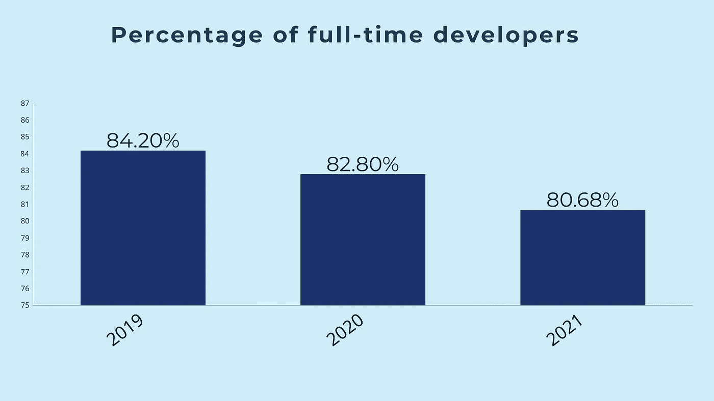
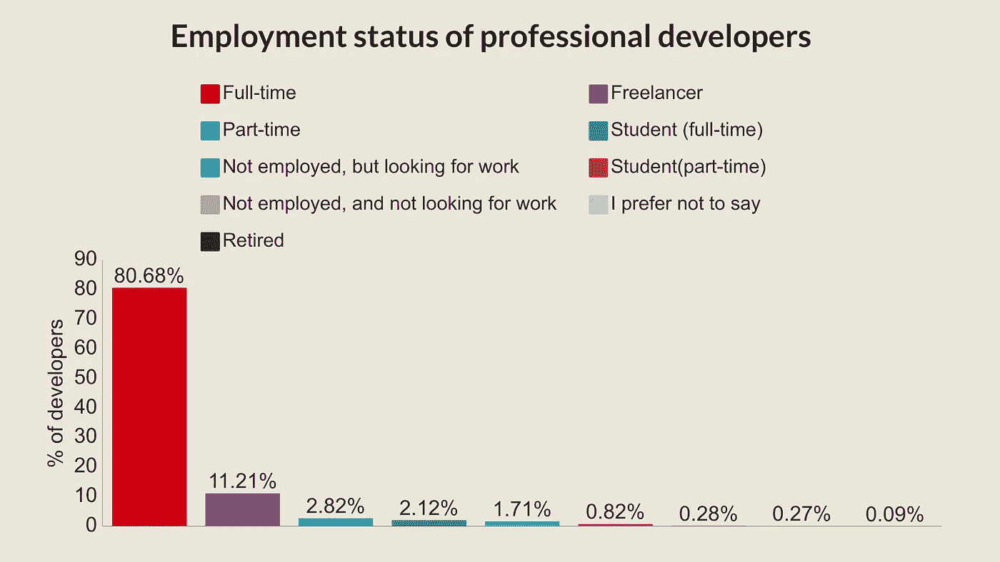
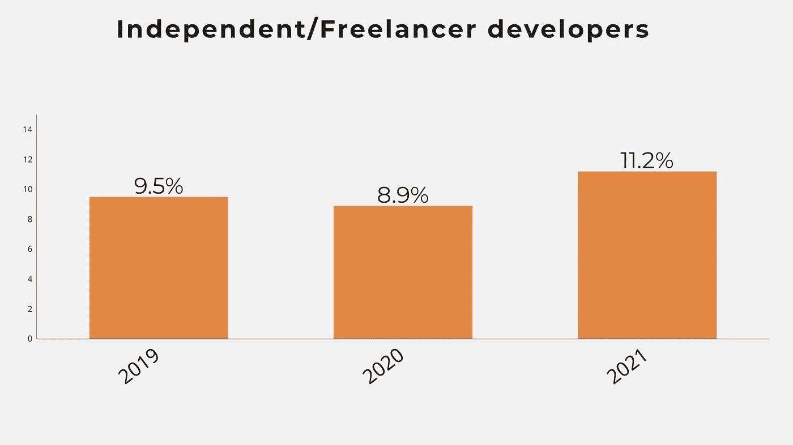
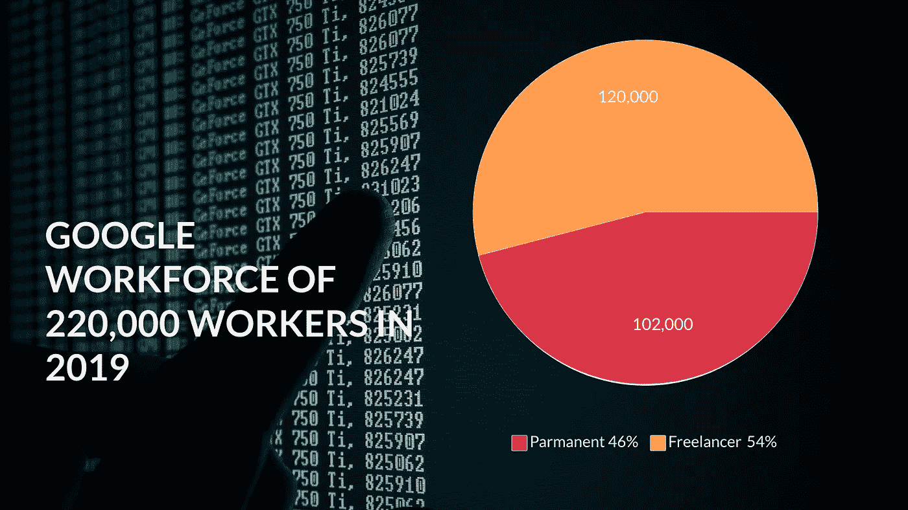

# 为什么全职程序员比以往减少得更快

> 原文：<https://levelup.gitconnected.com/why-full-time-programmers-are-decreasing-faster-than-ever-ad67d2697bbf>

## 我的猜测是这个数字在 10 年后会变成一半

图表:作者，数据:Stackoverflow

全职工作是世界上最受欢迎的工作类型。因为这样更安全。像其他事情一样，它有优点也有缺点。

但是我始终相信编程是一种非常不同的工作。这个职业的变化与其他职业不同。有了互联网和笔记本电脑，你可以在任何地方生活和工作。

去年，我注意到许多程序员为了更好的收入和生活，离开全职工作去做自由职业者和兼职工作。然而，这个数字仍然很低。但是我发现这在世界各地都在发生。

尽管如此，在 StackOverflow 的开发者调查中，仍有超过 80%的职业开发者表示，他们处于全职工作状态。

11.21%的人表示自己是独立承包人或自由职业者。这是巨大的！电气、土木或其他工程师的比例要低得多。

图表:作者，数据:Stackoverflow

我发现的另一个有趣的现象是，在这些专业开发人员中，几乎有 4%是学生。这是这个职业的另一个精彩的一面。

即使你是学生或者根本没有 CS 学位也可以赚。但是为什么全职开发者在减少呢？他们会失业吗？让我们找出答案。

# 工作会流向印度-孟加拉国-巴基斯坦

这是上升因素之一。印度开发人员和美国开发人员的工资差距是 5-15 倍。

许多公司给这些印度-孟加拉国开发商合同工作。发展是一种技能，你可以从任何地方学习，并变得非常擅长。

因此，在国内工作机会较少的国家，自由职业者会增多。南亚的三个国家位居自由职业者收入增长最快的前十名。

目前，美国拥有最多的开发者，有 440 万开发者。但是印度将在 2023 年超过。到 2023 年，印度将有超过 520 万名开发者。

因此，更多的技术工作将流向印度和南亚国家。

# Covid 正在裁员

这也是原因之一，但不是最重要的原因。虽然许多开发人员失去了工作，但这个数字比其他专业人员低得多。据 Hackreactor 报道，来自各行各业的 20%的用户报告称由于疫情爆发而失业。

但是只有 5%的开发人员说他们在 covid 期间失业了。但这也是事实，因为大规模的数字化，在 covid 的时代也创造了许多就业机会。

# 自由职业者正在增加

这是最大的因素。自由职业者越来越多，尤其是在开发工作中。程序员想要独立。至少数字是这么说的。

大多数全职开发人员正在成为自由职业者或独立承包商。根据 Stackoverflow 的数据，自由职业者的比例在两年内上升了近 2%。

图表:作者，数据:Stackoverflow

美国拥有最多的自由职业者。根据 2017 年 Upwork 的[新闻稿](https://www.upwork.com/press/releases/freelancing-in-america-2017)，近 5800 万美国人是自由职业者，占美国总劳动力的 36%。

到 2027 年，超过 50%的美国劳动力将成为自由职业者。谷歌的自由职业者已经超过了正式员工。

图表:作者，数据:彭博

在谷歌的 22 万员工中，有 12 万是自由职业者。这占总劳动力的 54%。

随着开发人员走向自由职业，全职开发人员正在减少。

# 公司想要省钱

很多公司不需要常驻开发人员。在许多项目中，维护和更新的范围很小。在这种情况下，公司通常会尽量避免永久开发人员，以节省资金。

最近我从一家最大的公司得到了一个项目。完成项目后，他们每个月会给我公司 500 美元的维护费。这个项目是如此之小，以至于我们在过去的几个月里不需要做任何维护。

公司和我的创业公司都从这个项目中受益。

SMB(中小企业 **)** 尽量避开永久开发者。他们雇佣自由职业者。

以下是来自 [Linkedin](https://www.linkedin.com/profinder/blog/how-small-businesses-are-leveraging-freelancers?&url=147) 的一些统计数据，

*   70%的中小企业至少与自由职业者合作过一次
*   几乎 83%的人认为自由职业者帮助了他们的生意，81%的人计划再次雇佣他们

# 临终遗言

在接下来的两年里，独立开发者的数量将会比以往任何时候都多，因为公司和开发者都习惯了远程工作。

雇用全职开发人员的最大原因之一是与他们在同一个办公室工作，并获得最高的生产率。

由于远程工作证明了在家工作也能提高工作效率，所以它越来越受欢迎。我的猜测是，许多公司可能会用自由职业者取代一些固定的开发人员。

我认为开发者不需要担心这些事实。只要我们熟练了，就没事了。

你认识失业或成为自由职业者的开发人员吗？

来源:所有图表均来自 stack overflow 2021 年、2020 年、2019 年、Goremotely、Flexiple、Linkedin、彭博的开发者调查数据

**别忘了订阅** [**我的中等简介**](https://abrarmasum.medium.com/subscribe)

*成为* [*成员这里*](https://abrarmasum.medium.com/membership) *。*