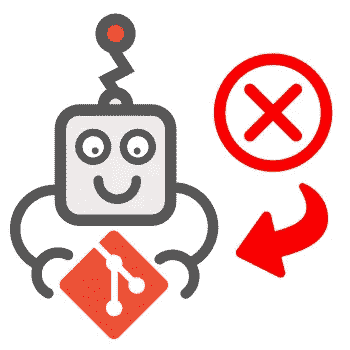
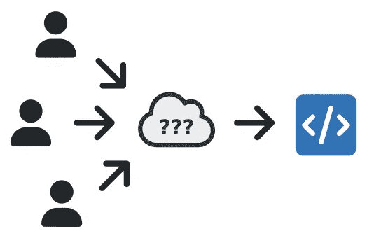
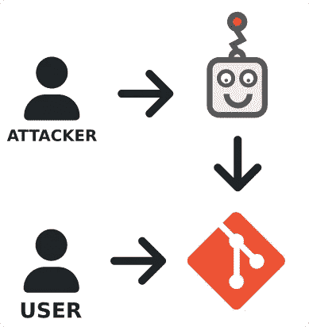
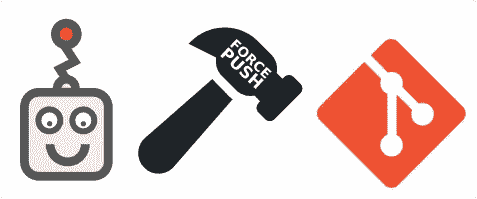

# 为什么 Git 不适合机器人

> 原文：<https://levelup.gitconnected.com/why-git-is-not-for-robots-6d5383c2ec0f>

Git 是软件开发中版本控制的一个很好的工具，但是自动化提交或者历史的修改会导致可追溯性、安全性和可用性的问题。

Git 允许开发人员独立工作，快速有效地组合他们的工作，同时保留变更历史。随着 GitOps 使用的增加，越来越多的开发人员使用自动化来运行 git commit 上的命令。这是一个有用的工具，但是当自动化将变更推回 git 时，可能会出现问题。

Git 不是给机器人用的

# 可追踪性

使用 Git 的一个主要目的是跟踪谁做了更改以及更改发生的时间。这种可追溯性有助于改善团队内部的沟通，为代码变更提供上下文，并提供访问先前版本代码的能力。

失去可追溯性

当自动化对代码库的更改时，可跟踪性就丧失了，因为它显示的不是进行最后一次更改的用户，而是一个机器人或共享凭证。这会导致关于谁做了更改的信息丢失，除非您代理用户的凭证，出于安全考虑，这是不可取的。

# 安全性

Git 允许您限制每个用户的访问控制，这在管理您的业务源代码时非常重要。源代码应该被认为是高度安全的，因为它可以代表你相对于其他公司的竞争优势。

安全性的丧失

当您允许自动化修改代码时，任何能够控制这种自动化的人都可以避开 Git 的安全控制。这是在实施之前应该考虑的一个额外的风险和攻击面。

# 可用性

Git 中的合并冲突需要由人工来解决，因为自动化解决它们太复杂了。有解决合并冲突的方法，但是这些方法会导致代码丢失和构建中断。

强制推送

因为自动化没有能力解决合并提交，所以它导致使用强制推送，这会覆盖任何其他用户的更改。自动化对代码的频繁修改也会导致问题，因为用户需要不断地提取变更以避免合并冲突。

# 摘要

从 Git 运行自动化是触发管道的一个很好的方式，但是重要的是自动化只有读访问权，而不会将更改推回到系统中。这就是为什么 Git 是给人类而不是给机器人的。

点击此处了解更多内容，或通过以下方式联系我:

*   **推特:** [@BenTorvo](https://twitter.com/BenTorvo)
*   【ben@torvo.com.au】邮箱: [邮箱:](http://torvo.com.au/)
*   **网址:**[torvo.com.au](http://torvo.com.au/)