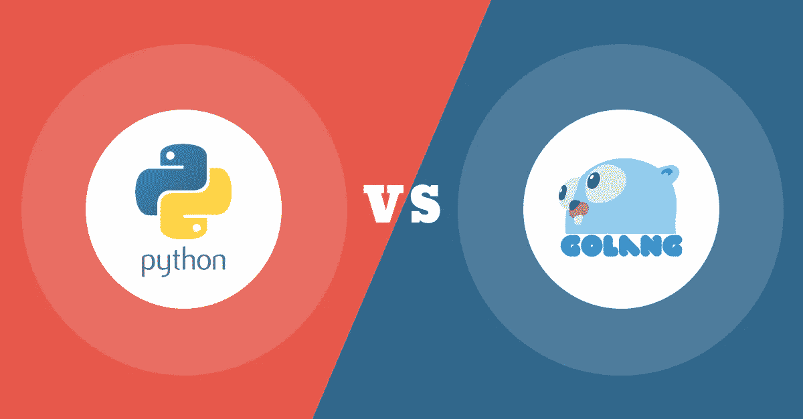

# 为什么是 Golang 而不是 Python？哪种语言最适合 AI？

> 原文：<https://levelup.gitconnected.com/why-golang-and-not-python-which-language-is-perfect-for-ai-687d2e8accb5>

olang 现在正成为机器学习和人工智能的主流编程语言，在全球拥有数百万用户。

> Python 很牛逼，但是 Golang 非常适合 AI 编程！

Golang 于 10 年前的 2009 年 11 月推出，最近已经 10 岁了。谷歌开发人员构建的语言现在让程序员更有效率。这些创造者的主要目标是创造一种语言，消除像 C++这样的编程语言中所谓的“无关垃圾”。它提供了编译成机器码的能力，运行时反射的能力，并提供了[垃圾收集](https://www.ardanlabs.com/blog/2019/07/garbage-collection-in-go-part3-gcpacing.html)的便利。

Golang 现在正成为机器学习和人工智能的主流编程语言，在全球拥有百万用户。一些大品牌包括网飞、美国运通、优步、Dropbox、Salesforce、Twitter 和 Twitch。

# Golang 会消灭 Python 吗？

答案是否定的，不会。

Python 应用广泛，用途广泛，不会过时。它是一种编程语言，将一千个组件从单个模块编译成整个开发的包。Python 也有一个强大的社区，承诺在未来几十年里让它保持活力。

在多种环境下进行测试后，发现初学者很容易使用 Python 编程，并被认为是年轻开发人员的最爱。在编写服务器端脚本时，Go 语言优于 Python。因此，在寻找具有快速部署周期的超高性能并发服务时，Golang 据说比 Python 更胜一筹。

然而，最近 Go 和 Python 被认为是最受欢迎的语言，非常适合人工智能专家。当组织同时使用这两种语言时，提出一个严格的解决方案对你来说是一个挑战。

# 为什么 Golang 是首选:

人工智能即将席卷技术世界。机器学习、自我修正和推理是可以模仿人类智能的一些应用。人工智能应用程序现在使企业能够提高资源的利用率，从而产生积极的影响。

👉**高可伸缩性和计算:**与 Python 相比，Golang 在可伸缩性和性能方面有更大的潜力。使用 Go 的想法是因为与数学计算的速度相比，它的速度很快。例如，它处理复杂数学问题的能力比 Python 高 20-50 倍，速度也快得多。

👉Golang 覆盖了广泛的人工智能用途:虽然 Go 提供了少量的库，但它一直在增长，因此满足了广泛的人工智能用途。GoLearn(数据处理)、Goml(传递数据)和 Hector(二进制分类问题)等 Go 库是为 AI 及其应用服务的一些库。

👉**提供了良好的代码可读性:**Go 中使用的算法提供了一种极简的方法，允许开发人员轻松地创建可读的代码。

👉**Go 开发者对 Go 库的易用性:**大多数 Go 开发者不需要选择用其他编程语言编写的库。在 Go 中拥有库的核心优势在于，它让使用 Go 编程的人工智能专业人员感到开发人员的舒适。

# 为什么 Python 是首选:

IT 界的新黑是什么？大多数答案将包括机器学习和人工智能，结果不会错。这两种技术一直是 IT 行业的主流，并且在可预见的未来仍将如此。

👉**多个库:**多个库现在可以帮助 [**AI 工程师构建新的算法**](https://www.artiba.org/blog/the-artificial-intelligence-engineer-career-roadmap-all-you-need-to-know) ，进行数据集处理，做模型处理，处理最复杂的数据，以及许多其他功能。不要忘记，TensorFlow 是最受欢迎的库(开源)之一，用于 Google 的许多机器学习应用程序。

👉 **Python 作为一种语言是可访问的:**在商业术语中，语言可访问性仅仅意味着拥有一个庞大的 Python 编程专家市场。此外，正如我们所知，这些编程语言遍布全球。

👉**强大的社区:** Python 有一个完善且强大的社区。[根据 GitHub 2019 年的报告](https://github.blog/2019-07-25-one-million-dependabot-pull-requests-merged/)，全球范围内发送了近 100 万个 pull 请求。社区倾向于创建新的库来扩展工具集和更新文档。

# 为什么是 Golang 而不是 Python？

就可伸缩性而言，这种编程语言的艺术作品就是在更大的范围内维护和帮助开发人员解决问题。Golang 内置了对适当并发进程通道的支持的原因。然而，Python 在并发性方面面临着巨大的挑战。

由于 Go 对并发性的支持，它已经在集群计算和云计算中被广泛接受。

如上所述，当谈到可读性时，Python 肯定会出名，但是，有时他们做得太过了。Python 确实为你提供了多种方式 来一遍又一遍地重复同样的事情，这经常会导致混淆。另一方面，围棋在编程方面遵循严格的规则。它不允许简单地导入不需要的库，也不允许创建不必要的变量。当然，这意味着围棋在执行任务时有更好的优势。虽然有些人可能不同意这一事实，即代码不是通用的。但是当我们谈论核心编程时，有人关心吗？也许不应该，只要代码是可读的。

断定哪种语言更适合 [**人工智能专家**](https://www.artiba.org/) 可能是一项艰巨的工作。虽然大多数情况下 Golang 似乎占了上风。目前，它可能不会像 Python 一样光芒四射，但最终，有一天它会实现。事实上，Python 花了 20 年才达到今天的水平。Python 的存在在最初的十年里没有引起人们的注意，直到 2001 年它才开始吸引人。所以，围棋一定会追上来。或许它已经在吸引注意力方面做得非常出色了。

*原载于*[*www.rtinsights.com*](https://www.rtinsights.com/why-golang-and-not-python-which-language-is-perfect-for-ai/)