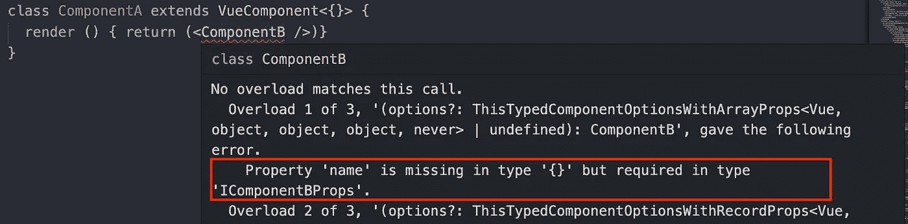
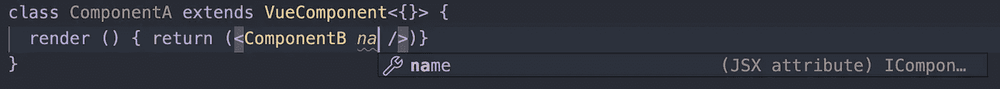
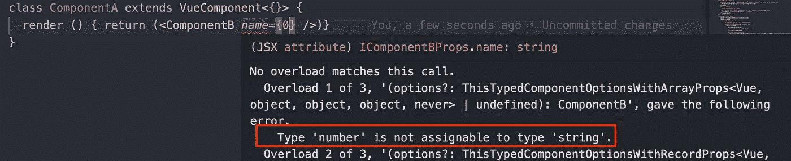
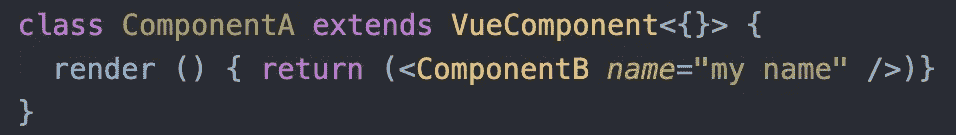

# 为什么我提倡在 Vue 组件中使用 JSX 和类型脚本

> 原文：<https://levelup.gitconnected.com/why-i-advocate-using-jsx-and-typescript-in-vue-components-e378bf9ee6e7>

## 在开发了企业级应用程序之后


照片由 [beasty 拍摄。](https://unsplash.com/@beastydesign?utm_source=medium&utm_medium=referral) on [Unsplash](https://unsplash.com?utm_source=medium&utm_medium=referral)

默认情况下，Vue 包含一个模板语法。与 JSX 相比，它更接近传统的 HTML，感觉更“自然”。但它继承了 HTML 的一个核心痛点:ab 不可预测的 API。事实上，没有简单的方法知道每个 HTML 标签支持什么属性。当然，除非是官方文件，但我们一会儿再谈。另一方面，JSX 提供了一种确保严格属性类型的方法。

为了理解这一点为什么如此重要，我们应该从“消费者”的角度来看一下可重用组件，消费者是指将使用我们构建的组件的人。

也许你正在嵌入一个外部 UI 库。或者，您即将采用由您组织的另一个团队构建的 Vue 组件。或者你从事个人兼职项目，几个月前开发了一些 Vue 组件，但已经忘记了它们是如何工作的。

所有情况的共同点是什么？此时，你就是这些组件的**消费者**。也就是说，它们是你的“黑匣子”。他们的逻辑被封装在远离你的地方。你几乎不知道它们是如何工作的。然而，你必须使用它们。你可以和他们交流的唯一方式是使用他们的公共 API:提供道具和监听事件。

想象你即将开始使用某个组件“v-btn”。你知道这是某种按钮。你大胆地把它放进代码里，运行它，然后…什么也没发生。页面是空的。

组件为什么不工作？你该怎么办？您有两个选择来解决它:阅读源代码或阅读文档。

# 阅读文件


先说后者。除非你正在应用一个专业开发的 UI 库，否则很可能没有任何文档。

即使文档确实存在，也没有人能保证它是正确的并且与源代码同步。俗话说:“谎言有三种:谎言、肮脏的谎言和代码文档”。不幸的是，源代码文档经常是不完整的或误导的。或者过时了。可悲的是，但大多数时候，文档是不可靠的。

# 阅读源代码


马库斯·斯皮斯克在 [Unsplash](https://unsplash.com?utm_source=medium&utm_medium=referral) 上拍摄的照片

许多开发人员都认为代码是唯一可靠的事实来源。现在，我们*可以*跳到代码中，并弄清楚这一点。但这里有一个问题:阅读这些组件的源代码意味着它们对我们来说不再是****的黑匣子**。我们必须投入时间和脑力去理解他们的内在逻辑和行为。但我们不是这些组件的作者。他们**不是我们的责任**。我们不能以任何方式改变他们，所以我们为什么要阅读他们的代码？**

**我们是*消费者*。必须有一种方法来利用这些元素，而不必深入到它们的实现细节中。**

# **PropTypes？**

****

**乔恩·泰森在 [Unsplash](https://unsplash.com?utm_source=medium&utm_medium=referral) 上的照片**

**许多开发人员使用 **PropTypes** 为他们的消费者生产更好的 API。但是让我告诉你:propTypes 几乎是****完全是** **无用的**。他们带来的价值接近 0。****

****为了说明这一点，让我们回到 v-btn。这次我们将假设 v-btn 作者已经使用了 PropTypes。作为消费者，您对该组件的实现一无所知，却将它添加到了您的模板中。你启动应用程序，打开浏览器，然后又看不到任何东西。这一页还是空白的。****

****但是这一次，至少你会在浏览器控制台看到一些错误，礼貌地暗示你忘记提供道具了。这个*是*有帮助的。您知道该怎么做:只需向 v-btn 添加一个必需的属性，就可以了。****

****但是这个**在生产**中是没有用的。最终用户不会让控制台一直开着。他们只会看到一个空页面(或者至少是未呈现的组件)。他们没有办法理解发生了什么。PropTypes 不支持您将问题传达给最终用户。技术上来说，没有**退路。******

****不要陷入“默认值”的陷阱。**默认值不是一个回退值**。如果你可以默认一个属性，这意味着消费者的数据对你来说不是那么重要。换句话说，如果一个组件本身可以提供一个值，那么这个属性就不是必需的。****

****propTypes 的第二个问题是它没有减少长的**反馈循环**。当你添加一个组件到你的代码或者改变任何东西的时候，你必须运行整个应用程序，到达组件应该呈现的地方，然后验证它是否工作。这里有一个问题:这个过程可能会非常长。****

****如果您处理一个包含成百上千个组件的大型、广泛的应用程序，会怎么样呢？或者，如果到达这个组件的路径是艰难和棘手的:点击五个按钮，然后提交一个表单，然后等待一个非常慢的服务器的响应，然后做这个，然后做那个…****

****想象一下，你不得不浪费生命中的几分钟来运行应用程序，然后到达你的组件应该呈现的点，所有这些只是为了看到一个控制台错误的空白页面？然后在你意识到你只是拼错了专有名称之后，重复这个循环？然后再重复一次，因为道具需要的是字符串，而不是数字？如果你仔细想想，即使没有 PropTypes，你也必须做同样的事情。他们没有带来太多的价值。****

****问题的核心是 **propTypes 传达错误时已经太晚了**——这就像在宇宙飞船已经发射后报告故障的火箭发动机一样。****

****但是，有一种方法可以显著减少反馈循环，并确保最终用户永远不会因为消费者忘记提供正确的数据而面临组件故障。****

# ****还有另一种方法****

********

****由[弗兰克·维西亚](https://unsplash.com/@frankvex?utm_source=medium&utm_medium=referral)在 [Unsplash](https://unsplash.com?utm_source=medium&utm_medium=referral) 上拍摄的照片****

****想象一下，你，作为这个消费者，会立即**知道**丢失的道具**？第二，你在你的源代码中写< v-btn / >？如果你拒绝提供必要的数据，你的组件就不会被添加到源代码中？******

******这不是黑魔法。这是 TypeScript、ESLint 和 JSX 的合作。而且非常简单:作为组件作者，您可以为组件的道具定义一个**接口**。另一方面，如果消费者以错误的方式使用组件，他们将立即收到类型检查错误。他们不必手动单击应用程序的一半，一直到组件。他们甚至不需要运行应用程序:IDE 会在你输入组件的第一秒就通知你这个问题。最终用户不会仅仅因为组件不能编译而面对失败的组件。******

# ****如何设置****

********

****Todd Quackenbush 在 [Unsplash](https://unsplash.com?utm_source=medium&utm_medium=referral) 上拍摄的照片****

****我将假设您有一个应用程序设置，其中包含 TypeScript + ESLint + Vue。如果没有，vue-create-app 是一个极好的起点。****

****首先，我们必须教 TS 尊重 JSX 语法。要做到这一点，我们必须调整 Vue 的类型和使用。tsx 文件而不是. vue。****

****“vue-create-app”为 TSX 提供了默认的 shim:“shims-tsx . d . ts”。只有一件事对我们来说是错误的:****

```
**interface ElementAttributesProperty { $props: {} }**
```

****教学生正确的类型****

****我们也可以通过提供的泛型定义一个调整道具类型的父类。创建一个包含以下内容的文件“vue-ts-component.ts ”:****

****应用适当类型超类****

****现在，让我们戴上“组件作者”的帽子，定义 Vue 组件。注意，我使用的是“vue-class-component”库，这是 TypeScript Vue 环境推荐的方法之一。****

****ComponentB 是一个简单的家伙:一个道具和渲染工具****

****这里没什么异常。我只定义了一个具有所需属性“名称”的组件并渲染它。神奇的事情开始了:****

****VueComponent 和 IComponentBProps****

****我为 ComponentB props 定义了一个接口。它规定组件必须有一个字符串属性“名称”。我还把 ComponentB 的父类改为 VueComponent 而不是 Vue。VueComponent 是我们之前定义的超类。它应用泛型类型 IComponentBProps 作为 Props 的类型。Generic 允许我们拥有许多组件，它们都是从 Vue 派生出来的，但是只有一个属性类型。****

****就是这样！本质上，只有 VueComponent <icomponentbprops>将静态类型的组件与常规组件分开。</icomponentbprops>****

****现在让我们戴上“消费者”的帽子。我们将创建一个新的 Vue 组件 ComponentA，它将 ComponentB 呈现为一个子组件。换句话说，ComponentA 消耗 ComponentB:****

****盲目使用组件 b****

****此时，您应该有一个类型错误:****

********

****TS 对我们大喊缺少所需的道具****

****这完全有道理:我们的代码无法编译，因为 ComponentB 缺少关键数据。您可以在 IDE 中看到这个错误。不需要运行代码，打开浏览器，导航到渲染点。反馈循环就像“写代码——看反馈”一样短。****

****TS 也为我们提供了帮助，并强调了预期的特性:****

********

****TS 善意地强调了所需的道具****

****它不仅检查属性是否存在，还检查类型的正确性:****

****如果道具的类型不对怎么办？****

********

****TS 冲我们吼:“名字必须是字符串，不能是数字！”****

****在这种情况下，我得到一个错误，因为 0 不是一个字符串。一旦我提供了正确的属性，组件就可以编译了:****

****组件的正确用法 b****

********

****TS 报告没有问题，因为所有必需的道具都已提供且有效****

****我不必检查组件的源代码或文档。它对我来说仍然是一个黑匣子，它应该是。****

# ****结论****

****JSX，连同 TypeScript 和林挺，给了开发人员一种不可思议的力量来更快更容易地交付更好的软件。反馈循环变得非常短，组件可以为它们的消费者提供更干净的 API。****

****如果你正在寻找一个工作的例子，请随意检查这个项目。****