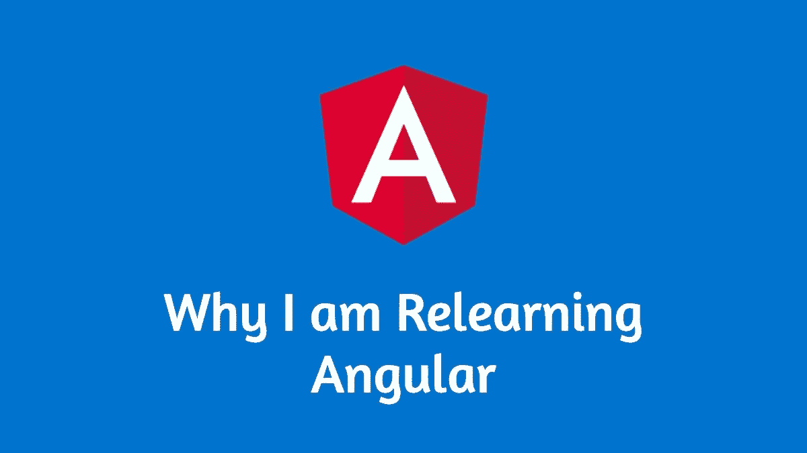

# 为什么我要重新学习 Angular

> 原文：<https://levelup.gitconnected.com/why-i-am-relearning-angular-5308555f4e8e>

## 我的角度学习中缺失的部分，以及我是如何修补它们的！

> *“经验是每个人给自己的错误起的名字——奥斯卡·王尔德”*

我职业生涯的大部分时间都在用 Angular 开发 web 应用程序。我是从学习做简单的静态`html`网站开始的。早些时候，我有过用 jQuery 开发动态 web 应用的经历。

学习角度基础知识是势不可挡的，但并不难。几门 Udemy 课程和大量 youtube 视频让学习变得简单有趣。在一家初创公司工作时，我接触了多个用 Angular 开发的项目，并从中获得了乐趣。

最近，我写了一篇关于我作为 Angular 开发人员所犯错误的文章。

 [## 我作为一个角度开发者所犯的错误

### 自白:作为一个 angular 开发者，我后悔没有做的事情，以及如何避免！

levelup.gitconnected.com](/mistakes-i-made-as-an-angular-developer-509277d60a10) 

我从反馈中发现，许多开发人员都有同样的感觉，因此我决定在学习 Angular 时，量身定制一个需要掌握的概念列表。

# 实现点

照片由 [Ryan Plomp](https://unsplash.com/@ryancp?utm_source=medium&utm_medium=referral) 在 [Unsplash](https://unsplash.com?utm_source=medium&utm_medium=referral) 上拍摄

直到你真正遇到正确的方法，你才会意识到你在用错误的方法写代码，如果你只是在看 youtube 教程，这永远不会发生。

在很好地掌握了 Angular 基础知识之后，我开始寻找 Angular 开源项目，并试图检查每个项目的架构。我奇怪地发现它令人困惑和复杂。我可以看到很多我从来不知道的概念。我可以看到我从未学习过的设计模式和从未尝试过的编码方式！

在这一点上，我意识到我必须学习 youtube 视频之外的东西。

> 不要误解我。只要了解一些基本知识，你就绝对可以用 Angular 编写出令人惊叹的、用户友好的 web 应用程序。但是创建一个企业级产品需要的不仅仅是这些！

# 这一切都归结于性能

在 [Unsplash](https://unsplash.com?utm_source=medium&utm_medium=referral) 上 [Veri Ivanova](https://unsplash.com/@veri_ivanova?utm_source=medium&utm_medium=referral) 拍摄的照片

这些年来棱角分明地出现了一个完整的框架。当我们说框架时，它是多个库的集合。由于这个原因，Angular 通常被认为有一个陡峭的学习曲线。

Angular 作为一个框架的许多核心原则在大多数在线课程中没有被教授或考虑。这种差距导致许多开发人员创建的应用程序不太灵活，难以增强，性能也较差。Angular 框架本身有无数种方法可以让应用程序变得更高效、性能更好，这是我们大多数人都没有学过或没有亲身体验过的。

这是我正在重新学习的东西。我正在学习如何让我的 Angular 应用程序更具性能和可维护性

# 包括什么

因此，正如我已经说过的，我正在修补我的棱角分明的知识，以下是我将包括的内容。这是我做的一个清单，上面列有我认为在学习时放在有角度的开发带上很重要的东西。你可以添加更多。

## 面向对象和类型脚本

由[迈克尔·泽兹奇](https://unsplash.com/@lazycreekimages?utm_source=medium&utm_medium=referral)在 [Unsplash](https://unsplash.com?utm_source=medium&utm_medium=referral) 上拍摄的照片

我们这些前端开发者，都是从 JavaScript 后台过来的。我们大多数人在开始使用 Angular 时，只会对 javaScript 有实际操作经验。当我翻译成 TypeScript 时，我甚至没有花一个小时来学习 TypeScript。我脑子里想的是' **TypeScript 是带类型的 JavaScript'(尽管我对 ES6 有基本的理解)。**

即使在某种程度上这是真的，我们也需要掌握一些类型脚本或典型 OOP 语言独有的概念。

例如，[接口](https://www.typescriptlang.org/docs/handbook/interfaces.html)不是我们在 ES6 中学到的概念，但是 TypeScript 支持接口是有角度的，在内部大量使用这个概念。其他与 OOP 相关的主题有 [Mixins](https://www.typescriptlang.org/docs/handbook/mixins.html) 和 ES6 中没有的访问修饰符。

另一个需要深入了解的重要话题是 typescript 的[依赖注入](https://khalilstemmler.com/articles/tutorials/dependency-injection-inversion-explained/) (DI)模式和 [Angular DI 框架](https://angular.io/guide/dependency-injection)。

学习这些概念，理解如何在 Angular 系统中使用它们来编写可读的、高性能的代码，可以让你成为一个更好的开发人员。

## Rxjs

泰勒·拉斯托维奇在 [Unsplash](https://unsplash.com?utm_source=medium&utm_medium=referral) 上拍摄的照片

Angular 遵循的核心理念之一是反应性的概念。一个反应式编程库正在帮助 Angular 更好地实现这一目标。

重要的事情先来。`Rxjs`不仅仅是关于`Observble`和`Subscriptions`。事情远不止如此。`Rxjs`可以让你的开发体验和代码可读性好很多。从一开始就反应性地思考是很重要的。

你可以从这里的[开始](https://blog.bitsrc.io/rxjs-patterns-efficiency-and-performance-10bbf272c3fc)。

## 变更检测和 NgZone

克里斯·劳顿在 [Unsplash](https://unsplash.com?utm_source=medium&utm_medium=referral) 上拍摄的照片

你玩过多少次类似下面的代码？

我们知道 Angular 正在执行一个变化检测周期，用最新的值更新视图。但是我们几乎一直在使用默认的变化检测策略。对于不同的应用，我们可以使用更多的策略。

这些功能也非常强大，可以让您的应用程序更快、性能更好。

你可以在这里了解更多关于变化检测策略[的信息。](https://blog.angular-university.io/how-does-angular-2-change-detection-really-work/)

`NgZone`是 Angular 执行变化检测的方式。“区域”的概念来自`[zone.js](http://npmjs.com/package/zone.js)`。作为开发者，不一定需要知道`NgZone`。但是更深入的理解有助于调试各种各样的问题。

也可以帮助编写高性能代码。如前所述，这种机制有助于 Angular 高效地执行变更检测。有些情况下，您并不真的需要触发变更检测。比如你在后台运行一个`setTimeOut`函数的时候。`setTimeOut`函数的每一次迭代都会触发变化检测，这会使你的应用程序变慢。如果您选择在`NgZone`之外运行这个`timeout`函数，您可以阻止变更检测的触发。

点击了解更多`NgZone` [。](https://medium.com/better-programming/zone-js-for-angular-devs-573d89bbb890)

## 内容投影

由[loc fürhoff](https://unsplash.com/@imagoiq?utm_source=medium&utm_medium=referral)在 [Unsplash](https://unsplash.com?utm_source=medium&utm_medium=referral) 上拍摄的照片

当谈到在线角度教程时，内容投影可能是最容易被忽略的话题。

内容投影是一种将任何内容投影到组件的角度技术。当您想要创建真正可重用的组件时，它真的很方便。

例如，您正在创建一个可以在整个应用程序中重用的确认模式组件。您可以使用`@Input`将以下数据传递给 modal。

1.  标题-模态的标题(字符串)
2.  正文—确认消息(字符串)
3.  动作— `cancel`和`okay`按钮

如果您稍后需要添加一个图像来指示确认是成功(绿色勾号)还是失败(红色叉号)，该怎么办？

您肯定可以向名为`type`的组件添加一个新的输入，并传递它。这次成功了。

但是如果需要模体有更多的内容呢？就像一个无线电广播组选择一些东西？如果您不断地添加每个案例，只会使您的可重用、轻量级组件变得庞大，可读性更差。

这就是内容投影派上用场的地方。您可以使用`<ng-content></ng-content>`语法将任何模板引用传递给组件。这样，您就可以创建更小的组件，用更少的业务逻辑服务于单一目的。多内容投影是实现结构化和灵活组件的一种非常强大的模式。

点击阅读更多关于内容投影[的信息。](https://dzone.com/articles/simplifying-content-projection-in-angular)

## 模板参考等

Christophe Hautier 在 [Unsplash](https://unsplash.com?utm_source=medium&utm_medium=referral) 上拍摄的照片

模板引用和`ng-template`语法可能会让初学者感到困惑。但是这些概念有助于编写高性能的应用程序。

模板引用变量只不过是对任何 DOM 元素的引用。当你结合`@ViewChild`来访问任何 DOM 元素时，保持 Angular 的快乐是很有帮助的。你可以把它想象成一个`jQuery` DOM 选择器。此外，当您想延迟加载组件时，`ng-template`会很有帮助。

附加学习

1.  `[@ContentChild](https://angular.io/api/core/ContentChild)`
2.  `[@CountendChildren](https://angular.io/api/core/ContentChildren)`
3.  `[@ViewChildren](https://angular.io/api/core/ViewChildren)`
4.  `[@QueryList](https://angular.io/api/core/QueryList)`

对构建你的下一个角度项目是有益的。

更多类似的文章👇

 [## Bharath Ravi | javaScript 文章

### 有能力的文章来提升你的网络技能。javaScript 全栈开发者 Bharath Ravi 的个人博客

bharathravi.com](http://bharathravi.com/) 

在 twitter 上找到我[这里](https://twitter.com/_bharath_ravi)。

黑客快乐！

# 分级编码

感谢您成为我们社区的一员！ [**订阅我们的 YouTube 频道**](https://www.youtube.com/channel/UC3v9kBR_ab4UHXXdknz8Fbg?sub_confirmation=1) 或者加入 [**Skilled.dev 编码面试课程**](https://skilled.dev/) 。

 [## 编写面试问题

### 掌握编码面试的过程

技术开发](https://skilled.dev)