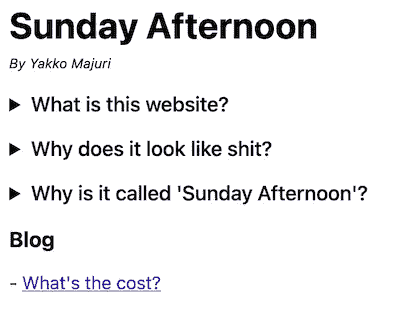

# 为什么我建立了自己的静态站点生成器

> 原文：<https://levelup.gitconnected.com/why-i-built-my-own-static-site-generator-d0b142db6407>

## 剧透:主要是为了好玩


照片由[克莱门特·海尔多特](https://unsplash.com/@clemhlrdt?utm_source=unsplash&utm_medium=referral&utm_content=creditCopyText)拍摄

> 最初发表于[我的个人博客](https://yakkomajuri.github.io/blog/teeny)。

# **背景故事**

我的[个人博客](https://yakkomajuri.github.io/)是使用名为 [Teeny](https://github.com/yakkomajuri/teeny) 的静态站点生成器创建的。

直到博客发布的前一天，Teeny 甚至还不是一个概念。它根本不存在，甚至在我的脑海里也不存在。

你看，很长一段时间以来，我一直想推出一个个人博客。

我曾经是 Medium 上技术内容的定期作者(不幸的是，这些天我没有太多时间)，但我渴望有一个家来出版更多未经打磨的、个人的“意识流”作品。

我热爱写作，只是想有一些东西激励我坚持下去，即使没有人阅读。

问题是，我遇到了大多数程序员都非常熟悉的一种情况:一种为附带项目增加越来越多范围的诀窍，以至于它们被放弃，再也见不到阳光。

在许多周末，我开始使用所有正确的工具和技术建立一个博客，编写干净的代码，让它“点燃喜悦”，然后到了周日晚上，手里拿着另一个回购协议，我再也不会重温。

所以几周前，我打破了这个循环。我发表了这个:



这是一个用普通 HTML 编写的糟糕的代码。但它比其他任何东西都好，原因很简单:它上线了。

这是一个很好的开始，但是，不幸的是，它缺少了我想要的一件东西:在 Markdown 中写作的能力。

Markdown 是自切片面包以来最好的东西，所以我的博客可能很烂，但它最好能够解析 Markdown。

所以我转向杰基尔。GitHub 页面本身支持 Jekyll，只需在 GitHub UI 中点击几下，您就可以开始运行了。

这很好，但是我失去了我想要定制页面的灵活性——GitHub 让你选择一个主题，就这样。

这是与 GitHub 页面原生集成的结果——如果我自己设置了 Jekyll，我就会拥有我需要的控制。但是我不是 Ruby 工具的忠实粉丝，所以我放弃了这个想法。

所以，我再一次求助于一个我相当熟悉的工具:盖茨比。

盖茨比很棒，我和他合作了很久。

在 PostHog，[我们的网站是用 Gatsby](https://github.com/PostHog/posthog.com) 构建的，我在工作的时候利用了很多 Gatsby 的工具(包括“底层”的东西)来完成工作。

这应该是我的舒适区。

我上了盖茨比的网站，选了一个主题，然后去工作。很快，问题就很明显了:太多了。

除了 Gatsby 附带的所有额外内容，许多 Gatsby 博客主题试图通过抽象出内部内容并展示一个`config.js`文件来让事情变得“更简单”,在那里你可以添加你的名字、简历、一些链接，剩下的事情由 Gatsby 来做。

但这是有代价的。我在目录中搜索了一会儿 favicon 文件，发现一些插件根据您可以在配置中设置的个人资料照片的路径自动生成了它，这清楚地表明了我的成本。

我真的不需要这些。

因此，我们又回到了起点。

在这个阶段，选择是:花一点时间做一些研究，可能找到一个适合我的工具，或者自己开发一个工具来做我需要的事情，仅此而已。

你已经知道发生了什么。

# **介绍田晶晶**

Teeny 是一个超级简单的静态网站生成器，专为满足我的需求而构建。

它所做的只是基于 HTML 模板和 Markdown 内容生成页面。

它做得很少，而且非常固执己见(*阅读:我太懒了，不想构建定制/条件处理程序*)，但是它允许我非常快速地构建一个我满意的博客。

本质上，你只需要考虑两个概念:模板和页面。

**模板**

模板是普通的 HTML，应该添加到一个`templates/`子目录中。

它们可以包含一个 id 为`page-content`的元素，Teeny 在这里添加解析 Markdown 内容生成的 HTML。

**页面**

Markdown 是 Teeny 的一等公民，所以你网站的所有页面都是由 Markdown 文件定义的。

文件不需要有任何实际的内容，所以如果你想用 HTML 定义一个页面，你只需要创建一个从页面文件引用的模板。

要指定页面应该使用什么样的模板，可以在页面文件的第一行添加 HTML 注释，如下所示:

```
<!-- template: blog -->
```

在上面的例子中，Teeny 会寻找一个名为`blog.html`的模板。如果没有指定模板，Teeny 会在`templates/`中寻找一个`default.html`文件并使用它。

这是一个青少年工作的例子。

> ***旁注:*** *Teeny 是我在看电影和打篮球之间编写的未经充分测试的代码。* ***但是*** *，如果想试试，可以用* `*npm i -g teeny-cli*` *或者* `*yarn global add teeny-cli*` *安装。这里的* *代码可用* [*。*](https://github.com/yakkomajuri/teeny)

要启动一个小项目，运行`teeny init`。这将在您的当前目录中创建以下内容:

```
.
├── pages
│   └── index.md
├── static
│   └── main.js
└── templates
    ├── default.html
    └── homepage.html
```

如果您随后运行`teeny build`，您将得到这样的结果:

```
.
├── pages
│   └── index.md
├── public
│   ├── index.html
│   └── main.js
├── static
│   └── main.js
└── templates
    ├── default.html
    └── homepage.html
```

`index.md`使用`homepage`模板，他们一起生成`index.html`。作为其他 SSG 的标准，静态文件从`public/`开始提供。

你还会注意到`main.js`也被移到了`public/`。Teeny 实际上将从`pages/`、`templates/`和`static/`中取出所有非模板和非页面文件，并按照与原始目录相同的结构将它们复制到`public/`。

这样做的原因是，我实际上不希望有“神奇的”导入，即您必须从与实际目录结构不对应的路径中导入静态资产。因此，我决定在必要时静态文件只存在于`templates/`和`pages/`中。

后来，我确实放弃了`static/`目录方法，因为可能有页面和模板都想使用的资产。来自`static/`的导入是“神奇的”，意味着你需要考虑`teeny build`的输出才能让它们工作。

Teeny 支持的最后一个命令是`teeny develop`。这将创建一个 HTTP 服务器来从`public/`子目录中提供文件。

它监听对文件的更改，并动态更新静态文件(天真地说，每次检测到更改时都要重新构建)。

# **最后的润色**

一旦我完成了 Teeny 的建设，我只用了很少的时间就建立并运行了这个博客。

我把 [Pico.css](https://picocss.com/docs/) 放在我的模板上，让网站立刻看起来好了 100 倍(对他们来说，大声喊出来，我喜欢它)，并部署我刚刚运行的新版本:

```
teeny build && gh-pages -d public/
```

这就是我如何在大约半天的时间里整理好我的博客。