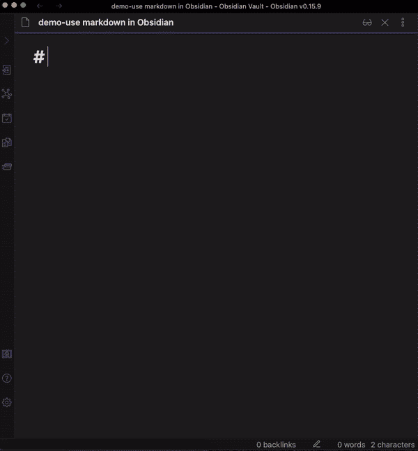
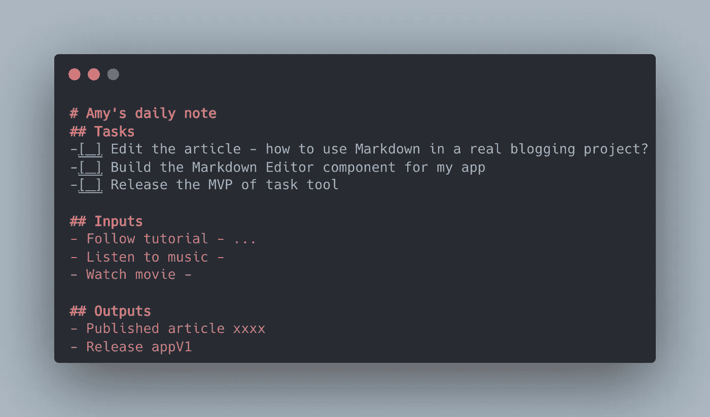
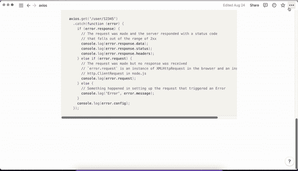
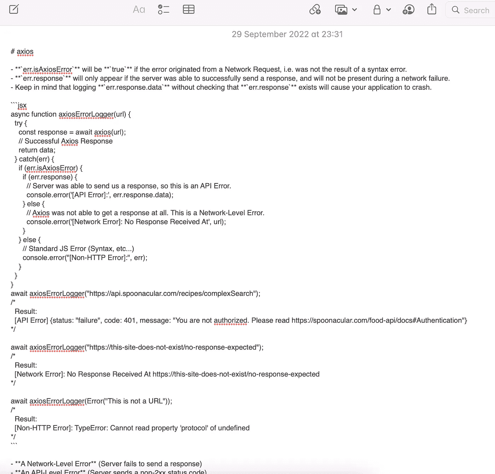
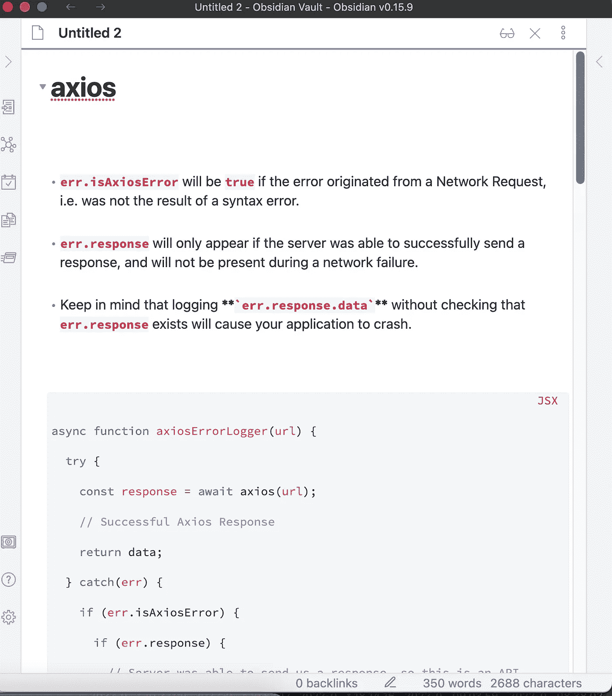
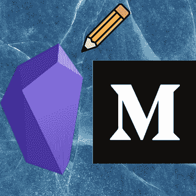
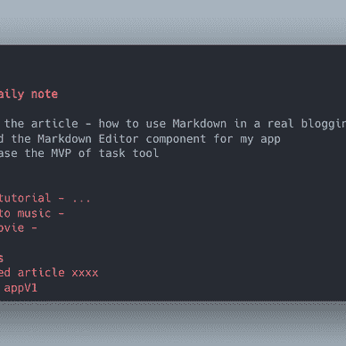
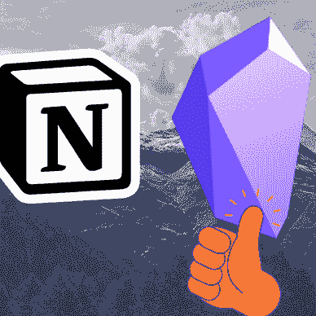

# 作为一名开发人员，我为什么选择 Markdown 而不是富文本编辑器来写笔记

> 原文：<https://levelup.gitconnected.com/why-i-choose-markdown-over-rich-text-editor-to-write-my-notes-as-a-developer-3738b31e060e>

## 使用基于 Vim 的编辑器和 Markdown 将您的笔记过程带到另一个层次。

在黑曜石内部写下降价。GIF 作者[李冠仪](https://medium.com/u/9f2dc23bfffa?source=post_page-----3738b31e060e--------------------------------)

# 动机

Markdown 是一种易读易写的标记语言，你可以用它来格式化你的作品，它在 Github 等许多网站以及 Obsidian、opinion 等笔记应用程序中都得到了支持。虽然富文本编辑器([所见即所得](https://en.wikipedia.org/wiki/WYSIWYG) HTML 编辑器)，如谷歌文档和微软 Word，让我们可以轻松地格式化我们的作品，但我个人不太喜欢在完成一个简短的笔记之前，用鼠标点击这么多次来进行一个简单的格式化。除此之外，我在富文本编辑器中使用 Markdown 语法还有很多其他原因。本文将介绍我喜欢使用 Markdown 语法做笔记的一些主要原因。

# 原因 1:快速获取信息

如果 Markdown 的快速格式化对你来说很自然，那么你更有可能写下笔记，尤其是那些需要格式化的笔记。因为你越容易把信息按照你想要的方式格式化，你在笔记系统(过程)中遇到的摩擦就越少。使用任何笔记系统，你达到目标的摩擦越多，完成目标的难度就越大。

快速捕获的另一个好处是，在记笔记的过程中，您可以集中思考，因为您不必通过移动计算或单击鼠标找到/单击/输入操作按钮来格式化笔记，从而转移您的注意力。

创造集中思考空间的快速捕捉模式也在[为什么我作为一名科技作家使用黑曜石做笔记/制作系统](https://amy-juan-li.medium.com/why-i-use-obsidian-for-note-taking-making-system-as-a-tech-writer-e208699e0011)中讨论过。

# 原因 2:易读易写

> Markdown 旨在尽可能地易于阅读和编写。

与 HTML 的出版格式不同，Markdown 是一种写作格式。你可以很容易地阅读什么是标题、项目符号列表等。

照片由[李冠仪](https://medium.com/u/9f2dc23bfffa?source=post_page-----3738b31e060e--------------------------------)

# 原因 3:近乎标准化(独立于平台)

如今，几乎所有的笔记应用程序都使用 Markdown 或富文本编辑器，或者两者都使用。如果你习惯于为你的日常笔记编写 markdown 语法，你就不需要担心不同应用程序、设备或任何操作系统中的不同语法，这与富文本编辑器不同。当你试图将笔记从一个应用程序移动到另一个应用程序时，格式会改变很多次。

有了 Markdown，你可以轻松地将你的 Markdown 笔记从 Obsidian 导出到其他 Markdown 笔记应用程序。因此，以 Markdown 为基础，您可以利用不同的应用程序实现不同的目的。您可以轻松地在不同的应用程序中使用它。例如，你可以使用免费的在线工具如 [Pandoc](https://pandoc.org/) 轻松地从 Markdown 生成 PDF/HTML。

将概念注释导出为降价:

将注释从概念导出为降价。GIF 作者[李冠仪](https://medium.com/u/9f2dc23bfffa?source=post_page-----3738b31e060e--------------------------------)

将导出的降价内容粘贴到 Apple Notes 中:

图片由[李冠仪](https://medium.com/u/9f2dc23bfffa?source=post_page-----3738b31e060e--------------------------------)

粘贴到黑曜石(根据降价规则自动格式化):

# 不是所有人

对于那些不经常写格式化文本的人来说，markdown 语法可能会对您的原始生产力造成过度的伤害。但是如果你正在处理大量的涉及格式的笔记，那么我打赌 markdown 会为你节省大量的时间用于更有价值的创作过程，而不是重复地将你的数字移动到鼠标点击再点击，然后再回到你的写作中。

如果你想在 Medium 上阅读来自 [*李冠仪*](https://medium.com/u/9f2dc23bfffa?source=post_page-----3738b31e060e--------------------------------) *和成千上万其他作家的每一个故事，考虑成为 Medium 会员* *。每月 5 美元，你可以无限制地访问媒体内容。如果你通过我的推荐链接* *注册，我会得到一点佣金。*

# 进一步阅读:

[李冠仪](https://amyjuanli.medium.com/?source=post_page-----3738b31e060e--------------------------------)

## 降价提高了生产率

[View list](https://amyjuanli.medium.com/list/markdown-levels-up-productivity-1a1b82b0f5dc?source=post_page-----3738b31e060e--------------------------------)3 stories [## 如何将黑曜石 Markdown 转化为中型博客

### 格式化要在媒体编辑器中使用的基于减价的笔记。

amy-juan-li.medium.com](https://amy-juan-li.medium.com/convert-obsidian-markdown-to-medium-blog-2b52f9bd1c28)