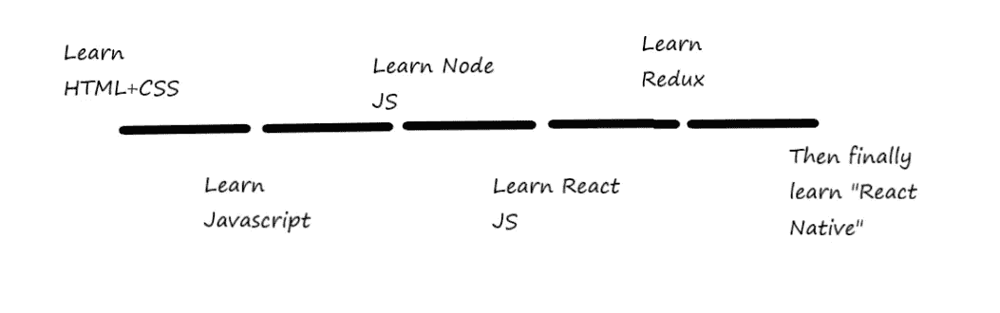
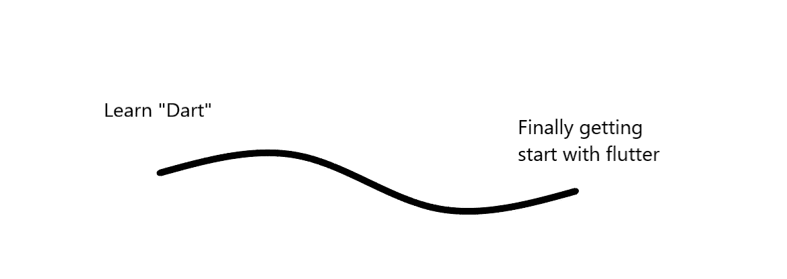

# 为什么我开始学习 Flutter，即使我是一名数据科学家

> 原文：<https://levelup.gitconnected.com/why-i-have-started-learning-flutter-even-being-a-data-scientist-e46089fa8711>

## 让你的深度学习模型更上一层楼

照片由 [**cottonbro**](https://www.pexels.com/@cottonbro?utm_content=attributionCopyText&utm_medium=referral&utm_source=pexels) 发自 [**Pexels**](https://www.pexels.com/photo/2-women-sitting-on-brown-wooden-chair-4101137/?utm_content=attributionCopyText&utm_medium=referral&utm_source=pexels)

如果您想要构建一个应用程序，利用您定制的人工智能模型来获得更好的用户体验，但是，作为一名数据科学家，您没有太多时间从头开始学习所有的 web 开发工具，该怎么办？

让我们深入到同一个场景中。我将帮助您选择数据科学领域，为您的 Android 或 IOS 应用程序赢得更多受众。我还将讨论软件开发工具包，它可以帮助你在更短的时间内开发一个人工智能应用程序。

当我们开始从事机器学习时，我们通常会花时间研究回归、打包和提升等基本算法。这些算法对需要预测未来销售的大型行业非常有用。

但是，如果你想建立一个人工智能驱动的应用程序，每个群体都可以使用，那么棘手的部分就来了。在这种情况下，如果你停留在那些基本的机器学习算法上，那么你可能不会为你的应用程序找到任何好的用例。

当我们开始致力于深度学习时，事情变得令人兴奋。在这个领域，我们有大量的用例来帮助更多的人在日常社交生活中使用。

我们有三大深度学习领域:自然语言处理、预测建模、计算机视觉。

让我们一个接一个地探索它们，并尝试找到可以拥有大量受众支持的用例的领域。

谈自然语言处理。这里，最常见的用例是聊天机器人。是的，还有许多其他次要的用例，如发票处理、网络挖掘、情感分析，但最终，所有这些次要的用例都会以某种方式帮助我们调整一个更好的聊天机器人。

因此，如果你在 NLP 领域，那么你将帮助开发一个更好的聊天机器人，以获得更好的用户体验。

拥有许多客户的公司通常使用这些聊天机器人来帮助他们。但是，作为个人，这不是我的游戏。

一个类似的例子是预测建模；即使你建立了一个预测比特币价格的产品，也没有人会相信你的数字。所以，没有必要花时间去构建一个预测的 android 应用程序。

最后，唯一能帮我获得更多用户群的领域是计算机视觉。根据 Statista 的[调查，今天有 30 亿人使用智能手机。而且，在这 30 亿人中，](https://www.statista.com/statistics/330695/number-of-smartphone-users-worldwide/#:~:text=How%20many%20people%20have%20smartphones,in%20the%20next%20few%20years.) [68%的成年人在发帖前会编辑自己的图片。](https://fstoppers.com/mobile/68-percent-adults-edit-their-selfies-sharing-them-anyone-95417)

> 所以，现在你终于有了可以让你赚钱的数据科学领域的想法。够刺激吗？

现在，我们知道计算机视觉可以帮助我们建立一个 AR 驱动的镜头，类似于我们在 Instagram，Snapchat 和脸书中使用的镜头。此外，我们可以利用 GANs 在图像和视频中产生人工效果。

尽管如此，我们需要一个平台来帮助我们的模型与使用 android 或 IOS 设备的外部世界见面。

唯一的问题是，我是一名数据科学家，我没有时间学习 android studio 和 java 来制作我的应用程序。我需要一些轻微的学习曲线和快速建立用户界面的方法。

所以，我有两个选择，要么学 React Native，要么走旋舞。我检查了 react native 和 flutter 的学习路径。这里是 react native 入门的学习路径。

React 本土学习路径:作者绘制

所以，这肯定不合适，因为我等不及为最终用户推出我的深度学习模型了。因为那样就没用了。

现在让我们检查颤振的学习路径。

颤振学习路径:作者绘制

> 惊讶吗？没错。

现在我们正在谈话。最后，我有一个工具可以帮助我在更短的时间内为我的深度学习模型开发一个强大的 android 应用程序。我并没有因为没有遵循学习母语的漫长道路而失去什么。我研究了 flutter，发现 flutter 的上市时间比 Vue JS、reach native JS 和 angular JS 要短得多。

此外，flutter 还支持 firebase，并添加了机器学习工具包来支持我们的机器学习应用程序。

# 结束点

本文到此为止。我们讨论了不同的深度学习领域，以寻找机会向外界展示我们的深度学习模型。

然后，我们讨论了如何在更短的时间内帮助我们生产深度学习模型。

我希望你喜欢这篇文章。更多精彩文章敬请期待。

谢谢你的阅读！

如果你想要更多关于数据科学和技术的精彩文章，[这里是我的简讯](https://mailchi.mp/4d33914bb328/pranjals-newsletter)。

# 分级编码

感谢您成为我们社区的一员！[订阅我们的 YouTube 频道](https://www.youtube.com/channel/UC3v9kBR_ab4UHXXdknz8Fbg?sub_confirmation=1)或者加入 [**Skilled.dev 编码面试课程**](https://skilled.dev/) 。

 [## 编写面试问题+获得开发工作

### 掌握编码面试的过程

技术开发](https://skilled.dev)