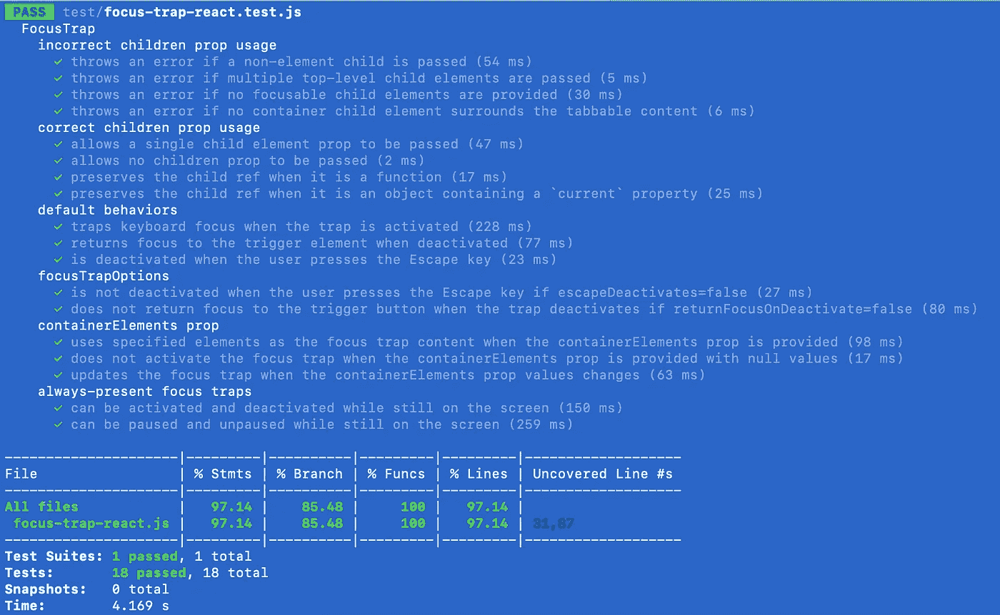

# 为什么我使用 react 测试库重写了 focus-trap-react 测试套件

> 原文：<https://levelup.gitconnected.com/why-i-re-wrote-the-focus-trap-react-test-suite-using-react-testing-library-2a4f35781edd>

## 像用户一样测试


图片来源:[pix abay 上的 skitter photo](https://pixabay.com/photos/mouse-trap-cheese-device-trap-2846147/)

我 2021 年的目标之一就是为开源多做贡献。通过使用 [React 测试库](https://testing-library.com/docs/react-testing-library/intro/)为`[focus-trap-react](https://github.com/focus-trap/focus-trap-react)` npm 包重新编写测试套件，我在 2020 年 12 月取得了领先。这是我合并的[拉请求](https://github.com/focus-trap/focus-trap-react/pull/222)。

如果你还没有听说过这个包，`focus-trap-react`是在你的应用程序的特定区域暂时捕获键盘焦点的最好的解决方案之一；例如，当模态或面板打开时。我们不希望用户跳出模态进入背景中的内容，不是吗？

在本文中，我们将回顾我重新编写测试套件的动机，以及用 React 测试库编写测试带来的一些好处。

# 原始测试套件的缺陷

值得注意的是，在我开始之前，这个包确实有一些测试。这些测试是使用 React 的内置测试工具`[react-dom/test-utils](https://reactjs.org/docs/test-utils.html)`编写的。

但是，事实是:没有人真正直接使用内置的 React 测试工具。就连 React 的医生自己都建议你用 React 测试库或者酵素！

因此，为了使测试更易于维护，并且让 React 编程世界的其他人更熟悉，我将测试套件切换到 React 测试库。

(尽管，`react-dom/test-utils`确实有一些非常时髦的方法名，我们现在已经错过了。如果你不相信我，请看例子:`[scryRenderedDOMComponentsWithClass](https://reactjs.org/docs/test-utils.html#scryrendereddomcomponentswithclass)`。)

第二，现有的测试包括模拟方法来模拟创建一个真正的焦点陷阱。在专门用于测试目的的组件中实现了一个`_createFocusTrap` prop。事实上，我们没有像开发人员在他们的应用程序中使用组件时那样实例化一个新的 focus trap 组件，这是一个非常大的危险信号。

第三，测试主要是断言当焦点陷阱被激活或停用时，某些函数被调用或不被调用。这些断言看起来像这样:

```
expect(mockCreateFocusTrap).toHaveBeenCalledTimes(1);
```

这里的问题是，当我们断言这个函数被调用时，我们实际上并没有说任何关于实际用户体验或 UI 中正在发生的事情。这个函数被调用的事实只是一个实现细节，我们的用户——坦白地说，我们的测试——不需要知道。

那么，我们如何解决这些问题呢？有没有更好的办法？

# React 测试库是一种更好的测试方式

React Testing Library 的核心理念是，您应该以用户与 UI 交互的相同方式测试您的组件。

不再强制更新组件的状态或断言函数被调用。相反，我们做用户会做的事情:点击按钮，输入文本，提交表单。

所以，关于`focus-trap-react`包，我就是这么做的。我通过与 UI 交互来编写测试，只做用户可以做的事情。

例如，对焦点陷阱默认行为的一个测试如下:

1.  呈现包含一个按钮的组件，该按钮在单击时切换焦点陷阱内容
2.  单击按钮显示焦点陷阱内容并激活陷阱
3.  验证焦点是否移动到焦点陷阱内的第一个元素
4.  遍历焦点陷阱中的可制表元素，然后验证焦点是否确实被捕获，并在从焦点陷阱中的最后一项跳转时返回到开始处
5.  单击一个按钮以停用焦点陷阱
6.  验证焦点是否返回到最初打开焦点陷阱内容的原始触发器按钮

这样好多了！我们不仅以用户与 UI 交互的相同方式进行测试，而且在测试中对这些行为进行断言。这给了我们更好的信心，让我们相信事情会正常工作，毕竟，这是拥有一个测试套件的全部目的。

# 结论

以用户与应用程序交互的方式测试应用程序是一种更好的测试方式。您的测试变得更加真实，让您更加放心，您的应用程序可以为您的用户正常工作。

另外，看看漂亮的代码覆盖率吧！



focus-trap-react 测试套件和代码覆盖率