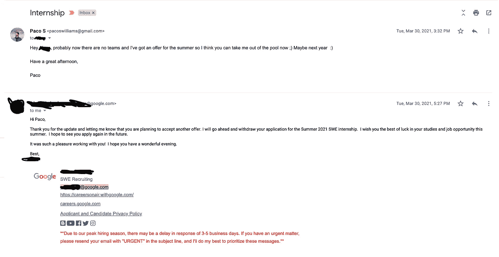
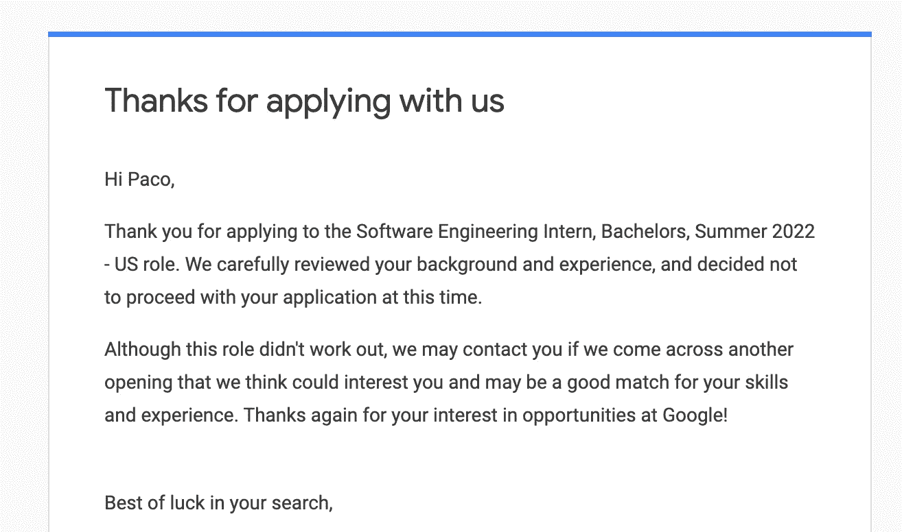

# 为什么我拒绝了谷歌软件工程实习

> 原文：<https://levelup.gitconnected.com/why-i-turned-down-a-google-software-engineering-internship-484b71b91713>

照片由[米切尔罗](https://unsplash.com/@mitchel3uo?utm_source=medium&utm_medium=referral)在 [Unsplash](https://unsplash.com?utm_source=medium&utm_medium=referral)

## 我想这不是命中注定的

去年，我向所有大型科技公司申请了软件工程实习。虽然我遭到了几次拒绝，但我还是投入工作，从头开始重新编写所有的数据结构，同时每周至少练习 3-5 次 leetcode。

我紧张得不想去面试，因为我已经拖了很长时间了。

对于计算机专业的学生来说，申请实习是一个非常独特的机会，但同时，压力也非常大。闯入大科技就像一枚荣誉徽章，只有少数学生可以带着他们的车在校园里游行。面试过程可能是申请时最难的部分之一，但只有一半是技术难度。

**另外 50%是你的心理准备，你对自己的信念。**

我可能不是唯一一个觉得这些面试可以成就或摧毁你职业自尊的人，很难不认为通过面试证明你是一名伟大的工程师，而失败意味着你不是。一开始我觉得自己只是运气好，但我喜欢麦克雷格的名言“运气就是机遇和准备的结合”

我通过了几家大型科技公司的面试，同时也收到了其他公司的拒绝邮件。

其中包括谷歌，我梦想中的公司。

当我被告知我已经通过了面试程序时，我欣喜若狂。我简直不敢相信，当我接到电话时，我在发抖。

我终于成功了。所有的工作都得到了回报，对吗？

不完全是。

这是 covid 上市的一年，谷歌有一个名为“主机匹配”的流程，你可以与一个团队匹配，但可能无法匹配，不得不在下一个招聘季节再次尝试。

因为 covid，他们花了很长时间，那年我也在亚马逊实习。然而，亚马逊的实习即将结束，我仍然没有被分配到一个团队。

我的很多同事，有些人的简历比我好得多，都经历了同样的事情。

随着时间的流逝，夏天越来越近了，而我还没有为夏天安排实习，因为谷歌花了几个月的时间。

我开始申请其他实习机会，因为我担心自己可能会成为找不到工作的幸运儿之一。

我回到了学习模式，不知何故在 Twilio 和 MongoDB 获得了两份实习机会。

# 然后谷歌宣布了改变一切的事情

虽然其他公司不介意在墨西哥进行远程实习，有些公司也不介意亲自实习，但谷歌却不这么认为。

他们说，由于墨西哥的规定，实习生一周只能工作 30 个小时，这听起来是件好事，但有一个小小的警告。

他们“不能亲自做”,但看起来他们也不想做。

尽管墨西哥实习生仍将与美国团队远程合作，但他们将获得根据国家调整的工资。

我不会说实际的数字，但我们只能说，墨西哥实习生的薪酬将比做同样工作的美国同事少 8 倍左右(好吧，每周少 10 小时)。

听着，我并不是在抱怨工资，因为即使减少了工资，工资仍然与墨西哥的入门级工作相当。

让我困扰的是，我梦想中的公司给出了一些可疑的借口，仅仅因为我们不在美国，我们的工作价值就比我们的美国同行低 8 倍。

我知道这不是一个真正的原因，因为一些在脸书和优步实习的朋友即使在远离墨西哥的地方工作，也仍然得到同样的报酬。

我当时已经在西班牙，并收到了欧洲其他公司的邀请，所以我做了一些我从来不相信自己会做的事情。

我要求我的招聘人员把我从这个过程中剔除出去，因为虽然我热爱谷歌，但我不愿意仅仅因为我在离美国 200 英里的地方就受到不公平的待遇。

接下来的一周，我的一些朋友告诉我，他们接到了可能进行团队配对的电话，所有人都得到了配对。

我不能说这样做没有坏处。这个假设在我脑中出现了几个星期。

我不知道这是否是一种应对机制，或者我是否会被匹配，但我相信我做出了正确的选择，没有参与那个夏天在谷歌发生的任何事情。

最糟糕的是，我想，好吧，我已经申请过一次了，明年夏天我会申请的。

然而，即使有了一份更令人印象深刻的简历(第一份简历主要是兼职项目),还有亚马逊和 Twilio 的实习经历，谷歌还是决定不再面试我。

## 也许是我经历太多了？

从这封邮件中你可以看到，这种情况发生了两次。

我不能肯定地说谷歌有不良意图，这是一个生意，也许墨西哥的法规不值得在那个夏天为他们制定。

我想指出的是，我的招聘人员非常棒，在我需要的时候给了我很多帮助。

我想我们永远不会知道，但我希望我做了正确的选择！

# 你认为我应该做什么？

请在评论中告诉我！

# 分级编码

感谢您成为我们社区的一员！更多内容见[级编码出版物](https://levelup.gitconnected.com/)。
跟随:[推特](https://twitter.com/gitconnected)，[领英](https://www.linkedin.com/company/gitconnected)，[通迅](https://newsletter.levelup.dev/)
**升一级正在改造理工大招聘➡️** [**加入我们的人才集体**](https://jobs.levelup.dev/talent/welcome?referral=true)