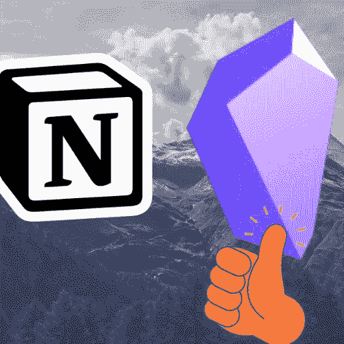
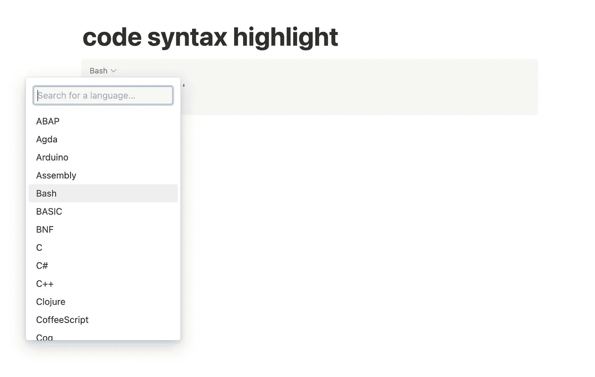
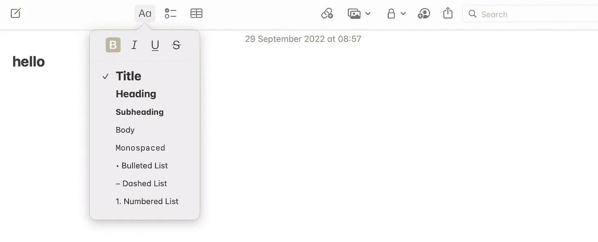
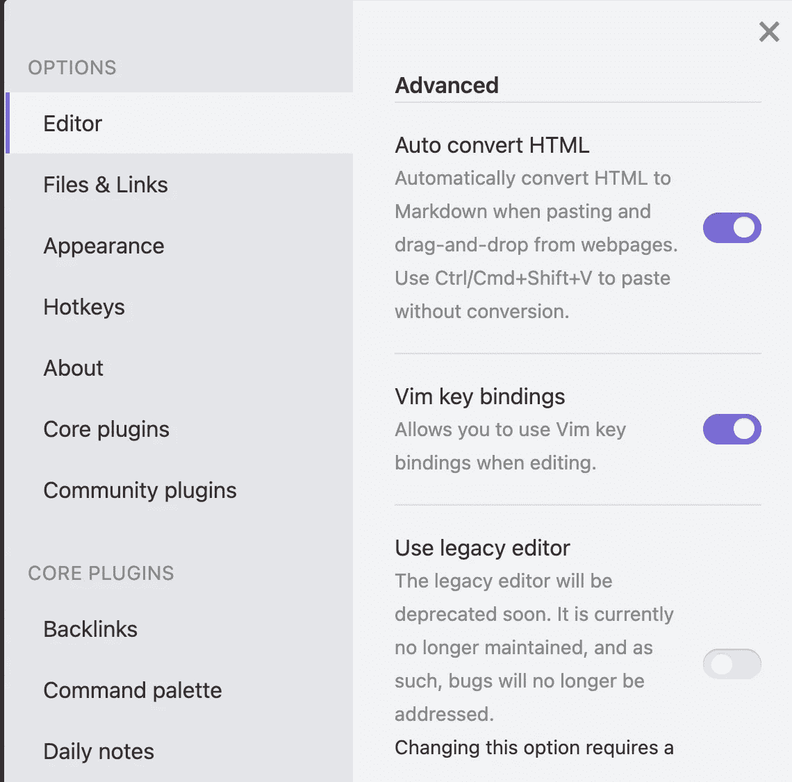
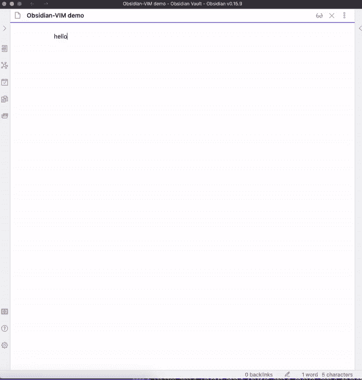
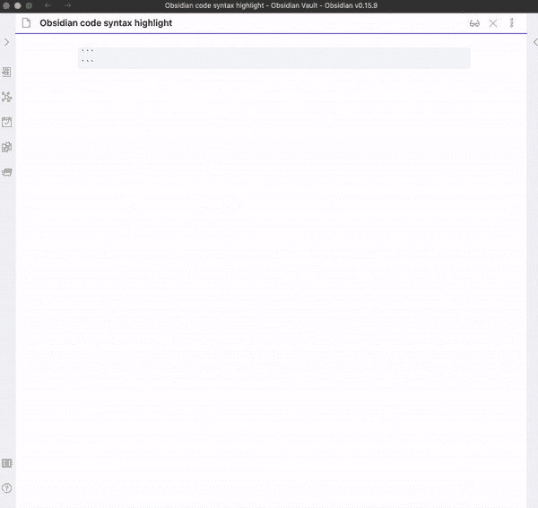
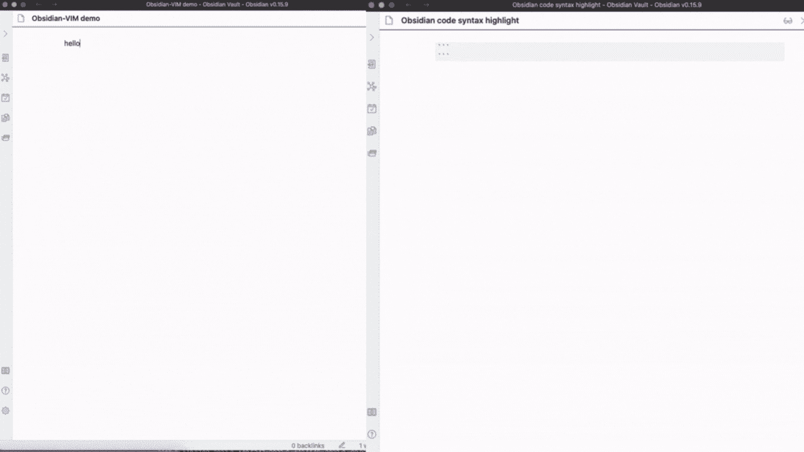

# 作为一名软件开发人员，我从观念转向黑曜石的三大原因

> 原文：<https://levelup.gitconnected.com/why-i-use-obsidian-for-note-taking-making-system-as-a-tech-writer-e208699e0011>

## 使用 VIM 快速输入，使用 Markdown 有效格式化笔记。

作者使用 [Canva](https://www.canva.com/) 创建的图像。

# 动机

作为一名程序员，我个人更喜欢键盘，以至于基于 VIM 的文本编辑器总是我日常编码工作和技术写作工作的首选。VIM 增强的这种专注的输入和编辑工作模式帮助我快速输入我的想法并做出快速的改变。除了**快速剪辑笔记**之外，我还需要把不同时空产生的很多点(想法)连接起来，重新创造一个新的笔记想法。所以，**快速搜索**对我来说也是必须的。

## 那么，为什么我放弃用观念做笔记呢？

毫不奇怪，我实际上是一个观念的大粉丝，但当涉及到搜索文件和导航不同的文件时，它变得迟缓，只是因为它需要强大的网络连接。在这一点上，我很欣赏黑曜石的离线模式，它完全离线工作，能够在不同的笔记之间快速导航。这种离线模式几乎为我提供了一个**集中的工作空间**来管理我的笔记和想法，而不会被网络连接打断，这极大地提高了包含头脑风暴在内的日常写作过程的效率。我个人讨厌因为网络问题而无法保存草稿笔记的时候，这种情况在使用 concept 作为笔记应用程序时经常发生。

## 作为一名开发人员和一名科技作家，需要更多

此外，我还需要格式化我的笔记，尤其是我正在为我的博客起草一篇文章，或者我的应用程序的文档(例如 Github *README.md* 文件和数字产品的文档)。所以， **Markdown** 语言很自然地出现来满足我的需求，这在观念内部得到了支持。关于学习减价的更多内容可以在这篇文章中找到。

 [## 使用降价来提高你的生产力

### 格式化文本，创建代码块和其他复杂的图表。

amy-juan-li.medium.com](https://amy-juan-li.medium.com/level-up-your-productivity-using-markdown-75f402abc8e9) 

另一个来自技术博客的强烈需求是一种轻松的方法来创建带有语法高亮特性的代码块。尽管 ideal 支持 Markdown，但它并不完整。最困扰我的是代码块的事情。最直观的方法是不用离开键盘就能输入我需要的一切。但是在 concept 中会发生这样的情况:你必须手动打开一个下拉菜单，以便选择匹配的编程语言来匹配代码语法。

在 concept 中，为了突出代码语法，您必须手动选择编程语言。

# ideal 和其他类似的笔记应用程序缺少什么

## 缺失#1:没有 Vim 支持，速度不够快

快速打字不会降低你的注意力，反而会提高你的注意力，这与吉姆·克维克和蒂姆·费里斯提倡的著名的“快速阅读”有着相同的原理。我把这个想法扩展到**快速剪辑**。如果你是一个打字很快的作家，我相信 VIM 可以把你的写作提升到另一个水平。

## **遗漏#2:格式化很难**

嗯，几乎所有的笔记应用程序都有格式化你的笔记的选项。例如，如果你是 Apple Notes 用户，你要么必须手动点击顶部菜单并从下拉列表中选择你需要的格式，要么如果你是一名键盘用户，你可能想学习许多复杂的命令。

在 Apple 备忘录中手动选择文本格式

嗯，我完全同意记忆快捷方式，比如用`Command-N`创建一个新笔记，因为它非常用户友好(`N`代表新笔记)，并且在许多应用程序中也经常使用，这值得我们经常使用它。问题是为什么我必须记住各种复杂的，甚至“无意义”的命令组合来应用一些非常常见的格式，如标题，项目列表，引用等..以 Apple Notes 为例:你必须输入`Shift-Command-H`才能应用标题格式，输入`Shift-Command-7`才能应用项目符号列表格式，输入`Shift-Command-9`才能应用编号列表格式。如此等等。当然，我可以记住所有的命令，但碰巧的是，我必须记住来自其他笔记应用程序的其他不同命令才能实现相同的目标。关键是这值得吗？不，我不这么认为。幸运的是 Markdown 来拯救。

## 缺失#3:缺乏专注的工作空间

笔记者的注意力杀手:

*   依靠网络连接
*   过多使用鼠标

解决方案:

*   支持离线模式
*   支持 VIM 和降价

当涉及到简单的笔记活动和快速搜索时，idea 很慢，因为它严重依赖于网络连接。此外，我更喜欢把注意力集中在我的笔记上，包括格式化笔记，而不是跳到额外的不相关(或不必要或多余)的动作，如移动鼠标、点击菜单、选择正确的选项等..Markdown 和 VIM 都为我节省了大量记笔记(输入)和记笔记(输出)的时间，为我现在的注意力和内心的平静提供了一个非常专注的工作空间。写作很有趣，但是合适的工具会让它变得更有趣、更愉快。😇

# 黑曜石来拯救(满足我作为开发人员的基本需求)

## 离线模式

黑曜石完全离线工作。所有文件都存储在我自己的设备中。我可以随时写、检查和编辑我的笔记，而不会被烦人的网络连接所困扰。

## 内置 VIM

黑曜石支持内置 VIM，所以你只需要通过 `Obsidian -> Settings -> Editor -> Vim key bindings`打开它

从设置->编辑器打开 Vim 键绑定

在黑曜石内部使用 **VIM** 的快速演示:

使用 VIM 命令在黑曜石中书写(GIF 由[李冠仪](https://medium.com/u/9f2dc23bfffa?source=post_page-----e208699e0011--------------------------------)

## 带有语法突出显示的代码块

这个功能在 Apple Notes 等很多笔记类 app 中完全被忽略了。但是对开发者来说要求太高了。

在黑曜石内部使用 Markdown 快速创建高亮代码块(GIF 由[李冠仪](https://medium.com/u/9f2dc23bfffa?source=post_page-----e208699e0011--------------------------------))

## 演示:使用黑曜石编写 VIM 和 Markdown

Obsidian 同时具备 VIM 和 Markdown 功能:(左)基于 VIM 的编辑器；(右)降价。GIF 由[李冠仪](https://medium.com/u/9f2dc23bfffa?source=post_page-----e208699e0011--------------------------------)

# 结论

通常有两种情况让我们决定是否需要某样东西。一个是我们知道我们需要它，因为我们需要它来生存，最好的例子是我们每天都需要食物。所以我们总是没有任何借口地为我们的日常食物留出足够的钱。另一个是我们不确定我们是否需要使用或购买一些产品，直到我们看到它们，然后我们告诉自己这是我们生活中必须的。一个典型的例子是 iPhone。考虑到几年前的价格，我认为我在日常生活中不需要 iPhone。但当我碰巧使用它时，我发现自己沉迷于它的‘智能’。😂好了，让我们回到本文的主题。在我知道黑曜石之前，我就已经强烈需要一个支持 VIM，Markdown，离线模式，非常可定制的笔记 app，这些都是黑曜石的特色。在我们的生活中有这样一个奇妙的产品是非常幸运的。又是一个快乐的日子来分享找出正确的笔记/制作系统的进展。

本文的视频版本:

[https://youtu.be/e2IkNOwqfbo](https://youtu.be/e2IkNOwqfbo)

[*如果你想在 Medium 上阅读来自*](https://medium.com/@amy-juan-li/membership)**和成千上万其他作家的每一个故事，考虑成为 Medium 会员* *。每月 5 美元，你可以无限制地访问媒体内容。如果你* [*通过我的链接*](https://medium.com/@amy-juan-li/membership) *注册，我会得到一点佣金。**

# *您可能会喜欢其他相关视频:*

* [## 如何将黑曜石 Markdown 转化为中型博客

### 格式化要在媒体编辑器中使用的基于减价的笔记。

amy-juan-li.medium.com](https://amy-juan-li.medium.com/convert-obsidian-markdown-to-medium-blog-2b52f9bd1c28)* * [## 通过我的推荐链接-李冠仪加入媒体

### 阅读李冠仪的每一个故事(以及媒体上成千上万的其他作家)。你的会员费直接支持李冠仪…

medium.com](https://medium.com/@amy-juan-li/membership)*