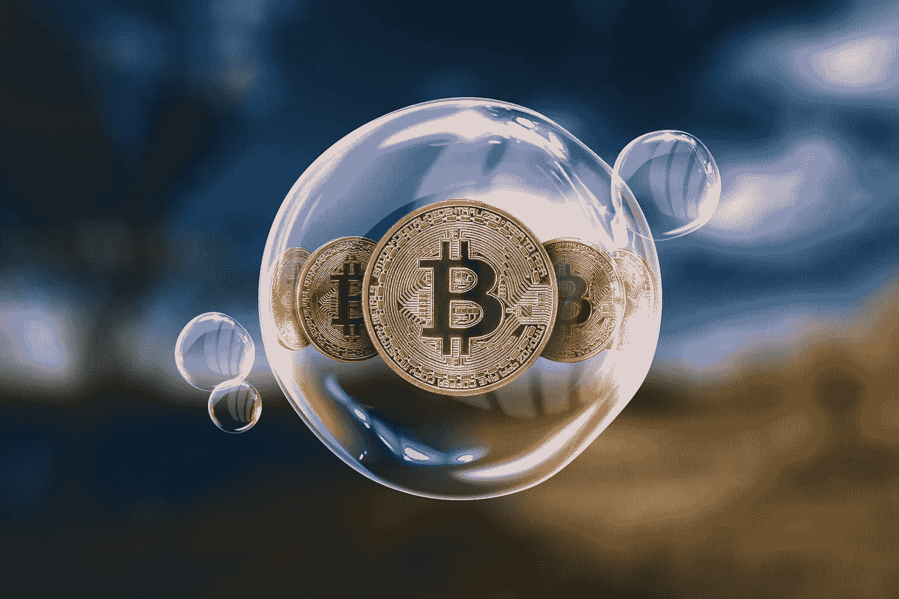
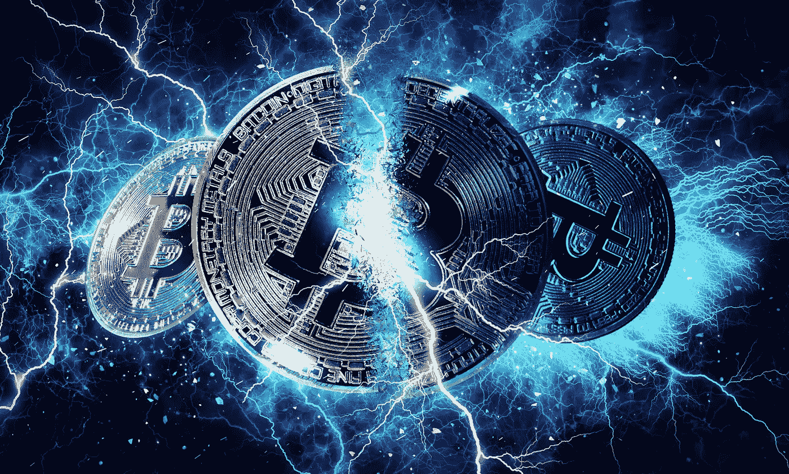

# 为什么我对比特币最近的价格暴跌感到高兴

> 原文：<https://levelup.gitconnected.com/why-im-glad-about-bitcoin-s-recent-price-crash-23241156ffac>

## 以及为什么我要长期坚持下去

来源: [Shutterstock](https://www.shutterstock.com/image-photo/gold-coins-bitcoin-soap-bubble-concept-781882801)

在 2021 年 1 月进行了第一次尝试性的比特币投资后，我无法摆脱后悔没有早点开始的感觉。

我迷上了比特币，并从各种渠道尽可能地了解它。我阅读书籍和文章，如饥似渴地听我能找到的每一个相关的播客。我开始在推特上关注所谓的比特币最大化主义者。

我感到幸运的是，当价格在每比特币 3 万美元左右时，我看到了光明并采取了行动——3000 美元或 300 美元会更好，但你不能回到过去。我稳定地一次买一点，高兴地看着价格涨到超过 63，000 美元的历史新高。

然后在今年五月，事情发生了:

来源: [Coindesk 播客主持人 NLW 在推特上](https://twitter.com/nlw/status/1394999561014456327?s=20)

在 5 月份几天的一系列极端抛售中，比特币的价格暴跌回 34000 美元的收盘价。全世界的铁杆比特币玩家、散户投资者、投机者和机会主义者都在舔自己的伤口。怀疑论者和愤世嫉俗者放声大笑。

具有讽刺意味的是，在我对比特币热情高涨的时候，我写了一篇呼吁价格大幅下跌的文章[——作为能够以更低的价格购买更多东西的一种手段。我觉得自己是最后一个到达派对的人，希望有机会买到更多更便宜的东西。](/id-love-for-the-price-of-bitcoin-to-drop-radically-9d99f7c6bf88)

五月，我的愿望实现了。

# 是什么原因造成的？

许多因素无疑起了作用。我们可能永远也不会知道哪一件事是罪魁祸首，但是很多人都有自己的理论。

埃隆·马斯克似乎成了“崩溃的代言人”。最近，许多人(包括我自己)为他为比特币开辟了一条道路而喝彩。许多人(也包括我自己)厌倦了他的干预。

虽然我对他的各种举措表示赞赏，但我也指出，他和其他各种名人影响者对 crypto 的过度影响是有害的，会降低可信度。当一个渴望曝光的亿万富翁把比特币当作他的个人玩物时，它削弱了向更广泛的世界传达比特币是一种严肃的投资资产或金融工具的力量。

来源:[埃隆·马斯克的推特](https://twitter.com/elonmusk/status/1392602041025843203?s=20)

其他事情可能也导致了价格暴跌——有些是埃隆造成的，有些是他加剧了价格暴跌(包括对比特币能源使用的新一轮歇斯底里)。其他人则完全不同。

*中国政府威胁关闭比特币开采；
当价格开始暴跌时，过度杠杆化的散户投资者平仓；
doge coin 和其他另类硬币和迷因硬币的影响和干扰
政府干预和监管的新威胁；
推进围绕央行数字货币的讨论。*

这些都可能发挥了作用。

不管是什么原因，比特币已经回升到 40，000 美元左右，并且似乎已经稳定下来(至少目前如此)。接下来会发生什么谁也说不准！

# 看到价格暴跌是什么感觉

我希望价格下跌，这样我可以以更好的价格购买更多，但随着价格暴跌，它提醒我看着它是多么不舒服。我记得在疫情开始的时候，我看着我的养老金投资价值在几天内下降了 10%——这是我 20 年前参加工作以来唯一一笔可靠的投资。

我感到无能为力。沮丧。迷茫。

但随着比特币的崩溃，我回忆起自己变得更加自由放任——该怎样就怎样。

在不同的时点，我持有的比特币显示出名义上 40%以上的收益。现在我下跌了 15%。总的来说，损失是微不足道的。

但是，如果油价再次跌破 2 万美元，我怎么会感到舒服呢？一万美元怎么样？5000 美元？诚实的回答——我可能会对实际损失感到更受伤。但我更倾向于尝试以这个价格积累一个完整的比特币，因为“为什么不呢？”。

# 这再次证实了我对冒险的信心

我一开始总是用比特币投资我能承受损失的东西，从来没有担心过可能会全部输掉。看着我所持股份的价值一分钟一分钟地减少是令人讨厌的(因为找不到更好的词)，但我从来没有想要卖掉剩下的股份，以防它变为零。

那些在崩盘中被清算的过度杠杆化的比特币买家可能有不同的感受。

据我所知，在一些交易所，如果交易员认为价格会上涨或下跌，他们可以利用 100 倍的杠杆做多或做空。他们持有一定比例的股份，如果他们是正确的，交易所允许他们从价格变动中获得更大的收益。

那些在价格上涨时买入的杠杆多头，可能会在价格进一步上涨时计算他们的名义收益。但当它突然开始下跌时，交易所在存款不足的时候清算他们的头寸，出售他们的比特币，导致价格进一步下跌。

我听说大约有 750，000 名这样的交易者在危机期间被清算，还有一些人在他们认为底部已经到达时建立了杠杆多头头寸，结果看到底部进一步下降，他们再次被清算。

我不能忍受这样的风险——要么是在上涨的市场中错过更大的卖出收益，要么是名义收益被崩盘抹去。杠杆交易不适合我。

不——总的来说，我乐于投资我能承受的损失，希望它能增加我其他更传统的投资。

来源: [Shutterstock](https://www.shutterstock.com/image-photo/gold-bitcoin-coin-cryptocurrency-792062659)

# 它暴露了埃隆和其他有影响力的人的权力和动机

有时，比特币推特上充满了对伊隆、史努比·道格和其他人的赞扬和热情，他们的评论和行动似乎有利于比特币的价格和更广泛的[加密](/does-dogecoin-have-any-genuine-merit-besides-demonstrating-the-power-of-memes-d4e69657f02c)。当特斯拉购买 15 亿美元的比特币时，这似乎标志着企业采纳和接受的开始。当[特斯拉出售一些比特币](/wait-so-elon-musk-sold-his-bitcoin-29be65b3c6f8)时，它展示了作为储备资产的流动性。价格上涨，热情也随之高涨。

现在我们已经看到，同样的效果可以反过来发生。特斯拉放弃接受比特币用于新车可能是因为他们寻求进入可再生燃料信贷市场[以及由此产生的紧张局势和对比特币能源使用的歇斯底里。或者可能有其他原因。](https://www.reuters.com/business/sustainable-business/exclusive-tesla-seeks-entry-into-us-renewable-fuel-credit-market-sources-2021-05-12/)

不管是哪种情况，我们都会更加关注与比特币相关的高层人物的个人动机、动机和议程，就像我们关注金融的其他方面一样。我们将更倾向于透过热情和炒作的表象来看问题。

也有理由预计政府和监管机构的注意力将会转向马斯克和其他人在比特币崩溃后的行为。如果他发表类似言论来影响特斯拉股票(或任何其他公开交易资产)的价格，那么监管机构将进行调查，这一行动可能与他最近几周在比特币(和 Dogecoin)上的行为有关。

# 经历的风暴越多，比特币就越能证明它的长寿

即使在我参与比特币和区块链的有限时间里，很明显它一次又一次地面临着同样的挑战和问题:

*人们对它知之甚少，政府对它持怀疑态度* **它的* [*能耗*](/is-bitcoin-an-environmental-disaster-waiting-to-happen-d770e4bea5e9) *与提供的收益不成比例
它使* [*犯罪和洗钱*](/a-ransom-of-75-bitcoin-has-been-paid-to-open-up-the-colonial-pipeline-aca69fc3717f) *它太不稳定，不适合作为投资资产
它不能像它声称要取代的传统金融系统那样进行交易**

*比特币的最大化主义者和狂热分子试图用冷酷、确凿的数据驱散这些神话，但它从未说服怀疑者和怀疑论者。*

*但随着时间的推移，比特币恢复、持续和增强的次数越多，它就越能证明它不会消失。*

*《货币周刊》最近的一篇文章回顾了比特币今年的表现，指出比特币价值 4 万美元，2021 年已经上涨了 40%。它实际上已经高达 6 万多美元，并在 5 月份的崩盘中损失了 50%，这也是很重要的，并且说明了与比特币同义的波动性。*

*尽管波动性仍然是一个特征(至少目前如此)，但很少有人愿意低估它，或者明确表示这标志着比特币的终结。同样的《金融周刊》报道将 10 万美元比特币的前景视为一种可行的可能性——很少有人能说得准。*

*与此同时，越多的机构采用比特币，它与传统金融的结合就越紧密，越多的私人投资者开始探索它作为赚钱的可能手段，它的价格就越有可能继续上涨。即使投资者不得不经受偶尔令人痛苦的调整和不时的回调，这种情况也会发生。自从它被创造出来，他们就一直在经历这种情况。*

# *这引发了关于比特币“包袱”的争论*

*对比特币和加密货币对环境影响的担忧不会轻易消失。正如它的粉丝所能提供的证据一样，很明显，那些反对它的人会不断重复同样的担忧。*

*在 5 月份价格下跌之后，立即采取行动一劳永逸地解决恐惧、不确定性和怀疑的一些来源，这似乎是积极的(又名 FUD)。*

*一个自封的“[比特币挖矿委员会](https://www.forbes.com/sites/ninabambysheva/2021/05/24/elon-musk-and-michael-saylor-lead-effort-by-bitcoin-miners-to-address-environmental-concerns/)”最近召开了会议，由 MicroStrategy 的迈克尔·塞勒(Michael Saylor)领导，前面提到的埃隆·马斯克(Elon Musk)也出席了会议。该委员会正寻求就标准化和透明的方式达成一致，比特币矿工可以披露采矿作业的能源使用情况和能源来源，以缓解更广泛的担忧。*

*对该委员会的冷嘲热讽来自于它公然对抗比特币的去中心化精神，以及一些人对这可能被用作分裂比特币的一种手段的怀疑。一种情况是，一些比特币被宣称比其他比特币更绿色或更环保，这将摧毁比特币可替代性的概念——一个比特币与任何其他比特币等价(就像美元或英镑一样)。*

*尽管如此，如果安理会能够实现其既定目标，而不试图施加那些参与者的个人议程，那么也许 FUD 的环境问题可能会得到永久解决。*

*来源:[推特上的硬币电报](https://twitter.com/Cointelegraph/status/1397829691919138816?s=20)*

*中国禁止比特币开采的提议也是如此。*

*有人认为，中国的比特币矿工已经出售了一些自己的比特币，导致价格大幅下跌。但这次抛售的目的似乎是为了资助他们将业务转移到邻国和领土，在那里可再生能源和较少干涉的政治制度将允许他们不受阻碍地建立业务。*

*如果中国继续实施拟议中的禁令，业务转移到中国共产党的影响范围之外，那么它可能也会缓解一些主要的 FUDs 不仅仅是环境，还有社会和政治。*

# *这让我想起了比特币在我生活中的地位*

*综上所述，价格暴跌以及此后的几天，当我阅读和聆听试图理解它的分析和解释时，提醒了我一些事情——它只是比特币。*

*这是我感兴趣和好奇的事情。我认为区块链计算、Web 3.0 和加密货币将在未来发挥重要作用，我将继续探索、试验和学习它们。*

*这也是我投资策略的一部分。我希望整个战略将为我和我的家人塑造一个更好、更稳定、更舒适的未来，但这一切都不仅仅依赖于比特币达到一个特定的价格，或者我对它的投资能够保证一定的回报。*

*我没有把希望寄托在它身上——相反，它是一种补充投资，为我所承担的风险水平提供了不对称回报的可能性，并且只要我只承担我愿意失去的风险，我将继续这样做。*

*出于这个原因，如果价格进一步下跌或在未来再次下跌，就像在血洗期间一样——我将[买入 dip](/why-this-is-still-a-good-time-to-buy-bitcoin-if-you-believe-in-it-df9c2b77805d) 并继续持有，就像我这次一样。*

**如果你喜欢阅读这样的故事，并且愿意支持 Medium 上的作家，考虑注册成为 Medium 会员。一个月 5 美元，给你无限的故事。如果你注册使用我的链接，我会赚一小笔佣金。**

* [## 阅读托比·黑兹伍德(以及媒体上成千上万的其他作家)的每一个故事

### 作为一个媒体会员，你的会员费的一部分会给你阅读的作家，你可以完全接触到每一个故事…

tobyhazlewood.medium.com](https://tobyhazlewood.medium.com/membership)* 

*注:*本文仅供参考。不应将其视为财务或法律建议。在做任何重大财务决定之前，先咨询财务专家。**

## *如果你喜欢这篇文章，我希望你加入我的电子邮件列表。*